Notice that there is a + sign in the values for android:id but not in the values for android:text. This is because you are creating the IDs and only referencing the strings.


To create a toast, you call the following method from the **Toast** class:

 `public static Toast makeText(Context context, int resId, int duration)`

The **Context** parameter is typically an instance of **Activity** (**Activity** is a subclass of **Context**). The

second parameter is the resource ID of the string that the toast should display. The **Context** is needed

by the **Toast** class to be able to find and use the string’s resource ID. The third parameter is one of two

**Toast** constants that specify how long the toast should be visible.

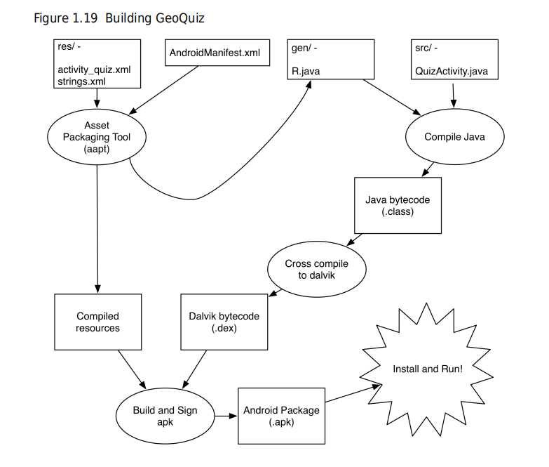

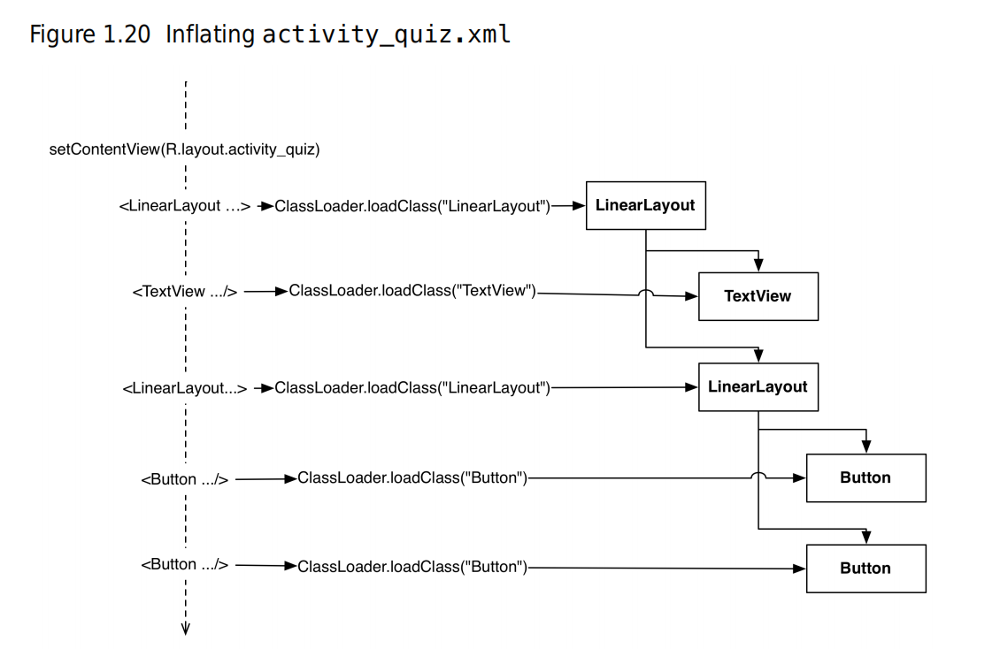

## Start with command

```shell
./gradlew tasks
#This will install your app on whatever device is connected.
./gradlew installDebug

```

## Activity

Every instance of **Activity** has a lifecycle. During this lifecycle, an activity transitions between three states: running, paused, and stopped. For each transition, there is an **Activity** method that notifies the activity of the change in its state. 

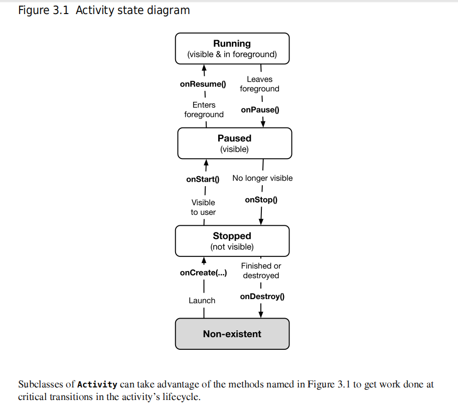

It is important to understand that you never call **onCreate(…)** or any of the other **Activity** lifecycle methods yourself. You override them in your activity subclasses, and Android calls them at the appropriate time.

Calling the superclass implementation before you do anything else is critical in onCreate(…); the order is less important in the other methods.

However, a stopped activity’s survival is not guaranteed. When the system needs to reclaim memory, it will destroy stopped activities.

Another situation that pauses an activity is when it is obscured from the user, such as by a pop-up window. Even if the window **only partially covers the activity, the activity is paused** and cannot be interacted with. The activity resumes when the pop-up window is dismissed.

### onSaveInstanceState

To fix this bug, the post-rotation **QuizActivity** needs to know the old value of mCurrentIndex. You need a way to save this data across a runtime configuration change, like rotation. One way to do this is to override the **Activity** method:

 `protected void onSaveInstanceState(Bundle outState)`

This method is normally called by the system before **onPause()**, **onStop()**, and **onDestroy()**.

The default implementation of **onSaveInstanceState(…)** directs all of the activity’s views to save their state as data in the **Bundle** object. A **Bundle** is a structure that maps string keys to values of certain limited types.

Note that the types that you can save to and restore from a **Bundle** are primitive types and classes that implement the **Serializable** or **Parcelable** interfaces. It is usually a bad practice to put objects of custom types into a **Bundle**, however, because the data might be stale when you get it back out. It is a better choice to use some other kind of storage for the data and put a primitive identifier into the **Bundle** instead.

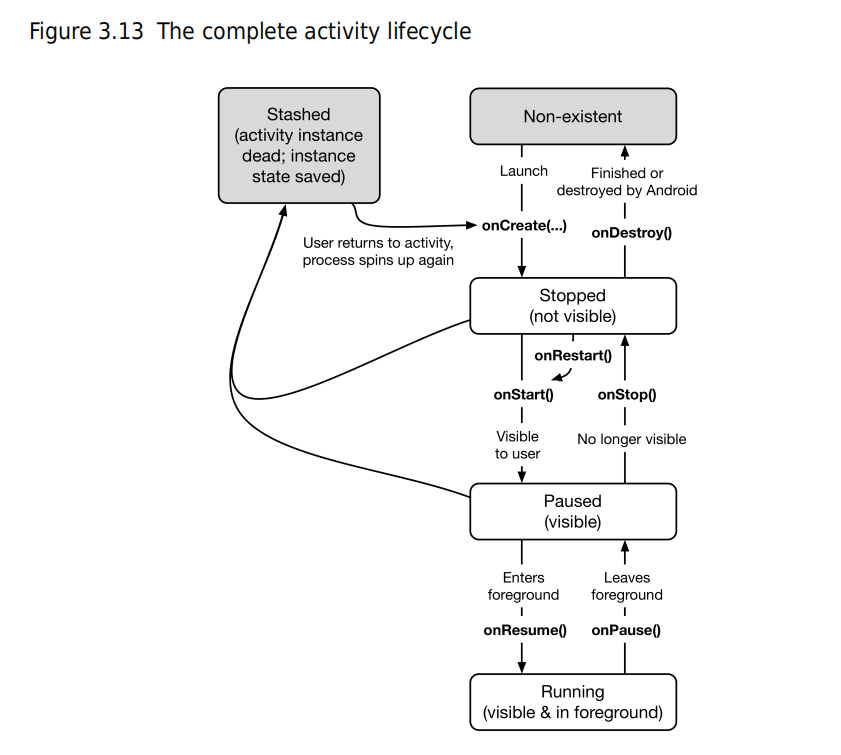

So when does the activity record get snuffed? When the user presses the Back button, your activity

really gets destroyed, once and for all. At that point, your activity record is discarded. Activity records

are also typically discarded on reboot and may also be discarded if they are not used for a long time. 

### startActivity

The simplest way one activity can start another is with the **Activity** method:

 `public void startActivity(Intent intent)`

You might guess that **startActivity(…)** is a static method that you call on the **Activity** subclass that you want to start. But it is not. When an activity calls **startActivity(…)**, this call is sent to the OS.

In particular, it is sent to a part of the OS called the **ActivityManager**. The **ActivityManager** then creates the **Activity** instance and calls its **onCreate(…)** method, as shown in Figure 5.7.

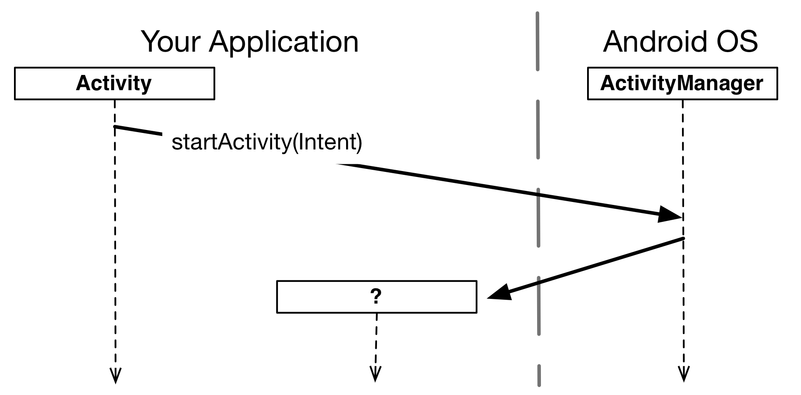

### Intent

An *intent* is an object that a *component* can use to communicate with the OS. The only components you have seen so far are activities, but there are also services, broadcast receivers, and content providers.

Intents are multi-purpose communication tools, and the **Intent** class provides different constructors depending on what you are using the intent to do.

In this case, you are using an intent to tell the **ActivityManager** which activity to start, so you will use this constructor:

 `public Intent(Context packageContext, Class<?> cls)`

The **Class** argument specifies the activity class that the **ActivityManager** should start. The **Context** argument tells the **ActivityManager** which application package the activity class can be found in (Figure 5.8).

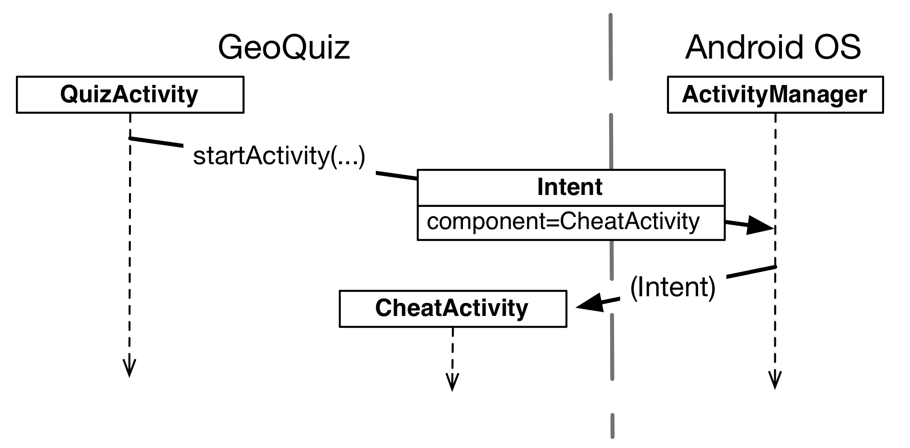

Before starting the activity, the **ActivityManager** checks the package’s manifest for a declaration with the same name as the specified **Class**. If it finds a declaration, it starts the activity, and all is well. If it does not, you get a nasty ActivityNotFoundException, which can crash your app. This is why all of your activities must be declared in the manifest.

### putExtra

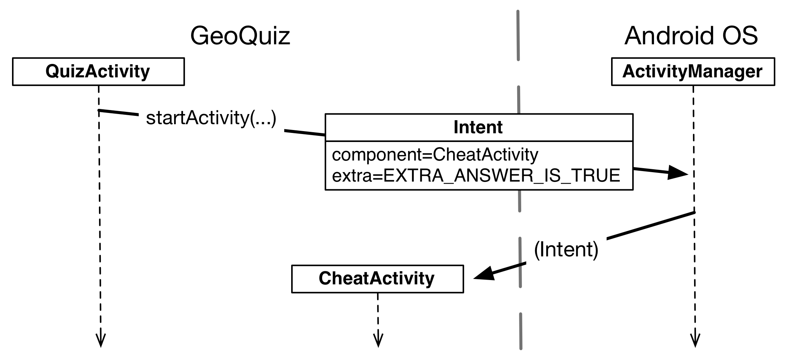

An extra is structured as a key-value pair, like the one you used to save out the value of mCurrentIndex in **QuizActivity.onSaveInstanceState(Bundle)**.

To add an extra to an intent, you use **Intent.putExtra(…)**. In particular, you will be calling public Intent putExtra(String name, boolean value)

**Intent.putExtra(…)** comes in many flavors, but it always has two arguments. The first argument is always a **String** key, and the second argument is the value, whose type will vary. It returns the **Intent** itself, so you can chain multiple calls if you need to.

`public boolean getBooleanExtra(String name, boolean defaultValue)`

Note that **Activity.getIntent()** always returns the **Intent** that started the activity. This is what you sent when calling **startActivity(Intent)**.

### StartActivityForResult

When you want to hear back from the child activity, you call the following **Activity** method:

 `public void startActivityForResult(Intent intent, int requestCode)`

The first parameter is the same intent as before. The second parameter is the *request code*. The *request*

*code* is a user-defined integer that is sent to the child activity and then received back by the parent. It

is used when an activity starts more than one type of child activity and needs to know who is reporting

### setResult

There are two methods you can call in the child activity to send data back to the parent: 

 `public final void setResult(int resultCode)`

 `public final void setResult(int resultCode, Intent data)`

Typically, the *result code* is one of two predefined constants: Activity.RESULT_OK or Activity.RESULT_CANCELED. (You can use another constant, RESULT_FIRST_USER, as an offset when defining your own result codes.) Setting result codes is useful when the parent needs to take different action depending on how the child activity finished.

For example, if a child activity had an OK button and a Cancel button, the child activity would set a different result code depending on which button was pressed. Then the parent activity would take different action depending on the result code. Calling **setResult(…)** is not required of the child activity. If you do not need to distinguish between results or receive arbitrary data on an intent, then you can let the OS send a default result code. A result code is always returned to the parent if the child activity was started with **startActivityForResult(…)**. If **setResult(…)** is not called, then when the user presses the Back button the parent will receive Activity.RESULT_CANCELED.

When the user presses the Show Answer button, the **CheatActivity** packages up the result code and the intent in the call to **setResult(int, Intent)**.

Then, when the user presses the Back button to return to the **QuizActivity**, the **ActivityManager** calls the following method on the parent activity:

 `protected void onActivityResult(int requestCode, int resultCode, Intent data)`

The parameters are the original request code from **QuizActivity** and the result code and intent passed into **setResult(…)**

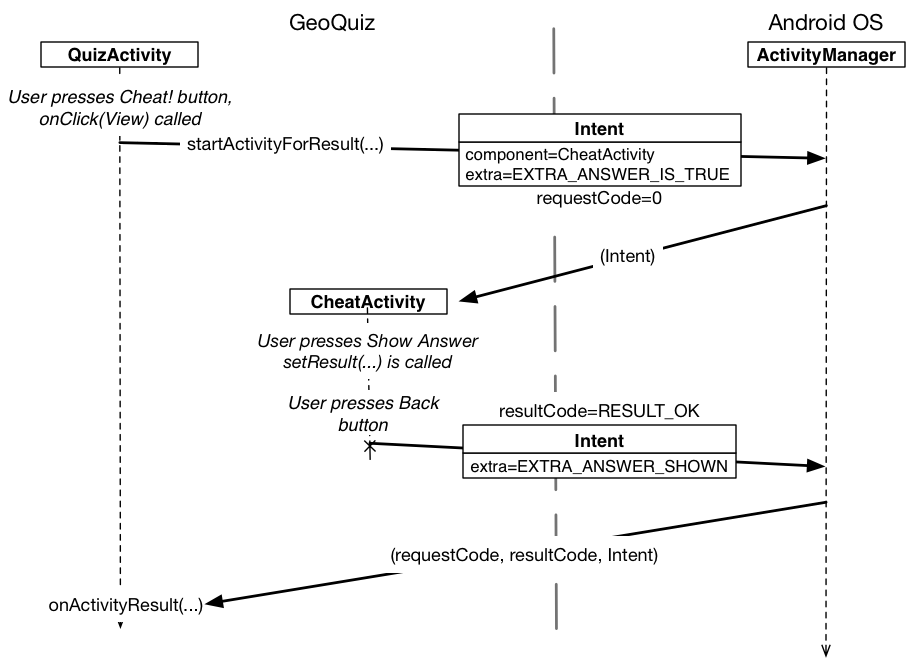

The final step is to override **onActivityResult(int, int, Intent)** in **QuizActivity** to handle the result. However, because the contents of the result **Intent** are also an implementation detail of **CheatActivity**, add another method to help decode the extra into something **QuizActivity** can use.

Let’s look at what is going on OS-wise as you move between activities. First, when you click on the GeoQuiz app in the launcher, the OS does not start the application; it starts an activity in the application. More specifically, it starts the application’s *launcher activity*. For GeoQuiz, **QuizActivity** is the launcher activity.

### FragmentManager

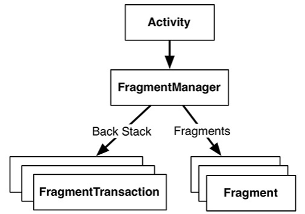

```java
FragmentManager fm = getSupportFragmentManager();
Fragment fragment = fm.findFragmentById(R.id.fragment_container);
if (fragment == null) {
    fragment = new CrimeFragment();
    fm.beginTransaction()
    	.add(R.id.fragment_container, fragment)
    	.commit();
}
```

The **FragmentManager** of an activity is responsible for calling the lifecycle methods of the fragments in its list. The **onAttach(Context)**, **onCreate(Bundle)**, and **onCreateView(…)** methods are called when you add the fragment to the **FragmentManager**.

The **onActivityCreated(Bundle)** method is called after the hosting activity’s **onCreate(Bundle)** method has executed. You are adding the **CrimeFragment** in **CrimeActivity.onCreate(Bundle)**, so this method will be called after the fragment has been added.

### RecyclerView

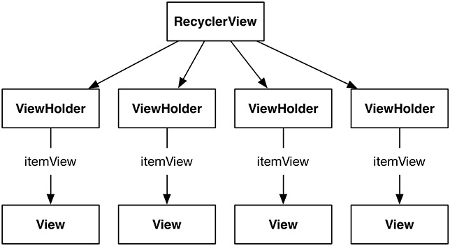

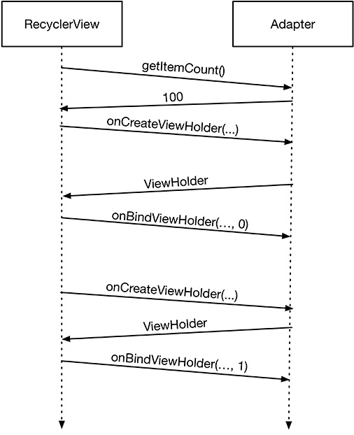

After this process is complete, **RecyclerView** will place a list item on the screen. Note that **onCreateViewHolder(ViewGroup, int)** will happen a lot less often than **onBindViewHolder(ViewHolder, int)**. Once enough **ViewHolder**s have been created, **RecyclerView** stops calling **onCreateViewHolder(…)**. Instead, it saves time and memory by recycling old **ViewHolder**s.