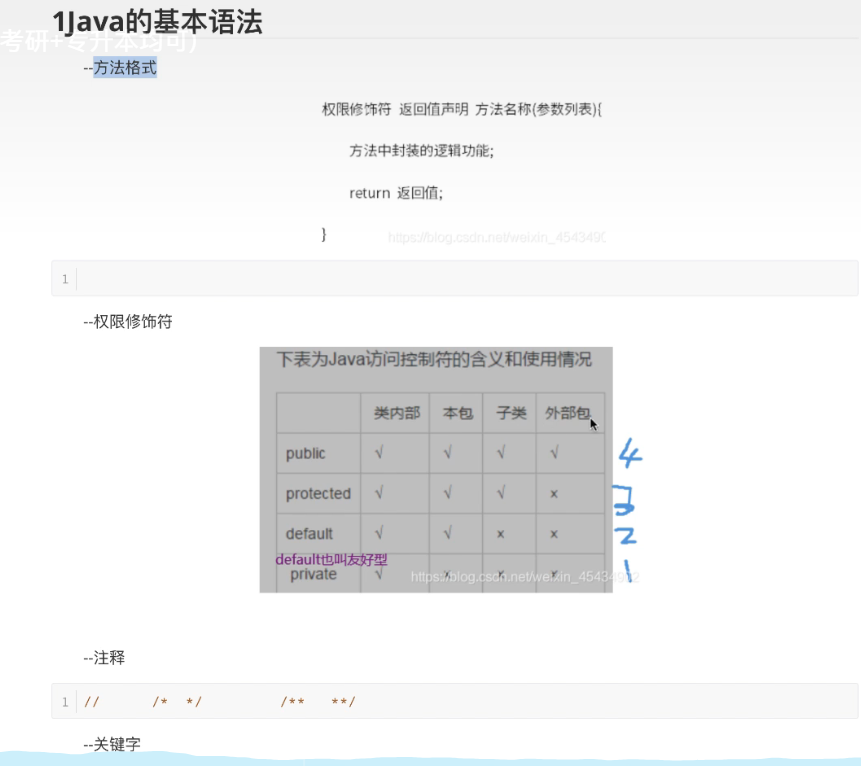
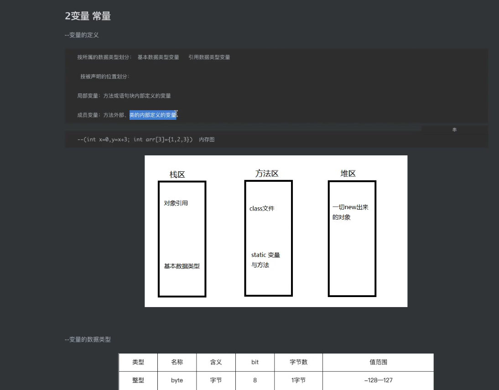
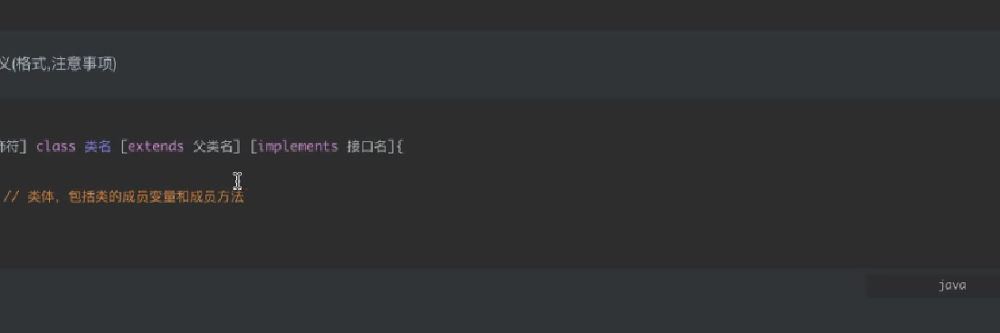
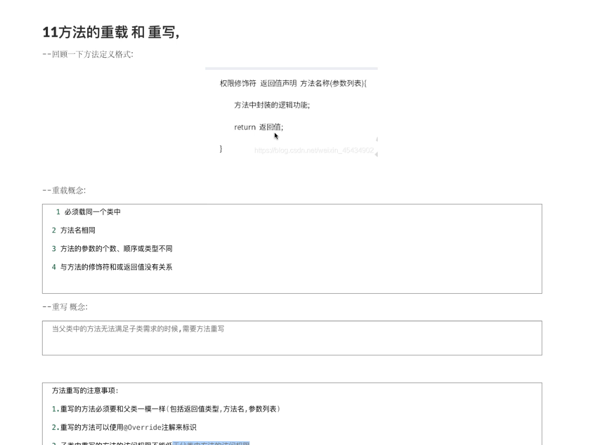
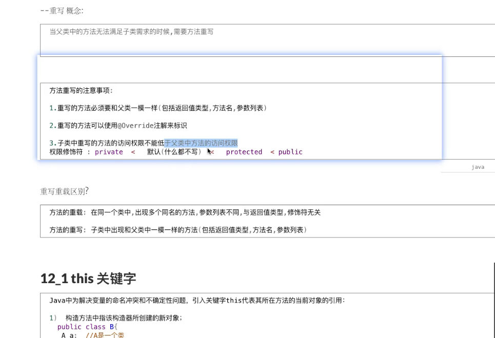
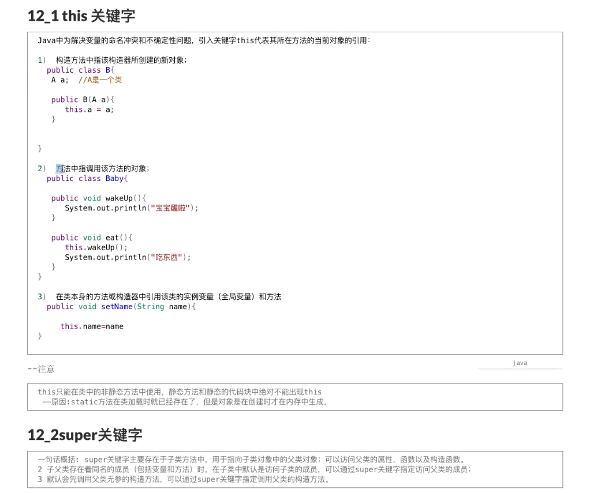
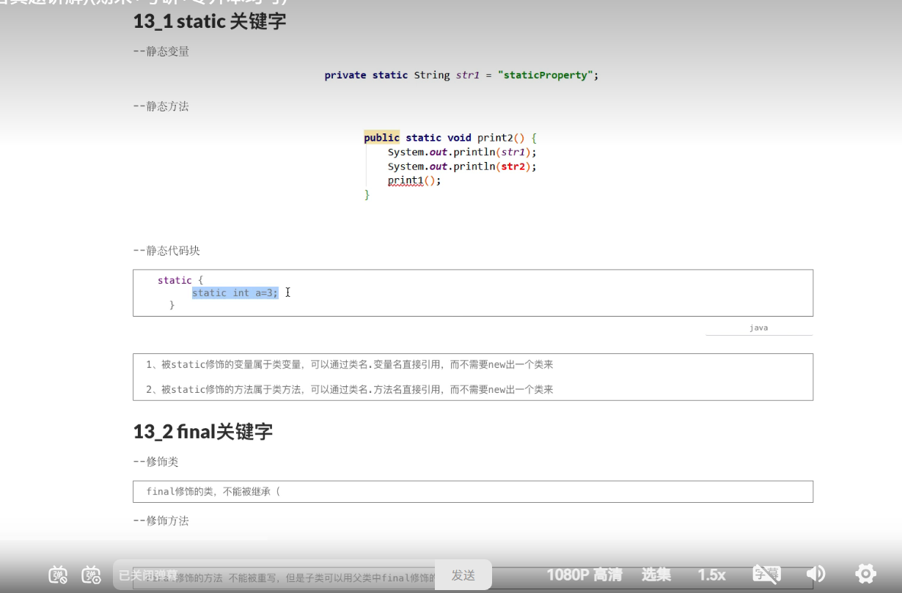
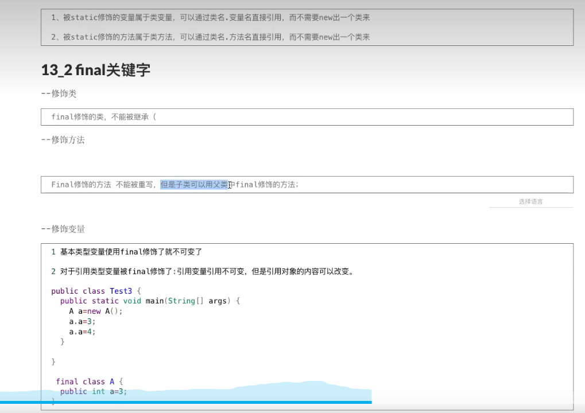
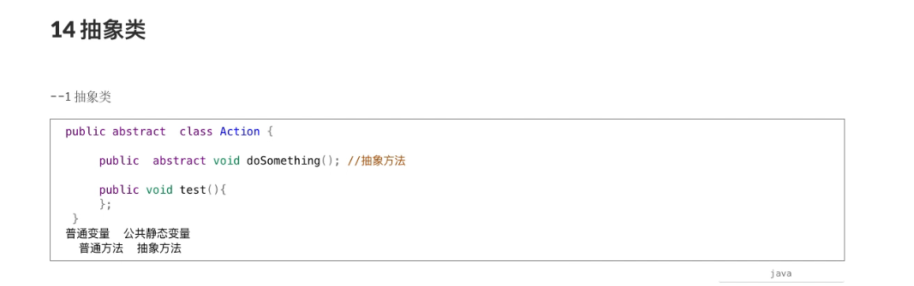
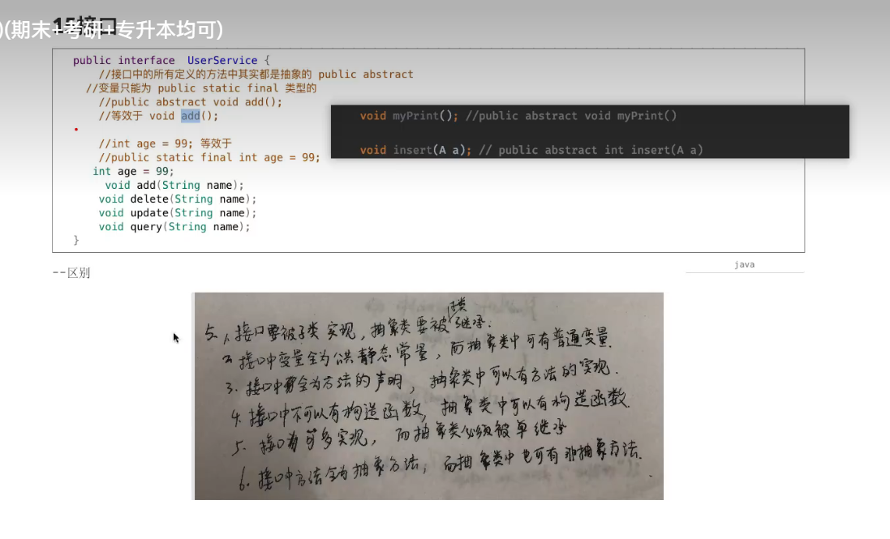

抽象方法：在父类中声明，在子类中必须实现的方法



```java
public interface UserDao {
    int age = 33;
    void myPrint();
}

public class UserTest implements UserDao {
    public void myPrint() {
        System.out.println("test");
    }
}
```

