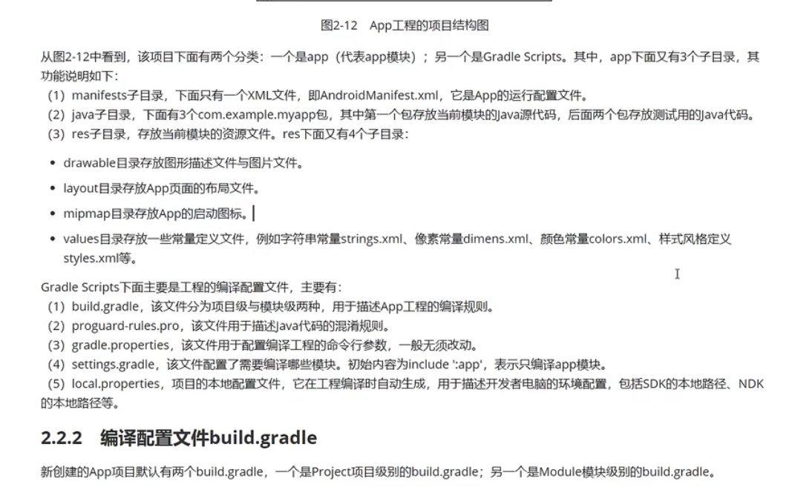

## Activity

### 按钮连接

```java
Button mLogin = (Button) this.findViewById(R.id.login);
mLogin.setOnClickListener(new View.OnClickLinstener() {
   @Override
    public void onClick (View v) {
        
    }
});
```


### 界面跳转

先要创建一个意图对象,然后通过startActivity方法来跳转

```java
String accountText = mAccount.getText().toString().trim();
Intent intent = new Intent(this, SecondActivity.class);
intent.putExtra("account", accountText);
intent.putExtra("password", passwordText);
startActivity(intent);


public class SecondActivity externs Activity {
    @Override
    protected void onCreate(Bundle savedInstanceState) {
        super.onCreate(savedInstanceState);
        setContentView(R.layout.activity_second);
        Intent intent = getIntent();
        intent.getStringExtra("account");
        intent.getStringExtra("password");
    }
}
```

隐式意图

```java
Intent intent = new Intent();
intent.setAction("com.sunofbeaches.LOGIN_INFO");
intent.addCategory(Intent.CATEGORY_DEFAULT);
startActivity(intent);
```

### 退出时保存数据

```java
@Override
protected void onCreate(Bundle savedInstanceState) {
    super.onCreate(savedInstanceState);
    setContentView(R.layout.activity_main);
    initView();
    initListener();
    mSharedPreferences = this.getSharedPreferences("msg_record", MODE_PRIVATE);
    String record = mSharedPreferences.getString("msg", null);
}

@Override
protected void onDestroy() {
    super.onDestroy();
    // 把数据保存到SharePreferences里
    String content = mContentBox.getText().toString().trim();
    if (!TextUtils.isEmpty(content)) {
        SharedPreferences.Editor edit = mSharedPreferences.edit();
        edit.putString("msg", content);
        edit.commit();
    }

}
```

[https://developer.android.com/reference/android/app/Activity.html](https://developer.android.com/reference/android/app/Activity.html)


- onCreate:启动app
- onStart:获取显示页面
- onResume：获得焦点（可操作）

### 广播接收者

```java
package com.sunofbeaches.broadcastreceiverdemo;

import android.content.BroadcastReceiver;
import android.content.Context;
import android.content.Intent;
import android.util.Log;

/**
 * Created by TrillGates on 2018/3/15.
 */

public class BatteryStatusReceiver extends BroadcastReceiver {
    private static final String TAG = "BatteryStatusReceiver";

    @Override
    public void onReceive(Context context, Intent intent) {
        String action = intent.getAction();
        Log.d(TAG, "action is == " + action);
        if (action.equals(Intent.ACTION_BATTERY_CHANGED)) {
            Log.d(TAG, "电量改变了的广播...");
        } else if (action.equals(Intent.ACTION_BATTERY_LOW)) {
            Log.d(TAG, "电池低电量广播...");
        } else if (action.equals(Intent.ACTION_BATTERY_OKAY)) {
            Log.d(TAG, "电池充电完成。...");
        }
    }
}
// 需要在AndroidManifest.xml中添加要收听的广播频道
<uses-permission android:name="android.permission.BATTERY_STATS"/>
```

```java
package com.sunofbeaches.broadcastreceiverdemo;

import android.content.Intent;
import android.content.IntentFilter;
import android.support.v7.app.AppCompatActivity;
import android.os.Bundle;
import android.util.Log;

public class MainActivity extends AppCompatActivity {

    private static final String TAG = "MainActivity";
    private BatteryStatusReceiver mReceiver;

    @Override
    protected void onCreate(Bundle savedInstanceState) {
        super.onCreate(savedInstanceState);
        setContentView(R.layout.activity_main);
        IntentFilter intentFilter = new IntentFilter();
        //设置频道，也就是设置要监听的广播action.
        intentFilter.addAction(Intent.ACTION_BATTERY_CHANGED);
        intentFilter.addAction(Intent.ACTION_BATTERY_OKAY);
        intentFilter.addAction(Intent.ACTION_BATTERY_LOW);
        mReceiver = new BatteryStatusReceiver();
        //注册广播
        registerReceiver(mReceiver, intentFilter);
        Log.d(TAG, "register receive..");
    }

    @Override
    protected void onDestroy() {
        super.onDestroy();
        //取消广播注册，释放资源
        if (mReceiver != null) {
            unregisterReceiver(mReceiver);
            mReceiver = null;
            Log.d(TAG, "unregister receive..");
        }
    }
}

```

