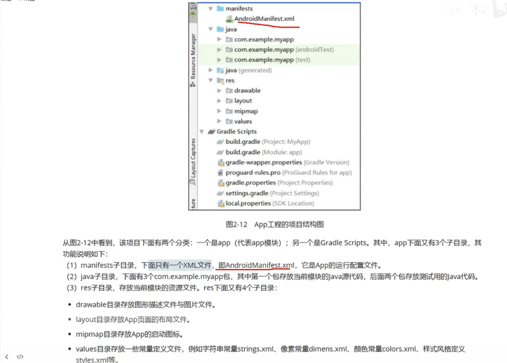

## Activity

### 按钮连接

```java
Button mLogin = (Button) this.findViewById(R.id.login);
mLogin.setOnClickListener(new View.OnClickLinstener() {
   @Override
    public void onClick (View v) {
        
    }
});
```


### 界面跳转

先要创建一个意图对象,然后通过startActivity方法来跳转

```java
String accountText = mAccount.getText().toString().trim();
Intent intent = new Intent(this, SecondActivity.class);
intent.putExtra("account", accountText);
intent.putExtra("password", passwordText);
startActivity(intent);


public class SecondActivity externs Activity {
    @Override
    protected void onCreate(Bundle savedInstanceState) {
        super.onCreate(savedInstanceState);
        setContentView(R.layout.activity_second);
        Intent intent = getIntent();
        intent.getStringExtra("account");
        intent.getStringExtra("password");
    }
}
```

隐式意图

```java
Intent intent = new Intent();
intent.setAction("com.sunofbeaches.LOGIN_INFO");
intent.addCategory(Intent.CATEGORY_DEFAULT);
startActivity(intent);
```


