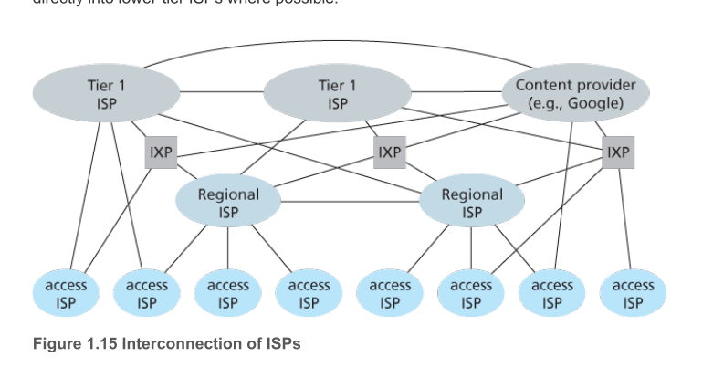
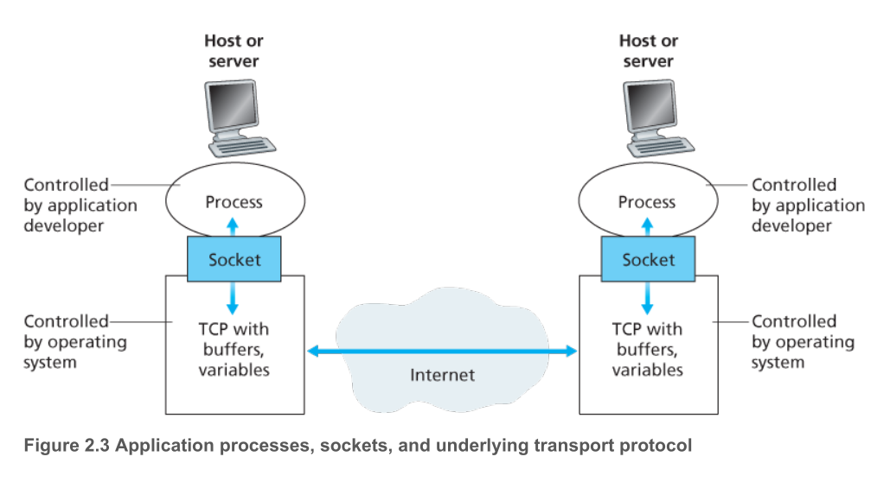
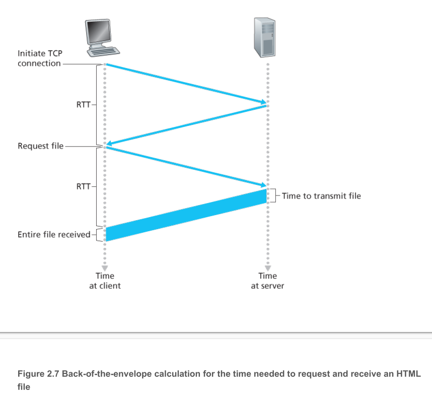
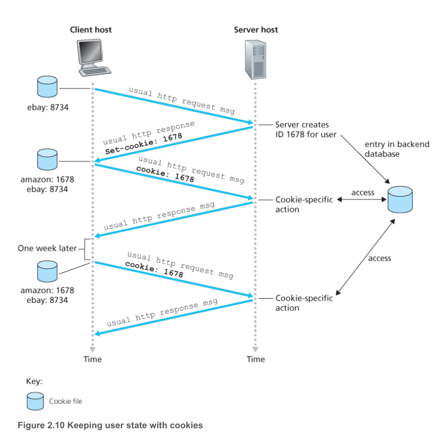
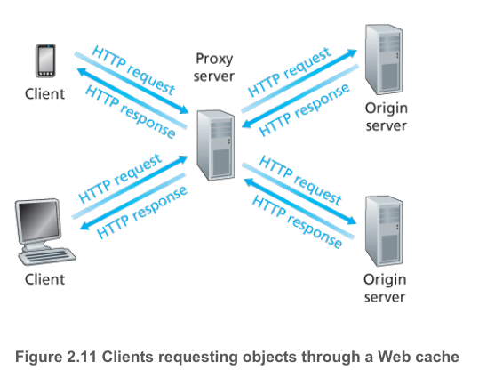
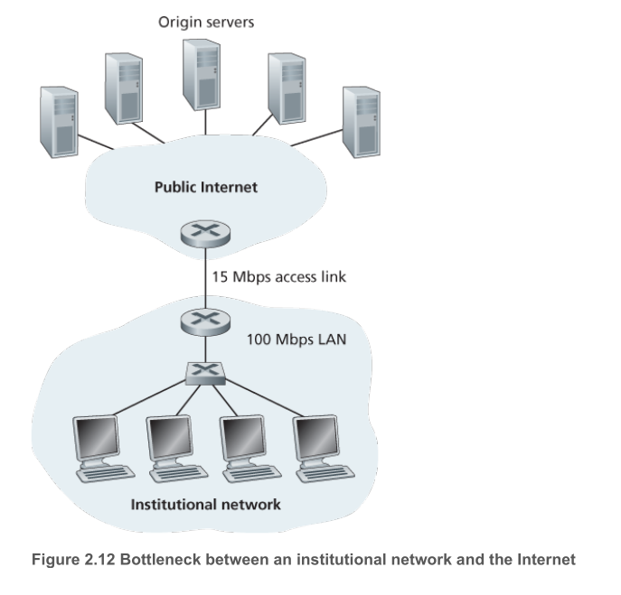
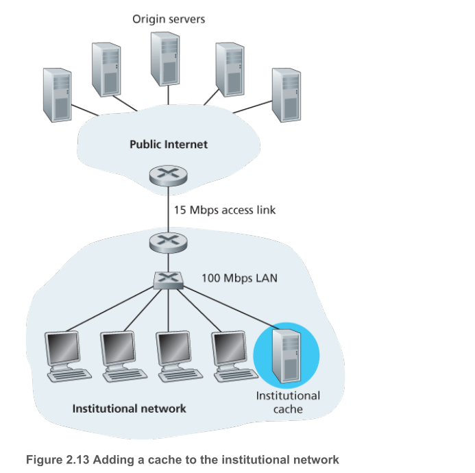

## Chapter 1 Computer Networks and the Internet

### 1.1 What Is the Internet?

In Internet jargon, all of these devices are called **hosts** or **end systems**.

End systems are connected together by a network of **communication links** and **packet switches**.

We’ll see in Section 1.2 that there are many types of communication links, which are made up of different types of **physical media**, including coaxial cable, copper wire, optical fiber, and radio spectrum. Different links can transmit data at different rates, with the **transmission rate** of a link measured in
bits/second.

The resulting packages of information, known as **packets** in the jargon of computer networks, are then sent through the network to the destination end system, where they are reassembled into the original data.

Both types of switches forward packets toward their ultimate destinations. Link-layer switches are typically used in **access networks**, while routers are typically used in the **network core**. The sequence of communication links and packet switches traversed by a packet from the sending end system to the receiving end system is known as a **route or path** through the network.

### ISP & IXP



- **ISP**: An internet service provider (ISP) is **a company that provides access to the internet**. 
- **IXP**: An Internet exchange point (IXP) is **a physical location through which Internet infrastructure companies such as Internet Service Providers (ISPs) and CDNs connect with each other**.1.5 Protocol Layers


- Application Layer

  - such as domain name system(DNS)
  - An application-layer protocol is distributed over multiple end systems, with the application in one end system using the protocol to exchange packets of information with the application in another end system. We’ll refer to this packet of information at the application layer as a **message**.

- Transport Layer

  - The Internet's transport layer transports application-layer messages between application endpoints. In the Internet there are two transport protocols, TCP and UDP, either of which can transport application-layer messages.

    > **TCP** provides a ­connection-oriented service to its applications. This service includes guaranteed delivery of application-layer messages to the destination and flow control (that is, sender/receiver speed matching). TCP also breaks long messages into shorter ­segments and provides a congestion-control mechanism, so that a source throttles its transmission rate when the network is congested. The **UDP** protocol provides a connectionless service to its applications. This is a no-frills service that provides **no reliability, no flow control, and no congestion control**.

  - In this boot, we'll refer to a transport-layer packet as a **segment**.

- Network Layer

  - Although the network layer contains both the **IP protocol** and **numerous routing protocols**, it is often simply referred to as the IP layer, reflecting the fact that IP is the glue that binds the Internet together.
  - The Internet’s network layer is responsible for moving network-layer packets known as **datagrams** from one host to another.
  - The Internet’s network layer also contains **routing protocols** that determine the routes that datagrams take between sources and destinations.

- Link Layer

  - include Ethernet, WiFi
  - The services provided by the link layer depend on the specific link-layer protocol that is employed over the link.
  - The network layer will receive a different service from each of the different link-layer protocols. In this book, we’ll refer to the link-layer packets as **frames**.

- Physical Layer

  - the job of the physical layer is to move the individual bits within the frame from one node to the next.
  - For example, Ethernet has many physical-layer protocols: one for twisted-pair copper wire, another for coaxial cable,

### 1.6 Networks Under Attack


We should keep in mind that communication among mutually trusted users is the exception rather than the rule. Welcome to the world of modern computer networking!


## Chapter 2 Application Layer



To identify the receiving process, two pieces of information need to be specified: 

1. the address of thehost and (**IP address**)

2. an identifier that specifies the receiving process in the destination host.(**port number**)

### Socket

Recall that a socket is the **interface between the application process and the transport-layer protocol.** The application at the sending side pushes messags through the socket. At the other side of the socket, the transport-layer protocol has the responsibility of getting the messages to the socket of the receiving process.

### Transport Services Available to Applications

1. **Reliable Data Transfer**

   packets can get lost within a computer network. For example, a packet can overflow a buffer in a router, or can be discarded by a host or router after having some of its bits corrupted.

   If a protocol provides such a guaranteed data delivery service, it is said to provide **reliable data transfer**. One important service that a transport-layer protocol can potentially provide to an application is process-to-process reliable data transfer.

2. **Throughput**

   In the context of a communication session between two processes along a network path, is **the rate at which the sending process can deliver bits** to the receiving process.

   Applications that have throughput requirements are said to be **bandwidth-sensitive applications**. If the transport protocol cannot provide this throughput, the application would need to encode at a lower rate (and receive enough throughput to sustain this lower coding rate) or may have to give up, since receiving, say, **half of the needed throughput** is of little or **no use** to this Internet telephony application.

3. **Timing**

   An example guarantee might be that every bit that the sender pumps into the **socket arrives at the receiver’s socket** no more than 100 msec later.

4. **Security**

   In the sending host, a transport protocol can **encrypt** all data transmitted by the sending process, and in the receiving host, the transport-layer protocol can **decrypt the data before delivering** the data to the receiving process.

### 2.1.4 Transport Services Provided by the Internet

#### TCP


- **Connection-oriented service**. TCP has the client and server **exchange** transport-layer control
  information with each other before the application-level messages begin to flow. This so-called
  **handshaking** procedure alerts the client and server, allowing them to prepare for an onslaught of
  packets.full-duplex connection.When the application finishes sending messages, it must tear down the connection.
- **Reliable data transfer service**. The communicating processes can rely on TCP to deliver all data sent without error and in the proper order. When one side of the application passes a stream of bytes into a socket, it can count on TCP to deliver the same stream of bytes to the receiving socket, with no missing or duplicate bytes.

TCP also includes a **congestion-control mechanism**, a service for the general welfare of the Internet rather than for the direct benefit of the communicating processes.

> Because privacy and other security issues have become critical for many applications, the Internet community has developed an enhancement for TCP, called Secure Sockets Layer (**SSL**).TCP-enhanced-with-SSL not onlydoes everything that traditional TCP does but also provides critical process-to-process security services, including **encryption, data integrity, and end-point authentication**.

#### UDP

UDP is a **no-frills, lightweight transport protocol, providing minimal services**. UDP is connectionless, so there is no handshaking before the two processes start to communicate. UDP provides an unreliable data transfer service—that is, when a process sends a message into a UDP socket, UDP provides no guarantee that the message will ever reach the receiving process. Furthermore, messages that do arrive at the receiving process may arrive out of order.

UDP does not include a congestion-control mechanism, so the sending side of UDP can pump data into the layer below (the network layer) at any rate it pleases.

#### *Services Not Provided by Internet Transport Protocols*

We have already noted that TCP provides reliable end-to-end data transfer. And we also know that TCP can be easily enhanced at the application layer with SSL to provide security services. But in our brief description of TCP and UDP, conspicuously missing was any mention of **throughput** or **timing guarantees**— services not provided by today’s Internet transport protocols.

**In summary**, today’s Internet can often provide satisfactory service to time-sensitive applications, but it cannot provide any timing or throughput guarantees.

thereby circumventing **TCP’s congestion control mechanism** and **packet overheads**.


### 2.1.5 Application-Layer Protocols

An **application-layer protocol** defines how an application’s processes, running on different end systems, pass messages to each other. 

In particular, an application-layer protocol defines:

- The types of messages exchanged, for example, request messages and response messages
- The syntax of the various message types, such as the fields in the message and how the fields are delineated
- The semantics of the fields, that is, the meaning of the information in the fields
- Rules for determining when and how a process sends messages and responds to messages

The Web application consists of many components, including a standard for **document formats** (that is, HTML), **Web browsers** (for example, Firefox and Microsoft Internet Explorer), **Web servers** (for example, Apache and Microsoft servers), and an **application-layer protocol**.

- **HTTP** (the HyperText Transfer Protocol [RFC 2616])

- **SMTP** (Simple Mail Transfer Protocol) [RFC 5321])

### 2.2.1 Overview of HTTP


Because an HTTP server maintains no information about the clients, HTTP is said to be a **stateless protocol**.

The HTTP server process tells TCP to close the TCP connection. (But TCP doesn’t actually terminate the connection until it knows for sure that the client has **received the response message intact**.)

Two different browsers may interpret (that is, display to the user) a Web page in somewhat different ways. HTTP has **nothing** to do with how a Web page is **interpreted** by a client. The HTTP specifications ([RFC 1945] and [RFC 2616]) **define only the communication protocol** between the client HTTP program and the server HTTP program.

In their default modes, most browsers open **5 to 10 parallel TCP connections**, and each of these connections handles one request-response transaction.

#### RTT

To this end, we define the **round-trip time** (RTT), which is the time it takes for a small packet to travel from client to server and then back to the client. The RTT includes **packet-propagation delays**, **packet-queuing delays** in intermediate routers and switches, and **packet-processing delays**.



As shown in Figure 2.7, this causes the browser to initiate a TCP connection between the browser and the Web server; this involves a “**three-way handshake**”—the client sends a small TCP segment to the server, the server acknowledges and responds with a small TCP segment, and, finally, the client acknowledges back to the server. The first two parts of the three-way handshake take one RTT. After completing the first two parts of the handshake, the client sends the HTTP request message combined with the third part of the three-way handshake (the acknowledgment) into the TCP connection. Once the request message arrives at the server, the server sends the HTML file into the TCP connection. This HTTP request/response eats up another RTT. Thus, roughly, the total response time is two RTTs plus the transmission time at the server of the HTML file.

Typically, the HTTP server closes a connection when it isn’t used for a certain time(a configurable timeout interval).The default mode of HTTP uses **persistent connections with pipelining**.

### 2.2.3 HTTP Message Format

#### HTTP Request Message

```http
GET /somedir/page.html HTTP/1.1
Host: www.someschool.edu
Connection: close
User-agent: Mozilla/5.0
Accept-language: fr
(/r/n)
```

The first line of an HTTP request message is called the **request line**; the subsequent lines are called the **header lines**.

- The **request line** has three fields: the **method field**, the **URL field**, and the **HTTP version field**. The method field can take on several different values, including *GET, POST, HEAD, PUT, and DELETE* .
- The **header line Host**: www.someschool.edu specifies the host on which the object resides. The information provided by the host header line is required by **Web proxy caches**.
- **Connection: close**: the browser is telling the server that it doesn’t want to bother with persistent connections; it wants the server to **close** the connection after sending the requested object.
- **User-agent:** Here the user agent is Mozilla/5.0, a Firefox browser. This header line is useful because the server can actually send different versions of the same object to different types of user agents.
- **Accept-language: fr**: header indicates that the user prefers to receive a French version of the object, if such an object exists on the server; otherwise, the server should send its default version.


For example, if a form uses the GET method, has two fields, and the inputs to the two fields are monkeys and bananas , then the URL will have the structure www.somesite.com/animalsearch?monkeys&bananas .

- **HEAD**:When a server receives a request with the HEAD method, it responds with an HTTP message but it **leaves out** the requested object. Application developers often use the HEAD method for **debugging**.
- **PUT**: The PUT method is often used in conjunction with Web publishing tools. It allows a user to upload an object to a specific path (directory) on a specific Web server. The PUT method is also used by applications that need to **upload objects to Web servers**.
- **DELETE**: The DELETE method allows a user, or an application, to **delete an object** on a Web server.

#### HTTP Response Message

```http
HTTP/1.1 200 OK
Connection: close
Date: Tue, 18 Aug 2015 15:44:04 GMT
Server: Apache/2.2.3 (CentOS)
Last-Modified: Tue, 18 Aug 2015 15:11:03 GMT
Content-Length: 6821
Content-Type: text/html

(data data data data data ...)
```

- **status line**: three fields: the *protocol version field*, *a status code*, and a *corresponding status message*.In this example, the status line indicates that the server is using HTTP/1.1 and that everything is OK (that is, the server has found, and is sending, the requested object).
- **header lines**
  - **Connection: close** : header line to tell the client that it is going to close the TCP connection after sending the message.
  - **Date:** header line indicates the time and date when the HTTP response was created and sent by the server. Note that this is not the time when the object was created or last modified; it is the time when the server retrieves the object from its file system, inserts the object into the response message, and sends the response message.
  - **Server:** header line indicates that the message was generated by an Apache Web server; it is analogous to the User-agent: header line in the HTTP request message. 
  - **Last-Modified:** header line indicates the time and date when the object was created or last modified. The Last-Modified: header, which we will soon cover in more detail, is critical for object caching, both in the local client and in network cache servers (also known as proxy servers).
  - **Content-Length:** header line indicates the number of bytes in the object being sent.
  - **Content-Type:** header line indicates that the object in the entity body is HTML text. (The object type is officially indicated by the Content-Type: header and not by the file extension.)
- **entity body**: The entity body is the meat of the message—it contains the requested object itself.


**status codes**

- **200 OK**: Request succeeded and the information is returned in the response.
- **301 Moved Permanently**: Requested object has been permanently moved; the new URL is specified in **Location :** header of the response message. The client software will automatically retrieve the new URL.
- **400 Bad Request**: This is a generic error code indicating that the request could not be understood by the server.
- **404 Not Found**: The requested document does not exist on this server.
- **505 HTTP Version Not Supported**: The requested HTTP protocol version is not supported by the server.

### 2.2.4 User-Server Interaction: Cookies

However, it is often desirable for a Web site to identify users, either because the server wishes to **restrict user access** or because it wants to serve content as a **function of the user identity**. For these purposes, HTTP uses cookies. **Cookies**, defined in [RFC 6265], allow sites to keep track of users. Most major commercial Web sites use cookies today.



As shown in Figure 2.10, cookie technology has four components:

- a cookie header line in the HTTP response message;
- a cookie header line in the HTTP request message;
- a cookie file kept on theuser’s end system and managed by the user’s browser;
- a back-end database at the Web site.

For a example:

> uppose Susan, who always accesses the Web using Internet Explorer from her home PC, contacts Amazon.com for the first time. Let us suppose that in the past she has already visited the eBay site. When the request comes into the Amazon Web server, the server creates a unique identification number and creates an entry in its back-end database that is indexed by the identification number. The Amazon Web server then responds to
> Susan’s browser, including in the HTTP response a Set-cookie: header, which contains the identification number. For example, the header line might be:
>
> ```http
> Set-cookie: 1678
> ```
>
> When Susan’s browser receives the HTTP response message, it sees the Set-cookie: header. The browser then appends a line to the special cookie file that it manages. This line includes the hostname of the server and the identification number in the Set-cookie: header. Note that the cookie file
> already has an entry for eBay, since Susan has visited that site in the past. As Susan continues to browse the Amazon site, each time she requests a Web page, her browser consults her cookie file, extracts her identification number for this site, and puts a cookie header line that includes the identification number in the HTTP request. Specifically, each of her HTTP requests to the Amazon server includes the header line:
>
> ```http
> Cookie: 1678
> ```
>
> In this manner, the Amazon server is able to track Susan’s activity at the Amazon site. Although the Amazon Web site does not necessarily know Susan’s name, it knows exactly which pages user 1678 visited, in which order, and at what times! Amazon uses cookies to provide its shopping cart service—Amazon can maintain a list of all of Susan’s intended purchases, so that she can pay for them collectively at the end of the session.
>
> If Susan returns to Amazon’s site, say, one week later, her browser will continue to put the header line Cookie: 1678 in the request messages. Amazon also recommends products to Susan based on Web pages she has visited at Amazon in the past. If Susan also registers herself with Amazon—providing full name, e-mail address, postal address, and credit card information—Amazon can then include this information in its database, thereby associating Susan’s name with her identification number (and all of the pages she has visited at the site in the past!). This is how Amazon and other e-commerce sites provide “one-click shopping”—when Susan chooses to purchase an item during a subsequent visit, she doesn’t need to re-enter her name, credit card number, or address.

### 2.2.5 Web Caching

A **Web cache**—also called a **proxy server**—is a network entity that satisfies HTTP requests on the behalf of an origin Web server. The Web cache has its own disk storage and keeps copies of recently requested objects in this storage.



- The browser establishes a TCP connection to the Web cache and sends an HTTP request for the object to the Web cache.
- The Web cache checks to see if it has a copy of the object stored locally. If it does, the Web cache returns the object within an HTTP response message to the client browser.
- If the Web cache does not have the object, the Web cache opens a TCP connection to the origin server, that is, to www.someschool.edu . The Web cache then sends an HTTP request for the object into the cache-to-server TCP connection. After receiving this request, the origin server sends the object within an HTTP response to the Web cache. 
- When the Web cache receives the object, it stores a copy in its local storage and sends a copy, within an HTTP response message, to the client browser (over the existing TCP connection between the client browser and the Web cache).

Web caching has seen deployment in the Internet for **two reasons**.

- First, a Web cache can substantially reduce the response time for a client request, particularly if the bottleneck bandwidth between the client and the origin server is much less than the bottleneck bandwidth between the client and the cache. If there is a high-speed connection between the client and the cache, as there often is, and if the cache has the requested object, then the cache will be able to deliver the object rapidly to the client.
- Second, as we will soon illustrate with an example, Web caches can substantially reduce traffic on an institution’s access link to the Internet. By reducing traffic, the institution (for example, a company or a university) does not have to upgrade bandwidth as quickly, thereby reducing costs. Furthermore, Web caches cansubstantially reduce Web traffic in the Internet as a whole, thereby improving performance for all applications.





Through the use of **Content Distribution Networks (CDNs)**, Web caches are increasingly playing an important role in the Internet.

#### The Conditional GET

An HTTP request message is a so-called conditional GET message if 

(1) the request message uses the **GET method** and 

(2) the request message includes an **If-Modified-Since:** header line.

```http
GET /fruit/kiwi.gif HTTP/1.1
Host: www.exotiquecuisine.com

HTTP/1.1 200 OK
Date: Sat, 3 Oct 2015 15:39:29
Server: Apache/1.3.0 (Unix)
Last-Modified: Wed, 9 Sep 2015 09:23:24
Content-Type: image/gif
(data data data data data ...)

GET /fruit/kiwi.gif HTTP/1.1
Host: www.exotiquecuisine.com
If-modified-since: Wed, 9 Sep 2015 09:23:24

HTTP/1.1 304 Not Modified
Date: Sat, 10 Oct 2015 15:39:29
Server: Apache/1.3.0 (Unix)
(empty entity body)
```

We’ve also studied a bit of the Web’s application infrastructure, including **caches**, **cookies**, and **back-end databases**, all of which are tied in some way to the HTTP protocol.

### 2.3 Electronic Mail in the Internet