# C语言拾遗

C和指针

### 编译过程

**预处理器(preprocessor)处理**。在这个阶段，预处理器在源代码上执行一些文本操作。例如，用实际值代替由#define 指令定义的符号以及读入由#include指令包含的文件的内容。

然后，源代码经过**解析**(parse)，判断它的语句的意思。第 2 个阶段是产生绝大

### 二进制编码

##### |， &， !， ^

或：两个中一个为1，则结果为1

与：两个都为1才是1，否则为0

非：取反 

异或：两个不同为1，相同为0

##### ||, &&

或：两个一个为真，则结果为真

与：两个都为真，结果才为真

##### <<, >>

移位运算

左移 << 超出的高位直接丢弃，低位补零

右移 >> ：分为**逻辑右移**和**算术右移**

- 逻辑右移：和左移一样，超出的低位直接丢弃，高位补0
- 算术右移：超出的低位直接丢弃，高位根据原来的符合位决定补1或0（与负数在机器中的表示形式有关）

##### 补码

Unsigned（无符号数）

$ B2U(X) = \sum\limits_{i=0}^{w-1}x_i\cdot2^i $

two's complement(补码)

$ B2T(X) = -x_{w-1}\cdot2^{w-1} + \sum\limits_{i=0}^{w-2}x_i\cdot2^i $

$-x_{w-1}\cdot2^{w-1}$为sign bit 符号位

- Unsigned Values
  - $UMin = 0$	(0000)
  - $ UMax = 2^w-1 $ (1111)   = 15
- Two's Complement Values
  - $ TMin = -2^{w-1} $      (1000) =  -8
  - $ TMax = 2^{w-1}-1 $        (0111)  = 7

##### U2T 转换

**有无符号数运算：**如果两个数都是有符号数（signed），那么会把他当作有符号数计算。如果其中任何一个无符号，那么会把另一个转换为无符号数并进行操作

> 运算中有无符号数参与的，结果都为无符号数

##### 符号位扩展

0110  -> 00110    正数直接在前面添加0，结果不变

1110 -> ==1==**1**110      负数在前面添加1，值依然不变，因为新添的1相当于-16，但是原来的符号位-8，改为了正8，他们的和依然是-8.

##### 位数缩短

**无符号数**     11011    27 -> 1011   11     变成4位相当于module16    $2^4$

**有符号数**      ~~11011   -5   ->   1011  -5      去1和符号位扩展原理一致~~

​					10011    -13  ->    0011   3       先将其当作无符号数U，也就是19，像无符号数一样取mod16，得到结果后再转回有符号数

# Chapter 2

### 二进制运算

##### **无符号数溢出**

1101 + 0101   ->    **1** 0010     2   相当于18取mod16

##### **补码溢出**

1101 + 0101    —>   **1** 0010    2    正负相加截断之后的结果反而是对的

- **负溢出**

1101 +  1010   —>   **1** 0111    7    应该的结果为-9

- **正溢出**(positive overflow)

0111 + 0101   —>   1100      -4     应该为12

乘法溢出

3×5

乘以常数

3个周期

除法30个周期

$2^{10}近似10^3$

##### 浮点数

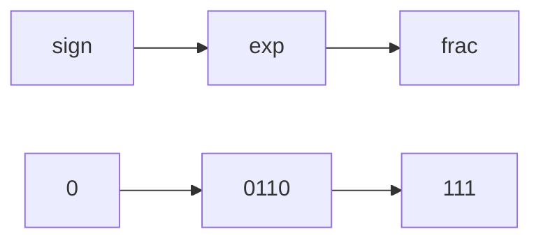
```mermaid
graph LR
A[sign]-->B[exp]-->C[frac]
D[0]-->F[0110]-->G[111]
```

- 非规格化值

阶码:`E=1-Bias`

尾数:`M=1+f`

- 规格化值

阶码:`E=e-Bias`

尾数:`M=f`

> 其中,e是无符号数,Bias是一个等于$2^{k-1}-1$
>
> Bias值设置原因:Bias值设置主要考虑规格化值与非规格化值,也就是0000到1110,0-14,为了使他取值范围中间为0,减去偏移值7,这样就可以表示负数与非负数.为什么不用有符号数?为了统一浮点数和整数比大小

- 特殊值

阶码:全为1

- frac全为0,表示无穷
- frac非零,表示NaN


##### tips

关于逻辑电路:

- 只有所有位全为1的数取反为0(一般用来排除-1)
- !!(x)    x为0则为0,x非零则为1
- 一个数只有异或他本身才为0(用于 == )
- 补码取负数为~x+1(注Tmin取负为其本身)

# Chapter 3

```bash
gcc -Og -S mstore.c
# cause GCC to run the compiler,generating an assembly  file mstore.s
gcc -Og -c mstore.c
# GCC will both compile and assemble the code,generating an object-code file mstore.o that is in binary format and hence cannot be viewed directly.
objdump -d mstore.o
# disassemblers
```


## 3.4 **Accessing Information**

#### general-purpose registers


| 名称 | 作用                   |
| ---- | ---------------------- |
| %rdi | 第一个参数寄存器       |
| %rsi | 第二个参数寄存器       |
| %rsp | 栈顶指针               |
| %rip | 当前正在执行指令的地址 |
| %rax | 函数返回值             |


#### Operand


> just for sort of the sake of convenience for the hardware designers,it doesm't let you directly copy from one memory location to another.

#### 

#### **3.4.4**  Pushing and Popping Stack Data

 the top element of the stack has the lowest address of

all stack elements

## **3.5** **Arithmetic and Logical Operations**


## 3.6 Control


**CF:** Carry flflag. The most recent operation generated a carry out of the most

signifificant bit. Used to detect overflflow for unsigned operations.

**ZF:** Zero flflag. The most recent operation yielded zero.

**SF:** Sign flflag. The most recent operation yielded a negative value.

**OF:** Overflflow flflag. The most recent operation caused a two’s-complement

overflflow—either negative or positive.


## 3.7 procedures


### call

- 栈顶指针 - 8
- 将此调用之后的指令地址写入栈顶部
- 跳转到目标函数的起始地址

### ret

- 读取

**integers or pointers**


| 指令           | 说明                   |
| -------------- | ---------------------- |
| break          | 打断点                 |
| run            | 运行                   |
| finish         | 运行直到当前代码块结束 |
| info registers | 显示寄存器信息         |
| print $rsp     | 输出栈指针             |
| stepi          | 逐个指令               |
| layout asm     | 布局汇编(图形界面_     |


> **目前64位机器会限制只使用47位的地址**

**what that means is if you tried to access any memory via the stack pointer, that was outside of the range of this 8 megabyte range you'd get a segmentation fault**

### three protections

- to randomize the stack position
- to make the stack not exectable
- use a stack canary or other mechanisms to detect a potential buffer overflow


# Chapter 4


# Chapter 5

- 减少不必要的函数调用
- 消除不必要的内存引用
- 多路并行循环展开
- 重新结合变换


# Chapter 6


## Random Access Memory(随机访问存储器)

- Static RAM(静态RAM, SRAM)   ------- Cache memory
  - 每个bit位的信息存储在一个**双稳态**的存储单元内,每个存储单眼需要六个晶体管来实现
- Dynamic RAM(动态RAM, DRAM) --------- Main memory/ frame buffers
  - 每个bit位的存储对应一个**电容**和一个晶体管


>  二维阵列减少了地址引脚数量,增加了访问时间


### DDR3,DDR4,LPDDR4

DDR SDRM - Double Data-Rate Synchronous DRAM (双倍速率同步动态随机存储器)

DDR4 --------> 预取缓冲区16bit

DDR4 ---------> 预取缓冲区8bit

LP -------------> Low Power

## Disk 

- 机械磁盘(也称旋转磁盘)


## Solid State Disk


## Locality

### temporal locality

时间局部性

### spatial locality

空间局部性


### 缓存是否命中确认

- (1) set selection(组选择)
- (2) line matching(行匹配)
- (3) word extraction(字抽取)


### Issues with Writes

- Write Hit(写命中)
  - write-through(写穿透)
  - write-back(写回)
- Write Miss(写不命中)
  - write-allocate(写分配) :先把目标数据所在的块从内存(更低一级cache)加载到cache中,然后再往cache中写
  - no-write-allocate(写不分配) :绕开cache,直接把要写的内容写到内存(更低一级cache)中

通常情况下写分配与写回,写不分配与写穿透搭配使用


# Chapter 7

### pre-processor

`cpp -o main.i main.c`

`cpp : c preprocessor`(C预处理器)

or `gcc -E -o main.i main.c`

### Compiler

`cc -S -o main.s main.i`

`cc : c compiler`(C编译器)

or `gcc -S -o main.s main.i`

### Assembler

`as -o main.o main.s`

`as : assembler`(汇编器)

### Linker


```shell
readelf -h main.o
```


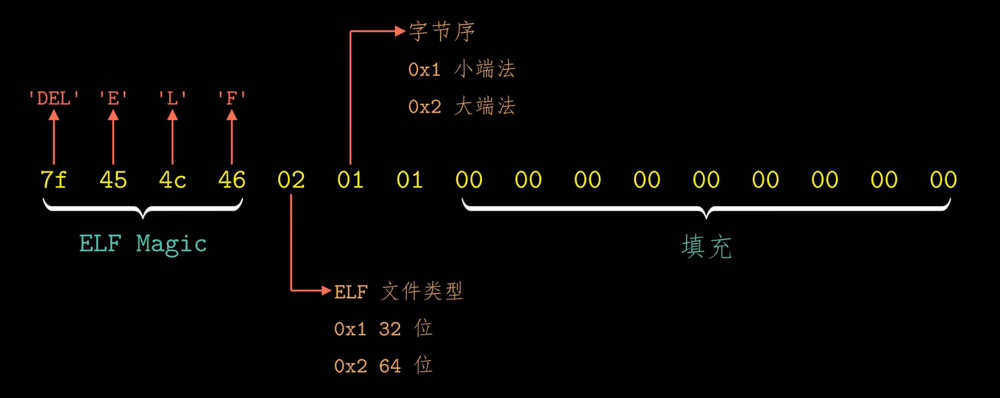


**Typocal ELF(Executable and Linkable Format) relocatable object file**

| sections             | remark                                                       |
| -------------------- | ------------------------------------------------------------ |
| ELF header           | 以一个16字节的序列开始,剩下的部分包含帮助链接器语法分析和解释目标文件的信息 |
| .text                | 已编译程序的机器代码                                         |
| .data                | 已初始化的全局和静态C变量.**局部C变量在运行时被保存在栈中**,既不出现在.data节中,也不出现在.bss节中 |
| .bss                 | **未初始化**的全局和静态C变量,以及所有**被初始化为0**的全局或静态变量.目标文件中的这个节不占据实际的空间,它仅仅是一个占位符.为了空间效率(Better Save Space):在目标文件中,未初始化变量不需要占据任何实际的磁盘空间,运行时,在内存中分配这些变量,初始值为0 |
| .rodata              | 只读数据,比如printf语句中的格式串和开关语句的跳转表          |
| .comment             | 存放的是编译器的版本信息                                     |
| .symtab              | 一个符号表(Symbol Table),with information about **functions and global variables** that are defined and referenced in the program.和编译器中的符号表不同,.symtab符号表不包含局部变量的条目 |
| .rel.text            | A list of locations in the .text section that will need to be modified when the linker combines this object file with others.一般情况,任何调用外部函数或引用全局变量的指令都需要修改,另一方面,调用本地函数的指令则不需要修改.注意:可执行目标文件中并不需要定位信息,因此通常省略 |
| .rel.data            | 被模块引用或定义的所有全局变量的重定位信息.一般而言,任何已初始化的全局变量,如果它的初始值是一个全局变量地址或者外部定义的函数的地址,都需要被修改 |
| .debug               | 一个调试符号表,其条目是程序中定义的局部变量和类型定义,程序中定义和引用的全局变量,以及原始的C源文件.只有以`-g`选项调用编译器驱动程序时,才会得到这张表 |
| .line                | 原始C源程序中的行号和.text节中的机器指令之间的映射.只有以`-g`选项调用编译器驱动程序时,才会得到这张表 |
| .strtab              | 一个字符串表,其内容包括.symtab和.debug节中的符号表,以及节头部中的节名字.字符串表就是以null结尾的字符串的序列 |
| Section header table | 描述目标文件的节                                             |

> **链接过程的本质**
>
> 链接过程的本质就是把不同的目标文件"粘合"到一起,为了使不同的目标文件之间能够相互粘合,这些目标文件之间必须有固定的规则才行.我们可以将符号看作是链接中的粘合剂,整个链接过程正是基于符号才能够正确完成.

> **COMMON vs .bss**
>
> COMMON:仅用来存放未初始化的全局变量
>
> .bss:用来存放未初始化的静态变量以及初始化为0的全局或者静态变量

**a symbol table** has three different kinds of symbols:

- 由模块m定义并能被其他模块引用的**全局符号(Global symbols)**.**全局链接器符号(Global linker symbols)**对应于非静态的C函数和全局变量
- 由其他模块定义并被模块m引用的**全局符号**.这些符号称为**外部符号(Extern symbols)**,对应于在其他模块中定义的非静态C函数和全局变量
- 只被模块m定义和引用的**局部符号(Local symbols)**.他们对应于带`static`属性的C函数和全局变量.这些符号在模块m中的任何位置都可见,但是不能被其他模块引用

> 定义为带有`C static`属性的本地过程变量是不在栈中管理的.相反,编译器在`.data`或`.bass`中为每个定义分配空间,并在符号表中创建一个有唯一名字的本地链接器符号

### Linux解析多重定义的全局符号

在编译时,编译器输出每个全局符号,或者是强(`strong`)或者是弱(`weak`),而汇编器把这个信息隐含地编码在可重定位目标文件的符号表里.**函数和已初始化的全局变量**是强符号,**未初始化的全局变量**是弱符号.

**规则:**

- 规则1:不允许有多个同名的强符号
- 规则2:如果有一个强符号和多个弱符号同名,那么选择强符号
- 规则3:如果有多个强符号同名,那么从这些弱符号中任意选择一个

### `readelf`

`-h` Display the ELF file header

`-S` Display the sections' header

`objdump -s -d main.o`

```c
// addvec.c

int addcnt = 0;
void addvec(int* x, int* y, int* z, int n)
{
    int i;
    addcnt++
    for (i = 0; i < n; i++)
        z[i] = x[i] + y[i];
}
```

```c
// multvec.c

int multcnt = 0;
void multvec(int* x, int* y, int* z, int n)
{
    int i;
    multcnt++;
    for (i = 0; i < n; i++)
        z[i] = x[i] * y[i];
}
```

```c
// vector.h

void addvec(int* x, int* y, int* z, int n);
void multvec(int* x, int* y, int* z, int n);
```


```c
// main.c

#include <stdio.h>
#include "vector.h" // 包括addvec和multvec函数的声明

int x[2] = {1, 2};
int y[2] = {3, 4};
int z[2];

int main()
{
    addvec(x, y, z, 2);
    printf("z =[%d %d]\n", z[0], z[1]);
    return 0;
}
```


```bash
objdump -t /usr/lib/x86_64-linux-gnu/libc.a > libc
grep -n printf.o libc
less +6895 -SN libc
# list files
ar -t /usr/lib/x86_64-linux-gnu/libc.a
# extract file(s) from the archive
ar -x /usr/lib/x86_64-linux-gnu/libc.a 
# replace existing or insert new file(s) into the archive
ar rcs libvector.a addvec.o multvec.o

# example
gcc -c main.c
gcc -static -o prog main.o ./libvector.a
```

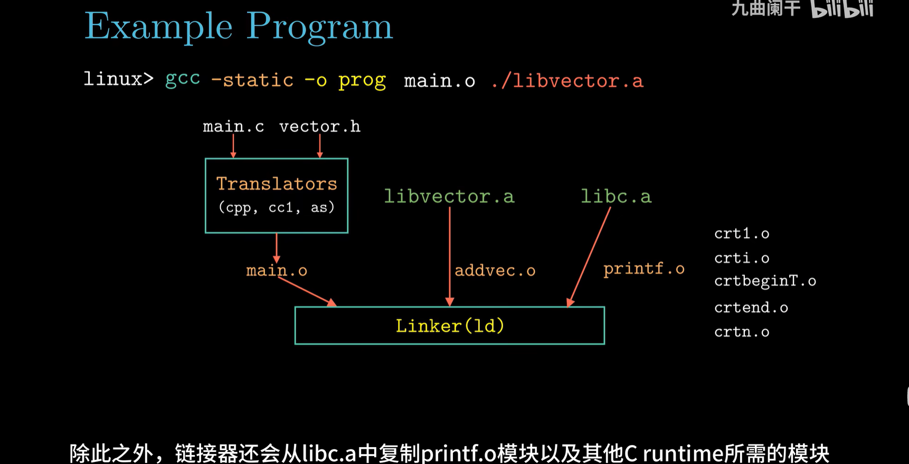


> 在**从左至右**依次扫描的过程中，链接器一共维护了三个集合
>
> - **集合E**：在链接器扫描的过程中发现了可重定位目标文件，就会放到这个集合中。在链接即将完成的时候，这个集合中的文件最终会被合并起来形成可执行文件
> - **集合U**：链接器会把引用了但是尚未定义的符号放在这个集合里
> - **集合D**：它用来存放输入文件中已定义的符号
>
> 链接器使用**静态库来解析**的过程:
>
> 链接最开始时，这3个集合均为空。对于命令行上的每一个输入文件f，链接器都会判断f是一个目标文件还是一个静态库文件。如果f是一个目标文件，那么链接器把f添加到集合E中，同时修改集合U和D来反映f中的符号定义和引用。发现下一个文件是静态库文件,那么链接器就尝试在这个静态库文件中寻找集合U中未解析的符号.
>
> **注:**命令行上目标文件和库文件的输入顺序非常重要,`libc.a`默认添加在末尾

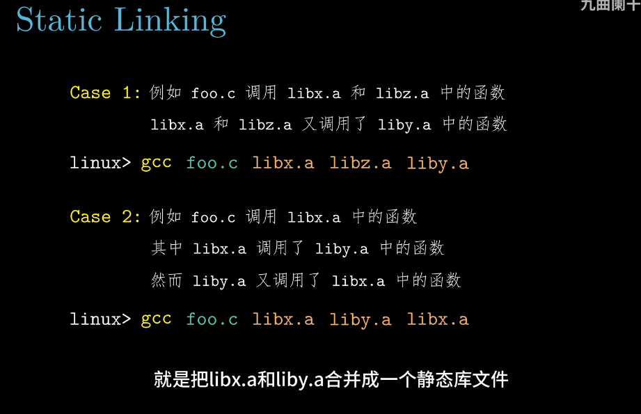

### Relocation(重定位)

- Relocating sections and symbol definitions(重定位节和符号定义)
- Relocating symbol references within sections(重定位符号引用)


### Relocation Entries(重定位条目)

- .rel.text
- .rel.data

```c
typedef struct {
    long offset;   // 表示被修改的引用的节偏移量
    long type:32, 	// 链接器会根据第二个字段type来修改新的引用
    	symbol:32;  //  第三个字段symbol表示被修改的引用是哪一个符号
    long addend;  //  最后一个addend是一个常数，一些类型的重定位要使用它对被修改应用的值做偏移调整
}ELF64_Rela
```

`type:32`  有32种类型，需要关注两种

- R_X86_64_PC32  (PC  相对地址)
- R_X86_64_32  (绝对地址)

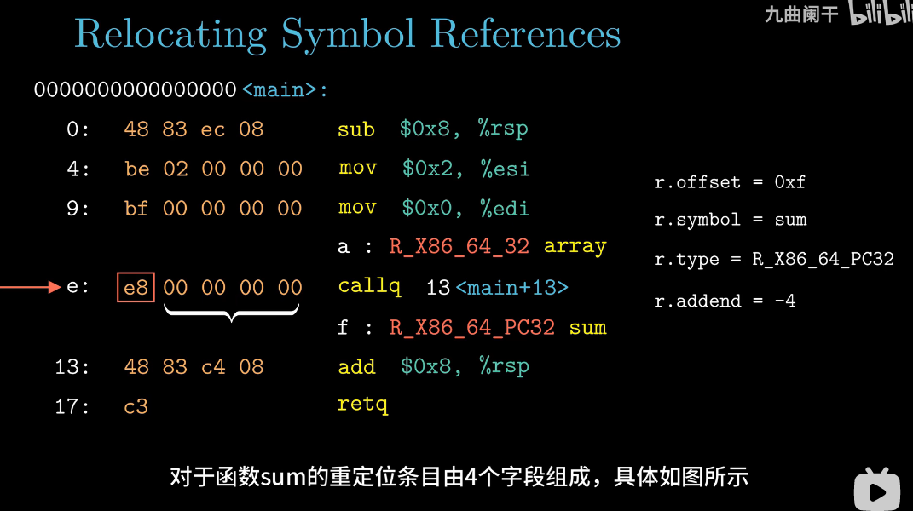

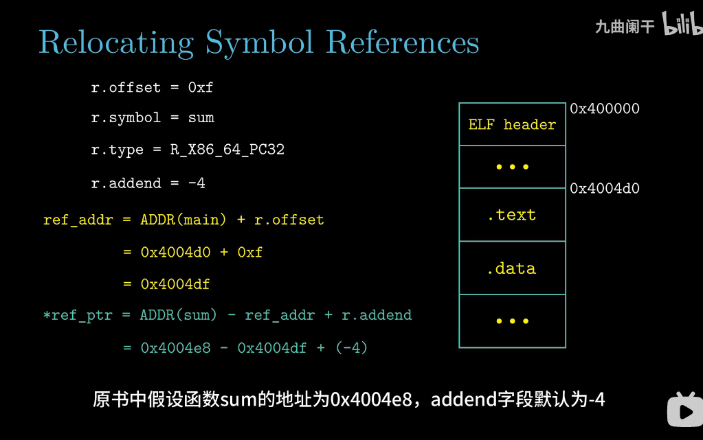


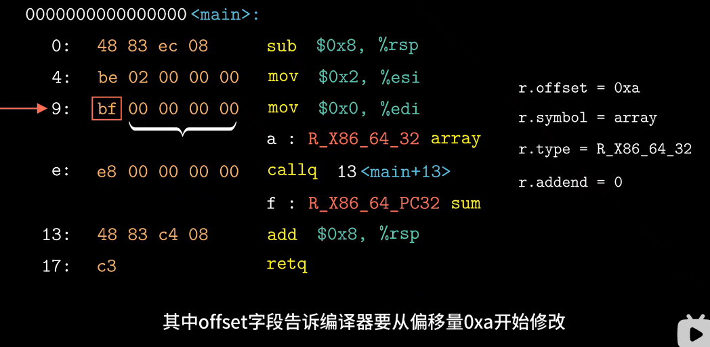

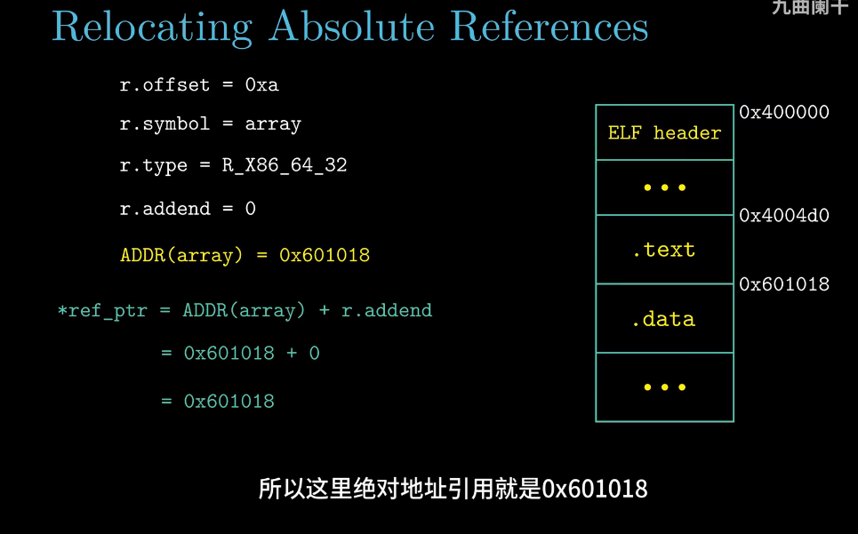

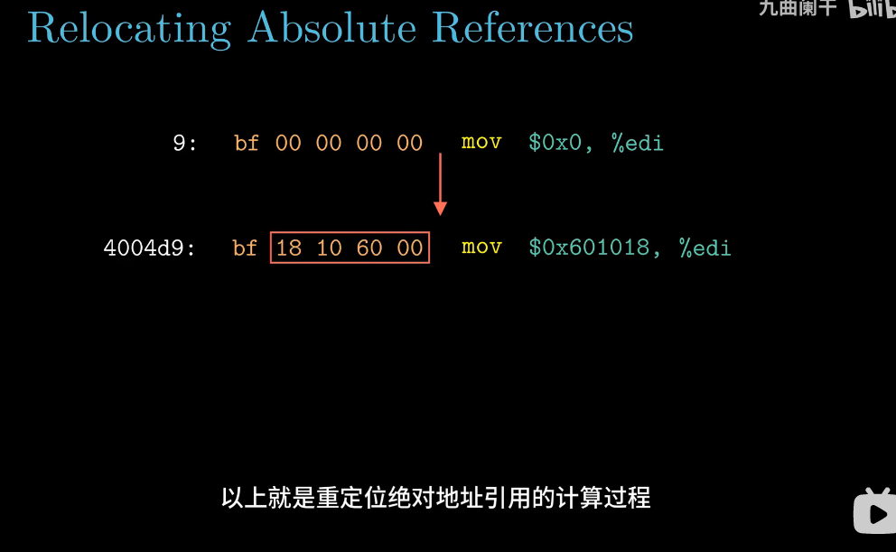


### Executable Object Files(可执行文件)

程序运行时，可执行文件中的代码段和数据需要被加载到内存执行。符号表和调试信息等不会被加载到内存

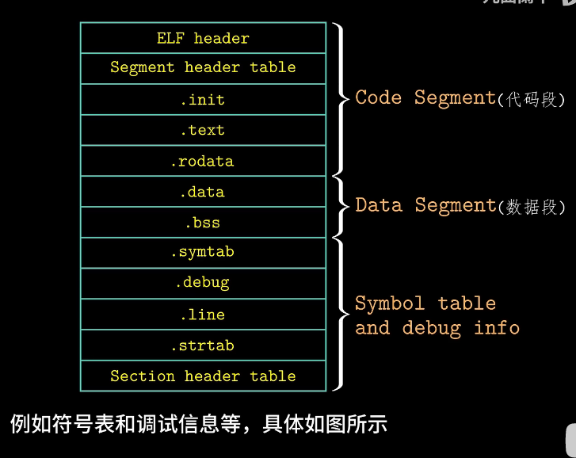

**加载**：将程序从磁盘复制到内存并运行的过程叫做加载

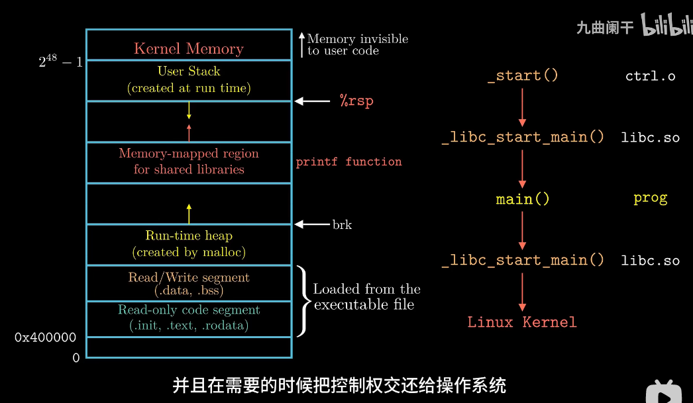

> 接下来函数`_start`调用系统启动函数`__libc_start_main`，这个函数位于`libc.so`中，它的作用是初始化执行环境

### Shared Libraries (共享库)

**共享库**是一种特殊的可重定位目标文件，在Linux系统中通常用`.so`的后缀来表示

windows系统中也使用了大量的共享库，例如以`dll`结尾文件就属于共享库

共享库在运行或加载时，可以被加载到任意的内存地址，还能和一个在内存中的程序链接起来，这个过程称为动态链接

```bash
# 创建静态库
gcc -c addvec.c mulvec.c
ar rcs libvector.a addvec.o mulvec.o

# 创建动态库
gcc -shared -fpic -o libvector.so addvec.c mulvec.c
# -shared :指示编译器创建一个共享的目标文件
# -fpic 选项：告诉编译器生成位置无关的代码，这样一来，共享库才能被加载到任意的内存位置

gcc -o prog2 main.c ./libvector.so
# 与静态库区别：`libvector.so`中的代码并没有真的被复制到可执行文件prog2中
```


### 动态链接具体过程

与静态库相比`libvector.so`中的代码并没有真的被复制到可执行文件prog2中，这个操作只是复制了符号表和一些重定位信息，当可执行程序`prog2`被**加载运行时**，加载器会发现可执行程序`prog2`中存在一个名为`.interp`的`section`。这个`section`中包含了动态链接器的路径名，实际上这个动态链接器本身也是一个共享目标文件(`ld-linux.so`),接下来，加载器会将这个动态链接器加载到内存中运行，然后由动态链接器执行重定位代码和数据的工作。首先是将`libc.so`的代码和数据重定位到某个内存段，然后重定位`libvector.so`中的代码和数据到另一个内存段，接下来重定位`prog2`中由`libc.so`和`libvector.so`定义的符号引用。上述链接操作完成之后，动态链接器把控制权交给应用程序`prog2`。从这个时刻开始，共享库的位置就固定了，并且在程序执行的过程中都不会改变。然后程序`prog2`开始执行，以上就是动态链接的具体执行过程。

**动态链接的应用**

- Distributing software   分发软件（更新软件版本）
- Building high-performance Web Server     构建高性能`Web`服务器

```c
// 使用接口的方式来动态链接共享库`libvector.so`的过程

void *dlopen(const char *filename, int flag);
handle = dlopen("./libvector.so", RTLD_LAZY); // RTLD_LAZY指示链接器将重定位推迟到函数运行时
void *dlsym(void *handle, char *symbol);
addvec = dlsym(hanle, "addvec");
addvec(x, y, z, 2);

int dlclose(void *handle);
dlclose(handle);
```


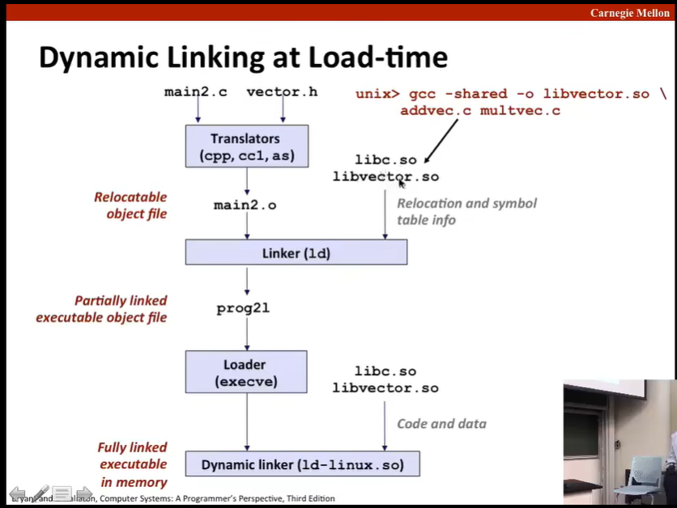

# chapter 8 

### **Exceptional Control Flow(ECF)** 

- 帮助理解重要的系统概念
- 帮助理解应用程序是如何与操作系统交互的
- 帮助我们编写一些有趣的应用程序
- 帮助我们理解并发
- 理解软件异常是如何工作的

****

### 中断(interrupt)

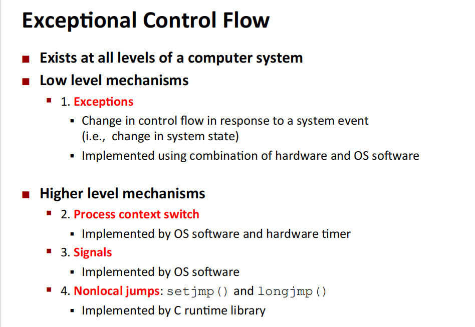

**Asynchronous Exceptions**(异步异常) :由处理器外部发生的状态变化而引起的,这些叫做**中断**(Interrupt)

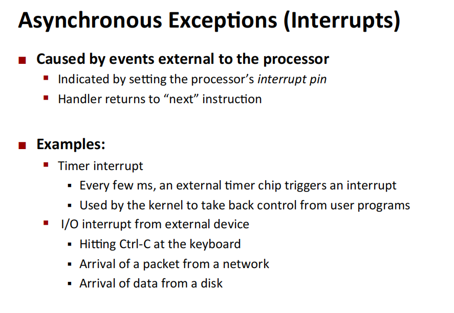

**Aynchronous Exceptions**(同步异常):由于执行指令而发生的事件引起


### 陷阱(trap)

- Intentional(故意)
- Examples:**system calls**, breakpoint traps, special instructions
- Returns control to "next" instruction


### 故障(fault)

- Unintentional but possibly recoverable 
- Examples:**page faults** (recoverable), protection faults(unrecoverable), floating point exceptions
- Either re-executes faulting("current") instruction or aborts


### 终止(abort)

- Unintentional and unrecoverable
- Examples : illegal instruction , parity error, machine check
- Aborts current program


### 

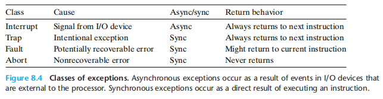


## 进程(process)

进程是正在运行的程序的实例

a process is an instance of a running program

带来**两个抽象**

- 给你带来你独占CUP和寄存器的使用权的错觉
- 有私人的地址空间

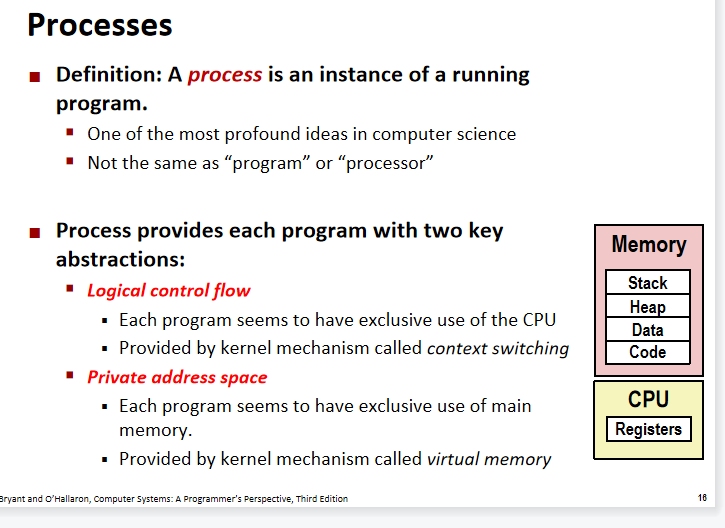

- **并行(parallel):** 是指两个进程在不同的处理器核上同时运行
- **并发(concurrency):** 是指两个进程在同一个处理器核上交替运行

> 二者区别:并发是交替运行的,而并行是同时运行的

### 上下文(Context)

上下文:就是内核重新启动一个被抢占的进程所需的状态

**Load saved registers and switch address space (context switch)**


```c
#include <sys/types.h>
#include <unistd.h>

pid_t fork(void);
// Call once, return twice
```

```c
#include <unistd.h>
int execve(const char *filename, const char *argv[], const char *envp[]);
// Called ones, Never return
```

```shell
# ls表示应用程序的名字,紧跟其后的-lt和路径就是可执行程序ls的参数列表
linux> ls -lt /home/csapp
	
```


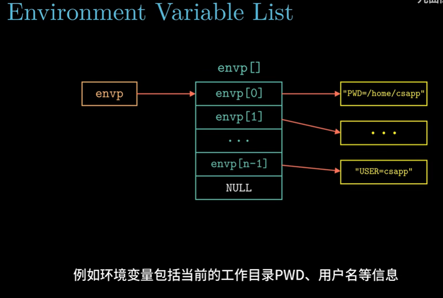

### zombie(僵死进程)

我们把一个终止运行但是还未被回收的进程称为僵死进程

等待一个


1. pid > 0
2. pid = -1

### 获取进程ID

每个进程都有一个唯一的正数(非零)进程ID(PID).`getpid`函数返回调用进程的PID.`getppid`函数返回它的父进程的PID(创建调用该进程的进程)

```c
#include <sys/types.h>
#include <unistd.h>

// 在Linux系统上pid_h在types.h中被定义为int
pid_t getpid(void);
pid_t getppid(void);
```


从程序员的角度,我们可以认为进程总是处于下面三种状态之一:

- **运行**: 进程要么是在CPU上执行,要么在等待被执行且最终会被内核调度

- **停止**: 进程的执行被**挂起(`suspended`)**, 且不会被调度.当收到`SIGSTOP,SIGTSTP,SIGTTIN,SIGTTOU`信号时,进程就停止,并且保持停止直到它收到一个`SIGCONT`信号,在这个时刻,进程再次开始运行.(信号是一种软件中断的形式)

- **终止**: 进程永远地停止了.进程会因为三种原因停止

  - 1.收到一个信号,该信号的默认行为是终止进程
  - 2.从主程序返回
  - 调用`exit`函数

  ```c
  #include <stdlib.h>
  
  // 该函数不返回
  void exit(int status);
  ```

> `exit`函数以`status`退出状态来终止进程(另一种设置退出状态的方法是从主程序中返回一个整数值).

### fork

父进程通过调用`fork`函数创建一个新的运行的子进程

```c
#include <sys/types.h>
#include <unistd.h>

pid_t fork(void);
```

> 新创建的**子进程**几乎但不完全与父进程相同.子进程得到与父进程用户级虚拟地址空间相同(但是独立的)一份副本,包括代码和数据段,堆,共享库以及用户栈.子进程还获得与父进程任何打开文件描述符相同的副本,这就意味着当父进程调用`fork`时,子进程可以读写父进程中打开的任何文件.父进程和新创建的子进程之间最大的区别在于它们有不同的PID
>
> `fork`函数被调用一次,却会返回两次:一次是在调用进程(父进程)中,一次是在新创建的子进程中.在父进程中,`fork`返回**子进程**的`PID`.在子进程中,`fork`返回0.因为子进程的PID总是为非零,返回值就提供一个明确的方法来分辨程序是在父进程还是在子进程中执行.

```c
#include <sys/types.h>

int main()
{
    pid_t pid;
    int x = 1;
    pid = Fork();
    if (pid == 0) {
        printf("child : x = %d\n", ++x);
        exit(0);
    }
    printf("parent : x = %d\n", --x);
    exit(0);
    
}

/*
linux> ./fork
parent : x = 0
child : x = 2
*/
```


**特征**

- 调用一次,返回两次
- **并发执行**.父进程和子进程是并发运行的独立进程.内核能够以任意方式交替执行它们的逻辑控制流中的指令.不同系统执行顺序不可预测.
- **相同但是独立的地址空间**.如果能够在`fork`函数在父进程和子进程中返回后立即暂停这两个进程,我们会看到两个进程的地址空间都是相同的.每个进程有相同的用户栈,相同的本地变量值,相同的堆,相同的全局变量值,以及相同的代码.因此,在我们的示例程序中,当`fork`函数在第6行返回时,本地变量x在父进程和子进程中都为1.然而,因为父进程和子进程是独立的进程,它们都有自己的私有地址空间.后面.父进程和子进程对x所**做的任何改变都是独立的**,不会反映在另一个进程的**内存**中.
- 共享文件.当运行这个示例程序时,我们注意到父进程和子进程都把它们的输出显示在屏幕上.原因是子进程继承了父进程所有的打开文件.当父进程调用`fork`时,`stdout`文件是打开的,并指向屏幕.子进程继承了这个文件,因此它的输出也是指向屏幕.

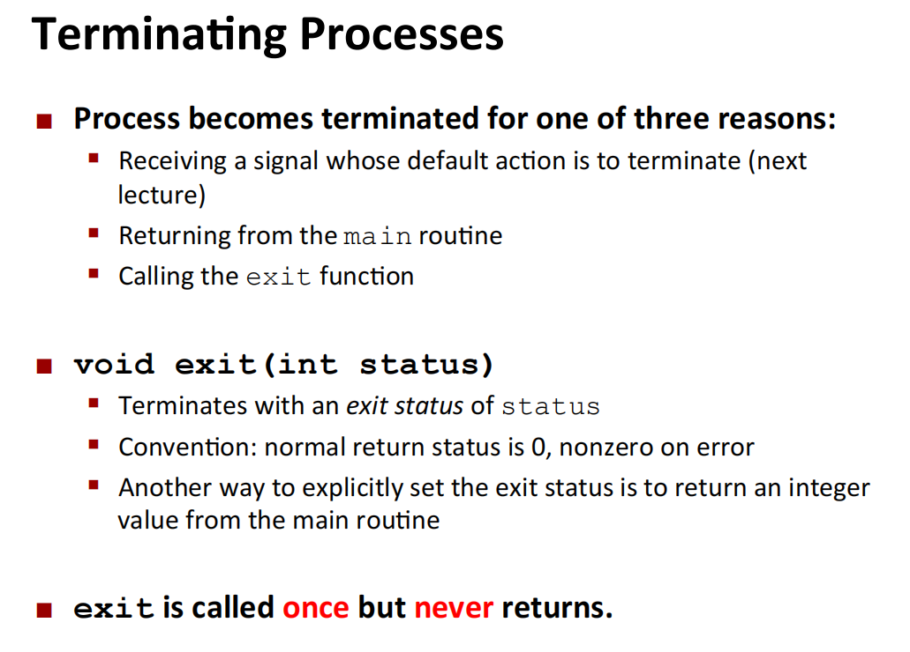

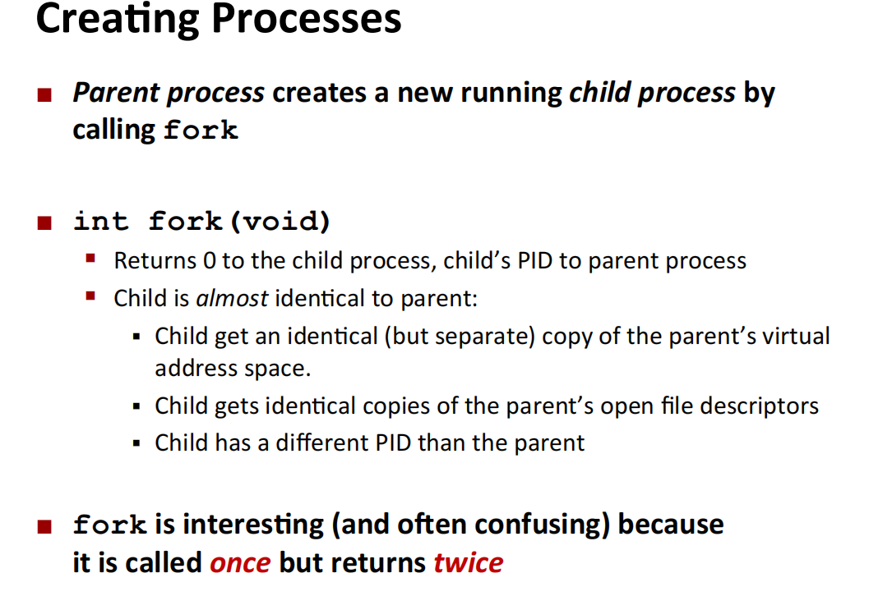


### Reaping Child Processes(回收子进程)

当一个进程由于某种原因终止时,内核并**不是立即**把它从系统中清除.相反,进程被保存在一种已终止的状态中,直到被它的父进程回收(`reaped`).当父进程回收已终止的子进程时,内核将子进程的退出状态传递给父进程,然后抛弃已终止的进程.从此时开始,该进程就不存在了.一个终止了但还未被回收的进程称为**僵死进程**(`zombie`)

如果一个父进程终止了,内核会安排`init`进程成为它的孤儿进程的养父.`init`进程的PID为1,是在系统启动时由内核创建的,它不会终止,是所有进程的祖先.如果父进程没有回收它的僵死子进程就终止了,那么内核会安排`init`进程去回收它们.不过长时间运行的程序,比如`shell`或者服务器,总是应该回收它们的僵死进程.即使僵死进程没有运行,它们仍然消耗系统的内存资源.

一个进程可以通过调用`waitpid`函数来等待它的子进程终止或者停止.

```c
#include <sys/types.h>
#include <sys/wait.h>

pid_t waitpid(pid_t pid, int *statusp, int options);
// return : 如果成功,则为子进程的PID,如果WNOHANG,则为0,如果其他错误,则为-1
```

### `waitpid`

`waitpid` : By default (when options = 0), waitpid suspends execution of the calling process until a child process in its wait set terminates If a process in the wait set has already terminated at the time of the call, then waitpid returns immediately. In either case, waitpid returns the PID of the terminated child that caused waitpid to return.At this point, the terminated child has been reaped and the kernel removes all traces of it from the system.

- 判断等待集合的成员(由`pid`参数决定)
  - 如果`pid > 0`,那么等待集合就是一个单独的子进程,它的进程ID等于`pid`
  - 如果`pid = -1`, 那么等待集合就是由父进程所有的子进程组成的

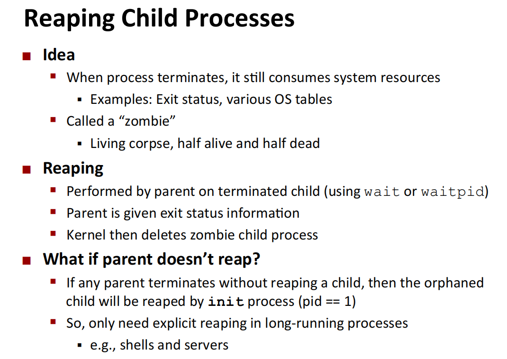

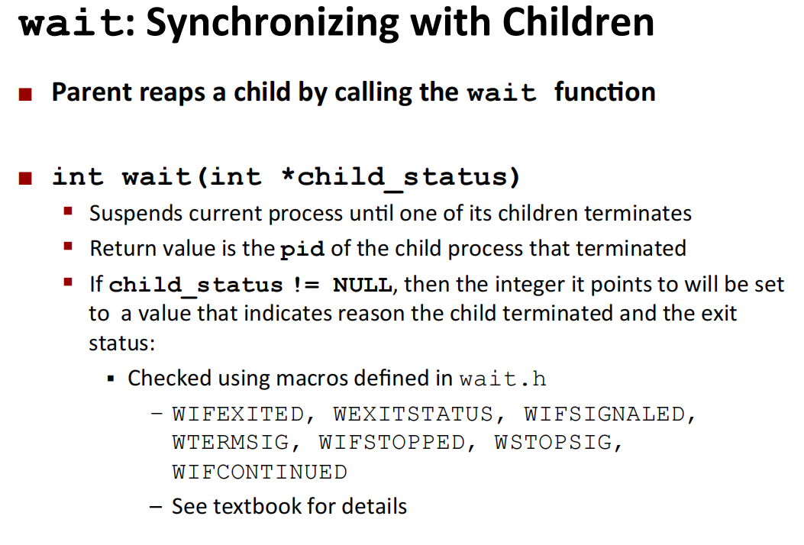

### `execve`

```c
#include <unistd.h>

int execve(const char *filename, const char *argv[], const char *envp[]);

// Called once, Never return
```


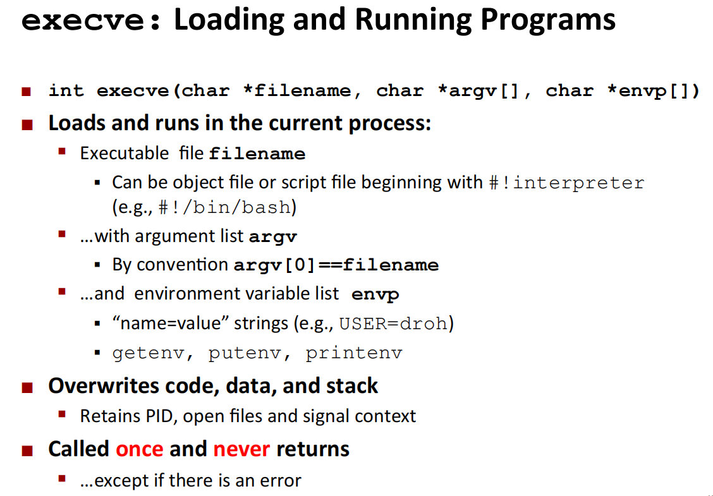

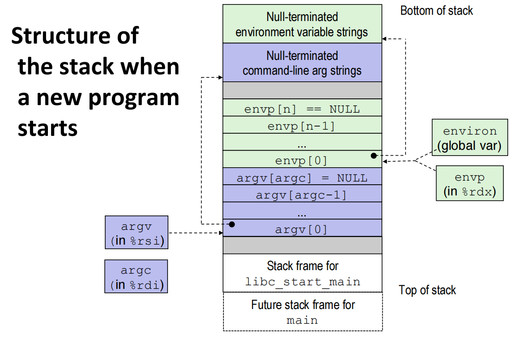

**信号（Signal）**

**定义:** Kernel **sends**(delivers) a signal to a **destination process** by updating some state in the context of the destination process

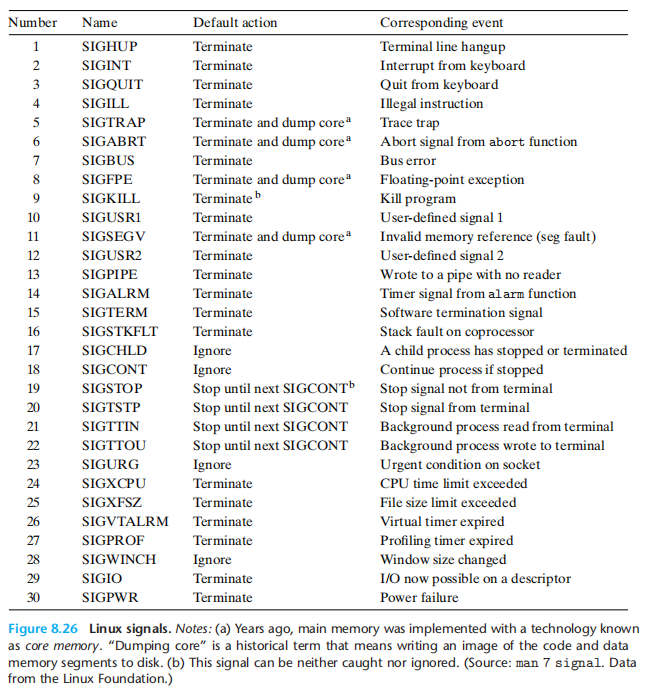

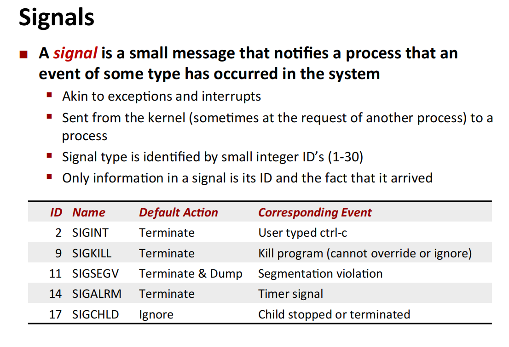

**段错误**：试图访问受保护的，或者不合法的内存区域，就会出现段错误


```c
#include <signal.h>
typedef void (*sighandler_t)(int);
sighandler_t signal(int signum, sighandler_t handler);
/* Returns: pointer to previous handler if OK, SIG_ERR on error (does not set errno) */
```


**deadlock**


```c
#include <setjump.h>

int setjump(jmp_buf env);
int sigsetjmp(sigjmp_buf env, int savesigs);

void longjump(jmp_buf env, int retval);
void siglongjmp(sigjmp_buf env, int retval);
```

