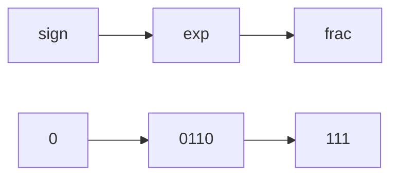

# C语言基础

C和指针

### 编译过程

**预处理器(preprocessor)处理**。在这个阶段，预处理器在源代码上执行一些文本操作。例如，用实际值代替由#define 指令定义的符号以及读入由#include指令包含的文件的内容。

然后，源代码经过**解析**(parse)，判断它的语句的意思。第 2 个阶段是产生绝大

### 二进制编码

##### |， &， !， ^

或：两个中一个为1，则结果为1

与：两个都为1才是1，否则为0

非：取反 

异或：两个不同为1，相同为0

##### ||, &&

或：两个一个为真，则结果为真

与：两个都为真，结果才为真

##### <<, >>

移位运算

左移 << 超出的高位直接丢弃，低位补零

右移 >> ：分为**逻辑右移**和**算术右移**

- 逻辑右移：和左移一样，超出的低位直接丢弃，高位补0
- 算术右移：超出的低位直接丢弃，高位根据原来的符合位决定补1或0（与负数在机器中的表示形式有关）

##### 补码

Unsigned（无符号数）

$ B2U(X) = \sum\limits_{i=0}^{w-1}x_i\cdot2^i $

two's complement(补码)

$ B2T(X) = -x_{w-1}\cdot2^{w-1} + \sum\limits_{i=0}^{w-2}x_i\cdot2^i $

$-x_{w-1}\cdot2^{w-1}$为sign bit 符号位

- Unsigned Values
  - $UMin = 0$	(0000)
  - $ UMax = 2^w-1 $ (1111)   = 15
- Two's Complement Values
  - $ TMin = -2^{w-1} $      (1000) =  -8
  - $ TMax = 2^{w-1}-1 $        (0111)  = 7

##### U2T 转换

**有无符号数运算：**如果两个数都是有符号数（signed），那么会把他当作有符号数计算。如果其中任何一个无符号，那么会把另一个转换为无符号数并进行操作

> 运算中有无符号数参与的，结果都为无符号数

##### 符号位扩展

0110  -> 00110    正数直接在前面添加0，结果不变

1110 -> ==1==**1**110      负数在前面添加1，值依然不变，因为新添的1相当于-16，但是原来的符号位-8，改为了正8，他们的和依然是-8.

##### 位数缩短

**无符号数**     11011    27 -> 1011   11     变成4位相当于module16    $2^4$

**有符号数**      ~~11011   -5   ->   1011  -5      去1和符号位扩展原理一致~~

​					10011    -13  ->    0011   3       先将其当作无符号数U，也就是19，像无符号数一样取mod16，得到结果后再转回有符号数

# Chapter 2

### 二进制运算

##### **无符号数溢出**

1101 + 0101   ->    **1** 0010     2   相当于18取mod16

##### **补码溢出**

1101 + 0101    —>   **1** 0010    2    正负相加截断之后的结果反而是对的

- **负溢出**

1101 +  1010   —>   **1** 0111    7    应该的结果为-9

- **正溢出**(positive overflow)

0111 + 0101   —>   1100      -4     应该为12

乘法溢出

3×5

乘以常数

3个周期

除法30个周期

$2^{10}近似10^3$

##### 浮点数



- 非规格化值

阶码:`E=1-Bias`

尾数:`M=1+f`

- 规格化值

阶码:`E=e-Bias`

尾数:`M=f`

> 其中,e是无符号数,Bias是一个等于$2^{k-1}-1$
>
> Bias值设置原因:Bias值设置主要考虑规格化值与非规格化值,也就是0000到1110,0-14,为了使他取值范围中间为0,减去偏移值7,这样就可以表示负数与非负数.为什么不用有符号数?为了统一浮点数和整数比大小

- 特殊值

阶码:全为1

- frac全为0,表示无穷
- frac非零,表示NaN


##### tips

关于逻辑电路:

- 只有所有位全为1的数取反为0(一般用来排除-1)
- !!(x)    x为0则为0,x非零则为1
- 一个数只有异或他本身才为0(用于 == )
- 补码取负数为~x+1(注Tmin取负为其本身)

# Chapter 3

```bash
gcc -Og -S mstore.c
# cause GCC to run the compiler,generating an assembly  file mstore.s
gcc -Og -c mstore.c
# GCC will both compile and assemble the code,generating an object-code file mstore.o that is in binary format and hence cannot be viewed directly.
objdump -d mstore.o
# disassemblers
```


## 3.4 **Accessing Information**

#### general-purpose registers


| 名称 | 作用                   |
| ---- | ---------------------- |
| %rdi | 第一个参数寄存器       |
| %rsi | 第二个参数寄存器       |
| %rsp | 栈顶指针               |
| %rip | 当前正在执行指令的地址 |


#### Operand


> just for sort of the sake of convenience for the hardware designers,it doesm't let you directly copy from one memory location to another.

#### 

#### **3.4.4**  Pushing and Popping Stack Data

 the top element of the stack has the lowest address of

all stack elements

## **3.5** **Arithmetic and Logical Operations**


## 3.6 Control


**CF:** Carry flflag. The most recent operation generated a carry out of the most

signifificant bit. Used to detect overflflow for unsigned operations.

**ZF:** Zero flflag. The most recent operation yielded zero.

**SF:** Sign flflag. The most recent operation yielded a negative value.

**OF:** Overflflow flflag. The most recent operation caused a two’s-complement

overflflow—either negative or positive.


