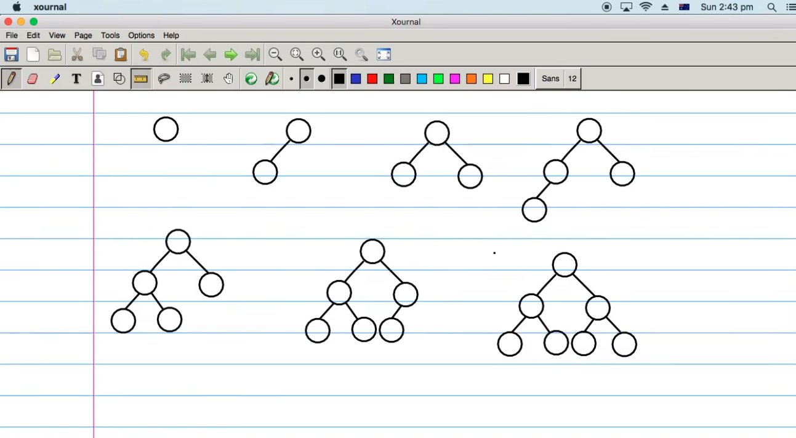
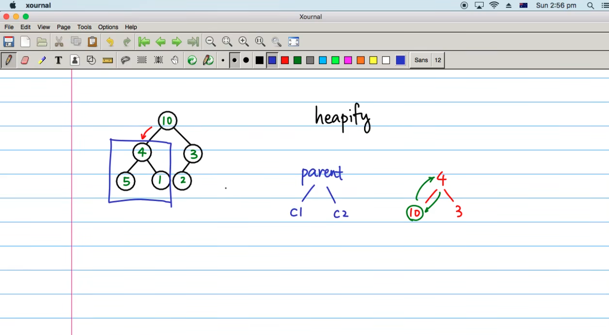
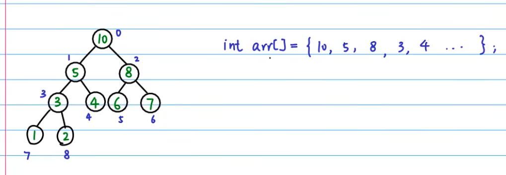
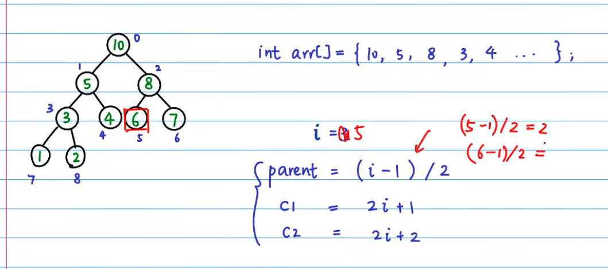
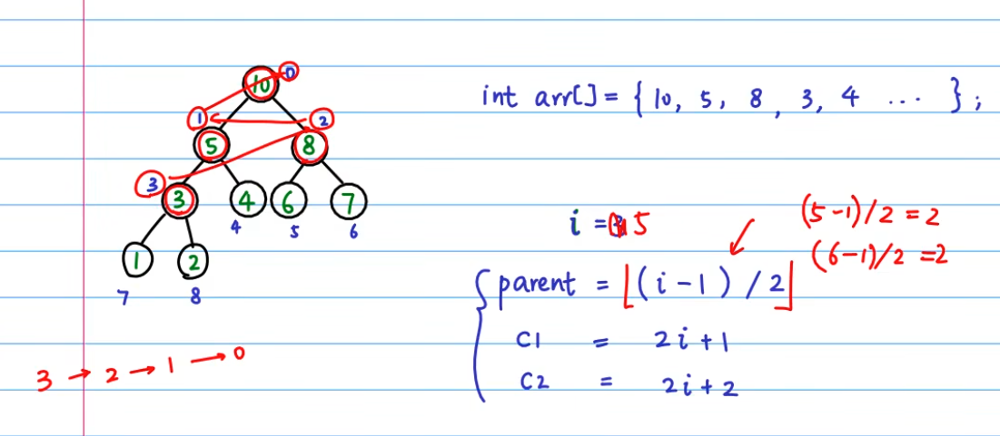

## Heap

1. Complete Binary Tree
2. parent > children










### 调整更新过一个元素的堆

```c
#include <stdio.h>


void heapify(int tree[], int n, int i)
{
    if (i >= n) {
        return;
    }
    
    int c1 = 2 * i + 1;
    int c2 = 2 * i + 2;
    int max = i;
    
    if (c1 < n && tree[c1] > tree[max]) {
        max = c1;
    }
    if (c2 < n && tree[c2] > tree[max]) {
        max = c2;
    }
    if (max != i) {
        swap(tree, max, i);
        heapify(tree, n, max);
    }
}


int main()
{
    int tree[] = [4, 10, 3, 5, 1, 2];
    int n = sizeof(tree);
    heapify(tree, n, 0);
    
    for (int i = 0; i < n; i++) {
        printf("%d\n", arr[i]);
    }
    
    return 0;
    
}
```



### 调整整个堆

Time Complexity:

1. Building Initial Heap: O(n)O(n)O(n)
2. Heapify Operations: O(log⁡n)O(\log n)O(logn) for each element

```c

void build_heap(int tree[], int n)
{
    int last_node = n - 1;
    int parent= (last_node - 1) / 2;
    int i;
    
    for (i = parent; i >= 0; i--) {
        heapify(tree, n, i);
    }
}
```

### 利用堆进行排序

```c
void heap_sort(int tree[], int n)
{
    int i;
    
    build_heap(tree, n);
    for (i = n - 1; i >= 0; i--) {
        swap(tree, i, 0);
        heapify(tree, i, 0);
    }
}
```

