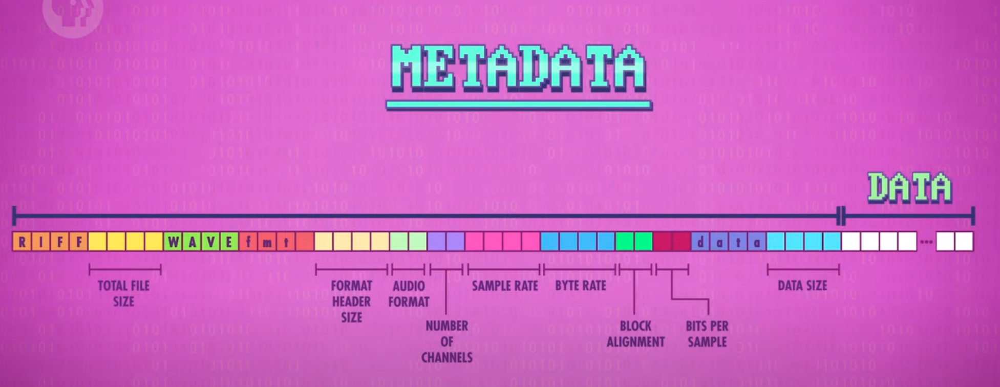
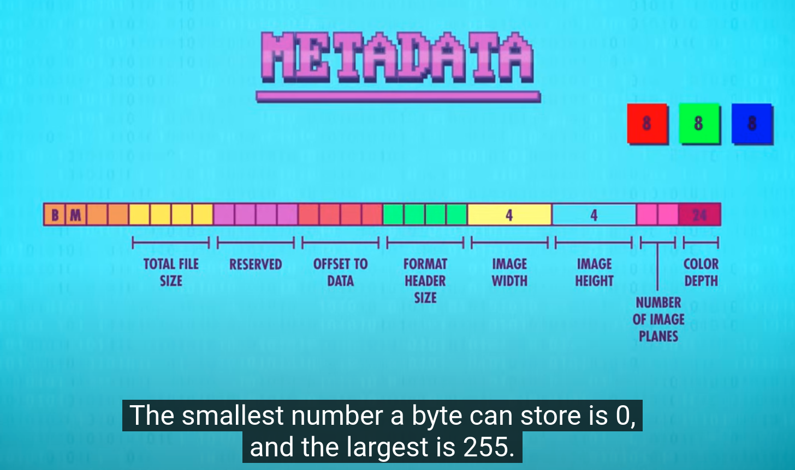
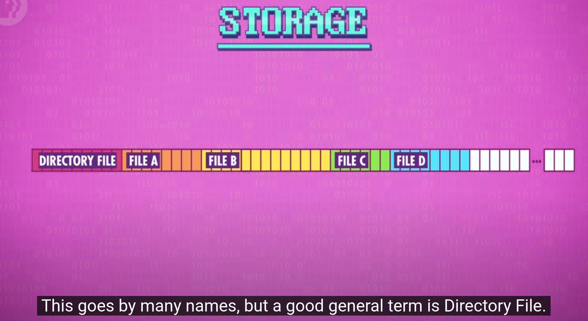
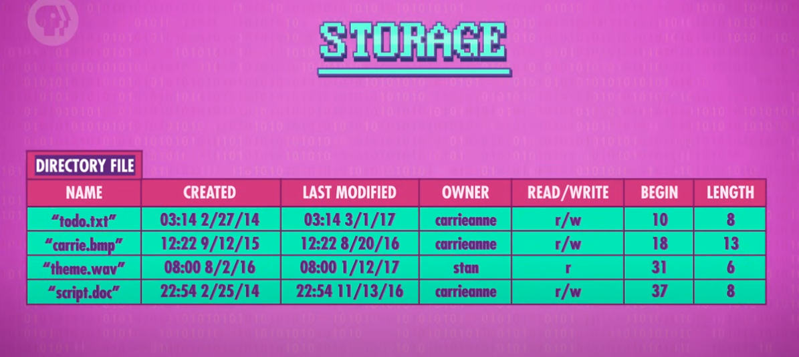
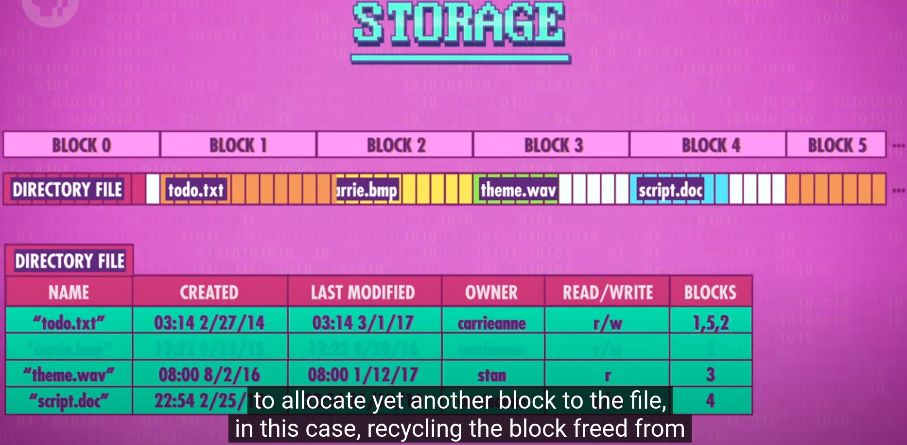
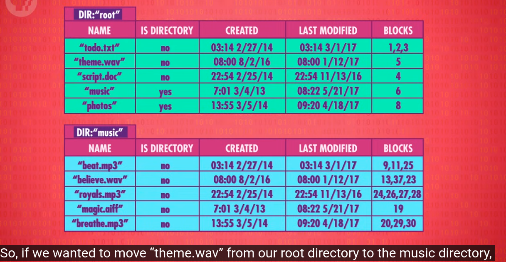

## 文件格式

##### WAVE



声音文件的采集和存储


##### BITMAPS




## 文件系统



##### Directory File

文件顺序存储,由 Directory File 存储每个文件开始和结束的位置.通常存储在开头



##### FLAT File System

缺点: 如果是磁盘,分散在不同位置的文件读取需要很长时间. 这种分别存储在不同地方的方法一般称为`Fragmentation`.解决办法是`DeFragmentation`,即存储后进行碎片整理(defragged), 将`todo.txt`顺序存储在BLOCK1~3



##### 多层级文件系统

在metadata中添加一列是否为文件夹即可.移动文件时并不用移动实际的物理存储,只需要修改文件系统条目即可




> For your specific case with 8MB flash and receiving audio files via network/serial, let me break down the comparison:
>
> 1. **LittleFS Advantages for Your Case**:
> - Better wear leveling for frequent writes from network/serial
> - Lower RAM usage (~1KB vs ~8KB for FatFS)
> - Better power-loss protection
> - More efficient for frequent partial updates
> - Designed specifically for flash memory
>
> 2. **FatFS Advantages for Your Case**:
> - Simpler directory structure if you need it
> - Slightly faster sequential writes
> - Better for large files
> - More familiar format if you need to occasionally connect flash to PC
>
> **Recommendation**: Given your constraints, I recommend **LittleFS** because:
> 1. Receiving files over network/serial means frequent writing
> 2. 8MB is relatively small, so efficient space usage is important
> 3. Power loss protection is crucial for network/serial transfers
> 4. Lower RAM usage leaves more memory for buffering received data
>
> Example implementation for your case:
>
> ```c
> #include "lfs.h"
> 
> // Configuration for 8MB flash
> const struct lfs_config cfg = {
>     .read_size = 256,
>     .prog_size = 256,
>     .block_size = 4096,
>     .block_count = 2048,  // 8MB / 4KB blocks
>     .cache_size = 256,
>     .lookahead_size = 16,
>     .block_cycles = 500,
> };
> 
> // Structure for received data
> typedef struct {
>     char filename[32];
>     uint32_t total_size;
>     uint32_t received_size;
>     lfs_file_t file;
>     bool file_open;
> } file_receive_ctx_t;
> 
> file_receive_ctx_t rx_ctx = {0};
> 
> // Start receiving new file
> int start_file_receive(const char* filename, uint32_t size) {
>     lfs_t lfs;
>     
>     if (rx_ctx.file_open) {
>         lfs_file_close(&lfs, &rx_ctx.file);
>     }
>     
>     strncpy(rx_ctx.filename, filename, sizeof(rx_ctx.filename));
>     rx_ctx.total_size = size;
>     rx_ctx.received_size = 0;
>     
>     // Create/open file
>     if (lfs_file_open(&lfs, &rx_ctx.file, filename, 
>         LFS_O_WRONLY | LFS_O_CREAT | LFS_O_TRUNC) < 0) {
>         return -1;
>     }
>     
>     rx_ctx.file_open = true;
>     return 0;
> }
> 
> // Handle received data chunk
> int handle_received_data(uint8_t* data, uint32_t length) {
>     lfs_t lfs;
>     
>     if (!rx_ctx.file_open) {
>         return -1;
>     }
>     
>     // Write data chunk
>     if (lfs_file_write(&lfs, &rx_ctx.file, data, length) < 0) {
>         return -2;
>     }
>     
>     rx_ctx.received_size += length;
>     
>     // Check if file is complete
>     if (rx_ctx.received_size >= rx_ctx.total_size) {
>         lfs_file_close(&lfs, &rx_ctx.file);
>         rx_ctx.file_open = false;
>         return 1;  // File complete
>     }
>     
>     return 0;  // More data expected
> }
> 
> // Network/Serial receive callback
> void on_data_received(uint8_t* data, uint32_t length, bool is_new_file) {
>     static uint8_t buffer[1024];  // Adjust size based on your RAM
>     static uint32_t buffer_pos = 0;
>     
>     if (is_new_file) {
>         // Parse file header/info and start new file
>         file_header_t* header = (file_header_t*)data;
>         start_file_receive(header->filename, header->size);
>         return;
>     }
>     
>     // Buffer data and write in chunks
>     memcpy(buffer + buffer_pos, data, length);
>     buffer_pos += length;
>     
>     if (buffer_pos >= sizeof(buffer)) {
>         handle_received_data(buffer, buffer_pos);
>         buffer_pos = 0;
>     }
> }
> ```
>
> Key implementation considerations for your case:
>
> 1. **Buffering**:
> ```c
> // Optimize buffer size for your network/serial speed
> #define BUFFER_SIZE 1024
> uint8_t receive_buffer[BUFFER_SIZE];
> ```
>
> 2. **Space Management**:
> ```c
> // Check available space before receiving
> uint32_t get_available_space(void) {
>     lfs_t lfs;
>     struct lfs_fsinfo info;
>     lfs_fs_stat(&lfs, &info);
>     return info.block_size * info.block_count - info.used_blocks;
> }
> ```
>
> 3. **Error Recovery**:
> ```c
> // For network/serial interruptions
> void recover_incomplete_file(void) {
>     if (rx_ctx.file_open) {
>         lfs_t lfs;
>         lfs_file_close(&lfs, &rx_ctx.file);
>         lfs_remove(&lfs, rx_ctx.filename);  // Delete incomplete file
>     }
> }
> ```
>
> Would you like me to explain any specific aspect of this implementation or show how to handle specific file operations?


```c

CFLAGS = -mcpu=cortex-m4 \        # Specify Cortex-M4 CPU
         -mthumb \                 # Use Thumb instruction set
         -mfloat-abi=hard \        # Use hardware floating-point
         -mfpu=fpv4-sp-d16 \      # M4F's floating-point unit type
         -O2 \                     # Optimization level 2
         -g \                      # Include debug info
         -ffunction-sections \     # Each function in separate section
         -fdata-sections \         # Each data item in separate section
         -Wall                     # Enable all warnings

LDFLAGS = -Wl,--gc-sections \     # Remove unused sections
          -specs=nano.specs \      # Use newlib-nano
          -specs=nosys.specs      # No system calls

The read speed improved by changing #define CONFIG_LITTLEFS_CACHE_SIZE from 128 to 512
```

