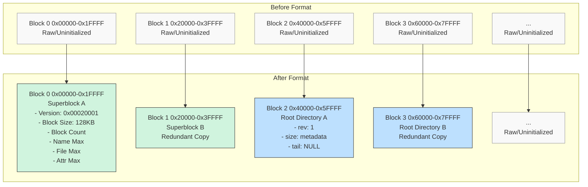

## 文件格式

##### WAVE


声音文件的采集和存储


##### BITMAPS


## 文件系统


##### Directory File

文件顺序存储,由 Directory File 存储每个文件开始和结束的位置.通常存储在开头


##### FLAT File System

缺点: 如果是磁盘,分散在不同位置的文件读取需要很长时间. 这种分别存储在不同地方的方法一般称为`Fragmentation`.解决办法是`DeFragmentation`,即存储后进行碎片整理(defragged), 将`todo.txt`顺序存储在BLOCK1~3


##### 多层级文件系统

在metadata中添加一列是否为文件夹即可.移动文件时并不用移动实际的物理存储,只需要修改文件系统条目即可


> For your specific case with 8MB flash and receiving audio files via network/serial, let me break down the comparison:
>
> 1. **LittleFS Advantages for Your Case**:
> - Better wear leveling for frequent writes from network/serial
> - Lower RAM usage (~1KB vs ~8KB for FatFS)
> - Better power-loss protection
> - More efficient for frequent partial updates
> - Designed specifically for flash memory
>
> 2. **FatFS Advantages for Your Case**:
> - Simpler directory structure if you need it
> - Slightly faster sequential writes
> - Better for large files
> - More familiar format if you need to occasionally connect flash to PC
>
> **Recommendation**: Given your constraints, I recommend **LittleFS** because:
> 1. Receiving files over network/serial means frequent writing
> 2. 8MB is relatively small, so efficient space usage is important
> 3. Power loss protection is crucial for network/serial transfers
> 4. Lower RAM usage leaves more memory for buffering received data
>
> Example implementation for your case:
>
> ```c
> #include "lfs.h"
> 
> // Configuration for 8MB flash
> const struct lfs_config cfg = {
>     .read_size = 256,
>     .prog_size = 256,
>     .block_size = 4096,
>     .block_count = 2048,  // 8MB / 4KB blocks
>     .cache_size = 256,
>     .lookahead_size = 16,
>     .block_cycles = 500,
> };
> 
> // Structure for received data
> typedef struct {
>     char filename[32];
>     uint32_t total_size;
>     uint32_t received_size;
>     lfs_file_t file;
>     bool file_open;
> } file_receive_ctx_t;
> 
> file_receive_ctx_t rx_ctx = {0};
> 
> // Start receiving new file
> int start_file_receive(const char* filename, uint32_t size) {
>     lfs_t lfs;
>     
>     if (rx_ctx.file_open) {
>         lfs_file_close(&lfs, &rx_ctx.file);
>     }
>     
>     strncpy(rx_ctx.filename, filename, sizeof(rx_ctx.filename));
>     rx_ctx.total_size = size;
>     rx_ctx.received_size = 0;
>     
>     // Create/open file
>     if (lfs_file_open(&lfs, &rx_ctx.file, filename, 
>         LFS_O_WRONLY | LFS_O_CREAT | LFS_O_TRUNC) < 0) {
>         return -1;
>     }
>     
>     rx_ctx.file_open = true;
>     return 0;
> }
> 
> // Handle received data chunk
> int handle_received_data(uint8_t* data, uint32_t length) {
>     lfs_t lfs;
>     
>     if (!rx_ctx.file_open) {
>         return -1;
>     }
>     
>     // Write data chunk
>     if (lfs_file_write(&lfs, &rx_ctx.file, data, length) < 0) {
>         return -2;
>     }
>     
>     rx_ctx.received_size += length;
>     
>     // Check if file is complete
>     if (rx_ctx.received_size >= rx_ctx.total_size) {
>         lfs_file_close(&lfs, &rx_ctx.file);
>         rx_ctx.file_open = false;
>         return 1;  // File complete
>     }
>     
>     return 0;  // More data expected
> }
> 
> // Network/Serial receive callback
> void on_data_received(uint8_t* data, uint32_t length, bool is_new_file) {
>     static uint8_t buffer[1024];  // Adjust size based on your RAM
>     static uint32_t buffer_pos = 0;
>     
>     if (is_new_file) {
>         // Parse file header/info and start new file
>         file_header_t* header = (file_header_t*)data;
>         start_file_receive(header->filename, header->size);
>         return;
>     }
>     
>     // Buffer data and write in chunks
>     memcpy(buffer + buffer_pos, data, length);
>     buffer_pos += length;
>     
>     if (buffer_pos >= sizeof(buffer)) {
>         handle_received_data(buffer, buffer_pos);
>         buffer_pos = 0;
>     }
> }
> ```
>
> Key implementation considerations for your case:
>
> 1. **Buffering**:
> ```c
> // Optimize buffer size for your network/serial speed
> #define BUFFER_SIZE 1024
> uint8_t receive_buffer[BUFFER_SIZE];
> ```
>
> 2. **Space Management**:
> ```c
> // Check available space before receiving
> uint32_t get_available_space(void) {
>     lfs_t lfs;
>     struct lfs_fsinfo info;
>     lfs_fs_stat(&lfs, &info);
>     return info.block_size * info.block_count - info.used_blocks;
> }
> ```
>
> 3. **Error Recovery**:
> ```c
> // For network/serial interruptions
> void recover_incomplete_file(void) {
>     if (rx_ctx.file_open) {
>         lfs_t lfs;
>         lfs_file_close(&lfs, &rx_ctx.file);
>         lfs_remove(&lfs, rx_ctx.filename);  // Delete incomplete file
>     }
> }
> ```
>
> Would you like me to explain any specific aspect of this implementation or show how to handle specific file operations?


```c

CFLAGS = -mcpu=cortex-m4 \        # Specify Cortex-M4 CPU
         -mthumb \                 # Use Thumb instruction set
         -mfloat-abi=hard \        # Use hardware floating-point
         -mfpu=fpv4-sp-d16 \      # M4F's floating-point unit type
         -O2 \                     # Optimization level 2
         -g \                      # Include debug info
         -ffunction-sections \     # Each function in separate section
         -fdata-sections \         # Each data item in separate section
         -Wall                     # Enable all warnings

LDFLAGS = -Wl,--gc-sections \     # Remove unused sections
          -specs=nano.specs \      # Use newlib-nano
          -specs=nosys.specs \    # No system calls
    	  -u _printf_float 		  # Enable printf float support

The read speed improved by changing #define CONFIG_LITTLEFS_CACHE_SIZE from 128 to 512
```


## LittleFS

I'll help you understand this code. This appears to be the source code for littlefs (Little File System), which is a small filesystem designed for embedded systems and microcontrollers. Let me break down the main components:

Key Files:
1. `lfs.c` - Main implementation file
2. `lfs.h` - Header file with public API definitions
3. `lfs_util.c` - Utility functions implementation
4. `lfs_util.h` - Utility functions header

Main Features:
1. **Designed for Flash Memory**:
   - Wear leveling
   - Power-loss resilient
   - Small memory footprint

2. **Key Structures**:
   ```c
   typedef struct lfs {
       lfs_cache_t rcache;    // Read cache
       lfs_cache_t pcache;    // Program cache
       lfs_block_t root[2];   // Root directory pair
       struct lfs_mlist *mlist; // Metadata list
       // ... other fields
   } lfs_t;
   ```

3. **Core Operations**:
   - File operations (open, read, write, close)
   - Directory operations (open, read, close)
   - Filesystem operations (format, mount, unmount)

4. **Key APIs**:
   ```c
   // Filesystem operations
   int lfs_format(lfs_t *lfs, const struct lfs_config *config);
   int lfs_mount(lfs_t *lfs, const struct lfs_config *config);
   int lfs_unmount(lfs_t *lfs);
   
   // File operations
   int lfs_file_open(lfs_t *lfs, lfs_file_t *file, const char *path, int flags);
   int lfs_file_read(lfs_t *lfs, lfs_file_t *file, void *buffer, lfs_size_t size);
   int lfs_file_write(lfs_t *lfs, lfs_file_t *file, const void *buffer, lfs_size_t size);
   
   // Directory operations
   int lfs_mkdir(lfs_t *lfs, const char *path);
   int lfs_dir_open(lfs_t *lfs, lfs_dir_t *dir, const char *path);
   ```

Would you like me to dive deeper into any particular aspect of the code? For example:
1. The internal workings of the filesystem
2. The caching mechanism
3. How it handles power loss resilience
4. The wear leveling strategy
5. Specific APIs or operations

Let me know what interests you most and I'll provide more detailed information!

##### 1. The internal workings of the filesystem

Let me explain the internal workings of littlefs. The filesystem is designed with a few key concepts that make it reliable and efficient for flash memory:

1. **Block Organization**
```c
// Each block in littlefs has a few key components
struct lfs_mdir {
    lfs_block_t pair[2];     // Two blocks are kept in pairs for reliability
    uint32_t rev;            // Revision count for updates
    lfs_off_t off;           // Current offset in block
    uint32_t etag;           // Expected tag
    uint16_t count;          // Number of directory entries
    bool erased;             // Whether block is erased
    bool split;              // Whether directory is split
    lfs_block_t tail[2];     // Tail directory for larger directories
};
```

2. **Metadata Structure**
The filesystem uses a copy-on-write (COW) directory system where metadata is stored in two blocks:

```c
// Key metadata structures
typedef struct lfs_dir {
    struct lfs_dir *next;    // Next directory in linked list
    uint16_t id;             // Directory ID
    uint8_t type;            // Type of directory
    lfs_mdir_t m;           // Metadata directory info
    lfs_off_t pos;          // Position in directory
    lfs_block_t head[2];    // Directory entry pair
} lfs_dir_t;
```

3. **Write Process**
Here's a simplified flow of how writes work:

```c
// Writing data involves several steps
static int lfs_file_write_(lfs_t *lfs, lfs_file_t *file, const void *buffer, lfs_size_t size) {
    // 1. Check if file is in write mode
    if (!(file->flags & LFS_O_WRONLY)) {
        return LFS_ERR_BADF;
    }

    // 2. Handle pending reads
    if (file->flags & LFS_F_READING) {
        int err = lfs_file_flush(lfs, file);
        if (err) {
            return err;
        }
    }

    // 3. Write data using copy-on-write
    lfs_ssize_t res = lfs_file_flushedwrite(lfs, file, buffer, size);
    if (res < 0) {
        return res;
    }

    return size;
}
```

4. **Power Loss Protection**
The filesystem achieves power loss protection through:

a) **Atomic Updates**:
```c
// All metadata updates are atomic
static int lfs_dir_commit(lfs_t *lfs, lfs_mdir_t *dir,
        const struct lfs_mattr *attrs, int attrcount) {
    // Write new data to unused block
    // Only switch active block after successful write
    // This ensures one block is always valid
}
```

b) **Checksums**:
```c
// CRC is used to verify data integrity
uint32_t lfs_crc(uint32_t crc, const void *buffer, lfs_size_t size) {
    static const uint32_t rtable[16] = {
        0x00000000, 0x1db71064, 0x3b6e20c8, // CRC lookup table
        // ...
    };
    // Calculate CRC for data verification
}
```

5. **Wear Leveling**
The filesystem implements wear leveling through:

```c
static int lfs_dir_alloc(lfs_t *lfs, lfs_mdir_t *dir) {
    // Allocate new blocks in a way that spreads writes across flash
    for (int i = 0; i < 2; i++) {
        int err = lfs_alloc(lfs, &dir->pair[i]);
        if (err) {
            return err;
        }
    }
}
```

6. **Reading Process**
Reading is implemented with caching for efficiency:

```c
static lfs_ssize_t lfs_file_read_(lfs_t *lfs, lfs_file_t *file,
        void *buffer, lfs_size_t size) {
    // Use cache if data is available
    if (file->flags & LFS_F_INLINE) {
        // Read from inline data
        memcpy(buffer, file->cache.buffer + file->pos, size);
    } else {
        // Read from block device
        int err = lfs_bd_read(lfs,
                NULL, &file->cache, size,
                file->block, file->off, buffer, size);
        if (err) {
            return err;
        }
    }
}
```

7. **Directory Structure**
Directories are organized as a linked list of entries:

```c
static int lfs_dir_fetch(lfs_t *lfs,
        lfs_mdir_t *dir, const lfs_block_t pair[2]) {
    // Read directory metadata
    // Find the block with the most recent revision
    // Load directory entries
}
```

This design provides several key benefits:
- Power-fail safety through atomic operations
- Wear leveling through block allocation strategy
- Bounded RAM usage through careful buffer management
- Support for growing directories through tail pointers
- Efficient block reuse through metadata compaction

Would you like me to elaborate on any of these aspects or explore another part of the filesystem?

##### 2. Explain the caching mechanism

Let me explain the caching mechanism in littlefs. The filesystem uses two main types of caches to optimize performance:

1. **Cache Structure**
```c
// Basic cache structure
typedef struct lfs_cache {
    lfs_block_t block;     // Block number being cached
    lfs_off_t off;         // Offset within the block
    lfs_size_t size;       // Size of cached data
    uint8_t *buffer;       // Actual cache buffer
} lfs_cache_t;
```

2. **Two Main Cache Types**:
```c
typedef struct lfs {
    lfs_cache_t rcache;    // Read cache
    lfs_cache_t pcache;    // Program (write) cache
    // ... other fields
} lfs_t;
```

3. **Cache Operations**
Here's how the read cache works:

```c
static int lfs_bd_read(lfs_t *lfs,
        const lfs_cache_t *pcache, lfs_cache_t *rcache, lfs_size_t hint,
        lfs_block_t block, lfs_off_t off,
        void *buffer, lfs_size_t size) {
    
    // Check if data is in program cache first
    if (pcache && block == pcache->block && 
        off < pcache->off + pcache->size) {
        if (off >= pcache->off) {
            // Copy from program cache
            memcpy(buffer, &pcache->buffer[off-pcache->off], size);
            return 0;
        }
    }

    // Check if data is in read cache
    if (block == rcache->block && 
        off < rcache->off + rcache->size) {
        if (off >= rcache->off) {
            // Copy from read cache
            memcpy(buffer, &rcache->buffer[off-rcache->off], size);
            return 0;
        }
    }

    // If not in cache, read from storage
    rcache->block = block;
    rcache->off = off;
    rcache->size = size;
    int err = lfs->cfg->read(lfs->cfg, rcache->block,
            rcache->off, rcache->buffer, rcache->size);
    if (err) {
        return err;
    }
}
```

4. **Cache Management**:
```c
// Drop cache (invalidate)
static inline void lfs_cache_drop(lfs_t *lfs, lfs_cache_t *rcache) {
    rcache->block = LFS_BLOCK_NULL;
}

// Zero cache (clear contents)
static inline void lfs_cache_zero(lfs_t *lfs, lfs_cache_t *pcache) {
    memset(pcache->buffer, 0xff, lfs->cfg->cache_size);
    pcache->block = LFS_BLOCK_NULL;
}
```

5. **Write Cache Flushing**:
```c
static int lfs_bd_flush(lfs_t *lfs,
        lfs_cache_t *pcache, lfs_cache_t *rcache, bool validate) {
    
    if (pcache->block != LFS_BLOCK_NULL) {
        // Write cached data to storage
        int err = lfs->cfg->prog(lfs->cfg, pcache->block,
                pcache->off, pcache->buffer, pcache->size);
        if (err) {
            return err;
        }

        if (validate) {
            // Verify written data if requested
            lfs_cache_drop(lfs, rcache);
            int res = lfs_bd_cmp(lfs,
                    NULL, rcache, pcache->size,
                    pcache->block, pcache->off, pcache->buffer);
            if (res < 0) {
                return res;
            }
        }

        // Clear cache after successful write
        lfs_cache_zero(lfs, pcache);
    }
    
    return 0;
}
```

6. **Cache Configuration**:
```c
struct lfs_config {
    // Cache configuration
    lfs_size_t cache_size;     // Size of block caches
    void *read_buffer;         // Optional static read buffer
    void *prog_buffer;         // Optional static program buffer
    void *lookahead_buffer;    // Optional static lookahead buffer
    // ... other fields
};
```

Key Features of the Caching Mechanism:

1. **Dual Cache System**
   - Read cache (rcache) optimizes reading operations
   - Program cache (pcache) buffers writes before committing to storage

2. **Cache Priority**
   - Program cache has priority over read cache
   - This ensures data consistency when both caches contain the same block

3. **Cache Invalidation**
   - Caches are invalidated when blocks are erased or modified
   - Ensures data consistency across operations

4. **Write-Through Validation**
   - Optional validation after writing to verify data integrity
   - Helps detect storage failures early

5. **Configurable Cache Size**
   - Cache size can be adjusted based on available RAM
   - Separate configuration for read and program caches

6. **Static Buffer Support**
   - Allows use of static buffers instead of dynamic allocation
   - Useful in memory-constrained environments

This caching mechanism provides several benefits:
- Reduces number of physical reads/writes
- Improves performance for sequential operations
- Helps manage flash wear leveling
- Maintains data consistency
- Efficient use of limited RAM

Would you like me to elaborate on any specific aspect of the caching mechanism or explore another area?

##### 3. How it handles power loss resilience?

Let me explain how littlefs handles power loss resilience. This is one of its key features, ensuring filesystem integrity even when power is cut unexpectedly.

1. **Atomic Updates**
Here's the core mechanism for atomic updates:

```c
static int lfs_dir_commit(lfs_t *lfs, lfs_mdir_t *dir,
        const struct lfs_mattr *attrs, int attrcount) {
    // Always keeps two valid copies of directory blocks (pairs)
    struct lfs_commit commit = {
        .block = dir->pair[1],  // Write to alternate block
        .off = 0,
        .ptag = 0xffffffff,
        .crc = 0xffffffff,
    };

    // Write new data to unused block first
    while (nsize > 0) {
        int err = lfs_dir_commitprog(lfs, &commit, data, nsize);
        if (err) {
            return err;
        }
    }

    // Only after successful write, update the directory pointer
    lfs_pair_swap(dir->pair);
}
```

2. **Metadata Protection**
```c
static int lfs_dir_split(lfs_t *lfs,
        lfs_mdir_t *dir, const struct lfs_mattr *attrs, int attrcount) {
    // Create new metadata pair
    lfs_mdir_t tail;
    int err = lfs_dir_alloc(lfs, &tail);
    
    // Write metadata to new location before updating pointers
    err = lfs_dir_compact(lfs, &tail, attrs, attrcount,
            source, split, end);

    // Only after successful write, update the tail pointer
    dir->tail[0] = tail.pair[0];
    dir->tail[1] = tail.pair[1];
}
```

3. **State Tracking**
```c
typedef struct lfs_gstate {
    uint32_t tag;           // Current state tag
    lfs_block_t pair[2];    // Currently active block pair
} lfs_gstate_t;

typedef struct lfs {
    lfs_gstate_t gstate;    // Global state
    lfs_gstate_t gdisk;     // On-disk state
    lfs_gstate_t gdelta;    // Change in state
} lfs_t;
```

4. **Recovery Process**
```c
static int lfs_fs_deorphan(lfs_t *lfs, bool powerloss) {
    // Check for orphan blocks after power loss
    if (!lfs_gstate_hasorphans(&lfs->gstate)) {
        return 0;
    }

    // Find orphaned blocks
    lfs_mdir_t pdir = {.split = true, .tail = {0, 1}};
    
    // Fix orphaned blocks
    while (!lfs_pair_isnull(pdir.tail)) {
        // Check each directory entry
        if (tag == LFS_ERR_NOENT && powerloss) {
            // Found an orphan
            LFS_DEBUG("Fixing orphan {0x%"PRIx32", 0x%"PRIx32"}",
                    pdir.tail[0], pdir.tail[1]);

            // Fix orphan
            int err = lfs_dir_getgstate(lfs, &dir, &lfs->gdelta);
            if (err) {
                return err;
            }
        }
    }
}
```

5. **Checksums for Data Integrity**
```c
static int lfs_dir_commitcrc(lfs_t *lfs, struct lfs_commit *commit) {
    // Calculate CRC for written data
    struct {
        lfs_tag_t tag;
        uint32_t crc;
    } ccrc;

    ccrc.tag = lfs_tobe32(ntag ^ commit->ptag);
    commit->crc = lfs_crc(commit->crc, &ccrc.tag, sizeof(ccrc.tag));
    ccrc.crc = lfs_tole32(commit->crc);

    // Write CRC
    int err = lfs_bd_prog(lfs,
            &lfs->pcache, &lfs->rcache, true,
            commit->block, commit->off, &ccrc, sizeof(ccrc));
}
```

6. **Block Synchronization**
```c
static int lfs_bd_sync(lfs_t *lfs,
        lfs_cache_t *pcache, lfs_cache_t *rcache, bool validate) {
    // Flush any pending writes
    int err = lfs_bd_flush(lfs, pcache, rcache, validate);
    if (err) {
        return err;
    }

    // Force sync to storage
    err = lfs->cfg->sync(lfs->cfg);
    return err;
}
```

Key Power Loss Protection Features:

1. **Copy-on-Write Updates**
   - Never modifies existing data in place
   - Always writes new data before updating pointers
   - Ensures valid state even if power fails during write

2. **Metadata Redundancy**
   - Keeps two copies of critical metadata
   - Alternates between copies for updates
   - Can recover from corruption of one copy

3. **Transaction System**
   - Groups related changes into atomic transactions
   - Either all changes commit or none do
   - Prevents partial updates

4. **Integrity Verification**
   - Uses CRC checksums to detect corruption
   - Validates data after writing when configured
   - Can detect and handle storage failures

5. **Recovery Mechanism**
   - Scans for inconsistencies on mount
   - Can fix orphaned blocks
   - Restores filesystem to last known good state

6. **Wear Leveling Integration**
   - Power loss protection works with wear leveling
   - Prevents wear concentration even during recovery
   - Maintains flash lifetime

The end result is a filesystem that can:
- Survive unexpected power loss at any point
- Maintain data consistency
- Automatically recover on next mount
- Prevent data corruption
- Handle flash device failures

Would you like me to delve deeper into any of these aspects or explore another area of the filesystem?


```shell
Flash Memory Layout (4KB blocks)
===============================

Block 0 (0x0000 - 0x0FFF): Superblock Primary
--------------------------------------------
0x0000: 32 00 02 00     // Version (0x00020032)
0x0004: 00 10 00 00     // Block size (4096 bytes)
0x0008: 00 20 00 00     // Block count (8192 blocks)
0x000C: FF 00 00 00     // Name max (255 bytes)
0x0010: FF FF FF 7F     // File max (2GB)
0x0014: FE 03 00 00     // Attr max (1022 bytes)
0x0018: "littlefs"      // Filesystem magic
0x0020: [CRC32]         // Metadata checksum

Block 1 (0x1000 - 0x1FFF): Superblock Backup
-------------------------------------------
[Identical to Block 0]

Block 2 (0x2000 - 0x2FFF): Root Directory
----------------------------------------
0x2000: 01 00 00 00     // Revision number
0x2004: 40 00 00 00     // Directory size
0x2008: [Dir Entry 1]   // e.g. "file1.txt"
  +0x00: 01             // Type (file)
  +0x01: 09             // Name length
  +0x02: 00             // Attr length
  +0x03: "file1.txt"    // Name
  +0x0C: [Metadata]     // File metadata (size, block pointer)
0x2048: [Dir Entry 2]   // e.g. "folder1"
  +0x00: 02             // Type (directory)
  +0x01: 07             // Name length
  +0x02: 00             // Attr length
  +0x03: "folder1"      // Name
  +0x0A: [Metadata]     // Directory metadata
0x2FFC: [CRC32]         // Block checksum

Block 3 (0x3000 - 0x3FFF): Backup Root Directory
----------------------------------------------
[Mirror of Block 2]

Block 4-5 (0x4000 - 0x5FFF): File Data Blocks
-------------------------------------------
0x4000: [File Content]  // Actual file data
0x4FF8: [Next Block]    // Pointer to next block if file continues
0x4FFC: [CRC32]        // Data checksum

Block 6+ (0x6000+): Free Space / Lookahead Region
----------------------------------------------
[Available for allocation]

Metadata Entry Format:
--------------------
[2 bytes] Type/ID
[2 bytes] Size
[4 bytes] Block pointer (for files/directories)
[4 bytes] File size (for files)
[4 bytes] CRC

Directory Entry Format:
---------------------
[1 byte]  Type (file/dir/symlink)
[1 byte]  Name length
[1 byte]  Attribute length
[N bytes] Name
[M bytes] Attributes (optional)
[4 bytes] Metadata pointer

Block States:
-----------
0xFF: Erased state
0x00: Valid data
0xEE: Moving/processing
0xDD: Bad block


Block 4 (0x4000 - 0x4FFF): File Data Block
----------------------------------------
0x4000: [Header]
    +0x00: 32 00 02 00  // Block tag/version
    +0x04: FF 03 00 00  // Block flags
    +0x08: [Block ID]   // Block identifier
    +0x0C: [Block sequence number]  // For file ordering
    +0x10: [Data length]  // Length of data in this block

0x4020: [File Content]  // Actual file data starts here
    ... (data continues)

0x4FF0: [Footer]
    +0x00: [Next block pointer]  // Link to next block if file continues
    +0x04: [Data checksum]      // CRC32 of data section
    +0x08: [Block checksum]     // CRC32 of entire block

Total block size: 4096 bytes (0x1000)

Block linking example for a large file:
--------------------------------------
Block 4 -> Block 7 -> Block 12 -> NULL

Notes:
- First 32 bytes: Block metadata
- Last 16 bytes: Footer with checksums and next pointer
- Usable data space per block: 4048 bytes (0x1000 - 32 - 16)
```

##### 4. The wear leveling strategy

Let me explain littlefs's wear leveling strategy. The filesystem uses several techniques to distribute writes evenly across flash blocks to extend the life of the storage device.

1. **Block Allocation Strategy**
```c
static int lfs_alloc(lfs_t *lfs, lfs_block_t *block) {
    while (true) {
        // Scan lookahead buffer for free blocks
        while (lfs->lookahead.next < lfs->lookahead.size) {
            // Find next free block using bitmap
            if (!(lfs->lookahead.buffer[lfs->lookahead.next / 8] 
                    & (1U << (lfs->lookahead.next % 8)))) {
                // Found a free block
                *block = (lfs->lookahead.start + lfs->lookahead.next)
                        % lfs->block_count;
                
                // Move to next block for next allocation
                lfs->lookahead.next += 1;
                lfs->lookahead.ckpoint -= 1;
                return 0;
            }
            
            lfs->lookahead.next += 1;
            lfs->lookahead.ckpoint -= 1;
        }

        // Need to scan filesystem for more free blocks
        int err = lfs_alloc_scan(lfs);
        if (err) {
            return err;
        }
    }
}
```

2. **Dynamic Relocation**
```c
static int lfs_dir_relocating(lfs_t *lfs, lfs_mdir_t *dir) {
    // Check if block needs relocation based on erase cycles
    if (lfs->cfg->block_cycles > 0) {
        int cycles = ((dir->rev + 1) % ((lfs->cfg->block_cycles+1)|1));
        if (cycles == 0) {
            // Time to relocate this directory
            return lfs_dir_relocate(lfs, dir);
        }
    }
    return 0;
}

static int lfs_dir_relocate(lfs_t *lfs, lfs_mdir_t *dir) {
    // Allocate new location
    lfs_block_t nblock;
    int err = lfs_alloc(lfs, &nblock);
    if (err) {
        return err;
    }

    // Move data to new block
    err = lfs_dir_move(lfs, dir, nblock);
    if (err) {
        return err;
    }
}
```

3. **Metadata Distribution**
```c
static bool lfs_dir_needsrelocation(lfs_t *lfs, lfs_mdir_t *dir) {
    // If our revision count == n * block_cycles, force relocation
    return (lfs->cfg->block_cycles > 0
            && ((dir->rev + 1) % ((lfs->cfg->block_cycles+1)|1) == 0));
}
```

4. **Block Reuse Control**
```c
static void lfs_alloc_ckpoint(lfs_t *lfs) {
    // Set checkpoint - marks when blocks can be reused
    lfs->lookahead.ckpoint = lfs->block_count;
}

static int lfs_alloc_lookahead(void *p, lfs_block_t block) {
    lfs_t *lfs = p;
    lfs_block_t off = ((block - lfs->lookahead.start)
            + lfs->block_count) % lfs->block_count;

    // Mark block as used in lookahead buffer
    if (off < lfs->lookahead.size) {
        lfs->lookahead.buffer[off / 8] |= 1U << (off % 8);
    }
    return 0;
}
```

5. **Wear Monitoring**
```c
struct lfs_config {
    // Block cycles controls frequency of relocations
    int32_t block_cycles;  // Number of erase cycles before forced relocation
};

// Block wear state tracking
typedef struct lfs_mdir {
    uint32_t rev;     // Revision count tracks block usage
    // ... other fields
} lfs_mdir_t;
```

Key Features of the Wear Leveling Strategy:

1. **Dynamic Block Selection**
   
   - Uses a lookahead buffer to track free blocks
   - Distributes writes across available blocks
   - Avoids concentration of writes in specific areas
   
2. **Forced Block Rotation**
   
   - Tracks erase cycles per block
   - Forces relocation after configured number of cycles
   - Prevents any block from wearing out prematurely
   
3. **Configurable Wear Thresholds**
   
   ```c
   // Example configuration
   const struct lfs_config cfg = {
       .block_cycles = 500,  // Relocate after 500 erases
   };
   ```
   
4. **Intelligent Metadata Placement**
   
   - Spreads metadata across different blocks
   - Rotates directory locations
   - Prevents metadata hotspots
   
5. **Balanced Block Reuse**
   ```c
   static int lfs_fs_traverseraw(lfs_t *lfs, int (*cb)(void*, lfs_block_t), void *data) {
       // Traverse all blocks to understand usage patterns
       // Helps make informed allocation decisions
   }
   ```

6. **Power-Fail Safe Wear Leveling**
   - Maintains wear leveling even during power failures
   - Recovers state correctly after interruption
   - Continues balanced wear pattern

Benefits of this Strategy:

1. **Extended Device Life**
   - Prevents premature block failure
   - Distributes wear evenly
   - Maximizes flash endurance

2. **Predictable Performance**
   - Avoids sudden failures
   - Maintains consistent write speeds
   - Graceful degradation

3. **Configurable Behavior**
   - Adjustable based on flash characteristics
   - Can be tuned for different use cases
   - Balances wear vs performance

4. **Low Overhead**
   - Efficient block tracking
   - Minimal memory requirements
   - Small computational cost

Would you like me to elaborate on any specific aspect of the wear leveling strategy or explore another area of the filesystem?

### 执行过程

##### lfs_format()

I'll help create a visualization of how littlefs organizes flash memory during formatting. Let me create this using a mermaid diagram.




Let me explain the key aspects of the memory layout:

1. **Before Formatting**:
   - The entire flash memory is in an uninitialized state
   - Each block contains random or undefined data (0xFF if freshly erased)
   - No filesystem structure exists

2. **After Formatting** (key structures):

   a) **Superblock Pair (Blocks 0-1)**:
   ```c
   struct lfs_superblock {
       uint32_t version;     // 0x00020001 (version 2.0.1)
       lfs_size_t block_size;  // Typically 128KB
       lfs_size_t block_count; // Total number of blocks
       lfs_size_t name_max;    // Max filename length
       lfs_size_t file_max;    // Max file size
       lfs_size_t attr_max;    // Max attribute size
   }
   ```
   - Stored in both Block 0 and Block 1 for redundancy
   - Contains filesystem configuration and metadata

   b) **Root Directory Pair (Blocks 2-3)**:
   ```c
   struct lfs_dir {
       uint32_t rev;         // Revision number (starts at 1)
       lfs_size_t size;      // Size of metadata
       lfs_block_t tail[2];  // Points to next directory pair or NULL
   }
   ```
   - Stored in both Block 2 and Block 3 for redundancy
   - Contains directory entries and file metadata

   c) **Remaining Blocks**:
   - All other blocks are marked as free (erased to 0xFF)
   - Will be used for file data and directory entries as needed

3. **Key Features of the Layout**:

   - **Dual Block Redundancy**: Critical structures (superblock and root directory) are stored in pairs
   - **Power Loss Protection**: Uses a sequence of atomic operations to update blocks
   - **Wear Leveling**: Free blocks are allocated in a way that distributes wear across the flash
   - **Fixed Block Size**: Each block has the same size (typically 128KB)
   - **Deterministic**: The layout is consistent across formats

4. **Block States**:
   - **Erased**: All bits set to 1 (0xFF)
   - **Valid**: Contains valid data and metadata
   - **Moving**: Being relocated during wear leveling
   - **Corrupt**: Failed write/erase (marked as bad)

This layout enables littlefs to provide:
- Power loss resilience through paired redundancy
- Wear leveling through dynamic block allocation
- Efficient space usage through block chaining
- Fast mount times by having fixed superblock locations

Would you like me to elaborate on any particular aspect of the layout or explain how specific operations (like file writes) interact with this structure?

##### lfs_mount()

I'll help create a visualization of the flash memory layout before and after mounting littlefs. Let me create this using an artifact to show the memory layout clearly.


Let me explain the key aspects of the memory layout:

1. **Before Mount**:
   - The flash memory starts with two critical blocks:
     - Block 0 (0x00000000): Primary Superblock
     - Block 1 (0x00001000): Backup Superblock
   - The superblocks contain filesystem metadata:
     - Version information
     - Block size
     - Block count
     - Name/file/attribute maximums

2. **After Mount**:
   - The filesystem loads critical structures into RAM:
     - The superblock is validated and its information cached
     - Root directory structure is loaded
     - Lookahead bitmap is initialized for wear leveling
     - Cache buffers are allocated (read cache and program cache)

3. **Key Memory Structures**:
   - **Superblock**: Contains filesystem configuration
     ```c
     struct lfs_superblock {
         uint32_t version;     // 0x00020001
         lfs_size_t block_size;  // Usually 4096 bytes
         lfs_size_t block_count; // Total number of blocks
         lfs_size_t name_max;    // Maximum name length
         lfs_size_t file_max;    // Maximum file size
         lfs_size_t attr_max;    // Maximum attribute size
     }
     ```
   
   - **Directory Entry**:
     - Contains file/directory metadata
     - Includes name, size, and type information
     - Linked in a circular list structure

   - **Data Blocks**:
     - Used for file content storage
     - Managed through copy-on-write for power safety
     - Wear leveling distributes writes across blocks

4. **Key Operations During Mount**:
   ```c
   int lfs_mount(lfs_t *lfs, const struct lfs_config *cfg) {
       // 1. Read and validate superblock
       // 2. Setup root directory
       // 3. Initialize lookahead
       // 4. Setup read/write caches
       // 5. Load filesystem state
   }
   ```

5. **Memory Management Features**:
   - **Power Loss Resilience**: Uses copy-on-write operations
   - **Wear Leveling**: Dynamic block allocation with lookahead
   - **Caching**: Separate read and write caches reduce flash wear
   - **Metadata Redundancy**: Critical structures are duplicated

The filesystem is designed to be robust on flash memory while maintaining a small RAM footprint. Would you like me to elaborate on any specific aspect of the memory layout or operations?
