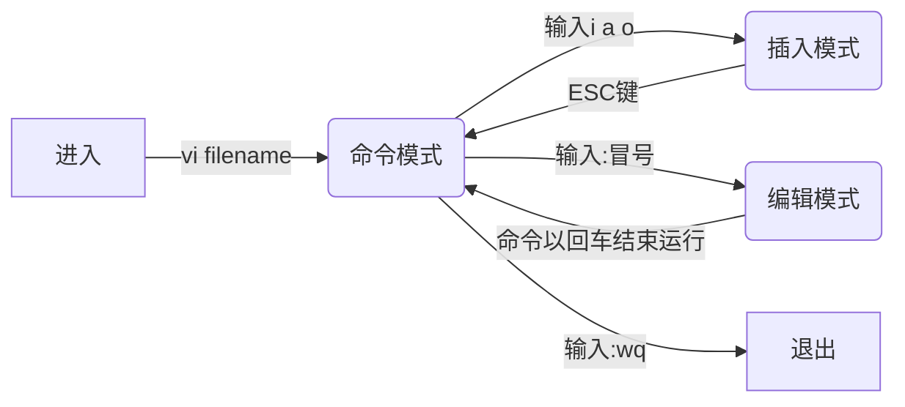
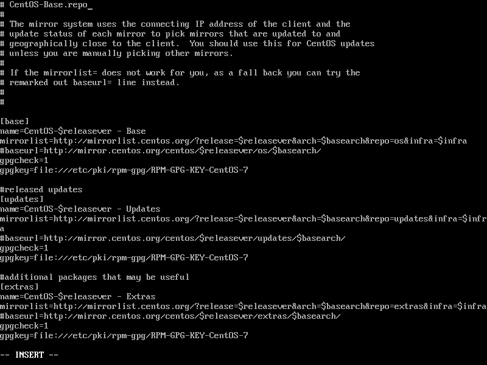
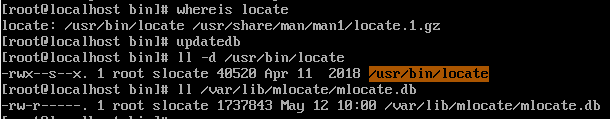
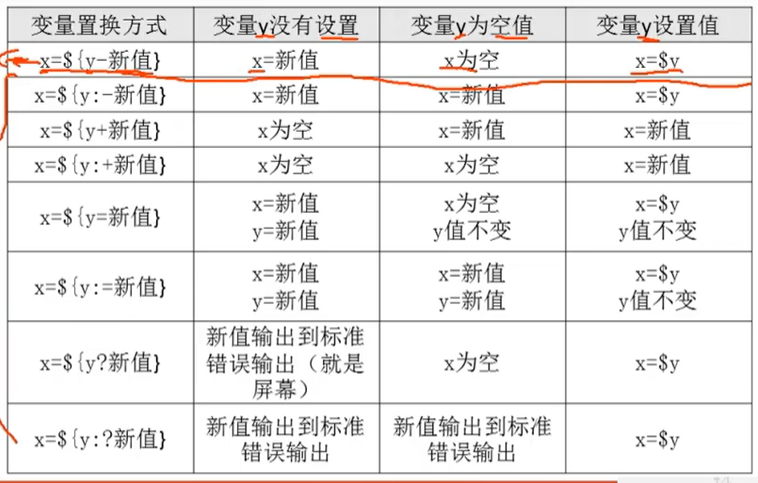
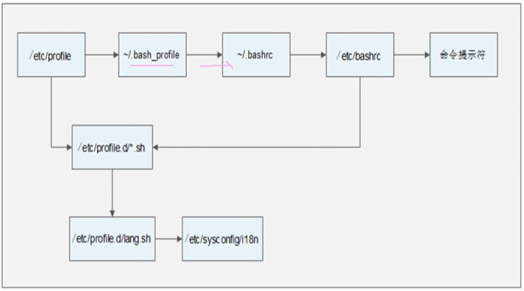
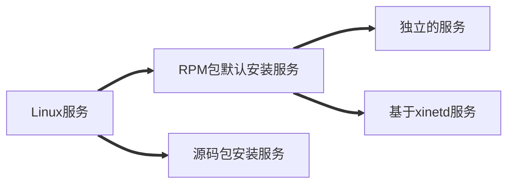

# Linux

## 一、系统分区

### 1.分区类型

- 主分区：最多只能有4个分区
- 扩展分区
  - 最多只能有一个
  - 主分区加扩展分区最多有4个
  - 不能写入数据，只能包含逻辑分区
- 逻辑分区

注：硬盘的限制，不是操作系统的，只要硬盘结构不改变，限制就会一直存在。硬盘的第一扇区可以分成三个部分：第一部分MBR，需要占用446字节，第二部分DPT，需要占用64字节，这是因为一个分区表需要占用16字节，64/16=4，所以刚好能存放四个分区的表，这就是为什么只能分四个分区。还有两个字节就用来存放结束标志。这样
446+64+2=512字节

### 2.格式化

格式化（高级格式化）又称逻辑格式化，它是指根据用户选定的文件系统（Linux为EXT4），在磁盘的特定区域写入特定数据，在分区中划出一片用于存放文件分配表、目录表等用于文件管理的磁盘空间。（为了在硬盘中写入文件系统）

### 3.硬件设备文件名

Linux还需要给每一个硬件起一个名字（为了调用）

| 硬件              | 设备                 |
| :---------------- | :------------------- |
| IDE硬盘           | /dev/hd[a-d]         |
| SCSI/SATA/USB硬盘 | /dev/sd[a-p]         |
| 光驱              | /dev/cdrom或/dev/sr0 |
| 软盘              | /dev/fd[0-1]         |
| 打印机（25针）    | /dev/lp[0-2]         |
| 打印机（USB）     | /dev/usb/lp[0-15]    |
| 鼠标              | /dev/mouse           |

分区设备文件

在硬盘文件名后加1-4，如   /dev/hda1a  代表硬盘的第一个分区

### 4.挂载

- 必须分区
  - /（根分区）
  - swap分区（交换分区，内存2倍，不超过2GB）
- 推荐分区
  - /boot（启动分区，200MB）

整个过程：分区 >> 格式化 >> 给每个分区起设备文件名 >> 挂载（给每个分区写入挂载点）

### 总结

- 分区：把大硬盘分为小的逻辑分盘
- 格式化：写入文件系统（附带清空数据）
- 分区设备文件名：给每个分区定义设备文件名
- 挂载：给每个分区分配挂载点

## 二、一些建议

### 1.Linux注意事项

- Linux严格区分大小
- Linux中所有内容以文件形式保存，包括硬件
  - 硬盘文件是/dev/sd[a-p]
  - 光盘文件是/dev/sr0等
- Linux不靠扩展名区分文件类型
  - 压缩包：*.gz， *.bz2, .tar.bz2, *.tgz等
  - 二进制软件包： .rpm
  - 网页文件：*.html, *.php
  - 脚本文件：*.sh
  - 配置文件：*.conf
- Linux所有的存储设备都必须挂载之后用户才能使用，包括硬盘、U盘和光盘
- Windows下的程序不能直接在LInux中安装和运行

### 2.服务器管理和维护建议

**usr:**	unix system resources 	unix系统资源

#### 目录名与作用表

| 目录名       | 目录作用                                                     |
| ------------ | ------------------------------------------------------------ |
| /bin/        | 存放系统命令的目录，普通用户和超级用户都可以执行。不过放在/bin下的命令在单用户模式下也可以执行 |
| /sbin/       | 保存和系统环境设置相关的命令，只有超级用户可以使用这些命令进行系统环境设置，但是有些命令可以允许普通用户查看 |
| /usr/bin/    | 存放系统命令的目录，普通用户和超级用户都可以执行。这些命令和系统启动无关，在单用户模式下不能执行 |
| /usr/sbin/   | 存放根文件系统不必要的系统管理命令，例如多数服务程序。只有超级用户可以使用。大家其实可以注意到Linux的系统，在所有所有“sbin”目录中保存的命令只有超级用户可以使用，“bin”目录中保存的命令所有用户都可以使用 |
| /boot/       | 系统启动目录，保存系统启动相关的文件，如内核文件和启动引导程序（grub）文件等 |
| /dev/        | 设备文件保存位置。我们已经说过Linux中所有内容以文件形式保存，包括硬件。那么这个目录就是用来保存所有硬件设备文件的 |
| /etc/        | 配置文件保存位置。系统内所有采用默认安装方式（rmp安装）的服务的配置文件全部都保存在这个目录当中，如用户账号和密码，服务的启动脚本，常用服务的配置文件等 |
| /home/       | 普通用户的家目录。建立每个用户时，每个用户要有一个默认登录位置，这个位置就是这个用户的家目录，所有普通用户的家目录就是在home下建立一个和用户名相同的目录。如用户userl的家目录就是/home/userl |
| /lib/        | 系统调用的函数库保存位罝                                     |
| /lost+found/ | 当系统意外崩溃或机器意外关机，而产生一些文件碎片放在这里。当系统启动的过程中fsck工具会检查这里，并修复已经损坏的文件系统。这个目录只在每个分区中出现，例如/lost+found就是根分区的备份恢复目录，/boot/lost+found 就是/boot分区的备份恢复目录 |
| /media/      | 挂载目录。系统建议是用来挂载媒体设备的，例如软盘和光盘       |
| /mnt/        | 挂载目录，早期Linux中只有这一个挂载目录，并没有细分。现在这个目录系统建议挂载额外设备，如U盘，移动硬盘和其他操作系统的分区 |
| /misc/       | 挂载目录。系统建议用来挂载NFS服务的共享目录。我们在刚刚己经解释了挂载：童鞋们应该知道只要是一个已经建立的空目录就可以作为挂载点。那么系统虽然准备了三个默认挂载目录/media、/mnt、/misc，但是到底在哪个目录中挂载什么设备都可以由管理员自己决定。例如超哥接触Linux的时候，默认挂载目录只有/mnt一个，所以养成了在/mnt下建立不同目录挂载不同设备的习惯。如Imnt/cdrom挂载光盘，Imntusb挂载U畫，这都是可以的 |
| /opt/        | 第三方安装的软件保存位置。这个目录就是放置和安装其他软件的位置，我手工安装的源码包软件都可以安装到这个目录当中。不过我还是更加习惯把软件放置到/usr/local/目录当中，也就是说/usr/local/目录也可以用来安装软件 |

- 远程服务器不允许关机，只能重启
- 重启时应该关闭服务
- 不要在服务器访问高峰运行高负载命令
- 远程配置防火墙时不要把自己踢出服务器
- 指定合理的密码规范并定期更新
- 合理分配权限
- 定期备份重要数据和日志

## 三、Linux常用命令

### 命令格式

**命令格式：**命令[-选项] [参数] (中括号代表可选)

例：ls -la /etc

**说明：**

1. 个别命令使用不遵循此格式

2. 当有多个选项时，可以写在一起

3. 简化选项与完整选项

   -a 等于 --all

### 1.文件处理命令

#### 1.1目录处理命令

##### ls

**命令名称：**ls

**命令英文原意：**list

**命令所在路径：**/bin/ls

**执行权限：**所有用户

**功能描述：**显示目录文件

**语法：**ls 选项[-ald] [文件或目录]

​				-a	--all 显示所有文件，包括隐藏文件

​				-l	long 详细信息显示

​				-d	查看目录属性

​				-h	human人性化显示

​				 -i	查看inode索引节点

**-rw-r--r--**

-  **-**

-  开头第一个符号表示文件类型（ - 二进制文件；d 目录；l 软链接）
-  **rw-**                     **r--**                    **r--**
-  user                  group              other
-  u所有者            g所属组           o其他人
-  r读  w写  x执行

##### mkdir

**命令名称：**mkdir

**命令英文原意：**make directories

**命令所在路径：**/bin/mkdir

**执行权限：**所有用户

**功能描述：**创建新目录

**语法：**mkdir -p [目录名]

​				-p	递归创建

**范例：**$mkdir -p /tmp/wuwt/bio

​			$mkdir -p /tmp/wuwt/art /tmp/wuwt/gatk

##### cd

**命令名称：**cd

**命令英文原意：**change directory

**命令所在路径：**bin/cd

**执行权限：**所有用户

**功能描述：**切换目录

**语法：**cd [目录名]

​				-p	递归创建

##### pwd

**命令名称：**pwd

**命令英文原意：**print working directory

**命令所在路径：**/bin/pwd

**执行权限：**所有用户

**功能描述：**显示当前目录

**语法：**pwd

##### rmdir

**命令名称：**rmdir

**命令英文原意：**remove empty directories

**命令所在路径：**/bin/rmdir

**执行权限：**所有用户

**功能描述：**删除空目录

**语法：**rmdir [目录名]

##### cp

**命令名称：**cp

**命令英文原意：**copy

**命令所在路径：**/bin/cp

**执行权限：**所有用户

**功能描述：**复制文件或目录

**语法：**cp	-rp	[原文件或目录] [目标目录]  #可同时进行更名，写在最后

​					-r	复制目录

​					-p	保留文件属性

##### mv

**命令名称：**mv

**命令英文原意：**move

**命令所在路径：**/bin/mv

**执行权限：**所有用户

**功能描述：**剪切文件、改名

**语法：**mv [原文件或目录] [目标目录]

##### rm

**命令名称：**rm

**命令英文原意：**remove

**命令所在路径：**/bin/rm

**执行权限：**所有用户

**功能描述：**删除文件

**语法：**rm	-rf	[目录名]

​					-r	删除目录

​					-f	force强制执行

#### 1.2文件处理命令

##### touch

**命令名称：**touch

**命令所在路径：**/bin/touch

**执行权限：**所有用户

**功能描述：**创建空文件

**语法：**touch	[文件名]

##### cat

**命令名称：**cat

**命令所在路径：**/bin/cat

**执行权限：**所有用户

**功能描述：**显示文件内容		#**tac** 反向列示文件内容

**语法：**cat	[文件名]

​					-n	number显示行号

##### more	

**命令名称：**more

**命令所在路径：**/bin/more

**执行权限：**所有用户

**功能描述**：分页显示文件内容

**语法：**more	[文件名]

​					（空格）或f		frontpage翻页

​					（Enter)				换行

​						q或Q				退出

##### less

**命令名称：**less

**命令所在路径：**/usr/bin/less

**执行权限：**所有用户

**功能描述**：分页显示文件内容(可向上翻页)

**语法：**less	[文件名]

​					（空格）或f		frontpage翻页

​					（Enter)				换行

​						q或Q				退出

​						PgUp				往上翻页

​						上箭头				上一行

​						/[关键词]				查找			n	next查找下一个

##### head

**命令名称：**head

**命令所在路径：**/usr/bin/head

**执行权限：**所有用户

**功能描述**：分页显示文件头几行

**语法：**head	[文件名]

​					-n		指定行数	#不加默认前10行

##### tail

**命令名称：**tail

**命令所在路径：**/usr/bin/tail

**执行权限：**所有用户

**功能描述**：分页显示文件尾几行

**语法：**tail	[文件名]

​					-n		指定行数	#不加默认前10行

​					-f		动态显示文件末尾内容

#### 1.3链接命令

##### ln

**命令名称：**ln

**命令所在路径：**/bin/ln

**执行权限：**所有用户

**功能描述**：生成链接文件

**语法：**ln		-s	[原文件]	[目标文件]

​					-s		soft创建软链接

​				不加选项	hard创建硬链接

**软链接特征：**类似Windows快捷方式

1、lrwxrwxrwx	l软链接

2、文件很小-只是符号链接

3、/tmp/issue.soft -> /etc/issue	箭头指向源文件

**硬链接特征：**

1、拷贝cp -p + 同步更新

echo "www.lampbrother.net" >> /etc/issue

2、通过i节点识别

3、不能跨分区

4、不能针对目录使用

### 2.权限管理命令

**chmod**

**命令名称：**chmod

**命令英文原意：**change the permissions mode of a file

**命令所在路径：**/bin/chmod

**执行权限：**所有用户

**功能描述**：改变文件或目录权限

**语法：**chmod	[{ugoa}{+-=}{rwx}] [文件或目录]

​							[mode=421 ] [文件或目录]

​							-R	递归修改(更改目录及所有子文件权限)

权限的数字表示

**r**	-----------	4	$2^2$

**w**	----------	2	$2^1$

**x**	-----------	1	$2^0$

**file**		 **r: **	cat/more/head/tail/less

​			  **w:**	vim

​			   **x:**	script	command

**directory**		 **r:**	ls

​						**w:**	touch/mkdir/rmdir/rm

​						**x:**	cd

**rwxrw-r--**

7	6	4

##### chown

**命令名称：**chown

**命令英文原意：**change file ownership

**命令所在路径：**/bin/chown

**执行权限：**所有用户

**功能描述**：改变文件或目录的所有者

**语法：**chown	[用户]	[文件或目录]

##### chgrp

**命令名称：**chgrp

**命令英文原意：**change file group ownership

**命令所在路径：**/bin/chgrp

**执行权限：**所有用户

**功能描述**：改变文件或目录的所属组

**语法：**chgrp	[用户组]	[文件或目录]

##### umask

**命令名称：**umask

**命令英文原意：**the user file-creation mask

**命令所在路径：**Shell内置命令

**执行权限：**所有用户

**功能描述**：显示、设置文件的缺省（默认）权限

**语法：**umask [-S]

​			-S	以rwx形式显示新建文件缺省权限

umask

0022

0	特殊权限

022	---	-w-	-w-

777	rwx	rwx	rwx

-----

755	rwx	r-x	r-x	异或	目录

### 3.文件搜索命令

##### find

**命令名称：**find

**命令所在路径：**/bin/find

**执行权限：**所有用户

**功能描述**：文件搜索

**语法：**find	[搜索范围]	[匹配条件]

​			find	/etc	**-name**	init		按文件名搜索

​			find	/etc	-name	* init *	模糊查找

​			find	/etc	**-iname**	init		不区分文件名大小写

​			find	/		**-size**	+204800	查找大于100MB的文件

​											**+n**	大于	**-n**	小于	**n**等于

​						linux的最小存储单位是1数据块，512字节，0.5K

​			find	/home		**-user**	shenchao	在家目录下查找所有者为shenchao的文件

​			find	/etc		**-cmin**	-5	查找5分钟内被修改过属性的文件目录

​			**-amin**		访问时间	access

​			**-cmin**		文件属性	change

​			**-mmin**		文件内容	modify

​			find	/etc	-size	+163840	**-a**	-size	-204800	查找大于80MB小于100MB的文件

​			**-a**	and两个条件同时满足

​			**-o**	or两个条件满足任意一个即可

​			find	/etc	-name	inittab	**-exec**	ls	-l	{}\；	查找inittab文件并显示其详细信息

​			**-exec**/**-ok**	命令	{}	\;	对搜索结果执行操作（ok会逐个询问是否确认执行，exec不会）

​			**-type**	根据文件类型查找

​						**f** 文件	**d** 目录	**l** 软链接文件

​			**-inum**	根据 i 节点查找

###### 通配符

*****	--------	匹配任意个字符

?	--------	匹配单个字符

##### locate

**命令名称：**locate

**命令所在路径：**/usr/bin/locate

**执行权限：**所有用户


**功能描述**：在文件资料库中查找文件	#	**updatedb**更新文件资料库，但是有些目录不在文件资料库收录范围内，比如/tmp

​					-i	不区分大小写

**语法：**locate	[文件名] 

##### which

**命令名称：**which

**命令所在路径：**/usr/bin/which

**执行权限：**所有用户

**功能描述**：搜索命令所在目录及别名信息

**语法：**which	[命令]

##### whereis

**命令名称：**whereis

**命令所在路径：**/usr/bin/whereis

**执行权限：**所有用户

**功能描述**：搜索命令所在目录及帮助文档路径

**语法：**whereis	[命令]

##### **grep**

**命令名称：**grep

**命令所在路径：**/bin/grep

**执行权限：**所有用户

**功能描述**：在文件中搜索字串匹配的行并输出

**语法：**grep	[选项]	[指定字串]	[文件]

​						-i	忽略大小写

​						-n	输出行号

​						-v	排除指定字串(反向查找)

​						--color==auto	给匹配项标上颜色

### 4.帮助命令

##### man & info

**命令名称：**man	#类似命令info

**命令英文原意：**manual

**命令所在路径：**/usr/bin/man

**执行权限：**所有用户

**功能描述**：获得帮助信息

**语法：**man	[命令或配置文件]

​			man	1	passwd	查看命令passwd的帮助

​			man	5	passwd	查看配置文件passwd的帮助

gatk --java-options "-Xmx4G" HaplotypeCaller -R sequence.fasta -I sample1.bam -O variants.g.vcf -ERC GVCF

**man1** 一般存放命令的帮助	**man5** 一般存放配置文件的帮助

##### whatis

**命令名称：**whatis

**命令所在路径：**/usr/bin/whatis

**执行权限：**所有用户

**功能描述**：获得命令的简短信息	# **apropos** 获得配置文件的简短信息

**语法：**whatis	<命令>					#	apropos	[配置文件]

##### help

**命令名称：**help

**命令所在路径：**shell内置命令

**执行权限：**所有用户

**功能描述**：获得shell内置命令的帮助信息

**语法：**help	[shell内置命令]

### 5.用户管理命令

##### useradd

**命令名称：**useradd

**命令所在路径：**/usr/sbin/useradd

**执行权限：**root

**功能描述**：添加新用户

**语法：**useradd	<用户名>

##### passwd

**命令名称：**passwd

**命令所在路径：**/usr/sbin/passwd

**执行权限：**所有用户

**功能描述**：设置用户密码

**语法：**passward	[用户名]	# 默认当前用户

##### who

**命令名称：**who

**命令所在路径：**/usr/bin/who

**执行权限：**所有用户

**功能描述**：查看登录用户信息

**语法：**who

##### w

**命令名称：**w

**命令所在路径：**/usr/bin/w

**执行权限：**所有用户

**功能描述**：查看登录用户详细信息

**语法：**w

### 6.压缩解压命令

##### gzip

**命令名称：**gzip

**命令英文原意：**GUN zip

**命令所在路径：**/bin/gzip

**执行权限：**所有用户

**功能描述**：压缩文件	#只能压缩文件，不能压缩目录

**语法：**gzip	<文件>	# 不保留原文件

​				-d			解压

**压缩后文件格式：**	.gz

##### gunzip

**命令名称：**gunzip

**命令英文原意：**GUN unzip

**命令所在路径：**/bin/gunzip

**执行权限：**所有用户

**功能描述：**解压缩.gz的压缩文件

**语法：**gunzip	<.gz压缩文件>

##### tar

**命令名称：**tar	# 打包

**命令所在路径：**/bin/tar

**执行权限：**所有用户

**功能描述：**打包目录

**语法：**tar	[-zcf]	[压缩后的文件名]	<目录>	

​				-c			打包

​				-z			.gz文件	# -j	.bz2文件

​				-v			显示详细信息

​				-f			 指定文件名

tar	-czvf	step1.tar.gz	step1	# f必须放最后

**压缩后文件格式：**.tar.gz

**tar命令解压缩语法：**

​				-x			解包

​				-z			.gz文件	# -j	.bz2文件

​				-v			显示详细详细

​				-f			指定解压文件

##### zip & unzip

**命令名称：**zip

**命令所在路径：**/usr/bin/zip

**执行权限：**所有用户

**功能描述：**压缩文件或目录		# 解压unzip

**语法：**zip	[-r]	[压缩后的文件名]	<文件或目录>

​					-r				压缩目录

**压缩后文件格式：**.zip

##### bzip2 & bunzip

**命令名称：**bzip2		# gzip升级版	压缩比惊人

**命令所在路径：**/usr/bin/bzip2

**执行权限：**所有用户

**功能描述：**压缩文件		# 解压 bunzip

**语法：**bzip2	[-k]	<文件>

​					-k				产生压缩文件后保留原文件	# 增加选项

**压缩后文件格式：**.bz2

### 7.网络命令

##### nmtui

图形界面设置ip

##### write

**命令名称：**write

**命令所在路径：**/usr/bin/write

**执行权限：**所有用户

**功能描述：**给用户发信息，以Ctrl+D保存结束

**语法：**write	<文件或目录>

##### wall

**命令名称：**wall

**命令英文原意：**write all

**命令所在路径：**/usr/bin/wall

**执行权限：**所有用户

**功能描述：**发广播信息

**语法：**wall	[message]

##### ping

**命令名称：**ping

**命令所在路径：**/bin/ping

**执行权限：**所有用户

**功能描述：**测试网络连通性

**语法：**ping	选项	[IP地址]

​					-c	指定发送次数

##### ifconfig

**命令名称：**ifconfig

**命令英文原意：**interface configure

**命令所在路径：**/sbin/ifconfig

**执行权限：**root

**功能描述：**查看和设置网卡信息	# 临时更改（大多命令都是临时更改）

**语法：**ifconfig	网卡名称	IP地址

##### mail

**命令名称：**mail

**命令所在路径：**/bin/mail

**执行权限：**所有用户

**功能描述：**查看和发送电子邮件

**语法：**mail	[用户名]

##### last & lastlog 

**命令名称：**last		# lastlog	查看最后一次登录信息

**命令所在路径：**/usr/bin/last

**执行权限：**所有用户

**功能描述：**列出目前与过去登入系统的用户信息

**语法：**last

##### traceroute

**命令名称：**traceroute

**命令所在路径：**/bin/traceroute

**执行权限：**所有用户

**功能描述：**显示数据包到主机间的路径

**语法：**traceroute	[网址]

##### netstat

**命令名称：**netstat

**命令所在路径：**/bin/netstat

**执行权限：**所有用户

**功能描述：**显示网络相关信息

**语法：**netstat	[选项]

​							-t			TCP协议

​							-u			UDP协议

​							-l			监听

​							-r			路由

​							-n			显示IP地址和端口号

​		范例：

​					netstat	-tlun			查看本机监听的端口

​					netstat	-an			  查看本机所有的网络连接

​					netstat	-rn  			查看本机路由表

##### setup

**命令名称：**setup		# 永久生效

**命令所在路径：**/usr/bin/setup

**执行权限：**root

**功能描述：**配置网络

**语法：**setup

##### mount & umount

**命令名称：**mount

**命令所在路径：**/bin/mount

**执行权限：**所有用户

**功能描述：**挂载命令	# umount	卸载

**语法：**mount	[-t 文件系统]	设备文件名	挂载点

​			# umount	设备文件名（挂载点软链接也可）

**范例：** mount	-t	iso9660	/dev/sr0	/mnt/cdrom	# 挂载光盘

挂载其实就是找到这个硬件，给它分配一个设备文件名。再给它找一个盘符/目录，然后把它的设备文件名和盘符连接起来。设备文件名是系统默认指定的（固定为/dev/sr0 ？）。-t 可省略，系统自动识别

### 8.关机重启命令

##### shutdown

**命令名称：**shutdown

**命令所在路径：**/sbin/shutdown

**执行权限：**root

**功能描述：**关机命令

**语法：**shutdown	[选项]	时间(now, 20:30)

​								-c		取消前一个关机命令

​								-h		关机

​								-r		 重启

##### init

**命令名称：**init

**命令所在路径：**/usr/sbin/init

**执行权限：**root

**功能描述：**调用系统运行级别

**语法：**init	[系统运行级别]

**范例：**	 重启	init	6

​				关机	init	0

​			cat		/etc/inittab

​			#修改系统默认运行级别

​			id:3:initdefault:

​			**runlevel**

​			#查询系统运行级别

​			N(显示上一个运行级别，没有显示N)		3（显示当前运行级别）

###### 系统运行级别？

- 0		关机
- 1        单用户       # 只启动最核心的程序，附加程序都不启动，如网络等，因为报错可能就是因为附加程序。一般用来进去做修复。只有root用户登录进去，没有图像界面。
- 2        不完全多用户，不含NFS服务      # 不包含NFS（network file system 网络文件系统，Linux系统之间进行文件共享比较简单方便的方式)服务的命令行。NFS的用户验证机制比较弱，有安全隐患。在真正的生产服务器上不建议使用。也没有网络
- 3        完全多用户       # 2和3都是命令行，3是完全的命令行
- 4        未分配（还未投入使用）
- 5        图形界面
- 6        重启

##### logout

**命令名称：**logout

**命令所在路径：**未知

**执行权限：**所有用户

**功能描述：**退出当前用户

**语法：**logout

## 四、文本编辑器Vim

### 1.Vim常用操作

##### Vim简介

​	Vim是一个功能强大的全屏幕文本编辑器，是Linux/UNIX上最常用的文本编辑器，它的作用是是建立、编辑、显示文本文件。

**Vim 没有菜单，只有命令。**



##### 			插入命令

| 命令 | 作用                 |
| ---- | -------------------- |
| a    | 在光标所在字符后插入 |
| A    | 在光标所在行尾插入   |
| i    | 在光标所在字符前插入 |
| I    | 在光标所在行行首插入 |
| o    | 在光标下插入新行     |
| O    | 在光标上插入新行     |

##### 			定位命令

| 命令      | 作用                             |
| --------- | -------------------------------- |
| :set nu   | 设置行号                         |
| :set nonu | 取消行号                         |
| gg        | 到第一行                         |
| G         | 到最后一行                       |
| nG        | 到第n行                          |
| :n        | 到第n行                          |
| $         | 移至行尾                         |
| 0         | 移至行首                         |
| %         | 光标移动到匹配的括号处           |
| w或W      | word光标移动至下一个单词的单词首 |
| b或B      | 光标移动至上一个单词的单词首     |
| e或E      | 光标移动至下一个单词的单词尾     |

##### 			删除命令

| 命令    | 作用                         |
| ------- | ---------------------------- |
| x       | 删除光标所在处字符           |
| nx      | 删除光标所在处后n个字符      |
| dd      | 删除光标所在行，ndd删除n行   |
| dG      | 删除光标所在行到文件末尾内容 |
| D       | 删除光标所在处到行尾内容     |
| :n1,n2d | 删除指定范围的行             |

##### 			复制和剪切命令

| 命令 | 作用                              |
| ---- | --------------------------------- |
| yy   | 复制当前行                        |
| nyy  | 复制当前行以下n行                 |
| dd   | 剪切当前行                        |
| ndd  | 剪切当前行以下n行                 |
| p、P | paste粘贴在当前光标所在行下或行上 |

##### 			替换和取消命令

| 命令   | 作用                                       |
| ------ | ------------------------------------------ |
| r      | replace取代光标所在处字符                  |
| R      | replace从光标所在处开始替换字符，按Esc结束 |
| u      | undo取消上一步操作                         |
| Ctrl+R | Redo恢复最近一次所做的撤销操作             |

##### 			搜索和搜索替换命令

| 命令              | 作用                                                         |
| ----------------- | ------------------------------------------------------------ |
| /string           | 搜索指定字符串<br />搜索时忽略大小写:set ic    :set noic 不忽略 |
| n                 | 搜索指定字符串的下一个出现位置                               |
| :%s/old/new/g     | 全文替换指定字符串<br />g替换时不询问，c替换时询问           |
| :n1,n2s/old/new/g | 在一定范围内替换指定字符串                                   |

##### 			保存和退出命令

| 命令            | 作用                                                         |
| --------------- | ------------------------------------------------------------ |
| :w              | 保存修改                                                     |
| :w new_filename | 另存为指定文件                                               |
| :wq             | 保存修改并退出                                               |
| ZZ              | 快捷键，保存修改并退出                                       |
| :q!             | 不保存修改退出                                               |
| :wq!            | 保存修改并退出（文件所有者及root可使用）<br />在没有写权限时可强制保存 |

### 2.Vim常用技巧

- 导入命令执行结果 :r! 命令  # r   /etc/issue  导入文件内容到当前文件  # :!系统命令   可以在不退出vim的情况下执行系统命令

- 定义快捷键 ：map 快捷键 触发命令

  - 范例： :map ^P I#<ESC>		定义在行首插入#号快捷键ctrl+P 	^P = ctrl+v+p     

    ​            :map ^B 0x         定义删除行首第一个字符快捷键ctrl+B

    ​			:unmap		取消一个自定义快捷键

    ​			:noremap		不嵌套映射

- 连续行注释  :31,44s/^/#/g   

  - 31，44表示31行到44行    
  - s表示替换
  - ^尖角号表示行首  
  - #表示要替换成的新字符
  - g表示不需要确认    可选c表示需要询问确认 

  表示在31到44行首插入#符号

  ​                    :n1,n2s/^#//g    将行首#符号替换为空

  ​                    :n1,n2s/^  //g     

- 替换 :ab mymail samlee@lampbrother.net

## 五、软件包管理

### 1、软件包分类

##### 源码包

源码包的优点是：

- 开源，如果有足够的能力，可以修改源代码
- 可以自由选择所需的功能
- 软件是编译安装，所以更加适合自己的系统，更加稳定也效率更高
- 卸载方便

源码包的缺点：

- 安装过程步骤较多，尤其安装较大的软件集合时（如LAMP环境搭建），容易出现拼写错误
- 编译过程时间较长，安装比二进制安装时间长
- 因为是编译安装，安装过程中一旦报错新手很难解决

脚本安装包

##### 二进制包（RPM包、系统默认包）

二进制包的优点：

- 包管理系统简单，只通过几个命令就可以实现包的安装、升级、查询和卸载
- 安装速度比源码包安装快的多

二进制包缺点：

- 经过编译，不再可以看到源代码
- 功能选择不如源码包灵活
- 依赖性

### 2.RPM包管理-rpm命令管理

##### RPM包命名原则

httpd-2.2.15-15.el6.centos.1.i686.rpm

httpd					   软件包名

2.2.15				    软件版本

15						  软件发布的次数

el6.centos			 适合的Linux平台

i686					   适合的硬件平台

rpm						rpm包扩展名

##### RPM包依赖性

- 树形依赖：a-->b-->c
- 环形依赖：a-->b-->c-->a
- 模块依赖：模块依赖查询网站：www.rpmfind.net

##### 包全面与包名

- 操作的包是没有安装的软件包时，使用包全名。而且要注意路径
- 包名：操作已经安装的软件包时，使用包名。是搜索/var/lib/rpm/中的数据库

#### ***rmp安装命令**

rpm 		-ivh 		包全名

选项：

​		-i  (install)			安装

​		-v  (verbose)		显示详细信息（啰嗦）

​		-h  (hash)			 显示进度

​		--nodeps			   不检测依赖性

rpm		-Uvh			包全名

选项：

​			-U (upgrade)				升级

rpm		-e		包名

选项：

​		-e (erase)			卸载

​		--nodeps				不检查依赖性

#### ***rmp查询命令**

rpm			-q			包名		#查询包是否安装

选项：

- -q				查询(query)
  - -l (list)		列出安装位置
  - -a				列出所有已安装包（all)
  - -f        加系统文件名         查询系统文件属于哪个软件包（file）
- -i				 查询已安装包基本信息
  - -p			加包全名，查看未安装包信息

####  ***RPM包校验**		

rpm		-V		已安装的包名

选项：

​			-V		校验指定RPM包中的文件(verify)

验证内容中的8给信息的具体内容如下：

- S			文件大小是否改变
- M            文件的类型或文件的权限（rwx）是否被改变
- 5              文件MD5检验和是否改变（可以看成文件内容是否改变）
- D               设备的中，从代码是否改变
- L                文件的路径是否改变
- U                文件的属主（所有者）是否改变
- G                文件的属组是否改变
- T                 文件的修改时间是否改变

文件类型：

- c				配置文件（config file）
- d				普通文档（documentation）
- g				“鬼”文件（ghost file），很少见，就是该文件不应该被这个RPM包包含
- l				授权文件（liense file）
- r				描述文件（read me）

#### ***RPM包中文件提取**（主要用来修复）

rpm2cpio		包全名 | cpio      -idv     .文件绝对路径

rpm2cpio				#将rpm包转换为cpio格式的命令

#### *cpio

cpio						#是一个标准工具，他用于创建软件档案文件和从档案文件中提取文件

cpio					选项			<[文件|设备]

选项：

​		-i	:	copy-in模式，还原

​		-d	：还原时自动新建目录

​		-v	：	显示还原过程

示例：

#查询ls命令属于哪个软件包

rpm	-qf	/bin/ls

#造成ls命令误删除假象

mv	/bin/ls	/tmp/

#提取RPM包中ls命令到当前目录的./bin/ls

rmp2cpio	/mnt/cdrom/Packages/coreutils-8.4-19.el6.i686.rpm | cpio	idv	./bin/ls

#把ls命令复制到/bin/目录，修复文件丢失

cp	/rppt/bin/ls	/bin/

### 3.RPM包管理-yum在线管理

##### IP地址配置和网络源

#启动网卡

vi	/etc/sysconfig/network-scripts/ifcfg-ens33

ONBOOT=no   改为yes

service network restart		重启网络

#网络yum源



vi	/etc/yum.repos.d/CentOS-Base.repo

- [base]			容器名称，一定要放在[]中
- name             容器说明，可以自己随便写
- mirrorlist         镜像站点，这个可以注释掉
- baseurl           我们的渔民源服务器地址，默认是CentOS官方的yum源服务器，是可以使用的，如果你觉得慢可以改成你喜欢的yum源地址
- enabled           此容器是否生效，如果不写或写成enable=1都是生效的，写成enable=0就是不生效
- gpgcheck         如果是1是指RPM的数字证书生效，如果是0则不生效
- gpgkey            数字证书的公钥文件保存位置。不用修改

## *yum

#**查询**所有可用软件包列表

yum		list

#搜索服务器上所有和关键字相关的包

yum		search		关键字

#**安装**

yum		-y		install		包名

​			install		安装

​			-y				自动回答yes

#**升级**

yum		update		包名

#**卸载**

yum		remove		包名 

#列出所有可以使用的软件组列表

yum			grouplist

​					groupinstall			组安装

​					groupremove		组删除

#### 光盘yum源搭建

光盘yum源搭建步骤

1）挂载光盘

mount	/dev/sr0	/mnt/cdrom/

2)让网络yum源文件失效

cd	/etc/yum.repos.d/

mv	CentOS-Base.repo	CentOS-Base.repo.bak	(检测的后缀名repo，修改后缀名即可)

mv	CentOS-Debuginfo.repo	CentOS-Debuginfo.repo.bak

mv	CentOS-Vault.repo	CentOS-Vault.repo.bak

3)修改光盘yum源文件

vi	CentOS-Media.repo

[c6-media]

name=CentOS-$releasever - Media

baseurl=file:///mnt/cdrom

#地址为你自己的光盘挂载地址

#file:///media/cdrom

#file:///media/cdrecorder/

#注释这两个不存在的地址

gpgcheck=1

enabled=1

#把enabled=0改为enabled=1,让这个yum源配置文件生效

gpgkey=file:///etc/pki/rpm-gpg/RPM-GPG-KEY-CentOS-7

### 4.源码包管理

#### 源码包和RPM包的区别

1）区别

- 安装之前的区别：概念上的区别
- 安装之后的区别：安装位置不同

2）RPM包安装位置

- 是安装在默认位置中

| RPM包默认安装路径 |                            |
| ----------------- | -------------------------- |
| /etc/             | 配置文件安装目录           |
| /usr/bin/         | 可执行的命令安装目录       |
| /usr/lib/         | 程序所使用的函数库保存位置 |
| /usr/share/doc/   | 基本的软件使用手册保存位置 |
| /usr/share/man/   | 帮助文件保存位置           |

3）源码包安装位置

- 安装在指定位置当中，一般是

  /usr/local/软件名/				unix系统资源/本地

4）安装位置不同带来的影响

- RPM包安装的服务可以使用系统服务管理命令（service）来管理，例如RPM包安装的apache的启动方法是：
  - /etc/rc.d/init.d/httpd start
  - service httpd start             #restart  重启   stop   停止

- 而源码包安装的服务则不能被服务管理命令管理，因为没有安装到默认路径中。所以只能用绝对路径进行服务的管理，如：
  - /isr/local/apache2/bin/apachectl start

#### 源码包安装过程

1）安装准备

- 安装C语言编译器

- 下载源码包

  http://mirror.bit.edu.cn/apache/httpd

2）安装注意事项

- 源代码保存位置：/usr/local/src/			#src源代码缩写
- 软件安装位置：/usr/local/
- 如何确定安装过程报错：
  - 安装过程停止
  - 并出现error、warning或no的提示

3）源码包安装过程

- 下载源码包
- 解压缩下载的源码包
- 进入解压缩目录
- ./configure   软件配置与检查
  - 定义需要的功能选项
  - 检测系统环境是否符合安装要求
  - 把定义好的功能选项和检测系统环境的信息都写入Makefile文件，用于后续的编辑
- make      编译
  - make clean     清空编译产生的临时文件（编译出错时使用）
- make install        编译安装

4）源码包的卸载

- 不需要卸载命令，直接删除安装目录即可。不会遗留任何垃圾文件。

### 5.脚本安装包

- 脚本安装包并不是独立的软件包类型，常见安装的是源码包。
- 是人为把安装过程写成了自动安装的脚本，只要执行脚本，定义简单的参数，就可以完成安装。
- 非常类似于Windiws下软件的安装方式

#### Webmin的作用

- Webmin是一个基于Web的Linux系统管理界面。您就可以通过图形化的方式设置用户账号、Apache、DNS、文件共享等服务。

#### Webmin安装过程

- 下载软件
  - http://sourceforge.net/projects/webadmin/files/webmin
- 解压缩，并进入加压缩目录
- 执行安装脚本

## 六、用户和用户组管理

### 1.用户配置文件

#### 1）用户信息文件/etc/passwd

##### 用户管理简介

- 越是对服务器安全性要求较高的服务器，越需要建立合理的用户权限等级制度和服务器操作规范。
- 在Linux中主要是通过用户配置文件来查看和修改用户信息

##### /etc/passwd

- 第1字段：用户名称
- 第2字段：密码标志
- 第3字段：UID（用户ID）
  - 0：  				超级用户
  - 1-499：           系统用户（伪用户）
  - 500-65535：   普通用户
- 第4字段：GID（用户初始组ID）
- 第5字段：用户说明
- 第6字段：家目录
  - 普通用户：/home/用户名/
  - 超级用户：/root/
- 第7字段：登录之后的Shell

##### 初始组和附加组

- 初始组：就是指用户一登录就立刻拥有这个用户组的相关权限，每个用户的初始组只能有一个，一般就是和这个用户的用户名相同的组名作为这个用户组的初始组。
- 附加组：指用户可以加入多个其他的用户组，并拥有这些组的权限，附加组可以有多个。

##### Shell是什么

- Shell就是Linux的命令解释器
- 在/etc/passwd当中，除了标准Shell是/bin/bash之外，还可以写如/sbin/nologin

#### 2）影子文件/etc/shadow

- 第1字段：用户名
- 第2字段：加密密码
  - 加密算法升级为SHA512散列加密算法
  - 如果密码位是“！！”或“*”代表没有密码，不能登录
- 第3字段：密码最后一次修改日期
  - 使用1970年1月1日作为标准时间，每过一天时间戳加1
- 第4字段：下次修改密码的最少间隔时间（和第3字段相比）
- 第5字段：密码有效期（和第3字段相比）
- 第6字段：密码修改到期前的警告天数（和第5字段相比）
- 第7字段：密码过期后的宽限天数（和第5字段相比）
  - 0：代表密码过期后立即失效
  - -1：则代表密码永远不会失效
- 第8字段：账号失效时间
  - 要用时间戳表示
- 第9字段：保留

时间戳换算

- 把时间戳换算为日期
  - date -d "1970-01-01 16066 days"
- 把日期换算为时间戳
  - $$echo $(($(date --date="2014/01/06" +%s)/86400+1))

#### 3）组信息文件/etc/group和组密码文件/etc/gshadow

##### 组信息文件/etc/group

- 第1字段：组名
- 第2字段：组密码标志
- 第3字段：GID
- 第4字段：组中附加用户

##### 组密码文件/etc/gshadow

- 第1字段：组名

- 第2字段：组密码

- 第3字段：组管理员用户名

- 第4字段：组中附加用户

### 2.用户管理相关文件

#### 1）用户的家目录

- 普通用户：/home/用户名/，所有者和所属组都是此用户，权限默认是700
- 超级用户：/root/，所有者和所属组都是root用户，权限是550

#### 2）用户的邮箱

- /var/spool/mail/用户名/

#### 3）用户模板目录

- /etc/skel/

### 3.用户管理命令

#### 1）用户添加命令useradd

useradd		[选项]		用户名

选项：

​		-u	UID:		手工指定用户的UID号

​		-d	家目录：			手工指定用户的家目录

​		-c	用户说明：		手工指定用户的说明

​		-g	组名：				手工指定用户的初始组

​		-G	组名：				指定用户的附加组

​		-s	shell:					手工指定用户的登录shell。默认是/bin/bash

##### 用户默认值文件

/etc/default/useradd

- GROUP=100          #用户默认组
- HOME=/home        #用户家目录
- INACTIVE=-1         #密码过期宽限天数（shadow文件7字段）
- EXPIRE=                #密码失效时间(8)
- SHELL=/bin/bash    #默认shell
- SKEL=/etc/skel       #模板目录
- CREATE_MAIL_SPOOL=yes           #是否建立邮箱

/etc/login.defs

- PASS_MAX_DAYS 99999         #密码有效期（5）
- PASS_MIN_DAYS 0                  #密码修改间隔（4）
- PASS_MIN_LEN 5                     #密码最小5位（已失效，升级为PAM认证)
- PASS_WARN_AGE 7                 #密码到期警告（6）
- UID_MIN 500                              #最小和最大UID范围
- GID_MAX 60000                     
- ENCRYPT_METHOD SHA512    #加密模式

#### 2）修改用户密码passwd

passwd		[选项]		用户名

选项：

​		-S				查询用户密码的密码状态。仅root用户可用。

​		-l				  暂时锁定用户。仅root用户可用

​		-u				 解锁用户。仅root用户可用

​		--stdin		  可以通过管道符输出的数据作为用户的密码

#### 3）修改用户信息usermod

usermod		[选项]		用户名

选项：

​		-u	UID：				修改用户的UID号

​		-c	用户说明：		修改用户的说明信息

​		-G	组名：			  修改用户的附加组

​		-L	：					  临时锁定用户（Lock)

​		-U	:						解锁用户锁定（Unlock）

#### 4）修改用户密码状态chage

change	[选项]	用户名

选项：

​		-l					列出用户的详细密码状态

​		-d	日期：	修改密码最后一次更改日期（shadow3字段）

​		-m	天数：	两次密码修改间隔（4字段）

​		-M	天数：	密码有效期（5字段）

​		-W	天数：	密码过期前警告天数（6字段）

​		-I	天数：	  密码过后宽限天数（7字段）

​		-E	日期：	 账号失效时间（8字段）

**最常用命令**

#这个命令其实是把密码修改日期归0了（shadow第3字段）

#这样用户一登陆就要修改密码

chage	-d	0	xiaoming	

#### 5）删除用户userdel

userdel		[-r]		用户名

选项：

​		-r			删除用户的同时删除用户家目录

手工删除用户

- vi /etc/pasawd
- vi /etc/shadow
- vi /etc/group
- vi /etc/gshadow
- rm -rf /var/spool/mail/xiaoming
- rm -rf /home/xiaoming

#查询用户的id信息

**id**			用户名

#### 6）用户切换命令su

su			[选项]			用户名

选项：

​		-：		选项只使用“-”代表连带用户的环境变量一起切换（必须带上）    #**env**		查看当前环境命令

​		-c	命令：		仅调用其他用户身份执行一次命令，而不切换用户身份		#示例：su	-	root	-c	"useradd	user3"

**exit**		退回到原用户

### 4.用户组管理命令

#### 1）添加用户组

groupadd		[选项]		组名

选项：

​			-g	GID:			指定组ID

#### 2）修改用户组

groupmod			[选项]		组名

选项：

​			-g		GID：				修改组ID

​			-n		新组名：			修改组名

#### 3）删除用户组

groupdel		组名

#### 4）把用户添加入组或从组中删除

gpasswd		[选项]			组名

选项：

​			-a	用户名：		把用户加入组

​			-d	用户名：		把用户从组中删除

## 七、权限管理

### 1、ACL权限

#### 1）ACL权限简介与开启

Access Control List		(访问控制列表)

#### 2）查看分区ACL权限是否开启

dumpe2fs			-h		/dev/sda3

#dumpe2fs命令是查询指定分区详细文件系统信息的命令

选项：

​		-h		仅显示超级块中信息，而不显示磁盘块组的详细信息

**==df==**		-h		查看磁盘空间使用情况

#### 3）临时开启分区ACL权限

mount		-o		remount,acl	/

#重启挂载根分区，并挂载加入acl权限

4）永久开启分区ACL权限

vi		/etc/fstab

UUID=c2ca6f57-b15c-43ea-bca0-f239083d8bd2 / ext4 default**,acl** 1 1

#加入acl

mount	-o	remount	\

#重新挂载文件系统或重启系统，使修改生效

### 2、查看和设定ACL权限

#### 1）查看ACL权限

getfacl		文件名

#查看ACL权限

#### 2）设定ACL权限的命令

setfacl		[选项]			文件名

选项:

​			-m			   设定ACL权限

​			-x			    删除指定的ACL权限

​			-b			    删除所有的ACL权限

​			-d			    设定默认的ACL权限

​			-k				删除默认ACL权限

​			-R				递归设定ACL权限

示例：

setfacl	-m	u:st:rx	/project			#添加用户权限（添加组权限时将u改为g

#### 3）最大有效权限与删除ACL权限

##### 最大有效权限mask

- mask是用来给指定最大有效权限的。如果我给用户赋予了ACL权限，是需要和mask的权限“相与”才能得到用户的真正权限(不影响所有者的权限)

#调整最大权限

setfacl		-m		m:rx		/project

##### 删除ACL权限

setfacl		-x		u:用户名		文件名

#删除指定用户的ACL权限

setfacl		-x		g:组名		文件名

#删除指定用户组的ACL权限

#### 4）默认ACL权限和递归ACL权限

##### 递归ACL权限

- ：递归是父目录在设定ACL权限时，所有的子文件和子目录也会拥有相同的ACL权限
- setfacl        -m            u:用户名:权限        -R          目录

##### 默认ACL权限

- 默认ACL权限的作用是如果给父目录设定了默认ACL权限，那么父目录中所有新建的子文件都会继承父目录的ACL权限
- setfacl     -m       d:u:用户名:权限         目录

### 3.文件特殊权限

#### SetUID

所属者的x权限变为s

**SetUID的功能**

- 只有可以执行的二进制程序才能设定SUID权限

- **命令执行者要对程序拥有x（执行）权限**（正常显示s，如果没有显示为S）

- 命令执行者在执行该程序时获得该程序文件属主的身份（在执行程序的过程中灵魂附体为文件的属主）

- SetUID权限只在该程序执行过程中有效，也就是说身份改变只在程序执行过程中有效

- passwd命令拥有SetUID权限，所以普通用户可以修改自己的密码

  ll	/usr/bin/passwd

  -rw**s**r-xr-x.	l	root	root	25980	2月	22	2012	/usr/bin/passwd

- cat命令没有SetUID权限，所以普通用户不能查看/etc/shadow文件

ll	/bin/cat

-rwxr-xr-x	l	root	root	47976	6月	22	2012	/bin/cat

##### 设定SetUID的方法

- 4代表SUID
  - chmod 4755 文件名
  - chmod u+s 文件名

##### 取消SetUID的方法

- chmod 755 文件名
- chmod u-s 文件名

##### 危险的SetUID

- 关键目录应严格控制写权限。比如“/”、"/usr"等
- 用户的密码设置要严格蹲守密码三原则
- 对系统中默认应该具有SetUID权限的文件作一列表，定时检查有没有这之外的文件被设置了SetUID权限

#### SetGID

所属组的x权限变为s

##### SetGID针对文件的作用

- 只有可执行的二进制程序才能设置SGID权限
- 命令执行者要对该程序拥有x（执行权限）
- 命令执行在执行程序的时候，组身份升级为该程序文件的属组
- SetGID权限同样只在该程序执行过程中有效，也就是说组身份改变只在程序执行过程中有效



示例：locate

- /usr/bin/locate是可执行二进制程序，可以赋予SGID
- 执行用户xiaoming对/usr/bin/locate命令拥有执行权限
- 执行/usr/bin/locate命令时，组身份会升级为slocate组，而slocate组，而slocate组对/var/lib/mlocate/mlocate.db数据库拥有r权限，所以普通用户可以使用locate命令查询mlocate.db数据库
- 命令结束，xiaoming用户的组身份返回为xiaoming组

##### SetGID针对目录的作用

- 普通用户必须对此目录拥有r和x权限，才能进入此目录
- 普通用户在此目录中的有效组会变成此目录的属组
- 若普通用户对此目录拥有w权限时，新建的文件的默认属组是这个目录的属组

##### 设定SetGID

- 2代表SGID
  - chmod 2755 文件名
  - chmod g+s 文件名

##### 取消SetGID

- chmod 755 文件名
- chmod g-s 文件名

#### Sticky BIT （粘着位）

其他人的x权限变为t

##### 粘着位作用

- 粘着位目前只对目录有效
- 普通用户对该目录拥有w和x权限，即普通用户可以在此目录拥有写入权限
- 如果没有粘着位，因为普通用户拥有w权限，所以可以删除此目录下所有文件，包括其他用户建立的文件。一旦赋予粘着位，除了root可以删除所有文件，普通用户就算拥有w权限，也只能删除自己建立的文件，但不能删除其他用户建立的文件

#### 设置与取消粘着位

- 设置粘着位
  - chmod 1777 目录
  - chmod o+t 目录
- 取消粘着位
  - chmod 777 目录名
  - chmod o-t 目录名

### 4.文件系统属性chattr权限

```
change file attributes on a Linux file system
```

#### chattr命令格式

chattr		[+-=]		[选项]		文件或目录名

​			+			 增加权限

​			-			  删除权限

​			=			  等于权限

- 选项
  - i：如果对文件设置i属性，那么不允许对文件进行删除、改名，也不能添加和修改数据；如果对目录设置i属性。那么只能修改目录下文件的数据，但不允许建立和删除文件。
  - a：如果对文件设置a属性，那么只能在文件中增加数据，但是不能删除也不能修改数据；如果对目录设置a属性，那么只允许在目录中建立和修改文件内容，但是不允许删除

#### 查看文件系统属性

lsattr		选项		文件名

选项：

​		-a		显示所有文件和目录

​		-d		若目标是目录，仅列出目录本身的属性，而不是子文件的

### 5.系统命令sudo权限

```
execute a command as another user
```

#### sudo权限

- root把本来只能超级用户执行的命令赋予普通用户执行
- sudo的操作对象是系统命令

#### sudo使用

#实际修改的是/etc/sudoers文件

visudo

#用户名	被管理主机的地址=（可使用的身份） 授权命令（绝对路径）

root		ALL=(ALL)		ALL

#%组名 被管理主机的地址=（可使用的身份） 授权命令（绝对路径）

%whell		ALL(ALL)		ALL

## 八、文件管理系统

### 1.回顾分区和文件系统

#### 1）分区类型

- 主分区：总共最多只能分四个
- 扩展分区：只能有一个，也算作主分区的一种，也就是说主分区加扩展分区最多有四个。但是扩展分区不能存储数据和格式化，必须再划成逻辑分区才能使用
- 逻辑分区：逻辑分区是在扩展分区中划分的，如果是IDE硬盘，Linux最多支持59个逻辑分区，如果是SCSI硬盘Linux最多支持11个逻辑分区

#### 2）分区表示方法

| 分区的设备文件名 |           |
| ---------------- | --------- |
| 主分区1          | /dev/sda1 |
| 主分区2          | /dev/sda2 |
| 主分区3          | /dev/sda3 |
| 扩展分区         | /dev/sda4 |
| 逻辑分区1        | /dev/sda5 |
| 逻辑分区2        | /dev/sda6 |
| 逻辑分区3        | /dev/sda7 |

| 分区的设备文件名 |           |
| ---------------- | --------- |
| 主分区1          | /dev/sda1 |
| 扩展分区         | /dev/sda2 |
| 逻辑分区1        | /dev/sda5 |
| 逻辑分区2        | /dev/sda6 |
| 逻辑分区3        | /dev/sda7 |

**分区号1-4只能用于主分区**

### 2.文件系统常用命令

#### df

**命令名称：**文件系统查看命令df

**命令英文原意：**report file system disk space usage

**命令所在路径：**/usr/bin/df

**执行权限：**所有用户

**功能描述：**报告文件系统磁盘空间使用情况

**语法：** **df**		[选项]		[挂载点]

​				**-a**			显示所有的文件系统信息，包括特殊文件系统，如/proc、/sysfs

​				**-h**			 使用习惯单位显示容量，如KB，MB或GB等

​				**-T**			 显示文件系统类型

​				**-m**			以MB为单位显示容量

​				**-k**			 以KB为单位显示容量。默认就是以KB为单位

#### du

**命令名称：**统计目录或文件大小du

**命令英文原意：**estimate file space usage

**命令所在路径：**/usr/bin/du

**执行权限：**所有用户

**功能描述：**估计文件空间使用情况

**语法：** **du**		[选项]		[目录或文件名]

​				**-a**			显示每个子文件的磁盘占用量。默认只统计子目录的磁盘占用量

​				**-h**			 使用习惯单位显示容量，如KB，MB或GB等

​				**-s**			 统计总占用量，而不列出子目录和子文件的占用量

##### du命令和df命令的区别

- df命令是从文件系统考虑的，不光要考虑文件占用的空间，还要统计被命令或程序占用的空间（最常见的就是文件已经删除，但是程序并没有释放空间）
- du命令是面向文件的。只会计算文件或目录占用的空间

#### fsck

**命令名称：**文件系统修复命令fsck（最好别用，可能出问题，系统会自动修复)

**命令英文原意：**check and repair a Linux filesystem

**命令所在路径：**/usr/sbin/fsck

**执行权限：**root

**功能描述：**检查和修复 Linux 文件系统

**语法：** **fsck**		[选项]		分区设备文件名

​				**-a**			不用显示用户提示，自动修复文件系统

​				**-y**			 自动修复。和-a作用一致，不过有些文件只支持-y

#### 显示磁盘状态命令dumpe2fs

```
dump ext2/ext3/ext4 filesystem information
```

dumpe2fs	分区设备文件名（xfs文件系统已经不支持，使用xfs_info /dev/sda1)

#### 挂载命令

##### 1）查询与自动挂载

硬盘是系统自动挂载的，但是U盘，光盘，软盘需要手动挂载

#查询系统中已经挂载的设备，-l会显示卷标名称

mount [-l]

#依据配置文件/etc/fstab的内容，自动挂载

mount -a

##### 2）挂载命令格式

**mount**			[-t 文件系统]		[-L 卷标名]		[-o 特殊选项]		设备文件名		挂载点

​			-t 文件系统			加入文件系统类型来指定挂载的类型，可以ext3、ext4、iso9660等文件系统

​			-L 卷标名				挂载指定卷标的分区，而不是安装设备文件名挂载

​			-o 特殊选项			可以指定挂载的额外选项

| 参数        | 说明                                                         |
| ----------- | ------------------------------------------------------------ |
| exec/noexec | 执行/不执行，设定是否允许在文件系统中执行可执行文件，默认是exec允许 |
| remount     | 重新挂载已经挂载的文件系统，一般用于指定修改特殊权限         |

例：mount -o remount,noexec /home

##### 3）挂载光盘与U盘

###### 挂载光盘

- mkdir		/mnt/cdrom           #建立挂载点（任意一个空目录都可以作为挂载点）
- mount     -t     iso9660     /dev/cdrom        /mnt/cdrom        #挂载光盘，文件系统可以不选，系统自动选择（硬件名是系统自动检测的，cdrom和sr0都可以，因为cdrom是sr0的软连接，第二个为cdrom1和sr1，Linux都是这个命名规律）

###### 卸载命令

umount			设备文件名或挂载点

umount			/mnt/cdrom

###### 挂载U盘

- fdisk		-l			查看U盘设备文件名
- mkdir /mnt/usb
- mount       -t         vfat          /dev/sdb1        /mnt/usb/
- umount       /dev/sdb1

注意：Linux默认是不支持NTFS文件系统的

##### 4）支持NTFS文件系统

- 下载NTFS-3G插件           http://www.tuxera.com/community/ntfs-3g-download/
- tar -xzvf ntfs-3g_ntfsprogs-2013.1.13.tgz
- cd ntfs-3g_ntfsprogs-2013.1.13
- ./configure         #编译器准备。没有指定安装目录，安装到默认位置中
- make
- make install
- mount -t ntfs-3g 分区设备文件名 挂载点  #使用

### 3.fdisk分区

```
manipulate disk partition table
```

#### 1）fdisk命令分区过程

- 添加新硬盘
- fdisk    -l     #查看新硬盘设备文件名
- fdisk    /dev/sdb         #使用fdisk命令分区

fdisk交互指令说明

| 命令  | 说明                                                      |
| ----- | --------------------------------------------------------- |
| a     | 设置可引导标记                                            |
| b     | 编辑bsd磁盘标签                                           |
| c     | 设置DOS操作系统兼容标记                                   |
| **d** | 删除一个分区                                              |
| **l** | 显示已知的文件系统类型。82为Linux swap分区，83为Linux分区 |
| **m** | 显示帮助菜单                                              |
| **n** | 新建分区                                                  |
| o     | 建立空白DOS分区表                                         |
| **p** | 显示分区列表                                              |
| q     | 不保存退出                                                |
| s     | 新建空白SUN磁盘标签                                       |
| t     | 改变一个分区的系统ID                                      |
| u     | 改变显示记录单位                                          |
| w     | 保存退出                                                  |
| x     | 附加功能（仅专家）                                        |

- 如果提示分区表正在被占用，要求重启，可以重新读取分区表信息               **partprobe**（强制重新读取分区表）
- 格式化分区
  - mkfs -t xfs /dev/sdb1
- 建立挂载点并挂载
  - mkdir /disk1
  - mount /dev/sdb1 /disk1

#### 2）分区自动挂载与fstab文件修复

- /etc/fstab文件
  - 第1字段：分区设备文件名或UUID（硬盘通用唯一识别码）blkid查询UUID
  - 第2字段：挂载点
  - 第3字段：文件系统名称
  - 第4字段：挂载参数
  - 第5字段：指定分区是否被dump备份，0代表不备份，1代表每天备份，2代表不定期备份
  - 第6字段：指定分区是否被fsck检测，0代表不检测，其他数字代表检测的优先级，那么当然1的优先级比2高

> 注：修改fstab文件内容后，应执行mount -a 自动挂载命令，测试是否有问题，否则有问题会导致不能开机

- /etc/fstab文件修复
  - mount -o remount,rw /

### 4.分配swap分区

#### 1）free命令

查看内容与swap分区使用情况

- cached（缓存）：是指把读取出来的数据保存在内容当中，当再次读取时，不用读取硬盘而直接从内容当中读取，加速了数据的读取过程
- buffer（缓冲）：是指在写入数据时，先把分散的写入操作保存到内存当中，当达到一定程度再集中写入硬盘，减少了磁盘碎片和硬盘的反复寻道，加速了数据的写入过程

#### 2）新建swap分区

fdisk 		/dev/sdb

别忘记把分区ID改为82

#### 3）格式化

mkswap		/dev/sdb6

#### 4）加入swap分区

#加入swap分区

swapon		/dev/sdb6

#取消swap分区

swapoff		/dev/sdb6

#### 5）swap分区开机自动挂载

vi			/etc/fstab

/dev/sdb6					swap			swap			defaults		0	0


# 一、Shell概述

## 1、Shell是什么

- Shell是一个命令行解释器，它为用户提供了一个向Linux内核发送请求以便运行程序的界面系统级程序，用户可以用Shell来启动、挂起、停止甚至是编写一些程序。
- Shell还是一个功能相当强大的编程语言，易编写，易调试，灵活性较强。Shell是解释执行的脚本语言，在Shell中可以直接调用Linux系统命令。

## 2、Shell的分类

- **Bourne Shell：**从1979起Unix就开始使用Bourne Shell，Bourne Shell的主文件名为sh。
- **C Shell：**C Shell主要在BSD版的Unix系统中使用，其语法和C语言相类似而得名
- Shell的两种主要语法类型有Bourne和C，这两种语法彼此不兼容。Bourne家族主要包括sh、ksh、Bash、psh、zsh；C家族主要包括：csh、tcsh
- **Bash：**Bash与sh兼容，现在使用的Linux就是使用Bash作为用户的基本Shell

## 3、Linux支持的Shell

- /etc/shells

# 二、Shell脚本的执行方式

## 1、echo输出命令

echo		[选项]			[输出内容]

选项：

​				-e				支持反斜线控制的字符转换

| 控制字符 | 作用                                                         |
| -------- | ------------------------------------------------------------ |
| \ \      | 输出\本身                                                    |
| \a       | 输出警告音                                                   |
| \b       | 退格键，也就是输出位向左移一位                               |
| \c       | 取消输出行末的换行符。和“-n”选项一致                         |
| \e       | ESCAPE键                                                     |
| \f       | 换页符                                                       |
| \n       | 换行符                                                       |
| \r       | 回车键                                                       |
| \t       | 制表符，也就是Tab键                                          |
| \v       | 垂直制表符                                                   |
| \0nnn    | 按照八进制ASCII码表输出字符。其中0为数字零，nnn是三位八进制数 |
| \xhh     | 按照十六进制ASCII码表输出字符。其中hh是两位十六进制数        |

## 2、脚本执行

- 赋予执行权限，直接运行
  - chmod	755	hello.sh
  - ./hello.sh
- 通过Bash调用执行脚本
  - Bash     hello.sh

> windows转Linux文件格式
>
> **dos2unix**		文件名

## 3、Bash的基本功能

### 1）历史命令和命令补全

##### history

history		[选项]			[历史命令保存文件]

​					-c					清空历史命令

​					-w					把缓存中的历史命令写入历史命令保存文件~/.bash_history

- 历史命令默认会保存1000条，可以在环境变量配置文件/etc/profile中进行修改

##### **历史命令的调用**

- 使用上、下箭头调用以前的历史命令
- 使用“！n“重复执行第n条历史命令
- 使用”！！“重复执行上一条命令
- 使用”！字串“重复执行最后一条以该字串开头的命令

##### 命令与文件补全

- 在Bash中，命令与文件补全是非常方便与常用的功能，我们只要在输入命令或文件时，按”Tab“键就会自动进行补全

### 2）命令别名与常用快捷键

##### 命令别名

#设定命令别名(临时生效)

**alias** 		别名=‘原命令’

#查询命令别名

**alias**

##### 命令执行时顺序

1. 第一顺位执行用绝对路径或相对路径执行的命令
2. 第二顺位执行别名
3. 第三顺位执行Bash的内部命令
4. 第四顺位执行按照$PATH环境变量定义的目录查找顺序找到的第一个命令。

##### 让别名永久生效

vi		/root/**.bashrc**

##### 删除别名

**unalisas**

##### **Bash常用快捷键**

| 快捷键     | 作用                                                         |
| ---------- | ------------------------------------------------------------ |
| ctrl+A     | 把光标移动到命令行开头。如果我们输入的命令过长，想要把光标移动到命令行开头时使用 |
| ctrl+E     | 把光标移动到命令行结尾                                       |
| **ctrl+C** | 强制终止当前命令                                             |
| **ctrl+L** | 清屏，相当于clear命令                                        |
| **ctrl+U** | 删除或剪切光标之前的命令。我输入了一行很长的命令，不用使用退格键一个一个字符的删除，使用这个快捷键会更加方便 |
| ctrl+K     | 删除或剪切光标之后的内容                                     |
| **ctrl+Y** | 粘贴ctrl+U或ctrl+K剪切的内容                                 |
| **ctrl+R** | 在历史命令中搜索，按下ctrl+R之后，就会出现搜索界面，只要输入搜索内容，就会从历史命令中搜索 |
| **ctrl+D** | 退出当前终端                                                 |
| ctrl+Z     | 暂停，并放入后台。这个快捷键牵扯工作管理的内容，我们在系统管理章节详细介绍 |
| ctrl+S     | 暂停屏幕输出                                                 |
| ctrl+Q     | 恢复屏幕输出                                                 |

### 3）输入输出重定向

##### 标准输入输出

| 设备   | 设备文件名  | 文件描述符 | 类型         |
| ------ | ----------- | ---------- | ------------ |
| 键盘   | /dev/stdin  | 0          | 标准输入     |
| 显示器 | /dev/sdtout | 1          | 标准输出     |
| 显示器 | /dev/sdterr | 2          | 标准错误输出 |

##### **输出重定向**

| 类型                       | 符号                 | 作用                                                     |
| -------------------------- | -------------------- | -------------------------------------------------------- |
| 标准输出重定向             | 命令>文件            | 以覆盖的方式，把命令的正确输出输出到指定的文件或设备当中 |
|                            | 命令>>文件           | 以追加的方式，把命令的正确输出输出到指定的文件或设备当中 |
| 标准错误输出重定向         | 错误命令2>文件       | 以覆盖的方式，把命令的错误输出输出到指定的文件或设备当中 |
|                            | 错误命令2>>文件      | 以追加的方式，把命令错误输出输出到指定的文件或设备当中   |
| 正确输出和错误输出同时保存 | 命令>文件 2>&1       | 先把错误输出保存到正确输出，然后一起输入到文件中         |
|                            | 命令>>文件2>&1       | 以追加的方式把正确和错误输出都保存到同一个文件当中       |
|                            | 命令 &>文件          | 以覆盖的方式，把正确输出和错误输出都保存到用一个文件当中 |
|                            | 命令&>>文件          | 以追加的方式，把正确输出和错误输出都保存到同一个文件当中 |
|                            | 命令>>文件1 2>>文件2 | 把正确的输出追加到文件1中，把错误的输出追加到文件2中     |

ls &>**/dev/null** 		Linux的一个特殊文件，相当于垃圾箱，会直接删除内容            将ls的输出直接丢弃，不管其输出

##### 输入重定向

##### wc

统计文件单词数命令wc

**wc**		[选项]			[文件名]

选项：

​			-c			统计字节数

​			-w			统计单词数

​			-l			  统计行数

​			ctrl+D结束

- 命令**<**文件				把文件作为命令的输入
- 命令<<文件               把两个符号中间的内容作为输入

### 4）多命令顺序执行与管道符

##### 多命令顺序执行

| 多命令执行符 | 格式           | 作用                                                         |
| ------------ | -------------- | ------------------------------------------------------------ |
| ；           | 命令1；命令2   | 多个命令顺序执行，命令之间没有任何逻辑联系                   |
| &&           | 命令1&&命令2   | 逻辑与<br />当命令1正确执行，则命令2才会执行<br />当命令1执行不正确，则命令2不会执行 |
| \|\|         | 命令1\|\|命令2 | 逻辑或<br />当命令1执行不正确，则命令2才会执行<br />当命令1正确执行，则命令2不会执行 |

##### dd（磁盘复制）

**dd**		if=输入文件		of=输出文件		bs=字节数		count=个数

选项：

​			**if**=输入文件				指定源文件或源设备

​			**of**=输出文件				指定目标文件或目标设备

​			**bs**=字节数					指定一次输入/输出多少字节，即把这些字节看做一个数据块

​			**count**=个数					指定输入/输出多少个数据块

例子：

​			date；dd if=**/dev/zero** of=/root/testfile bs=1k count=100000; date				**零文件**

​			命令 && echo yes || echo no

##### 管道符

命令1 | 命令2

#命令1的正确输出作为命令2的操作对象

### 5）通配符与其他特殊符号

##### 通配符

| 通配符 | 作用                                                         |
| ------ | ------------------------------------------------------------ |
| ？     | 匹配一个任意字符                                             |
| *      | 匹配0个或任意多个任意字符，也就是可以匹配任何内容            |
| []     | 匹配中括号中任意一个字符。例如：[abc]代表一定匹配一个字符，或者是a，或者是b，或者是c |
| [-]    | 匹配中括号中任意一个字符，-代表一个范围。例如：[a-z]代表匹配一个小写字母 |
| [^]    | 逻辑非，代表匹配不是中括号内的一个字符。例如：[ ^0-9]代表匹配一个不是数字的字符 |

##### Bash中其他特殊符号

| 符号 | 作用                                                         |
| ---- | ------------------------------------------------------------ |
| ’ ‘  | 单引号。在单引号中所有的特殊符号，如“$”和“`”（反引号）都没有特殊含义 |
| “ ”  | 双引号。在双引号中特殊符号都没有特殊含义，但是“$”、“`”和“\”是例外，拥有“调用变量的值”、“引用命令”和“转义符”的特殊含义 |
| `` ` | 反引号。反引号括起来的内容是系统命令，在Bash中会先执行它。和`$()`作用一样，不过推荐使用`$()`,因为反引号非常容易看错 |
| $()  | 和反引号作用一样，用来引用系统命令                           |
| #    | 在Shell脚本中，#开头代表注释                                 |
| `$`  | 用于调用变量的值，如需要调用变量name的值时，需要用`$name`的方式得到变量的值 |
| \    | 转义符，跟在\之后的特殊符号将失去特殊含义，变为普通字符。如\$将输出“$”符号，而不当作是变量引用 |

## 4、Bash的变量

### 1）用户自定义变量

##### 什么是变量

- 变量是计算机内存的单元，其中存放的值可以改变。当Shell脚本需要保存一些信息时，如一个文件名或是一个数字，就把他存放在一个变量中。每个变量有一个名字，所以很容易引用它。使用变量可以保存有用的信息，使系统获知用户相关设置，变量也可以用于保存暂时信息。

##### 变量设置规则

- 变量名称可以由字母、数字和下划线组成，但是不能以数字开头。如果变量名是“2name”则是错误的。
- 在Bash中，变量的**默认类型都是字符串型**，如果要进行数值运算，则必须指定变量类型为数值型。
- 变量用等号连接值，等号左右两侧不能有空格。
- 变量的值如果有空格，需要使用单引号或双引号包括。
- 在变量的值中，可以使用“\”转义符
- 如果需要增加变量的值，那么可以进行变量值的叠加。不过变量需要用双引号包括“$变量名”或用`${变量名}`包括
- 如果是把命令的结果作为变量值赋予变量，则需要使用反引号或$()包括命令
- 环境变量名建议大写，便于区分

##### 变量分类

- 用户自定义变量
- 环境变量：这种变量中主要保存的是和操作系统环境相关的数据
- 位置参数变量：这种变量主要是用来向脚本当中传递参数或数据的，变量名不能自定义，变量作用是固定的
- 预定义变量：是Bash中已经定义和的变量，变量名不能自定义，变量作用也是固定的

###### 本地变量

用户自定义变量

- 变量定义   name=“shen chao"
- 变量叠加   aa=123    aa=`”$aa“456`   aa=${aa}789
- 变量调用   echo $aa
- 变量查看    **set**
- 变量删除    **unset**   name

### 2）环境变量

##### 环境变量是什么

- 用户自定义变量只在当前的Shell中生效，而环境变量会在当前Shell和这个Shell的所有子Shell当中生效。如果把环境变量写入相应的配置文件，那么这个环境变量就会在所有的Shell中生效

##### export设置环境变量

**export**		变量名=变量值

#申明变量或者将一个本地变量变为环境变量

**env**

#查询环境变量

**unset**      变量名

#删除变量

##### 系统常见环境变量

**PATH**

- PATH：系统查找命令的路径
  - echo			$PATH
  - /usr/local/sbin:/usr/local/bin:/sbin:/bin:/usr/sbin:/usr/bin:/root/bin
- PATH="$PATH":/root/sh
- #PATH变量叠加

**PS1**

- PS1：定义系统提示符的变量
  - \d：显示日期，格式为”星期 月 日“
  - \h：显示简写主机名。如默认主机名”localhost“
  - \t：显示24小时制时间，格式为”HH:MM:SS”
  - \T：显示12小时制时间，格式为”HH:MM:SS”
  - \A：显示24小时制时间，格式为“HH:MM”
  - \u：显示当前用户名
  - \w：显示当前所在目录的完整名称
  - \W：显示当前所在目录的最后一个目录
  - `\#`：执行的第几个命令
  - `\$`：提示符。如果是root用户会显示提示符为“#”，如果是普通用户会显示提示符为“$"

### **3）位置参数变量**

| 位置参数变量 | 作用                                                         |
| ------------ | ------------------------------------------------------------ |
| $n           | n为数字，`$0`代表命令本身，`$1`-`$9`代表第一到第九个参数，十以上的参数需要用大括号包含，如`&{10}` |
| `$*`         | 这个变量代表命令行中所有的参数，`$*`把所有的参数看成一个整体 |
| `$@`         | 这个变量也代表命令行中所有的参数，不过`$@`把每个参数区分对待 |
| $#           | 这个变量代表命令行中所有参数的个数                           |

>  **`$*`与`$@`的区别**
>
>  在for循环中，`$*`只进行一次循环，`$@`会依次对参数进行迭代

### 4）预定义变量

位置变量是预定义变量的一种

| 预定义变量 | 作用                                                         |
| ---------- | ------------------------------------------------------------ |
| `$?`       | 最后一次执行的命令的返回状态。如果这个变量的值为0，证明上一个命令正确执行；如果这个变量的值为非0（具体是哪个数，由命令自己来决定），则证明上一个命令执行不正确 |
| `$$`       | 当前进程的进程号（PID）                                      |
| `$!`       | 后台运行的最后一个进程的进程号（PID）                        |

> 注：**&&     ||**   本质上就是判断上一条命令的$?是不是0来判断上条命令是否正确执行

示例：

```bash
#!/bin/bash

echo "The current process is $$"
#输出当前进程的PID
#这个PID就是这个bash脚本执行时，生成的进程的PID

find /root -name hello.sh &
#使用find命令在root目录下查找hello.sh文件
#符号&的意思是把命令放入后台执行，工作管理我们在系统管理章节会详细介绍
echo "The last one Daemon process is $!"

```

### 接收键盘输入

可代替位置参数变量

##### **read**

**read**			[选项]			[变量名]

选项：

​			**-p**	"提示信息"：      在等待read输入时，输出提示信息

​			**-t** 	秒数：				read命令会一直等待用户输入，使用此选项可以指定等待时间

​			**-n**	字符数：			 read命令只接受指定的字符数就会执行

​			**-s**								隐藏输入的数据，适用于机密信息的输入

## 5、Bash的运算符

### 1）数值运算与运算符

##### declare声明变量类型

**declare**		[+/-] [选项]		变量名

选项：

​				**-**：					给变量设定类型属性

​				**+**：					取消变量的类型属性

​				**-i**：					将变量声明为整数型（integer）

​				**-x**：					将变量声明为环境变量

​				**-p**：					显示指定变量的被声明的类型

### 2）数值运算——方法1

aa=11

bb=22

#给变量aa和bb赋值

**declare** 		-i		cc=`$aa`+`$bb`

#### 方法二

**expr**或**let**数值运算工具

dd=`$`(expr `$aa` + `$bb`)				#`$()`代表将命令的执行结果赋值

#dd的值是aa和bb的和，注意“+”号左右两侧必须有空格

# *3种引用区别*

> **`$name`**代表取变量值
>
> **`$()`** 和 **``** 代表执行系统命令
>
> **`$(())`**和**`$[]`**代表执行算术运算

#### 方法三（推荐）

**`$((运算式))`**或**`$[运算式]`**

### 3）运算符

| 优先级 | 运算符                                       | 说明                               |
| ------ | -------------------------------------------- | ---------------------------------- |
| 13     | -，+                                         | 单目负、单目正                     |
| 12     | ！，~                                        | 逻辑非、按位取反或补码             |
| 11     | *，/，%                                      | 乘、除、取模                       |
| 10     | +，-                                         | 加、减                             |
| 9      | <<，>>                                       | 按位左移、按位右移                 |
| 8      | <=，>=，<，>                                 | 小于或等于、大于或等于、小于、大于 |
| 7      | ==，!=                                       | 等于、不等于                       |
| 6      | &                                            | 按位与                             |
| 5      | ^                                            | 按位异或                           |
| 4      | \|                                           | 按位或                             |
| 3      | &&                                           | 逻辑与                             |
| 2      | \|\|                                         | 逻辑或                             |
| 1      | =，+=，-=，*=，/=，%=，&=，^=，\|=，<<=，>>= | 赋值、运算且赋值                   |

## 6、变量测试与内容替换



| 变量置换方式   | 变量y没有设置                      | 变量y为空值            | 变量y设置值 |
| -------------- | ---------------------------------- | ---------------------- | ----------- |
| x=`${y-新值}`  | x=新值                             | x为空                  | x=`$y`      |
| x=`${y:-新值}` | x=新值                             | x=新值                 | x=`$y`      |
| x=`${y?新值}`  | 新值输出到标准错误输出（就是屏幕） | x为空                  | x=`$y`      |
| x=`${y:?新值}` | 新值输出到标准错误输出             | 新值输出到标准错误输出 | x=`$y`      |

## 7、环境变量配置文件

### 1）环境变量配置文件简介



##### source

**source**			配置文件			可缩写为   **.**(空格)配置文件	

#使目标配置文件立即生效

- 环境变量配置文件中主要是定义对系统的操作环境生效的系统默认环境变量，比如PATH、HISTSIZE、PS1、HOSTNAME等默认环境变量

- /etc/profile
- /etc/profile.d/*.sh                  # /etc/profile.d/lang.sh
- ~/.bash_profile
- ~/.bashrc
- /etc/bashrc

##### /etc/profile

- USER变量
- LOGNAME变量
- MAIL变量
- PATH变量
- HOSTNAME变量
- HISTSIZE变量
- umask
- 调用/etc/profile.d/*.sh文件

##### ~/.bash_profile

- 调用了~/.bashrc文件
- 在PATH变量后面加入了“:$HOME/bin"这个目录

##### ~/.bashrc

- User specific aliases and functions     用户特定的别名和函数
- 调用/etc/bashrc文件

> 越后面的文件定义的变量优先级越高（原因：后定义的变量会覆盖原先定义的变量。）

##### /etc/bashrc

- PS1变量
- umask
- PATH变量
- 调用/etc/profile.d/*.sh文件
- 部分变量针对不需要登录的情况（即输入用户名密码的情况）

#### 2）其他配置文件和登录信息

##### 注销时生效的环境变量配置文件

- **~/.bash_logout**

##### 其他配置文件

- **~/bash_history**

##### Shell登录信息

- 本地终端欢迎信息：**/etc/issue**

  | 转义符 | 作用                             |
  | ------ | -------------------------------- |
  | \d     | 显示当前系统日期                 |
  | \s     | 显示操作系统名称                 |
  | \l     | 显示登录的终端号，这个比较常用   |
  | \m     | 显示硬件体系结构，如i386、i686等 |
  | \n     | 显示主机名                       |
  | \o     | 显示域名                         |
  | \r     | 显示内核版本                     |
  | \t     | 显示当前系统时间                 |
  | \u     | 显示当前登录用户的序列号         |

- 远程终端欢迎信息：**/etc/issue.net**

  - 转义符在/etc/issue.net文件中不能使用
  - 是否显示欢迎信息，由ssh的配置文件**/etc/ssh/sshd_config**决定，加入”Banner /etc/issue.net"行才能显示（记得重启SSH服务）

- 登录后欢迎信息：**/etc/motd**

  - 不管是本地登录还是远程登录，都可以显示此欢迎信息

# 三、Shell编程

## 1、基础正则表达式

### 1）正则表达式与通配符 

- **正则表达式**用来在文件中匹配符合条件的**字符串**，正则是**包含匹配**。grep、awk、sed等命令可以支持正则表达式
- **通配符**用来匹配符合条件的**文件名**，通配符是**完全匹配**。ls、find、cp这些命令不支持正则表达式，所以只能是哟shell自己的通配符来进行匹配了

### 2）基础正则表达式

| 元字符     | 作用                                                         |
| ---------- | ------------------------------------------------------------ |
| *          | 前一个字符匹配0次或任意多次                                  |
| `.`        | 匹配除了换行符外任意一个字符                                 |
| ^          | 匹配行首。例如：^hello会匹配以hello开头的行                  |
| `$`        | 匹配行尾。例如：`hello$`会匹配以hello结尾的行                |
| []         | 匹配中括号中指定的任意一个字符，只匹配一个字符。例如：[aoeiu]匹配任意一个元音字母，[0-9]匹配任意一位数字，[a-z] [0-9]匹配小写字母和一位数字构成的两位字符 |
| [^]        | 匹配除中括号的字符以外的任意一个字符。例如：`[^0-9]`匹配任意一个非数字字符，`[^a-z]`表示任意一个非小写字母 |
| \          | 转义符。用于取消特殊符号的含义                               |
| ` \{n\}`   | 表示其前面的字符恰好出现n次。例如`[0-9]\{4\}`匹配4位数字，`[1][3-8][0-9]\{9\}匹配手机号码` |
| ` \{n,\}`  | 表示其前面的字符出现不小于n次。例如：`[0-9]\{2,\}`表示两位及以上数字 |
| ` \{n,m\}` | 表示其前面的字符至少出现n次，最多出现m次。例如：`[a-z]\{6,8\}`匹配6到8位的小写字母 |

grep -n "^$"			匹配空白行

grep "^[^a-zA-Z]"		匹配不以字母开头的行

## 2、字符截取命令

##### cut

提取符合条件的列

cut			[选项]			文件名

选项：

​			**-f**	列号				提取第几列

​			**-d**	分隔符			按照指定分隔符分割列（默认为制表符）

示例：**批量删除用户**

cat /etc/passwd | grep /bin/bash | grep -v root | cut -d ":" -f 1

##### printf

**printf**		‘输出类型输出格式’		输出内容

输出类型：

​			**%ns**			输出字符串。n是数字指代输出几个字符

​			**%ni**			 输出整数。n是数字指代输出几个数字

​			**%m.nf**		  输出浮点数。m和n是数字，指代输出的数的总位数和小数位数。如%8.2f代表共输出8位数，其中2位是小数，6位是整数

输出格式：

​			**\a**				输出警告语

​			**\b**				输出退格键，也就是Backspace键

​			**\f**				清除屏幕

​			**\n**				换行

​			**\r**				 回车

​			**\t**				水平输出退格键，也就是Tab键

​			**\v**				垂直输出退格键，也就是Tab键

printf		'%s'		$(cat test.txt)

在awk命令的输出中支持print和printf命令

- pirnt：print会在每个输出之后自动加入一个换行符（Linux默认没有print命令，在awk中）
- printf：printf是标准格式输出命令，并不会自动加入换行符，如果需要换行，需要手工加入换行符

##### **awk**

awk		‘条件1{动作1}条件2{动作2}...‘		文件名

条件（Pattern）：

​			**一般使用关系表达式作为条件**

​		x>10				判断变量x是否大于10

​		x>=10			  大于等于

​		x<=10			   小于等于

动作（Action）：

​				格式化输出

​				流畅控制语句

> **awk处理数据的时候，先读取第一行，然后将每一列依次赋值给`$1`到`$n`，`$0`代表整行**

awk '{printf `$2` "\t" `$6`"\n"}' student.txt

联合使用：

df -h | grep sdb5 | awk '{print $5}' | cut -d "%" -f 1

###### **BEGIN**

动作关键词，开始前执行一次

awk '**BEGIN**{print "test !!"} {print `$2` "t" `$5`}'

###### **FS内置变量**

指定分割符（默认为空格和制表符）

cat /etc/passwd | grep "/bin/bash" | awk 'BEGIN {**FS**=":"} {print `$1` "\t" `$3` "\"}'

#在前面不加BEGIN第一行数据不会按：作为分隔符，因为awk是先读入第一行再执行动作，此时指定分隔符已经来不及了，加入BEGIN之后，在读取第一行之前会强制进行指定分隔符

###### **END**

在所有数据都处理完之后执行一次动作

**关系运算符**

cat student.txt | grep -v Name | awk '`$6`>=87}{print $2}'

##### sed

- sed是一种几乎包括所有UNIX平台（包括Linux）的轻量级**流编辑器**。sed主要是用来将数据进行选取、替换、删除、新增的命令

sed		[选项]		’[动作]‘		文件名

**选项：**

​			**-n**				一般sed命令会把所有数据都输出到屏幕，如果加入此选项，则只会把经过sed命令处理的行输出到屏幕

​			**-e**				 允许对输入数据应用多条sed命令编辑

​			**-i**				   用sed的修改结果直接修改读取数据的文件，而不是由屏幕输出

**动作：**

​			**`a\`**					追加，在当前行后添加一行或多行。添加多行时，除最后一行外，每行末尾需要用`"\"`代表数据未完结

​			**`c\`**					行替换，用c后面的字符串替换原数据行，替换多行时，除最后一行外，每行末尾需用`"\"`代表数据未完结

​			**`i\	`**				 插入，在当期行前插入一行或多行。插入多行时，除最后一行外，每行行末需要用`"\"`代表数据未完结

​			**d**					 删除，删除指定的行

​			**p**					打印，输出指定的行

​			**s**					字串替换，用一个字符串替换另外一个字符串。格式为”行范围s/旧字串/新字串/g"（和vim中的替换格式类似）

例子：

打印第二行

sed		-n		’2p‘	student.txt

输出第二行到第四行数据

sed		'2,4d'		student.txt

在第二行后追加hello

sed	'2a hello'	stduent.txt

 同时执行两条命令

sed		-e		“s/Liming//g;s/Gao//g'			student.txt

## 3、字符处理命令

##### sort

**sort**			[选项]			文件名

选项：

​			**-f**				忽略大小写

​			**-n**				以数值型进行排序，默认使用字符串型排序

​			**-r**				反向排序

​			**-t**				指定分隔符，默认分隔符是制表符

​			**-k** n,m		按照指定的字段范围排序。从第n字段开始，m字段结束（默认到行尾）

## 4、条件判断

### 1）按照文件类型进行判断

| 测试选项    | 作用                                                         |
| ----------- | ------------------------------------------------------------ |
| -b 文件     | 判断该文件是否存在，并且是否为块设备文件（是块设备文件为真） |
| -c 文件     | 判断该文件是否存在，并且是否为字符设备文件（是字符设备文件为真） |
| **-d 文件** | 判断该文件是否存在，并且是否为目录文件（是目录为真）         |
| **-e 文件** | 判断该文件是否存在（存在为真）                               |
| **-f 文件** | 判断该文件是否存在，并且是否为普通文件（是普通文件为真）     |
| -L 文件     | 判断该文件是否存在，并且是否为符号链接文件（是符号链接文件为真） |
| -p 文件     | 判断该文件是否存在，并且是否为管道文件（是管道文件为真）     |
| -s 文件     | 判断该文件是否存在，并且是否为非空（非空为真）               |
| -S 文件     | 判断该文件是否存在，并且是否为套接字文件（是套接文件为真）   |

**两种判断格式**

- test -e /root/install.log
- [ -e /root/install.log ]          #开头和结尾必须有空格

### 2）按照文件权限进行判断

| 测试选项    | 作用                                                         |
| ----------- | ------------------------------------------------------------ |
| **-r 文件** | 判断该文件是否存在，并且是否该文件拥有读权限（有读权限为真） |
| **-w 文件** | 判断该文件是否存在，并且是否该文件拥有写权限（有写权限为真） |
| **-x 文件** | 判断该文件是否存在，并且是否该文件拥有执行权限（有执行权限为真） |
| -u 文件     | 判断该文件是否存在，并且是否该文件拥有SUID权限（有SUID权限为真） |
| -g 文件     | 判断该文件是否存在，并且是否该文件拥有SGID权限（有SGID权限为真） |
| -k 文件     | 判断该文件是否存在，并且是否该文件拥有SBit权限（有SBit权限为真） |

### 3）两个文件之间进行比较

| 测试选项        | 作用                                                         |
| --------------- | ------------------------------------------------------------ |
| 文件1 -nt 文件2 | 判断文件1的修改时间是否比文件2的新（如果新则为真）newer than |
| 文件1 -ot 文件2 | 判断文件1的修改时间是否比文件2的旧（如果旧则为真）older than |
| 文件1 -ef 文件2 | 判断文件1是否和文件2的Inode号一致，可以理解为两个文件是否为同一给文件。这个判断用于判断硬链接是很好的方法 equal file |

### 4）两个整数之间的比较

| 测试选项        | 作用                                     |
| --------------- | ---------------------------------------- |
| 整数1 -eq 整数2 | 判断整数1是否和整数2相等（相等为真）     |
| 整数1 -ne 整数2 | 判断整数1是否和整数2不相等（不相等为真） |
| 整数1 -gt 整数2 | 判断整数1是否大于整数2（大于为真greater  |
| 整数1 -lt 整数2 | 判断整数1是否小于整数2（小于为真）       |
| 整数1 -ge 整数2 | 判断整数1是否大于等于整数2（大于等于为真 |
| 整数1 -le 整数2 | 判断整数1是否小于等于整数2（小于等于为真 |

### 5）字符串的判断

| 测试选项       | 作用                                           |
| -------------- | ---------------------------------------------- |
| -z 字符串      | 判断字符串是否为空（为空返回真）               |
| -n 字符串      | 判断字符串是否为非空（非空返回真）             |
| 字串1 == 字串2 | 判断字符串1是否和字符串2相等（相等返回真）     |
| 字串1 != 字串2 | 判断字符串1是否和字符串2不相等（不相等返回真） |

### 6）多重条件判断

| 测试选项       | 作用                                           |
| -------------- | ---------------------------------------------- |
| 判断1 -a 判断2 | 逻辑与，判断1和判断2都成立，最终的结果才为真   |
| 判断1 -o 判断2 | 逻辑或，判断1和判断2有一个成立，最终结果就为真 |
| ! 判断         | 逻辑非，使原始的判断式取反（需有空格）         |

## 5、流程控制

### 1）if语句

##### 单分支if条件语句

```bash
if [ 条件判断式 ]；then

	程序

fi

或者

if [ 条件判断式 ]

then

	程序
fi
```


单分支条件语句需要注意几个点

- if语句使用fi结尾，和一般语言使用大括号结尾不同
- [ 条件判断式 ]就是使用test命令判断，所以中括号和条件判断式之间必须有空格
- then后面跟符合条件之后执行的程序，可以放在[]之后，用”；“分割。也可以换行写入，就不需要”；“了

例子：判断分区使用率

```bash
#!/bin/bash

rate=$(df -h | grep /dev/sda3 | awk '{print $5}' | cut -d "%" -f 1)

if [ $rare -ge 80 ]

then

	echo "Warning!/dev/sda3 is full!!"

fi
```

##### 双分支if条件语句

```bash
if [ 条件判断式 ]
then
	条件成立时，执行的程序
else
	条件不成立时执行的另一个程序
fi
```

**例子1：备份mysql数据库**

```bash
#!/bin/bash

ntpdate asia.pool.ntp.org &>/dev/null
#同步系统时间与网上亚洲时间一致
date=$(date +%y%m%d)
#把当前系统时间按照“年月日”格式赋予变量date
size=$(du -sh /var/lib/mysql)
#统计mysql数据库的大小，并把大小赋予size变量
if [ -d /tmp/dbbak ]
	then
		echo "Date:$date!" > /tmp/dbbak/dbinfo.txt
		echo "Date size:$size" >> /tmp/dbbak/dbinfo.txt
		cd /tmp/dbbak
		tar -zcf mysql-lib-${date}.tar.gz /var/lib/mysql dbinfo.txt $>/dev/null
		rm -rf /tmp/dbbak/dbinfo.txt
	else
		mkdir /tmp/dbbak
		echo "Date:$date!" > /tmp/dbbak/dbinfo.txt
		echo "Date size:$size" >> /tmp/dbbak/dbinfo.txt
		cd /tmp/dbbak
		tar -zcf mysql-lib-${date}.tar.gz /var/lib/mysql dbinfo.txt $>/dev/null
		rm -rf /tmp/dbbak/dbinfo.txt
fi
```

**例子2：判断apache是否启动**

```bash
#!/bin/bash

port=$(nmap -sT 192.168.1.156 | grep tcp | grep http | awk '{print $2}')
#使用nmap命令扫描服务器，并截取apache服务的状态，赋予变量port
if [ "$port" == "open" ]
	then
		echo "$(date) httpd is ok!" >> /tmp/autostart-acc.log
	else
		/etc/rc.d/init.d/httpd start &>/dev/null
		echo "$(date) restart httpd !!" >> /tmp/autostart-err.log
fi
```

###### *进程查看命令*

**ps aux** | grep httpd

###### *端口查看命令*

**netstat -tlun**

##### 多分支if条件语句

```bash
if [ 条件判断式1 ]
	then
		当条件判断式1成立时，执行程序1
elif [ 条件判断式2 ]
	then
		当条件判断式2成立时，执行程序2
	else
		当所有条件都不成立时，最后执行此程序
fi
```

### 2）case语句

- case语句和if...elif...else语句一样都是多分支条件语句，不过和if多分支条件语句不同的是，case语句只能判断一种条件关系，而if语句可以判断多种条件关系

```bash
case $name in 
"值1")
	程序语句
	;;
"值2")
	程序语句
	;;
*)
	程序语句
	;;
esac
```

例子：判断用户输入

```bash
#!/bin/bash

read -p "Please choose yse/no" -t 30 cho
case $cho in
	"yes")
		echo "Your choose is yes!"
		;;
	"no")
		echo "Your choose is no!"
		;;
	*)
		echo "Your choose is error!"
		;;
esac
```

### 3）for循环

##### 语法一

```bash
#靠空格或者换行符或者Tab（只要是空格就认为是一个）判断不同的值
for 变量 in 值1 值2 值3...
	do
		程序
	done
```

**示例：批量解压缩脚本**

```bash
#!/bin/bash

cd /lamp
ls *.tar.gz > ls.log
for i in $(cat ls.log)
	do
		tar -xzf $i &>/dev/null
	done
rm -rf /lamp/ls.log
```

##### 语法二

```bash
for ((初始值;循环控制条件;变量变化))
	do
		程序
	done
```

**示例：从1加到100**

```bash
#!/bin/bash

s=0
for (( i=1;i<=100;i=i+1 ))
	do
		s=$(( $s+$i ))
	done
echo "The sum of 1+2+...+100 is : $s"
```

示例：批量添加指定数量的用户

```bash
#!/bin/bash

read -p "please input username:" -t 30 name
read -p "please input the number of users:" -t 30 num
read -p "please input the password of users:" -t 30 pass
if [ ! -z "$name" -a ! -z "$num" -a ! -z "$pass" ]
then
	y=$(echo $num | sed s/[0-9]//g)
	if [ -z $y ]
	then
		for (( i=1;i<=$num;i++ ))
		do
			/usr/sbin/useradd ${name}${i} &>/dev/null
			echo $pass | /usr/bin/passwd --stdin $name$i &>/dev/null
		done
	fi
fi
```

### 4）while循环与untill循环

##### while循环

- while循环是不定循环，也称作条件循环。只要条件判断式成立，循环就会一直继续，直到条件判断式不成立，循环就会一直继续，直到条件判断式不成立，循环才会停止。这就和for的固定循环不太一样了。

```bash
while [ 条件判断式 ]
do
	程序
done
```

示例：从1加到100

```bash
#!/bin/bash

i=1
s=0
while [ $i -le 100 ]
do
	s=$(( $s+$si ))
	((i++)) 
done
echo $s
```

##### until循环

- until循环，和while循环相反，until循环时，只要条件判断式不成立则进行循环，并执行循环程序。一旦循环条件成立，则终止循环。

**示例：从1加到100**

```bash
#!/bin/bash

i=1
s=0
until [ $i -gt 100 ]
do
	s=$(( $s+$i ))
	((i++))
done
echo "The sum is : $s"
```

# 三、Linux服务管理

## 1、服务简介与分类



### 启动与自启动

- 服务启动：就是在当前系统中让服务运行，并提供功能
- 服务自启动：自启动是指让服务在系统开机或重启之后，随着系统的启动而自动启动服务

### 查询已安装的服务

- RPM包安装的服务

  - chkconfig	--list

  ```
  enable or disable system services
  ```

  #查看服务自启动状态，可以看到所有RPM包安装的服务

- 源码包安装的服务

  - 查看服务安装位置，一般是/usr/local/下

### RPM安装服务和源码包安装服务的区别

- RPM安装服务和源码包安装服务的区别就是安装位置的不同
  - 源码包安装在指定位置，一般是/usr/local/
  - RPM包安装在默认位置中

## 2、RPM包安装服务的管理

### 独立服务的管理

##### *RPM包默认安装位置*

- /etc/init.d/：启动脚本位置（独立）或/etc/rc.d/init.d
- /etc/sysconfig/：初始化环境配置文件位置
- /etc/：配置文件位置
- /etc/xinetd.conf：xinetd配置文件
- /etc/xinetd.d/：基于xinetd服务的启动脚本
- /var/lib/：服务产生的数据放在这里
- /var/log/：日志

### 独立服务的启动

- /etc/init.d/独立服务名	start|stop|status|restart|
- service       独立服务名     start|stop|status|restart|

### 独立服务的自启动

- chkconfig		[--level  运行级别] [独立服务名]       [on|off]
- 修改/etc/rc.d/rc.local文件
- 使用ntsysv命令管理自启动

## 3、基于xinetd的服务（了解）

## 4、源码包安装服务的管理

### 源码包安装服务的启动

- 使用绝对路径，调用启动脚本来启动。不同的源码包的启动脚本不同。可以查看源码包的安装说明，查看启动脚本的方法。

  /usr/local/apache2/bin/apachectl		start|stop

### 源码包服务的自启动

vim	/etc/rc.d/rc.local

加入	/usr/local/apache2/bin/apachectl

# 四、Linux系统管理

## 1、进程管理

### 1）进程查看

##### 进程简介

- 进程是正在执行的一个程序或命令，没每一个进程都是一个运行的实体，都有自己的地址空间，并占用一定的系统资源

### 2）进程管理的作用

##### **判断服务器健康状态**

- **top**	[选项]

  - -d 秒数      指定top命令每隔几秒更新。默认是3秒，在top命令的交互模式当中可以执行的命令
  - ？或h        显示交互模式的帮助
  - P               以CPU使用率排序，默认就是此项
  - M              以内存的使用率排序
  - N               以PID排序
  - q               退出top

  第一行信息为任务队列信息

  | 内容                            | 说明                                                         |
  | ------------------------------- | ------------------------------------------------------------ |
  | 12:26:46                        | 系统当前时间                                                 |
  | up   1day， 13：32              | 系统的运行时间，本机已经运行1天13小时32分钟                  |
  | 2 users                         | 当前登录了两个用户                                           |
  | load average：0.00， 0.00，0.00 | 系统在之前1分钟，5分钟，15分钟的平均负载。一般认为小于1(cpu为单核时)时，负载较小。如果大于1，系统已经超出负荷 |
  | Tasks: 95 total                 | 系统中的进程总数                                             |
  | 1 running                       | 正在运行的进程数                                             |
  | 94 sleeping                     | 睡眠的进程                                                   |
  | 0 stopped                       | 正在停止的进程                                               |
  | 0 zombie                        | 僵尸进程。如果不是0，需要手工检查僵尸进程                    |
  | Cpu(s): 0.3%us                  | 用户模式占用的CPU百分比                                      |
  | 0.3%sy                          | 系统模式占用的CPU百分比                                      |
  | 0.0%ni                          | 改变过优先级的用户进程占用的CPU百分比                        |
  | 99.3%id                         | 空闲的CPU百分比                                              |
  | 0.0%wa                          | 等待输入/输出的进程的占用CPU百分比                           |
  | 0.0%hi                          | 硬中断请求服务占用的CPU百分比                                |
  | 0.0%si                          | 软中断请求服务占用的CPU百分比                                |
  | 0.0%st                          | st（Steal time）虚拟时间百分比。就是当有虚拟机时，虚拟CPU等待实际CPU的时间百分比 |

  **第四行为物理内存信息**

  | 内容                     | 说明                                                         |
  | ------------------------ | ------------------------------------------------------------ |
  | Kib  Mem:   995640 total | 物理内存的总量，单位KB                                       |
  | 700860 free              | 空闲的物理内存数量，我们使用的是虚拟机，总共分配了1GB内存，所以只有0.67GB的空闲内存了 |
  | 140444 buff/cache        | 作为缓冲的内存数量                                           |

  **第五行为交换分区(swap)信息**

  | 内容                    | 说明                         |
  | ----------------------- | ---------------------------- |
  | KiB Swap：2301944 total | 交换分区（虚拟内存）的总大小 |
  | 2301944 free            | 空闲交换分区大小             |
  | 0 used                  | 已经使用的交换分区的大小     |
  | 695784 avail Mem        | 作为缓存的交换分区的大小     |

##### **查看系统中所有进程**

- **ps aux**

#查看系统中所有进程，使用BSD操作系统格式（unix格式）

a  前台进程    u 显示这个进程是哪个用户产生的   x 后台进程

| 列名    | 作用                                                         |
| ------- | ------------------------------------------------------------ |
| USER    | 该进程是由哪个用户产生的                                     |
| PID     | 进程的ID号                                                   |
| %CPU    | 该进程占用CPU资源的百分比，占用越高，进程越耗费资源          |
| %MEM    | 该进程占用物理内存的百分比，占用越高，进程越耗费资源         |
| VSZ     | 该进程占用虚拟内存的大小，单位KB                             |
| RSS     | 该进程占用实际物理内存的大小，单位KB                         |
| TTY     | 该进程是在哪个终端运行的。其中tty1-tty7代表本地控制台终端，tty1-tty6是本地的字符界面终端，tty7是图形终端。pts/0-255代表虚拟终端 |
| STAT    | 进程状态。常见的状态有：R：运行、S：睡眠、T：停止状态、s：包含子进程、+：位于后台 |
| START   | 该进程的启动时间                                             |
| TIME    | 该进程占用CPU的运算时间，注意不是系统时间                    |
| COMMAND | 产生此进程的命令名                                           |

- **ps -le**

#查看系统中所有进程，使用Linux标准命令格式

- **pstree**	[选项]

  - **-p**			显示进程的PID
  - **-u**            显示进程的所属用户

- **终止进程**

  - **kill**		**-l**

  #查看可用的进程信号

  | 信号代号 | 信号名称 | 说明                                                         |
  | -------- | -------- | ------------------------------------------------------------ |
  | **1**    | SIGHUP   | 该信号让进程立即关闭，然后重新读取配置文件之后重启           |
  | 2        | SIGINT   | 程序终止信号，用于终止前台进程。相当于输出ctrl+c快捷键       |
  | 8        | SIGFPE   | 在发生致命的算术运算错误时发出，不仅包括浮点运算错误，还包括溢出及除数为0等其他所以的算术错误 |
  | **9**    | SIGKILL  | 用来立即结束程序的运行，本信号不能被阻塞、处理和忽略。一般用于强制终止进程 |
  | 14       | SIGALRM  | 时钟定时信号，计算的是实际的时间或时钟时间，alarm函数使用该信号 |
  | **15**   | SIGTERM  | 正常结束进程的信号，kill命令的默认信号。有时如果进程已经发生问题，这个信号是无法正常终止进程的，我们才会尝试SIGKILL信号，也就是信号9 |
  | 18       | SIGCONT  | 该信号可用让暂停的进程恢复执行，本信号不能被阻断             |
  | 19       | SIGSTOP  | 该信号可用暂停前台进程，相当于输入CTRL+z快捷键。本信号不能被阻断 |

  - 示例
    - kill -1 22354      #重启进程
    - kill -9 22368      #强制杀死进程
    - kill     22368      #正常关闭进程

  - **killall**      [选项] [信号]        进程名

  #按照进程名杀死进程

  选项：

  ​           **-i**           交互式，询问是否要杀死某个进程

  ​           **-I**           忽略进程名的大小写

- **pkill**      [选项] [信号]          进程名

  - **-t**  终端号            按照终端号提出用户(w命令可查看用户）

## 2、工作管理

### 1）把进程放入后台

- tar -zcf etc.tar.gz /etc **&**           #在命令行后添加&符合
- 在某条命令执行的过程中，按下**ctrl+z**快捷键

**区别**在第二种方法放入后台的命令会暂停

### 2）查看后台的工作

**jobs        -l**

[工作号]+

-l    显示工作的PID

> **注：**“**+**”号代表最近一个放入后台的工作，也是工作恢复时，默认恢复的工作。“**-**”号代表倒数第二个放入后台的工作

### 3）将后台暂停的工作恢复到前台执行

- **fg**     %工作号

  ```
  run jobs in the foreground
  ```

  - **%工作号**            %号可以省略，但是注意工作号和PID的区别

### 4）把后台暂停的工作恢复到后台执行

- **bg**      %工作号

  ```
  run jobs in the background
  ```

> **注：**后台恢复执行的命令，是不能和前台有交互的，否则不能恢复到后台执行

## 3、系统资源查看

#### vmstat

**作用：**监控系统资源

**格式：**vmstat		[刷新延时 刷新次数] 

**示例：**vmstat    1   3

#### dmesg

**作用：**开机时内核检测信息

**格式：**dmesg

**示例：**dmesg | grep CPU

#### free

**作用：**查看内存使用状态

**格式：**free		[-b|-k|-m|-g]

**选项：**

​			**-b**				以字节为单位显示

​			**-k**				以KB为单位显示，默认是以KB为单位显示

​			**-m**				以MB为单位显示

​			**-g**				  以GB为单位显示

#### 缓存和缓冲的区别

- 简单来说缓存（cache）是用来加速数据从硬盘中“读取”的，而缓冲（buffer）是用来加速数据“写入”硬盘的

#### 查看CPU信息

cat			**/proc/cpuinfo**           #内存挂载点，断电清空

#### uptime命令

显示系统的启动时间和平均负载，也就是top命令的第一行。w命令也可以看到这个数据

#### 查看系统与内核相关信息

**uname**		[选项]

选项：

​			**-a**			查看系统所有相关信息

​			**-r**			查看内核版本

​			**-s**			查看内核名称

#### 查看系统发行版本

cat			**/etc/redhat-release**

#### 列出进程打开或使用的文件信息

**lsof**			[选项]

选项：

​		**-c**   字符串				只列出以字符串开头的进程打开的文件

​		**-u**   用户名				只列出某个用户的进程打开的文件

​		**-p**    pid                      列出某个PID进程打开的文件

### 4、系统定时任务

#### crond服务管理与访问控制

service crond restart

chkconfig crond on

#### 用户的crontab设置

crontab				[选项]

```
maintain crontab files for individual users (Vixie Cron)
```

选项：

​			**-e**				编辑crontab定时任务

​			**-l**				 查询crontab任务

​			**-r**				删除当前用户所有的crontab任务

crontab 		-e

#进入crontab编辑界面，会打开vim编辑你的工作

`* * * * * command`

| 项目     | 含义                     | 范围                  |
| -------- | ------------------------ | --------------------- |
| 第1个“*” | 一个小时当中的第几个分钟 | 0-59                  |
| 第2个“*” | 一天当中的第几个小时     | 0-23                  |
| 第3个“*” | 一个月当中的第几天       | 1-31                  |
| 第4个“*” | 一年当中的第几个月       | 1-12                  |
| 第5个“*” | 一周当中的星期几         | 0-7(0和7都代表星期日) |

| 特殊符号 | 含义                                                         |
| -------- | ------------------------------------------------------------ |
| *        | 代表任何时间。比如第一个“*”就代表一个小时中每分钟都执行一次的意思 |
| ，       | 代表不连续的时间。比如"0 8,12,16 * * * command"就代表在每天的8点0分，12点0分，16点0分都执行一次命令 |
| -        | 代表连续的时间范围。比如”0 5 * * 1-6 命令“，代表在周一到周六的凌晨5点0分执行命令 |
| */n      | 代表每隔多久执行一次。比如”*/10 * * * * 命令“，代表每隔10分钟就执行一遍命令 |

例子：

| 时间                 | 含义                                     |
| -------------------- | ---------------------------------------- |
| 45 22 * * * command  | 在22点45分执行命令                       |
| 0 17 * * 1 command   | 每周1的17点0分执行命令                   |
| 0 5 1,15 * * command | 每月1号和15号的凌晨5点0分执行命令        |
| 0 0 1,15 * 1 command | 每月1号和15，和每周1的0点0分都会执行命令 |
