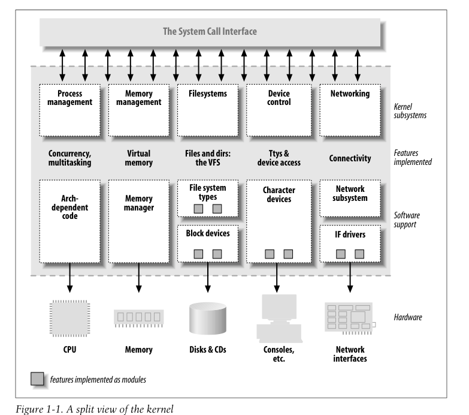
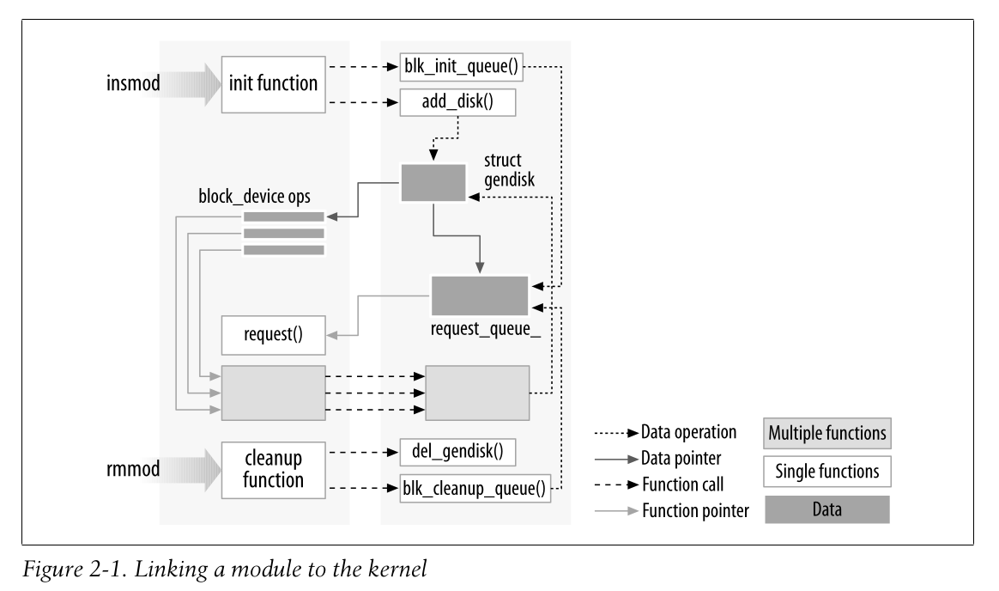

# LINUX DEVICE DRIVERS

(Third Edition) Jonathan Corbet, Alessandro Rubini, and Greg Kroah-Hartman

## Chapter 1.An Introduction to Device Drivers

User activities are performed by means of a set of standardized calls that are independent of the specific driver; mapping those calls to device-specific operations that action real hardware is then the role of the device driver.

The distinction between **mechanism** and **policy** is one of the best ideas behind the Unix design. Most programming problems can indeed be split into two parts: “what capabilities are to be provided” (the mechanism) and “how those capabilities can be used” (the policy). If the two issues are addressed by different parts of the program, or even by different programs altogether, the software package is much easier to develop and to adapt to particular needs.

### Splitting the Kernel

- Process management
- Memory management
- Filesystems
- Device control
- Networking

### Loadable Modules

 Each module is made up of **object code** (not linked into a complete executable) that can be dynamically linked to the running kernel by the `insmod` program and can be unlinked by the `rmmod` program.

### Classes of Devices and Modules

- Character devices
  - A character (char) device is one that can be accessed as a stream of bytes (like a file); a char driver is in charge of implementing this behavior. 
  - The only relevant **difference** between a **char device** and a **regular file** is that you can always move back and forth in the regular file, whereas most char devices are just data channels, which you can only access sequentially.
- Block devices
  - The difference between them is transparent to the user,  but block drivers have a completely
    different interface to the kernel than char drivers.
- Network interfaces

## Chapter 2: Building and Running Modules

Unix transfers execution from user space to kernel space whenever an application issues a **system call** or is suspended by a **hardware interrupt**.

- Kernel code executing a system call is working in the context of a process—it operates on behalf of the calling process and is able to access data in the process’s address space.
- Code that handles interrupts, on the other hand, is asynchronous with respect to processes and is not related to any particular process.

As a result, Linux kernel code, including driver code, must be **reentrant**—it must be capable of running in more than one context at the same time.
