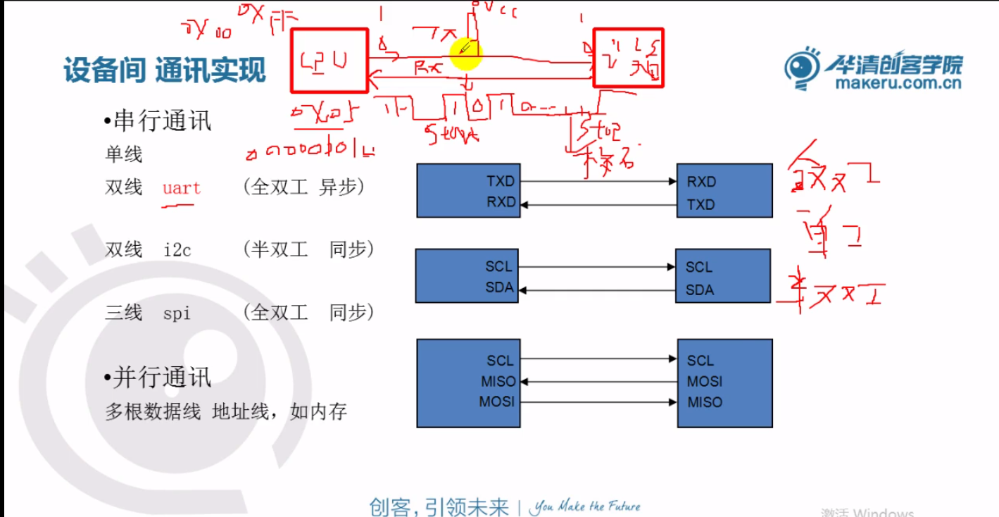

# 网络

## 网络采用分层的思想

    1. 每一层实现不同的功能，对上层的数据做透明传输
    2. 每一层向上层提供服务，同时使用下层提供的服务

各层典型的协议：

1. 网络接口与物理层

    MAC地址： 48位全球唯一，网络设备的身份标识（标识网卡身份）

    ARP/RARP:
        ARP: 地址解析协议， IP地址----> MAC地址
        RARP： MAC地址---->IP地址

    PPP协议（电话线上网）：拨号协议（GPRS/3G/4G）

2. 网络层：
    IP： Internet protocol(分为IPV4和IPV6)
    ICMP: Internet控制管理协议，ping命令属于ICMP
    IGMP： Internet分组管理协议，广播，组播

3. 传输层：
    TCP：（Transfer Control protocol,传输控制协议）提供面向连接的，一对一的可靠数据传输的协议
    即数据无误，数据无丢失，数据无失序，数据无重复到达的通信
    UDP：（user Datagram Protocol,用户数据报协议） 提供不可靠，无连接的尽力传输协议
    SCTP： 是可靠传输，是TCP的增强版，它能实现多主机，多链路的通信

4. 应用层
    网页访问协议： HTTP/HTTPS
    邮件发送接受协议：POP3（收）/SMTP(发)，IMAP（可接收邮件的一部分）
    FTP,文件传输
    Telnet/SSH: 远程登陆
    嵌入式相关：
        NTP：网络时钟协议
        SNMP:简单网络管理协议（实现对网络设备集中式管理）
        RTP/RTSP:用传输音视频的协议（安防监控）

|Ethernet header(14bytes)|IP header(20bytes)|TCP header(20bytes)|APP header|user data|Ethernet trailer(CRC32,4bytes,硬件产生和校验)|
46-1500bytes

MTU： Max Transfer Unit 最大传输单元（和网络类型相关）
例如：以太网：MTU = 1500
MSS： Maximum Segment Size 最大段大小 网络类型，线路，系统特性相关（实际数据和应用层包头的大小）此例中为1460

## TCP/IP网络编程预备知识

### Socket

- 是一个应用编程接口
- 是一种特殊的文件描述符(everything in Unix is a file),代表着网络编程的一种资源
- 并不仅限于TCP/IP协议
- 面向连接(Transmission Control Protocol - TCP/IP)
- 无连接 (User Datagram Protocol - UDP 和 Inter-network Packet Exchange IPX)

**套接字类型：**

- 流式套接字（SOCK——STREAM）：提供了一个面向连接，可靠的数据传输服务，数据无差错，无重复的发送且按发送的顺序接受。内置流量控制，避免数据流淹没慢的接收方。数据被看作是字节流，无长度限制。（唯一对应TCP）
- 数据报套接字（SOCK——DGRAM）：提供无连接服务。数据包以独立的数据包的形式被发送，不提供无差错保证，数据可能丢失或重复，顺序发送，可能乱序接收。（唯一对应UDP）
- 原始套接字（SOCK——RAM）：可以对较低层次协议如IP,ICMP直接访问。（对应多个协议，发送穿透了传输层）

### IP地址

IP地址分为IPV4和IPV6
    IPV4：采用32位的整数来表示
    IPV6：采用了128位整数来表示
    mobileIPV6：local IP（本地注册的IP）， roam IP（漫游IP）

IPV4地址：
    点分形式： 192.168.7.246
    32位整数

特殊IP地址：
    局域网IP：192.XXX.XXX.XXX 10.XXX.XXX.XXX
    广播IP： xxx.xxx.xxx.255, 255.255.255.255(全网广播)
    组播IP：224.xxx.xxx.xxx~239.xxx.xxx.xxx

### 端口号

    16位的数字（1-65535）
        Well Known Ports： 1～1023 （FTP:21, SSH:22, HTTP:80, HTTPS:443）
        保留端口： 1024～5000（不建议使用）
        可以使用的： 5000～65535
**TCP端口和UDP端口是相互独立的**

网络里面的通信是由IP地址+端口号来决定

### 字节序

字节序是指不同的CPU访问内存中的**多字节数据**时候，存在大小端问题
低对低： 小端   低端内存存放低端数据
低对高： 大端   低端内存存放高端数据

一般来说：
    X86/ARM： 小端
    powerpc/mips, ARM作为路由器时，大端模式

    网络传输的时候采用大端模式
    
    本地字节序，网络字节序

- 主机字节序到网络字节序
    - u_long htonl(u_long hostlong); (long 4bytes)
    - u_short htons(u_short short);  (short 2bytes)
- 网络字节序到主机字节序
    - u_long ntohl(u_long hostlong);
    - u_short ntohs(u_short short);

IP地址转换函数：
in_addr_t inet_addr(const char *cp);
cp :点分形式的ip地址，结果是32位整数（内部包含了字节序的转换，默认是大端）
特点： 1.仅适应于IPV4
        2.当出错时，返回-1
        3.此函数不能用于255.255.255.255的转换

inet_pton()/inet_ntop()

```c
#include <arpa/inet.h>

int inet_pton(int af, const char *src, void *dst);
```

特点： 1.适用于IPV4和IPV6
        2.能正确的处理255.255.255.255的转换问题
参数：
    1.af:地址协议族（AF_INET或AF_INET6）
    2.src:是一个指针（填写点分形式的IP地址[主要指IPV4]）
    3.dst:转换的结果给到dst

RETURN VALUE
       inet_pton() returns 1 on  success  (network  address  was  successfully  con‐
       verted).  0 is returned if src does not contain a character string represent‐
       ing a valid network address in the specified address family.  If af does  not
       contain  a valid address family, -1 is returned and errno is set to EAFNOSUP‐
       PORT.

inet_ntop(): 把IPV4/IPV6的网络字节序的地址变成本地的字符串形式的IP地址

```c
const char *inet_ntop(int af, const void *restrict src,
                        char dst[restrict .size], socklen_t size);
```
特点： 1.适用于IPV4和IPV6
        2.能正确的处理255.255.255.255的转换问题
参数：
    1.af:地址协议族（AF_INET或AF_INET6）
    2.src:是一个指针（32位网络字节序的IP地址）
    3.dst:输出结果为点分形式的IP地址[主要指IPV4]

RETURN VALUE
       On  success, inet_ntop() returns a non-null
       pointer to dst.  NULL is returned if  there
       was  an  error,  with errno set to indicate
       the error.

### TCP编程api

1.socket()

```c
#include <sys/socket.h>

int socket(int domain, int type, int protocol);
```

参数：
    1. domain
        AF_INET      IPv4 Internet protocols                    ip(7)
        AF_INET6     IPv6 Internet protocols                    ipv6(7)
        AF_UNIX      Local communication                        unix(7)
        AF_LOCAL     Synonym for AF_UNIX
        AF_NETLINK   Kernel user interface device               netlink(7)
        AF_PACKET    Low-level packet interface                 packet(7)
    2.type:
        SOCK_STREAM: 流式套接字，唯一对应于TCP
        SOCK_DGRAM: 数据报套接字，唯一对应着UDP
        SOCK_RAW： 原始套接字
    3.protocol: 一般为0,原始套接字编程时需填充

RETURN VALUE
       On  success,  a file descriptor for the new socket is returned.  On error, -1 is
       returned, and errno is set to indicate the error.
    成功时返回文件描述符，出错时返回为-1

2.bind()

```c
       #include <sys/socket.h>

       int bind(int sockfd, const struct sockaddr *addr,
                socklen_t addrlen);
```

参数：
    sockfd: 通过socket()函数拿到的fd
    addr： 采用struct sockaddr的结构体变量的地址
    addrlen： 地址长度

3.listen()

```c
       #include <sys/socket.h>

       int listen(int sockfd, int backlog);
```

参数：
    sockfd：通过socket()函数拿到的fd
    backlog:同时允许几路客户端和服务器进行正在连接的过程（正在三次握手）
            一般填5,测试得知，ARM最大为8
> 内核中服务器的套接字fd会维护2个链表
    1.正在三次握手的客户端链表（数量=2*backlog+1）
    2.已经建立好连接的客户端链表（已经完成3次握手分配好了newfd）

返回值：
    RETURN VALUE
       On success, zero is returned.  On error, -1 is returned, and errno is set to indicate the error.

4.accept() 阻塞等待客户端连接请求

```c
       #include <sys/socket.h>

       int accept(int sockfd, struct sockaddr *_Nullable restrict addr,
                  socklen_t *_Nullable restrict addrlen);
```

参数：
    sockfd: 经过前面socket()创建并通过bind(),listen(),设置过的fd
    addr和addrlen:

返回值：
    RETURN VALUE
       On  success,  these  system calls return a file descriptor for the accepted socket (a nonnegative integer).  On error, -1 is returned, errno is set to indicate the error, and addrlen is left  unchanged.

5.客户端的连接函数

```c
       #include <sys/socket.h>

       int connect(int sockfd, const struct sockaddr *addr,
                   socklen_t addrlen);
```

connect()函数和服务器bind()函数类似

返回值
RETURN VALUE
       If the connection or binding succeeds, zero is returned.  On error, -1 is returned, and errno is set to indicate the error.

参数：
    sockfd: 通过socket()函数拿到的fd
    addr： 采用struct sockaddr的结构体变量的地址
    addrlen： 地址长度

6.网络发送和接受数据
网络发送数据：send()/write()

```c
    #include <sys/socket.h>
    ssize_t send(int sockfd, const void buf[.len], size_t len, int flags);

    #include <unistd.h>
    ssize_t write(int fd, const void buf[.count], size_t count);
```

send()比write()多一个参数:
    flags:
    一般填写0,此时和write()作用一样
    MSG_DONWAIT: 当内核缓冲区满的时候默认阻塞，该宏取消阻塞 Enables  nonblocking  operation;
    MSG_OOB: 用于发送TCP类型的带外数据(out-of-band)

网络中接收数据： recv()/read()

```c
    #include <sys/socket.h>
    ssize_t recv(int sockfd, void buf[.len], size_t len,
                    int flags);

    #include <unistd.h>
    ssize_t read(int fd, void buf[.count], size_t count);
```

recv()比read()多一个参数:
    flags:
    一般填写0,此时和read()作用一样
    MSG_DONWAIT: 当内核缓冲区满的时候默认阻塞，该宏取消阻塞 Enables  nonblocking  operation;
    MSG_OOB: 用于发送TCP类型的带外数据(out-of-band)
    MSG_PEEK:读取数据之后不将其从内核缓冲区中移除，再次读取和第一次读取数据一样

### UDP编程api

UDP编程应用：实时的音视频传输，DNS的域名解析包

1.sendto()
```c
    #include <sys/socket.h>
    ssize_t sendto(int sockfd, const void buf[.len], size_t len, int flags,
                    const struct sockaddr *dest_addr, socklen_t addrlen);
```

2.recvfrom()
```c
    #include <sys/socket.h>
    ssize_t recvfrom(int sockfd, void buf[restrict .len], size_t len,
                    int flags,
                    struct sockaddr *_Nullable restrict src_addr,
                    socklen_t *_Nullable restrict addrlen);
```

## 多路复用

基本常识：
    linux中每个进程最多可以打开1024个文件，最多有1024个文件描述符
    文件描述符的特点：
        1. 非负整数
        2. 从最小可用的数字来分配
        3. 每个进程启动时默认打开0,1,2三个文件描述符（标准输入，标准输出，标准错误输出）
多路复用针对不止套接字fd,也针对普通文件描述符
    fd_set (maxfd + 1) 取最小的4个字节的整数倍

步骤：

1. 把关心的文件描述符加入到集合中(fd_set)
2. 调用select()/poll()函数去阻塞等待集合fd_set中的一个或多个文件描述符中有数据
3. 当有数据时，退出select()阻塞
4. 依次判断哪个文件描述符有数据
5. 依次处理有数据的文件描述符的数据

```c
void FD_ZERO(fd_set *fdset);    // 清零集合
void FD_SET(int fd, fd_set *fdset); // 把fd加入集合
void FD_CLR(int fd, fd_set *fdset); // 从集合中清除fd
int FD_ISSET(int fd, fd_set *fdset);    // 判断fd是否在set中

int select(int nfds, fd_set *_Nullable restrict readfds,
            fd_set *_Nullable restrict writefds,
            fd_set *_Nullable restrict exceptfds,
            struct timeval *_Nullable restrict timeout);

struct timeval {
    long tv_sec;    /* seconds */
    long tv_usec;   /* microseconds */
}
```

参数：
    nfds： 最大的文件描述符加1
    readfds: 读集合
    writefds： 写集合
    exceptfds： 异常集合
    timeout： 超时

    一般：填读集合，写集合填NULL，异常集合（带外数据）一般填NULL,

调用select()函数后，fd_set由之前用户设置的要监控的文件描述符集合，内核改为有数据的文件描述符集合（为设置集合的子集）

## wireshark抓包工具

### Ethernet头


MAC地址为48位全球唯一的地址

[Ethernet frame](https://en.wikipedia.org/wiki/Ethernet_frame)


### IP头

[Internet Protocol version 4](https://en.wikipedia.org/wiki/Internet_Protocol_version_4)


### TCP头

[Transmission Control Protocol](https://en.wikipedia.org/wiki/Transmission_Control_Protocol)

TCP是一种**面向连接的，可靠的**数据传输


一 TCP的可靠传输：通过确认和重发机制

	1. TCP把所有要发送的数据进行编号（每一个字节用一个号）
	1. 发送时从当前的数据位置，发送window大小的数据

二 面向连接


三次、四次握手注意点：

1. 一定标注客户端和服务器
2. 三次握手的连接必须是由客户端发起（四次握手客户端和服务器都可以发起）
3. SYN, ACK, FIN等标志符号应该写上
4. 建立连接必须是三次握手，关闭连接三四都可

## 网络属性的设置

```c
       #include <sys/socket.h>

       int getsockopt(int sockfd, int level, int optname,
                      void optval[restrict *.optlen],
                      socklen_t *restrict optlen);
       int setsockopt(int sockfd, int level, int optname,
                      const void optval[.optlen],
                      socklen_t optlen);
```

level指定控制套接字的层次，可以取三种值：

​	1） SOL_SOCKET: 通用套接字选项 （应用层）

​	2） IPPROTO_TCP：TCP选项	（传输层）

​	3） IPPROTO_IP: IP选项	（网络层）

​	optname指定控制的方式（选项的名称）


举例：

```c	
/* 允许绑定地址快速重用 */
int b_reuse = 1;
setsockopt(fd, SOL_SOCKET, SO_REUSEADDR, &b_reuse, sizeof(int));
```

```c
       struct timeval {
           time_t      tv_sec;         /* seconds */
           suseconds_t tv_usec;        /* microseconds */
       };
```

举例：

```c
/* 广播数据 */
int b_br = 1;
setsockopt(fd, SOL_SOCKET, SO_BROADCAST, &b_br, sizeof(int));

/* 设置接收超时 */
struct timeval tout;
tout.tv_sec = 5;
tout.tv_usec = 0;
setsockopt(fd, SOL_SOCKET, SO_RCVTIMEO, &tout, sizeof(struct timeval));
```

## 网络超时优化

### 方法1：设置socket的属性SO_RCVTIMEO

```C
struct timeval tv;
tv.tv_sec = 5;
tv.tv_usec = 0;
// 设置接收超时
setsockopt(sockfd, SOL_SOCKET, SO_REVTIMEO, &tv, sizeof(tv));
// 从socket读取数据
recv()/recvfrom()	
```

### 方法二：用select检测socket是否'ready'

```c
struct fd_set rdfs;
while(1) {
    struct timeval tv = {5, 0};
    FD_ZERO(&rdfs);
    FD_SET(sockfd, &rdfs);
    if (select(sockfd+1, &rdfs, NULL, NULL, &tv) > 0) {
        recv()/recvfrom()
    }
}
```

### 方法三：设置定时器（timer），捕捉SIGALRM信号

```C
viod handler(int signo)	{return;}

struct sigaction act;
sigaction(SIGALRM, NULL, &act);
act.sa_handler = handler;
act.sa_flags &= ~SA_RESTART; //清楚掉SIGALRM信号的SA_RESTART
sigaction(SIGALRM, &act, NULL);
alarm(5);
if (recv(...) < 0) ...
```

## 心跳检测

### 方法一：数据交互双方隔一段时间一方发送一点数据到对方

对方给出特定的应答。如超过设定次数大小的时间内还是没有应答，这时候认为异常

### 方法二：改变套接字的属性来实现

```c
int keepAlive = 1;	// 设定KeepAlive
int keepIdle = 5;	// 开始首次KeepAlive探测前的TCP空闭时间
int keepInterval = 5;	// 两次KeepAlive探测的时间间隔
int keepCount = 3;	// 判定断开前的KeepAlive探测次数

setKeepAlive(newfd, keepAlive, keepIdle, keepInterval, keepCount)
    
void setKeepAlive(int sockfd, int attr_on, socklen_t idle_time, socklen_t interval, socklen_t cnt) {
    setsockopt(sockfd, SOL_SOCKET, SO_KEEPALIVE, (const char *)&attr_on, sizeof(attr_on));
    setsockopt(sockfd, SOL_TCP, TCP_KEEPIDLE, (const char *)&idle_time, sizeof(idle_time));
    setsockopt(sockfd, SOL_TCP, TCP_KEEPINTVL, (const char *)&interval, sizeof(interval));
    setsockopt(sockfd, SOL_TCP, TCP_KEEPCNT, (const char *)&cnt, sizeof(cnt));
}
```

## 广播

- 前面介绍的数据包发送方式只有一个接收方，称为单播
- 如果同时发送给局域网中的所有主机，称为广播
- 只有用户数据报（使用UDP协议）套接字才能广播
- 广播地址
  - 以192.168.1.0(255.255.255.0)网段为例，最大的主机地址192.168.1.255代表该网段的广播地址
  - 发送到该地址的数据包被所有的主机接收
  - 255.255.255.255在所有网段中都代表广播地址

### 广播发送

- 创建用户数据报套接字	`fd = socket(AF_INET, SOCK_DGRAM, 0)`
- 缺省创建的套接字不允许广播数据包，需要设置属性
- 接收方地址指定为广播地址
- 指定端口信息，发送数据包

### 广播接收

- 创建用户数据报套接字
- 绑定本机IP地址和端口
  - 绑定的端口必须和发送方指定的端口相同
- 等待接收数据

```c
/* 广播数据 */
int b_br = 1;
setsockopt(fd, SOL_SOCKET, SO_BROADCAST, &b_br, sizeof(int));
```

### 组播

- 单播方式只能发给一个接收方
- 广播方式发送给所有主机，过多的广播会大量占用网络带宽，造成广播风暴，影响正常的通信
- 组播（又称为多播）是一种折中的方式，只有加入某个多组播的主机才能收到数据
- 多播方式既可以发给多个主机，又能避免像广播那样带来过多的负载（每台主机要到传输层才能判断广播包是否要处理）

组播的IP地址：224.0.0.1～239.255.255.254（中间除掉广播）


```c
struct ip_mreq {
    struct in_addr imr_multiaddr;
    struct in_addr imr_interface;
};

/* 加入多播组 */
struct ip_mreq mreq;
bzero(&mreq, sizeof(mreq));
mreq.imr_multiaddr.s_addr = inet_addr("234.3.3.1");
mreq.imr_interface.s_addr = htonl(INADDR_ANY);

setsockopt(fd, IPPROTO_IP, IP_ADD_MEMBERSHIP, &mreq, sizeof(mreq));
```

## UNIX域套接字（unix domain）

- socket同样可以用于本地通信
- 创建套接字时使用本地协议PF_UNIX(或PF_LOCAL)
  - socket(AF_LOCAL, SOCK_STREAM, 0)
  - socket(AF_LOCAL, SOCK_DGRAM, 0)
- 分为流式套接字和用户数据报套接字
- 和其他进程间通信方式相比使用方便、高效
- 常用于前后台进程通信

> 进程间通信：
>
> 1. 进程间的数据共享
>
> ​	管道、消息队列、共享内存、unix域套接字
>
> 易用性：消息队列 > unix域套接字 > 管道 >  共享内存（经常要和信号量一起使用）
>
> 效率： 共享内存 > unix域套接字 > 管道 > 消息队列
>
> 常用： 共享内存、unix域套接字
>
> 2. 异步通信：
>
> ​	信号
>
> 3. 同步和互斥（资源保护）
>
> ​	信号量

```c
       // A UNIX domain socket address is represented in the following structure:

           struct sockaddr_un {
               sa_family_t sun_family;               /* AF_UNIX */
               char        sun_path[108];            /* Pathname */
           };

       // The sun_family field always contains AF_UNIX.  On  Linux,  sun_path  is
       // 108 bytes in size; see also BUGS, below.

```

Unix域套接字的文件路径名（在内存中的文件）：

1. 必须事先不存在
2. 一般给绝对路径
3. 由内核在内存中创建

## 数据库

### SQLite3基本命令

**没有严格的类型检查**

**无法直接删除一列**

1. 系统命令（以.开头）
   1. .schema 查看表的结构图
   2. .databases 查看数据库
   3. .table 查看当前数据库下的表格
2. sql命令
   1. 创建数据表： CREATE TABLE stu(id integer, name str, score interger);
   2. 插入记录： INSERT INTO stu VALUES(1001, 'zhangsan', 80);
   3. 插入部分记录： INSERT INTO stu(id, name) VALUES(1001, 'zhangsan');
   4. 查看记录： SELECT * FROM stu; SELECT id, name FROM stu;
   5. 查看符合要求的记录： SELECT * FROM stu WHERE score=80 AND id=1001; SELECT * FROM stu WHERE score=80 OR id=1001;
   6. 删除一条记录： DELETE FROM stu WHERE name='zhangsan';
   7. 更新一条记录： UPDATE stu SET name = 'wang', score = 80 WHERE id=1001;
   8. 增加一列： ALTER TABLE stu ADD COLUMN address string;
   9. 删除一列的替代方案：
      1. CREATE TABLE stu1 AS SELECT id, name, score FROM stu;
      2. DROP TABLE stu;
      3. ALTER TABLE stu1 RENAME TO stu;

### SQLite编程接口

```c
#include <sqlite3.h>

int sqlite3_open(
  const char *filename,   /* Database filename (UTF-8) */
  sqlite3 **ppDb          /* OUT: SQLite db handle */
);


int sqlite3_close( sqlite3* db );
const char* sqlite3_errmsg(   sqlite3* db );

int sqlite3_exec(
  sqlite3*,                                  /* An open database */
  const char *sql,                           /* SQL to be evaluated */
  int (*callback)(void*,int,char**,char**),  /* Callback function */
  void *,                                    /* 1st argument to callback */
  char **errmsg                              /* Error msg written here */
);
```

## 类有道词典demo


# ARM


### 汇编指令

#### mov

```assembly
.text
mov r13, #5   @ 将十进制5移动到r13中
mov r0, r1
mov r0, r1, LSL#2 @ 将r1中的数字逻辑左移2次
mov r0, r1, LSR#2 @ 将r1中的数字逻辑左移2次
mrs r0, cpsr	@ 将cpsr中的数据移动到r0中
msr cpsr, r0	@ 将r0中的数据移动到cpsr中
.end
```

#### 条件执行

```assembly
@if (a==0) x=0;
@if (a>0) x=x+3;

.text
cmp	r0, #0
moveq	r1, #0
addgt	r1, r1, #3
.end
```

#### 指令机器码

- ARM采用的是32位架构
  - ARM指令集(32-bit)
  - Thumb指令集(16-bit)
- ARM instruction set encoding
  - 指令的机器码(如指令moveq r0, r1	机器码 0x01A00001)

- 立即数合法性  用伪指令 ldr   r0, =0x445501替换
- ARM指令包含条件判断

#### 逻辑指令

```assembly
and r0, r1, #0xFF @ r0 = r1&0xFF
orr r3, r0, #0x0F @ r3 = r0|0x0F
bic r0, r0, #0x03 @ 清除r0中的0号位和1号位
tst r0, #0x20 @ 测试第6位是否为0,为0则Z标志置1
cmp r1, r0   @ 将R1与R0相减做比较，并根据结果设置CPSR的标志位
```

#### 中断管理

打开中断

`MSR` (Move to Status Register) and `MRS` (Move from Status Register) 

CPSR stands for "Current Program Status Register" 

```assembly
mrs r0, cpsr
bic r0, #0xc0
msr cpsr, r0
```

判断当前工作状态是否是ARM状态，是则切换到user工作模式

```assembly
mrs r0, cpsr
tst r0, #0x20
andeq r0, r0, #0xFFFFFFE0
orreq r0, r0, #0x10
msreq cpsr, r0
```

#### 跳转指令

```assembly
b main
bl func @ 调用函数 Link Register (LR, or R14)
beq addr
bne addr @ 当CPSR寄存器中的Z条件码为0时，跳转到该地址处
```

#### 最大公约数

```rust
fn gcd(mut n: u64, mut m: u64) -> u64 {
    assert!(n != 0 && m != 0);
    while m != 0 {
        if m < n {
            let t = m;
            m = n;
            n = t;
        }
        m = m % n;
    }
    n
}
```

```c
int gcd(int a, int b) {
    while(1) {
        if (a==b) break;
        if (a>b){
            a = a-b;
        } else {
            b = b-a;
        }
    }
    return a;
}
```

**如果a和b存在公因数，那a-b也一定存在这个因数**

#### load/store

**注：load/store架构规定，存储器之间不能直接拷贝，需通过寄存器做中转**

```assembly
@ 后索引，将r0的数据写入r1地址中，并+4更新r1
str r0, [r1], #4
@ 前索引，将r0的数据写入r1+4地址中，不更新r1
str r0, [r1, #4]
@ 前索引，将r0的数据写入r1+4地址中，并更新r1
str r0, [r1, #4]!
```

实例：

```assembly
	.text
main:
	mov	r5, #0
	ldr	r7, =buf
	ldr	r8, =dest_buf
loop:
	cmp	r5, #3
	beq	main_end
	add	r5, #1
	ldrb	r0, [r7], #1
	strb	r0, [r8], #1
	b	loop
	
buf:
	.byte 1,2,3
	.data
main_end:
	b main_end

	.data
dest_buf:
	.space	8
	
	.end
```

#### GNU汇编伪指令

```assembly
.text	将定义符开始的代码编译到代码段
.data	将定义符开始的代码编译到数据段
.end	文件结束
.equ	GPG3CON, OXE03001C0 定义宏（用GPG3CON代替OXE03001C0）
.byte	定义变量1字节
		.byte	0x11, 'a', 0定义字节数组
.word	定义word变量（4字节， 32位机）
		.word	0x12344578, 0x33445566
.string	定义字符串
		.string "abc\0"
ldr r0, =0xE0028008	载入大常数0xE0028008到r0中
.global _start	声明_start为全局符号
```

#### 批量操作指令

由内部机器码实现，速度比循环载入更快

```assembly
@ ia-Increment After ib-Increment Before da-Dec After db-Dec Before
ldmia r0!, {r3 - r10} @ r0里地址指向的内容,批量load到r3~r10寄存器中，r0里地址会自动加4
stmia r0!, {r3 - r10} @ 把r3~r10寄存器中内容，store到r0里地址执行空间中，r0里地址会自动加4
```

#### 堆栈操作指令

```assembly
stmfd sp!, {r0-r12, lr} @ 将寄存器r0~r12， lr中的值存入栈中
						@ 常用于中断保存上下文，！表示会自动偏移
ldmfd sp!, {r0-r12, pc}^ @ 将栈中值逐个弹出到寄存器r0~r12 pc 中
						 @ 常由于恢复中断上下文， ^表示会恢复spsr到cpsr
						 @ The ! after SP indicates that the Stack Pointer should be updated (written back) after the operation.
swi 0x02	@ 产生软中断，软中断号为2	 
```

> When a subroutine or function is called using the `BL` (Branch with Link) instruction in ARM assembly, the address of the instruction immediately following the `BL` (i.e., the return address) is saved in the Link Register (LR).
>
> This is often achieved with a `MOV PC, LR` or a `BX LR` instruction at the end of the subroutine, effectively setting the Program Counter (PC) to the value stored in the LR and thus returning to the caller.(Branch and Exchange Instruction Set)

### 异常处理

- ARM有两级外部中断FIQ, IRQ
- 可是大多数的基于ARM的系统有>2个中断源，因此需要一个**中断控制器**
- Note：通常中断处理程序总是应该包含**清除中断源**的代码


```assembly
	.text
	@ 异常向量表
	b reset					@ 0x00 Reset
	ldr pc, _undef			@ 0x04 undef
	ldr pc, _swi_handler	@ 0x08 swi 突破32M地址空间限制
    ldr pc, _prefetch		@ 0x0C prefetch abort
    ldr pc, _data_abort 	@ 0x10 data abort
    nop						@ 0x14 reserved
    ldr pc, _irq			@ 0x18 IRQ
    ldr pc, _fiq			@ 0x1C FIQ

_undef:
	.word undef_handler
_swi_hanlder:
	.word swi_handler
_prefetch:
	.word prefetch_handler
_data_abort:
	.word data_abort_handler
_irq:
	.word irq_handler
_fiq:
	.word fiq_handler


swi_handler:
	stmfd sp!, {r0, lr}
	sub r0, lr, #4	@ 软中断号为其指令机器码的0-23bit
	ldr r0, [r0]
	bic r0, #0xff000000
	bl swi_num_handler
	ldmfd sp!, {r0, pc}^

swi_num_handler:
	@switch(num)
	cmp r0, #2
	moveq r7, #2
	cmp r0, #4
	moveq r7, #4
	mov pc, lr
	

reset:
	ldr sp, =stack_base	@ 不同模式有自己的LR和SP寄存器
	@ 切换到应用程序
	msr cpsr, #0x10
	mov r0, #3
	swi 2	@ 跳转到异常向量表中软中断的入口位置，并保持下条指令地址到lr,切换到svc工作模式
	b reset
	
	.data
buf:
	.space 32
stack_base:
	

	.end
```


## ARM裸机驱动开发


```assembly
	.text
	@ 设置LED灯的配置寄存器GPX2CON[7]为输出状态
	ldr r0, =0x11000c40
	ldr r1, [r0]
	bic r1, #0xf0000000
	orr r1, #0x10000000
	str r1, [r0]
	@ 设置LED灯输出高电平   GPX2DAT
	ldr r0, =0x11000c44
	ldr r1, [r0]
	orr r1, #0x80
	str r1, [r0]
	.end
```

嵌入式Linux交叉开发环境硬件基本组成

### 通信接口

- 串行通讯
  - 单线
  - 双线 uart （全双工 异步）
  - 双线 i2c （半双工 同步）
  - 三线 spi （全双工 同步）
- 并行通讯
  - 多根数据线 地址线，如内存




**UART**(Universal Asynchronous Receiver-Transmitter)：简单性和最低的硬件要求，但通信速率不能过高。“异步”是指数据可以以不规则的间隔传输，而无需发送和接收设备之间的**同步时钟信号**。

**I^2C**(Inter-Integrated Circuit):I²C communication primarily requires two wires:

- `SDA` (Serial Data Line): This is the line where actual data is transmitted.
- `SCL` (Serial Clock Line): This is the clock line, controlled by the master, that synchronizes data transfer on the I²C bus.

**SPI**(Serial Peripheral Interface)

### UART编程

- 初始化
  - 管脚设置为UART模式
  - 串口协议设置（数据位，停止位，校验位等）
  - 串口波特率(baud)设置
- 发送字符
  - 发送状态判断
  - 发送
- 接收字符后环回
  - 接收状态判断
  - 接收


### 中断


- **ICDISER (Interrupt Controller Distributor Set-Enable Register)**
- **ICDDCR (Interrupt Controller Distributor Control Register)**
- **ICCICR (Interrupt Controller CPU Interface Control Register)**


> The Generic Interrupt Controller (GIC) is a specification introduced by ARM to provide a standardized interface for handling and managing interrupts in a multiprocessor environment, especially in the ARM Cortex-A series of processors. The GIC provides a unified solution to interrupt management, taking over the role traditionally played by multiple interrupt controllers in earlier designs.
>
> Let's break down the key components and functionalities of the GIC:
>
> 1. **Distributor:**
>    - The Distributor is the main control interface to the GIC. It manages interrupt distribution to one or more CPU interfaces.
>    - It is responsible for determining which interrupts are pending and which CPU should handle each interrupt.
> 2. **CPU Interface:**
>    - Every CPU connected to the GIC has its CPU interface.
>    - The CPU Interface provides per-CPU interrupt acknowledgment and interrupt end of service signaling.
>    - It is the point of contact between an individual processor and the GIC.
> 3. **Interrupt Sources:**
>    - The GIC can manage many interrupt sources. These sources can be categorized into:
>      - Shared Peripheral Interrupts (SPIs): These are interrupts that can be routed to any processor.
>      - Private Peripheral Interrupts (PPIs): These are specific to an individual processor.
>      - Software Generated Interrupts (SGIs): These are interrupts generated by software running on a processor, typically used for inter-processor communication.
> 4. **Interrupt Priority:**
>    - Each interrupt source can be assigned a priority. The GIC uses these priorities to determine the order of interrupt handling when multiple interrupts are pending.
>    - The GIC supports priority masking, which allows a processor to specify a threshold above which it will not respond to interrupts, ensuring that only higher priority interrupts are serviced.
> 5. **Interrupt Configuration:**
>    - Interrupts can be configured as level-sensitive or edge-triggered.
>    - Each interrupt can also be set to target a specific processor or a group of processors.
> 6. **Security Extensions (optional):**
>    - Some implementations of the GIC include security extensions that enable it to support both Secure and Non-secure worlds, such as those found in TrustZone-enabled ARM processors.
> 7. **Virtualization Extensions (optional):**
>    - The GIC can also have virtualization extensions to support virtualized environments. This allows hypervisors to manage and virtualize interrupts for guest operating systems.
>
> **Illustration**:
>
> If we were to visualize this:
>
> ```
>     +-----------------+
>     |  Interrupt      |
>     |  Sources        |
>     +-----------------+
>           ||
>           \/
>     +-----------------+
>     |   Distributor   |
>     +-----------------+
>           ||     ||    || 
>           \/     \/    \/
>     +--------+  +--------+  +--------+
>     | CPU    |  | CPU    |  | CPU    |
>     | Interface |  | Interface |  | Interface |
>     +--------+  +--------+  +--------+
>           ||     ||    || 
>           \/     \/    \/
>     +--------+  +--------+  +--------+
>     | Processor |  | Processor |  | Processor |
>     +--------+  +--------+  +--------+
> ```
>
> In this illustrative structure, interrupt sources send their interrupts to the Distributor. The Distributor, based on configurations and priorities, decides which CPU Interface (and therefore which processor) should handle the interrupt.
>
> This is a high-level overview of the GIC. For specific details, configurations, and in-depth workings, the ARM reference manuals and GIC specification documents provide exhaustive information.


> The Generic Interrupt Controller (GIC) by ARM is designed to cater to the needs of complex interrupt architectures, especially in multiprocessor systems. The GIC is typically divided into two main parts: the Distributor and the CPU Interface. However, in a more detailed breakdown, there are several components and functionalities to consider:
>
> 1. **Distributor**:
>    - **Interrupt Sources:** The distributor can handle multiple interrupt sources. These sources generate interrupts that the GIC manages. They can be external peripherals, timers, or even other processors.
>    - **Priority Configuration:** Each interrupt can be assigned a priority from a set range. Higher priority interrupts can preempt lower priority ones. The distributor ensures that the highest priority interrupt is always sent to the appropriate CPU.
>    - **Target Processor Configuration:** For Shared Peripheral Interrupts (SPIs), the distributor can be configured to determine which CPUs or CPU clusters the interrupt should be forwarded to.
>    - **Edge or Level Sensitivity:** The distributor can configure each interrupt as either level-sensitive or edge-triggered.
>    - **Interrupt Enable:** Individual interrupts can be enabled or disabled.
>    - **Pending and Active Status:** The distributor keeps track of which interrupts are pending and which are active.
> 2. **CPU Interface**:
>    - **Acknowledge Register:** When a CPU wants to process an interrupt, it reads from this register. The read returns the ID of the highest priority interrupt that is pending and marks that interrupt as active.
>    - **End of Interrupt (EOI) Register:** After processing an interrupt, the CPU writes to this register to indicate that it has finished handling the interrupt.
>    - **Running Priority and Preemption:** The CPU interface tracks the priority of the currently executing interrupt. If a higher priority interrupt arrives, it will preempt the current one.
>    - **Binary Point Register:** This is used to split priority into group priority and subpriority fields, enabling finer control over interrupt preemption.
>    - **Interrupt Masking:** The CPU interface allows individual CPUs to mask or unmask interrupts, which can be useful during critical sections of code.
> 3. **Security Extensions (optional)**:
>    - The GIC can be set up to work with ARM's TrustZone technology. Interrupts can be classified as either Secure or Non-secure, and the GIC will ensure that Secure interrupts are only visible to software running in the Secure world.
> 4. **Virtualization Extensions (optional)**:
>    - **List Registers:** These allow the storage of multiple pending interrupts, helping virtualization software maintain and manage interrupt state for virtual machines.
>    - **Virtual CPU Interface:** Acts as an intermediary between the physical CPU interface and the virtual machine, allowing the hypervisor to control and virtualize interrupts for guest operating systems.
>    - **Maintenance Interrupt:** This is a special interrupt used to notify the hypervisor of specific conditions related to virtualized interrupt management.
> 5. **Software Generated Interrupts (SGIs)**:
>    - SGIs are used for inter-processor communication. They allow one CPU to interrupt another. The GIC supports a specific range of interrupt IDs for SGIs, which can be triggered by writing to a specific register in the Distributor.
> 6. **Interrupt Affinity**:
>    - In systems with multiple clusters of CPUs, interrupts can be routed based on their affinity to ensure they are handled by the appropriate cluster.
>
> This provides a deeper look into the structure of the GIC. It's worth noting that while the GIC specification outlines these features, individual implementations may vary based on the specific requirements of the SoC or device. For the most accurate and detailed information about a particular GIC implementation, refer to the specific reference manual or documentation associated with that chip.


```assembly
irq_handler:
    sub lr, lr, #4
    stmfd sp!, {r0-r12, lr}
    bl do_irq
irq_handler_end:
    ldmfd sp!, {r0-r12, pc}^
```

> Why `sub lr, lr, #4`?
>
> 1. **The program counter on ARM points to the instruction being fetched, rather than the current instruction**.
>
>    For normal subroutine calls, this is perfect -- when the program counter is copied to the link register, it already points at the next instruction. In an interrupt handler, it points at the instruction *after* the interrupted instruction, so this needs to be corrected for.
>
>    You can also apply this correction on the way out, e.g. by returning with `SUBS pc, lr, #4`. Note that if the interrupted code was running in Thumb mode, the `lr` is only two bytes ahead, so if you want to support user code in Thumb mode, you need to look at the `spsr_IRQ` to find out which offset to apply.
>
> The instruction that had been "next", before the interrupt. Basically, the interrupt copies `psr` -> `spsr_IRQ`, switches to IRQ mode and replaces the current instruction with a `blx 0x18`, which means that the original instruction is never executed. So yes, that is an implementation issue.


#### Distributor

Distributor receives interrupts and provides the highest priority interrupt to the corresponding CPU interface. An interrupt with a lower priority is forwarded to the appropriate CPU Interfaces when it **becomes the highest priority** pending interrupt.

The Distributor provides a **programming interface** for:

- Enabling the **forwarding of interrupts to the CPU interfaces** globally.

- **Enabling** or disabling each **interrupt**.

- Setting the **priority level of each interrupt**.

- Setting the **target processor list** of each interrupt.

- Setting each peripheral interrupt to be **level-sensitive or edge-triggered**.

- Setting each interrupt as either secure or Non-secure if the GIC implements the Security Extensions.

- Sending an SGI to one or more target processors.

  The Distributor also provides:

- Visibility of the state of each interrupt.

- A mechanism for software to set or clear the pending state of a peripheral interrupt.

#### CPU Interface

A CPU interface contains a programmable interrupt priority mask.
CPU interface accepts pending interrupts only if the priority of the interrupt is higher than the:

- Programmed interrupt priority mask.
- Interrupts that the processor is currently servicing.

Each **CPU interface block provides**:

- Interface for a processor that operates with the GIC.
- Programming interface for:
  - Enabling the signaling of **interrupt requests** by the CPU interface.
  - Acknowledging an interrupt.
  - Indicating completion of the processing of an interrupt.
  - Setting an interrupt **priority mask** for the processor.
  - Defining the preemption policy for the processor.
  - Determining the highest priority pending interrupt for the processor.

To determine whether to signal the interrupt request to the processor, the CPU interface considers the interrupt priority mask and the preemption settings for the processor. At any time, the connected processor can read the priority of its highest priority active interrupt from a CPU interface register.


#### write-1-to-clear

**Why** using a write-1-to-clear approach?

- **Atomic Operations**: By using a write-1-to-clear approach, you can clear a specific bit without having to read the value first. This can reduce race conditions where the value might change between reading the register and writing it back.
- can just use `EXT_INT41_PEND = 0x1 << 1;`,because 0 has no effect. Don't need to read, then write back, just write directly.

### 波形模拟

#### uart


#### i2c


> 约定时钟上升沿读取数据，下降沿修改数据

### PWM(Pulse Width Modulation)

脉冲宽度调制

交流蜂鸣器：占空比越大，音量越大。频率越高，音调越高


### WDT(WatchDog Timer)


## 系统移植


### tftp

### nfs

### bootloader

#### U-BOOT命令

**命令分类**

环境设置、数据传输、存储器访问、加载运行

```shell
# 显示所有环境变量
printenv
# 设置新的环境变量
setenv myboard fs4412
# 删除一个环境变量
setenv myboard
# 将当前定义的所有环境变量存入flash中
saveenv
# 通过网络传输文件tftp（Trivial File Transfer Protocol）
setenv ipaddr 192.168.1.100
setenv serverip 192.168.1.10
tftp 41000000 uImage
# Nand Flash相关命令
nand read addr off size
nand write addr off size
nand erase [clean] [off size]
# eMMC(三星闪存embedded MultiMediaCard)相关命令
movi init
movi read u-boot/kernel addr
movi write u-boot/kernel addr
movi read rootfs addr size
movi write rootfs addr size
# 自启动相关
## 设置自动启动等待时间，若为负数则会无限期等待
setenv bootdelay 3
## 如果定义了该变量，在自启动模式下将会执行该环境变量中的命令
setenv bootcmd tftp 41000000 uImage\; bootm 41000000
## 示例
bootargs=root=/dev/nfs nfsroot=192.168.0.88:/source/rootfs rw console=ttySAC2, 115200 init=/linuxrc ip=192.168.0.33
bootcmd=tftp 41000000 uImage; tftp 42000000 exyncs4412-fs4412.dtb; bootm 41000000 - 42000000
# 执行内存中的二进制代码，简单的跳转到指定地址
go addr
# 引导内核为内核传参，其中内核和ramdisk通常为mkimage处理过的二进制文件
bootm kernel_addr ramdisk_addr dtb_addr
```


#### U-BOOT移植


Here's a high-level sequence of events for **U-Boot starting** from an SD card:

1. Power-Up / Reset:
   - The system powers up or is reset.
2. ROM Code Execution:
   - The SoC's internal ROM code (or primary bootloader) starts executing. This is the first code that runs when the system starts up, and it is hard-coded into the SoC itself.
3. Initialize Basic Peripherals:
   - The ROM code initializes the very basic peripherals required for further booting, which often includes the SD card interface if booting from SD is supported by the hardware.
4. Load Secondary Bootloader (e.g., U-Boot SPL):
   - The ROM code will then look for a secondary bootloader on the SD card. This might be the U-Boot SPL (Secondary Program Loader). It reads this into RAM and starts its execution.
5. U-Boot SPL Execution:
   - The SPL initializes more peripherals, sets up the memory (RAM), possibly sets up clocks, etc. It also initializes the SD card interface if not done already by the ROM code.
6. Load U-Boot:
   - Once the SPL finishes its tasks, it loads the main U-Boot binary from the SD card into RAM and transfers control to it.
7. U-Boot Execution:
   - U-Boot initializes any remaining peripherals, sets up the environment, and provides an interface for user interaction. It then can load a kernel and start the booting process.


# Linux内核


- 进程管理
- 内存管理
- 文件系统
- 网络协议
- 设备管理


### 内核移植


### 网卡移植


### 设备树(DeviceTree)

CPU与设备连接描述


# Linux驱动开发

### Makefile模板

```makefile
ROOTFS_DIR = /opt/4412/rootfs

ifeq ($(KERNELRELEASE), )
KERNEL_DIR = /home/code/linux-3.14
CUR_DIR = $(shell pwd)

all:
	make -C $(KERNEL_DIR) M=$(CUR_DIR) modules
clean:
	make -C $(KERNEL_DIR) M=$(CUR_DIR) clean
install:
	cp -raf *.ko $(ROOTFS_DIR)/drv_module
	
else
obj-m += led.o

endif
```

在开发板上装载module驱动

```bash
# 装载指定模块
insmod led.ko  
# 查看系统中装载过哪些模块
lsmod
# 卸载
rmmod led
```

驱动模块开发：

1.参数传递

​	加载ko：	insmod led.ko myname="wuwt" myval=33

​	用途：wifi驱动，wifi硬件内部也运行内部代码（由wifi厂商开发，这些代码叫做固件--firmware.bin）

​				装载wifi驱动，必须告诉固件的文件在哪里

​				insmod rtxxx.ko path=/lib/modules/firmware/xxx.bin

​	在代码中如何处理参数？

​		`module_param(name, type, perm)`由宏定义获取

​		参数1：表示参数的名字， 比如myname, myval

​		参数2： 参数的类型，charp, int

​		参数3：/sys/modules/表示文件的权限： 0666

/home/wuwt/code/linux-3.14/include/linux/preempt.h

> **to find header**
> ` find / | grep mach/memory.h >tmp`

### c_cpp_properties.json

驱动开发微软官方插件配置文件

```json
{
    "env": {
        "LINUX_SRC": "/home/wuwt/code/linux-3.14"
    },
    "configurations": [
        {
            "name": "linux-kernel-arm32",
            
            "includePath": [
                "${LINUX_SRC}/arch/arm/include",
                "${LINUX_SRC}/arch/arm/include/generated",
                "${LINUX_SRC}/include",
                "${LINUX_SRC}/arch/arm/include/uapi",
                "${LINUX_SRC}/arch/arm/include/generated/uapi",
                "${LINUX_SRC}/include/uapi",
                "${LINUX_SRC}/include/generated/uapi",
                "${LINUX_SRC}/arch/arm/mach-exynos/include"
            ],
            "forcedInclude": [
                "${LINUX_SRC}/include/generated/autoconf.h"
            ],
            "defines": [
                "__KERNEL__",
                "MODULE"
            ],
            "compileCommands": "${workspaceFolder}/compile_commands.json",
            "compilerPath": "/home/wuwt/software/gcc-linaro-4.9-2016.02-x86_64_arm-linux-gnueabihf/bin/arm-linux-gnueabihf-gcc",
            "cStandard": "gnu11",
            "cppStandard": "gnu++14",
            "intelliSenseMode": "linux-gcc-arm"
        }
    ],
    "version": 4
}
```

> 可能的备用include路径：
>
> - `"/home/wuwt/software/gcc-linaro-4.9-2016.02-x86_64_arm-linux-gnueabihf/include"`

### setting.json

```json
{
    "C_Cpp.default.compilerPath": "/home/wuwt/software/gcc-linaro-4.9-2016.02-x86_64_arm-linux-gnueabihf/bin/arm-linux-gnueabihf-gcc",
    "files.associations": {
        "*.c": "c",
        "*.h": "c"
    },
}
```


### Clangd

优势：跟踪编译过程进行函数跳转，有多个同名函数时也能够正确跳转

1. 安装vscode Clangd 插件
2. 使用`bear make`命令重新编译，并让clangd记录编译过程，生成`compile_commands.json`。然后clangd根据该文件进行解析目录，生成索引文件，在`.cache/clangd/index/`

### 字符设备

1. 字符设备驱动框架，作为字符设备驱动的要素

   1. 必须有一个设备号，用于在众多的驱动设备中进行区分

   2. 用户必须知道设备驱动对应到设备节点（设备文件）

      - linux把所有的设备都看成文件

        ```shell
        crw-------  1 root root    251,     0 Aug 28 04:54 rtc0
        brw-rw----  1 root disk      8,     0 Aug 28 04:54 sda
        brw-rw----  1 root disk      8,     1 Aug 28 04:54 sda1
        brw-rw----  1 root disk      8,     2 Aug 28 04:54 sda2
        brw-rw----  1 root disk      8,     3 Aug 28 04:54 sda3
        brw-rw----  1 root disk      8,    16 Aug 28 04:54 sdb
        brw-rw----  1 root disk      8,    17 Aug 28 04:54 sdb1
        ```

   3. 对设备操作其实就是对文件操作，应用空间操作open,read,write,实际在驱动代码有对应的open,read,write

2. 作为驱动必须有一个设备号--向系统申请

   ```c
   int register_chrdev(unsigned int major, const char *name, const struct file_operations *fops){}
   /*
   参数1：主设备号
       设备号（32bit） == 主设备号（12bit） + 次设备号（20bit）
       次设备号：表示一类设备中某一个
     	给定到方式有两种：
       	1.动态--参数1直接0
       	2.静态--指定一个整数，12bit以内
   参数2：描述一个设备信息，可以自定义
   		/sys/devices列举出所有的已经注册的设备
   		/sys/module/<module_name>/parameters/myval
   参数3：文件操作对象--提供open,read,write(Pointer to the file_operations structure that defines the operations that can be invoked on this device.)
   返回值：正确返回0,错误返回负数
   */
   ```
   

### 字符设备驱动开发框架

```c
#include <linux/module.h>
#include <linux/fs.h>
#include <linux/cdev.h>
#include <linux/device.h>
#include <linux/uaccess.h>
#include <linux/moduleparam.h>

#define DEVICE_NAME "chardev"

static int majorNumber;
static struct class* charClass = NULL;
static struct device* charDevice = NULL;
static int example_param = 0;  // Default value
module_param(example_param, int, S_IRUGO); // Permissions set to read-only
MODULE_PARM_DESC(example_param, "An example parameter"); // Description

// Function prototypes for the character driver
static int dev_open(struct inode*, struct file*);
static int dev_release(struct inode*, struct file*);
static ssize_t dev_read(struct file*, char*, size_t, loff_t*);
static ssize_t dev_write(struct file*, const char*, size_t, loff_t*);

// File operations structure
static struct file_operations fops = {
    .open = dev_open,
    .read = dev_read,
    .write = dev_write,
    .release = dev_release,
};

static int __init chardev_init(void) {
    majorNumber = register_chrdev(0, DEVICE_NAME, &fops);
    if (majorNumber < 0) {
        printk(KERN_ALERT "Failed to register a major number\n");
        return majorNumber;
    }
    charClass = class_create(THIS_MODULE, DEVICE_NAME);
    if (IS_ERR(charClass)) {
        unregister_chrdev(majorNumber, DEVICE_NAME);
        return PTR_ERR(charClass);
    }
    charDevice = device_create(charClass, NULL, MKDEV(majorNumber, 0), NULL, DEVICE_NAME);
    if (IS_ERR(charDevice)) {
        class_destroy(charClass);
        unregister_chrdev(majorNumber, DEVICE_NAME);
        return PTR_ERR(charDevice);
    }
    printk(KERN_INFO "Character device driver initialized with parameter = %d\n", example_param);
    return 0;
}

static void __exit chardev_exit(void) {
    device_destroy(charClass, MKDEV(majorNumber, 0));
    class_unregister(charClass);
    class_destroy(charClass);
    unregister_chrdev(majorNumber, DEVICE_NAME);
    printk(KERN_INFO "Character device driver unloaded.\n");
}

static int dev_open(struct inode* inodep, struct file* filep) {
    printk(KERN_INFO "Device opened\n");
    return 0;
}

static ssize_t dev_read(struct file* filep, char* buffer, size_t len, loff_t* offset) {
    printk(KERN_INFO "Read from device\n");
    // Implement data reading logic here
    return 0; // Return number of bytes read
}

static ssize_t dev_write(struct file* filep, const char* buffer, size_t len, loff_t* offset) {
    printk(KERN_INFO "Write to device\n");
    // Implement data writing logic here
    return len; // Return number of bytes written
}

static int dev_release(struct inode* inodep, struct file* filep) {
    printk(KERN_INFO "Device closed\n");
    return 0;
}

module_init(chardev_init);
module_exit(chardev_exit);

MODULE_LICENSE("GPL");
MODULE_AUTHOR("Your Name");
MODULE_DESCRIPTION("Sample Character Device Driver");
MODULE_VERSION("0.1");

```


```c
// ... [your previous includes]
#include <linux/cdev.h>   // This includes support for character devices

// ... [your previous variables]
static struct cdev my_cdev; // The cdev structure
static dev_t dev_num; // Will hold the major/minor number

static int __init chardev_init(void) {
    // Dynamically allocate a major number for the device
    if (alloc_chrdev_region(&dev_num, 0, 1, DEVICE_NAME) < 0) {
        printk(KERN_ALERT "Failed to allocate a major number\n");
        return -1;
    }
    majorNumber = MAJOR(dev_num); // Extract the major number

    // Initialize the cdev structure and add it to the kernel
    cdev_init(&my_cdev, &fops);
    if (cdev_add(&my_cdev, dev_num, 1) == -1) {
        unregister_chrdev_region(dev_num, 1);
        return -1;
    }

    charClass = class_create(THIS_MODULE, DEVICE_NAME);
    if (IS_ERR(charClass)) {
        cdev_del(&my_cdev);
        unregister_chrdev_region(dev_num, 1);
        return PTR_ERR(charClass);
    }
    
    charDevice = device_create(charClass, NULL, dev_num, NULL, DEVICE_NAME);
    if (IS_ERR(charDevice)) {
        class_destroy(charClass);
        cdev_del(&my_cdev);
        unregister_chrdev_region(dev_num, 1);
        return PTR_ERR(charDevice);
    }
    
    printk(KERN_INFO "Character device driver initialized with parameter = %d\n", example_param);
    return 0;
}

static void __exit chardev_exit(void) {
    device_destroy(charClass, dev_num);
    class_unregister(charClass);
    class_destroy(charClass);
    cdev_del(&my_cdev);  // Remove the cdev
    unregister_chrdev_region(dev_num, 1);  // Unregister the device numbers
    printk(KERN_INFO "Character device driver unloaded.\n");
}

// ... [rest of your functions and module info]

```


**步骤和规范**：

1. 实现模块加载和卸载入口函数

2. 在模块加载入口函数中
   - 申请主设备号（内核中用于区分和管理不同字符设备）
     - register_chrdev(dev_major, "chr_dev_test", &my_fops);
     
   - 创建设备节点文件（为用户提供一个可操作的文件接口--open()）
   
     - ```c
       struct class *class_create(THIS_MODULE, "chr_cls");
       struct device *device_create(devcls, NULL, MKDEV(dev_major, 0), NULL, "chr2");
       ```
   
   - 硬件的初始化
   
     - 地址映射
       - `gpx2con = ioremap(GPX2_CON, GPX2_SIZE);`
     - 中断申请
     - 实现硬件的寄存器初始化
       - `*gpx2conf &= ~(0xf<<28); *gpx2conf |= (0x1<<28);`
   
   - 实现file_operation


### 中断申请

- 获取中断号

  - 宏定义
    - `IRQ_EINT(no)`
  - 设备树文件
    - `arch/arm/boot/dts/exynos4412-fs4412.dts`

- 硬件连接：

- 设备树文件：`arch/arm/boot/dts/exynos4x12-pinctrl.dtsi`

  - `Documentation/devicetree/bindings/pinctrl/samsung-pinctrl.txt`管脚说明文档

    

  - ```dtsi
    		gpx1: gpx1 {
      			gpio-controller;
      			#gpio-cells = <2>;	
      
      			interrupt-controller;  // 这是一个中断控制器
      			interrupt-parent = <&gic>;  //继承于gic
      			interrupts = <0 24 0>, <0 25 0>, <0 26 0>, <0 27 0>,
      				     <0 28 0>, <0 29 0>, <0 30 0>, <0 31 0>;
      			#interrupt-cells = <2>; // 子节点中断号描述的宽度
      		};
    ```

  - 该内容仅描述SoC，在编程过程中，需要定义自己的节点的具体用法
  
  - ```dts
     	key_int_node {
     		compatible = "test_key";
     		interrupt-parent = <&gpx1>;
     		interrupts = <2 2>;
     
     	};
     ```

### 阻塞

驱动中实现阻塞：

- 当当前进程加入到等待队列中
  - `add_wait_queue(wait_queue_head_t *q, wait_queue_t *wait);`

- 将当前进程状态设置成`TASK_INTERRUPTIBLE`
  - `set_current_state(TASK_INTERRUPTIBLE)`
- 让出调度（阻塞）
  - `schedule(void)`

更加智能的接口：

​	`wait_event_interruptible(wq, condition)`

代码实现：

```c
#include <linux/wait.h>

wait_queue_head_t my_wait_queue;
bool data_ready = false;

// ... Somewhere during initialization
init_waitqueue_head(&my_wait_queue);

// ... In a reading function or similar:
int result = wait_event_interruptible(my_wait_queue, data_ready);
if (result) {
    // Sleep was interrupted by a signal.
    return result;
}

// Continue processing now that data_ready is true.

data_ready = true;
wake_up_interruptible(&my_wait_queue);
```


# 附录

## tools used in linux kernel development

```markdown
In the context of developing and building Linux kernel modules, several tools and software are often used to assist developers. Here are some of the most commonly used ones:

1. **The GCC Compiler (and Binutils)**: 
   - The GNU Compiler Collection, especially the `gcc`, is the primary tool for compiling the Linux kernel and its modules.
   
2. **Make**:
   - The build process for the kernel and its modules is controlled by Makefiles. Invoking `make` commands, as you've shown, drives the build process.

3. **Sparse**:
   - As previously discussed, Sparse is a tool used for semantic checking of the kernel code, helping catch certain types of errors.

4. **Ctags and Cscope**:
   - These are tools for navigating large codebases like the Linux kernel. They help in finding function definitions, variable declarations, and other code references quickly.

5. **Git**:
   - The Linux kernel source code is managed using the Git version control system. Familiarity with Git is crucial for kernel developers to fetch the latest kernel code, submit patches, and track changes.

6. **Kconfig**:
   - The Linux kernel uses a configuration system (`Kconfig`) to enable or disable certain features or drivers. Tools like `menuconfig`, `xconfig`, or `nconfig` provide interfaces to configure the kernel.

7. **QEMU**:
   - QEMU is a generic and open-source machine emulator and virtualizer. It's useful for kernel developers as it allows them to boot and test their custom kernel or modules in a virtual environment.

8. **KGDB (Kernel GNU Debugger)**:
   - This is a debugger for the Linux kernel. It allows developers to debug the kernel in its running state.

9. **Kprobes, Jprobes, and Uprobes**:
   - These are kernel features that allow you to dynamically break into any kernel routine or user-space function and collect debugging and performance information non-disruptively.

10. **Perf**:
   - The Linux `perf` tool provides rich commands to collect and analyze performance and trace data in the kernel.

11. **LTTng (Linux Trace Toolkit Next Generation)**:
   - This is a highly efficient tracing tool for Linux. It can trace the kernel, user processes, and even user-space applications.

12. **BPF (and eBPF)**:
   - BPF is a highly efficient and flexible tracing tool that's getting more attention in the Linux kernel community. It allows for custom tracing, networking, and even security programs to be run within the kernel, offering high performance and safety.

13. **modprobe and lsmod**:
   - These are basic utilities for loading and managing kernel modules.

14. **Editor/IDE**:
   - While not specific to kernel development, tools like Vim, Emacs, or even more advanced IDEs like Eclipse or Visual Studio Code (with the right plugins/extensions) can be quite useful. Kernel developers often have a preference, with many gravitating towards Vim or Emacs due to their powerful text manipulation capabilities.

This is by no means an exhaustive list, but these are some of the tools that are often encountered when working with Linux kernel development.
```

## 常用信息文件

- 驱动信息：`/proc/devices`
- cpu信息：`/proc/cpuinfo`
- 中断信息：`/proc/interrupts`
- 设备树文件：`/proc/device-tree/key_init_node`

## 开发环境配置

- 通过tftp去启动内核

  - 将uImage和dtb文件放入到ubuntu中/tftpboot
  - 在开发板中设置uboot参数，使其能够去加载内核

  ```shell
  bootdelay=2
  baudrate=115200
  stdin=serial
  stdout=serial
  stderr=serial
  bootcmd=movi read kernel 40008000;movi read rootfs 40df0000 100000;bootm 40008000 40df0000
  
  Environment size: 160/16380 bytes
  ```

  ```
  set ipaddr 192.168.7.22
  set serverip 192.168.7.21
  set bootcmd tftp 0x41000000 uImage \; tftp 0x42000000 exynos4412-fs4412.dtb \; bootm 0x41000000 - 0x42000000
  ```

- 通过nfs去挂载rootfs

  - 需要一个根文件系统目录

  - 配置nfs服务器

    ```shell
    sudo vim /etc/exports
    /opt/4412/rootfs	*(subtree_check,rw,no_root_squash,async)
    sudo services nfs-kernel-server restart
    # test
    sudo mount -t nfs localhost:/opt/4412/rootfs /mnt
    ```

  - 在开发中去指定内核要挂载/opt/4412/rootfs

    ```shell
    # dm9000 使用时钟时需添加clk_ignore_unused，忽略没有使用的时钟
    set bootargs console=ttySAC2,115200 init=/linuxrc root=/dev/nfs rw nfsroot=192.168.7.21:/opt/4412/rootfs ip=192.168.7.22 clk_ignore_unused
    save
    ```

    解释：bootargs 是uboot传递给内核的启动参数，是一个字符串

    console=xxx: 内核启动时候的调试信息是从哪个设备输出的

    init=xxx: linux的第一个用户进程是哪个

    root=xxx: 告诉内核根文件系统在哪里

    ​	root=/dev/nfs	表示根文件系统在网络远端

    ​	nfsroot=ip:path	

    ip=xxx: 告诉内核开机的时候内核的ip地址是多少（静态分配ip）

- 驱动开发

  - 配置架构和编译器

    ```makefile
    ARCH = arm
    CROSS_COMPILE = /home/wuwt/software/gcc-linaro-4.9-2016.02-x86_64_arm-linux-gnueabihf/bin/arm-linux-gnueabihf-
    ```

  - 选择一个soc,内核支持多个soc,所以必须挑选一个针对开发平台的代码

    ```shell
    make exynos_defconfig
    // cp -raf arch/arm/configs/exynos_defconfig .config
    ```

  - make menuconfig 内核裁剪，图形配置界面

    ```shell
    System Type --->
    	(2) S3C UART to use for low-level message
    ```

  - make uImage: 编译内核

  - 编译设备树文件

    ```shell
    # 找一个最为接近的作为模板
    cp arch/arm/boot/dts/exynos4412-origen.dts arch/arm/boot/dts/exynos4412-fs4412.dts
    # 修改dts文件夹下的Makefile，添加在相应变量中
    dtb-$(CONFIG_ARCH_EXYNOS) += exynos4210-origen.dtb \
    	exynos4210-smdkv310.dtb \
    	exynos4210-trats.dtb \
    	exynos4210-universal_c210.dtb \
    	exynos4412-odroidx.dtb \
    	exynos4412-origen.dtb \
    	exynos4412-fs4412.dtb \
    	....
    # 编译设备树文件
    make dtbs
    ```

  - 使用uImage和dtb文件

    ```shell
    cp -raf arch/arm/boot/uImage /tftpboot
    cp -raf arch/arm/boot/dts/exynos4412-fs4412.dtb /tftpboot
    ```

    

