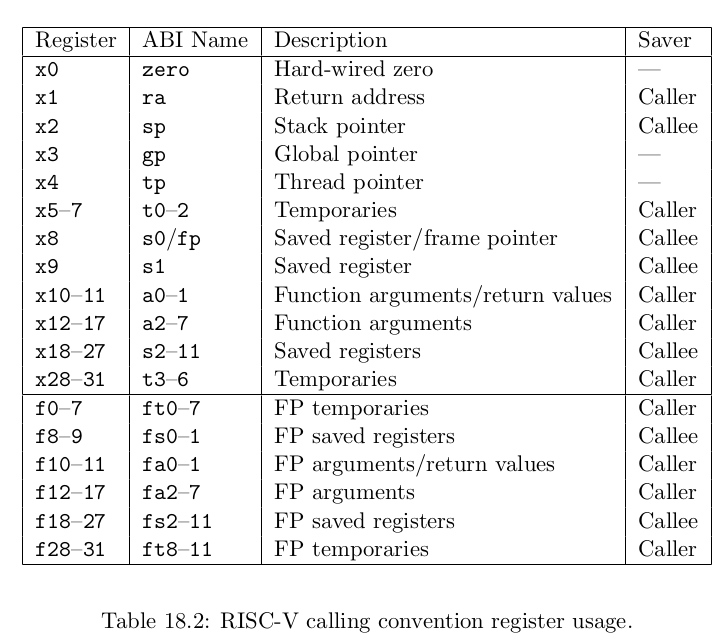

Certainly! Here's a list of frequently used GDB commands that are essential for effective debugging. These commands can help you control the execution flow, inspect the state of a program, set breakpoints, and more.

### Basic Navigation
- **`run` (or `r`):** Starts the execution of your program in GDB. You can also pass arguments to your program using this command.
- **`continue` (or `c`):** Resumes the execution of your program after it has been stopped (e.g., at a breakpoint).
- **`next` (or `n`):** Executes the next line of your program, stepping over function calls.
- **`step` (or `s`):** Executes the next line of your program, stepping into function calls.
- **`finish`:** Runs until the current function is finished and returns to the caller.

### Breakpoints and Watchpoints
- **`break` [location] (or `b` [location]):** Sets a breakpoint at the specified location. The location can be a function name, line number, or address.
- **`watch` [expression]:** Sets a watchpoint for the given expression (e.g., a variable). The program will stop whenever the expression's value changes.
- **`info breakpoints`:** Lists all breakpoints and watchpoints.
- **`delete` [breakpoint number]:** Deletes the specified breakpoint or watchpoint.
- **`disable` [breakpoint number]:** Disables the specified breakpoint or watchpoint without deleting it.
- **`enable` [breakpoint number]:** Re-enables a previously disabled breakpoint or watchpoint.

### Inspecting the Program State
- **`print` [expression] (or `p` [expression]):** Evaluates and prints the value of the expression.
- **`info locals`:** Displays local variables of the current function.
- **`info args`:** Shows the arguments of the current function.
- **`backtrace` (or `bt`):** Displays the call stack (or backtrace) showing function calls that led to the current point in the program.
- **`list` (or `l`):** Shows the source code around the current line or specified location.

### Controlling Execution
- **`set variable` [variable]=[value]:** Changes the value of a variable.
- **`signal` [signal]:** Sends a specified signal to the program.
- **`kill`:** Terminates the execution of the program being debugged.

### Miscellaneous
- **`info registers`:** Displays the contents of CPU registers.
- **`disassemble` [function]:** Disassembles the machine code of a specified function.
- **`layout src`:** Switches to the Source layout, showing the source code, assembly, and registers.
- **`help`:** Provides information about GDB commands.

### Exiting GDB
- **`quit` (or `q`):** Exits GDB.

These commands form the foundation of navigating and utilizing GDB for debugging. As you become more experienced, you may find additional, more advanced commands useful for specific scenarios. Remember that GDB is a powerful tool, and mastering its commands can significantly enhance your debugging efficiency.

有关RISC-V的一件有意思的事情是，虚拟内存地址都是64bit，这也说的通，因为RISC-V的寄存器是64bit的。但是实际上，在我们使用的RSIC-V处理器上，并不是所有的64bit都被使用了，也就是说高25bit并没有被使用。这样的结果是限制了虚拟内存地址的数量，虚拟内存地址的数量现在只有2^39个，大概是512GB。当然，如果必要的话，最新的处理器或许可以支持更大的地址空间，只需要将未使用的25bit拿出来做为虚拟内存地址的一部分即可。

在剩下的39bit中，有27bit被用来当做index，**12bit被用来当做offset。offset必须是12bit**，因为对应了一个page的4096个字节。

物理内存地址是56bit，其中44bit是物理page号（PPN，Physical Page Number），剩下12bit是offset完全继承自虚拟内存地址（也就是地址转换时，只需要将虚拟内存中的27bit翻译成物理内存中的44bit的page号，剩下的12bitoffset直接拷贝过来即可）。

选择56bit而不是64bit是因为在主板上只需要56根线。

这个page table最多会有2^27个条目（虚拟内存地址中的index长度为27），这是个非常大的数字。如果每个进程都使用这么大的page table，进程需要为page table消耗大量的内存，并且很快物理内存就会耗尽。

所以实际上，硬件并不是按照这里的方式来存储page table。从概念上来说，你可以认为page table是从0到2^27，但是实际上并不是这样。实际中，page table是一个多级的结构。下图是一个真正的RISC-V page table结构和硬件实现。


我们之前提到的虚拟内存地址中的27bit的index，实际上是由3个9bit的数字组成（L2，L1，L0）。

一个directory是4096Bytes，就跟page的大小是一样的。Directory中的一个条目被称为PTE（Page Table Entry）是64bits，就像寄存器的大小一样，也就是8Bytes。所以一个Directory page有512个条目。

所以实际上，SATP寄存器会指向最高一级的page directory的物理内存地址，之后我们用虚拟内存中index的高9bit用来索引最高一级的page directory，这样我们就能得到一个PPN，也就是物理page号。这个PPN指向了中间级的page directory。

当我们在使用中间级的page directory时，我们通过虚拟内存地址中的L1部分完成索引。接下来会走到最低级的page directory，我们通过虚拟内存地址中的L0部分完成索引。在最低级的page directory中，我们可以得到对应于虚拟内存地址的物理内存地址。

从某种程度上来说，与之前一种方案还是很相似的，除了实际的索引是由3步，而不是1步完成。这种方式的主要优点是，如果地址空间中大部分地址都没有使用，你不必为每一个index准备一个条目。举个例子，如果你的地址空间只使用了一个page，4096Bytes。

> 学生提问：既然每个物理page的PPN是44bit，而物理地址是56bit，我们从哪得到缺失的12bit？（这个学生嘟囔了半天，我猜他是要问这个。其实12bit直接从虚拟地址的12bit offset继承就可以了，但是可能这个问题太简单了，Frans教授似乎理解错了问题。）
>
> Frans教授：所有的page directory传递的都是PPN，对应的物理地址是44bit的PPN加上12bit的0（注，也就是page的起始地址，因为每个page directory都使用一个完整的page，所以直接从page起始地址开始使用就行）。如果我们查看这里的PTE条目，它们都有相同的格式，其中44bit是PPN，但是寄存器是64bit的，所有有一些bit是留空的。实际上，支持page的硬件在低10bit存了一些标志位用来控制地址权限。

.png)

## Kernel Page Table


```shell
tui enable
layout asm
layout reg
layout source # 仅展示C代码
layout split # 同时展示C代码和汇编代码
tui disable
info frame
backtrace
```

这里的意思是，一个Caller Saved寄存器可能被其他函数重写。假设我们在函数a中调用函数b，任何被函数a使用的并且是Caller Saved寄存器，调用函数b可能重写这些寄存器。任何一个Callee Saved寄存器，作为被调用方的函数要小心寄存器的值不会相应的变化。

不同的函数有不同数量的本地变量，不同的寄存器，所以Stack Frame的大小是不一样的。但是有关Stack Frame有两件事情是确定的：

- Return address总是会出现在Stack Frame的第一位
- 指向前一个Stack Frame的指针也会出现在栈中的固定位置

有关Stack Frame中有两个重要的寄存器，第一个是SP（Stack Pointer），它指向Stack的底部并代表了当前Stack Frame的位置。第二个是FP（Frame Pointer），它指向当前Stack Frame的顶部。因为Return address和指向前一个Stack Frame的的指针都在当前Stack Frame的固定位置，所以可以通过当前的FP寄存器寻址到这两个数据。

riscv.h (kernel/riscv.h:1) contains definitions that xv6 uses. Here’s an outline of the most important registers:
• **stvec**: The kernel writes the address of its trap handler here; the RISC-V jumps to the address in stvec to handle a trap.
• **sepc**: When a trap occurs, RISC-V saves the program counter here (since the pc is then overwritten with the value in stvec). The sret (return from trap) instruction copies sepc to the pc. The kernel can write sepc to control where sret goes.
• **scause**: RISC-V puts a number here that describes the reason for the trap.
• **sscratch**: The kernel places a value here that comes in handy at the very start of a trap handler.
• **sstatus**: The SIE bit in sstatus controls whether device interrupts are enabled. If the kernel clears SIE, the RISC-V will defer device interrupts until the kernel sets SIE. The SPP bit indicates whether a trap came from user mode or supervisor mode, and controls to what mode sret returns.

Each CPU on a multi-core chip has its own set of these registers, and more than one CPU may
be handling a trap at any given time.
When it needs to force a trap, the RISC-V hardware does the following for all trap types (other
than timer interrupts):

1. If the trap is a device interrupt, and the sstatus SIE bit is clear, don’t do any of the
    following.
2. Disable interrupts by clearing the SIE bit in sstatus.
3. **Copy the pc to sepc.**
4. Save the current mode (user or supervisor) in the SPP bit in sstatus.
5. Set scause to reflect the trap’s cause.
6. **Set the mode to supervisor.**
7. **Copy stvec to the pc.**
8. Start executing at the new pc.

Note that the CPU **doesn’t switch to the kernel page table**, doesn’t switch to a stack in the kernel, and **doesn’t save any registers other than the pc**. Kernel software must perform these tasks. One reason that the CPU does minimal work during a trap is to provide flexibility to software; for example, some operating systems omit a page table switch in some situations to increase trap performance.

我们是通过ecall走到trampoline page的，而ecall实际上只会改变三件事情：

第一，ecall将代码从user mode改到supervisor mode。

第二，ecall将程序计数器的值保存在了SEPC寄存器。我们可以通过打印程序计数器看到这里的效果

第三，ecall会跳转到STVEC寄存器指向的指令。

所以现在，ecall帮我们做了一点点工作，但是实际上我们离执行内核中的C代码还差的很远。接下来：

- 我们需要保存32个用户寄存器的内容，这样当我们想要恢复用户代码执行时，我们才能恢复这些寄存器的内容。
- 因为现在我们还在user page table，我们需要切换到kernel page table。
- 我们需要创建或者找到一个kernel stack，并将Stack Pointer寄存器的内容指向那个kernel stack。这样才能给C代码提供栈。
- 我们还需要跳转到内核中C代码的某些合理的位置。

ecall并不会为我们做这里的任何一件事。

A major constraint on the design of xv6’s trap handling is the fact that the RISC-V hardware
does not switch page tables when it forces a trap. This means that the trap handler address in
stvec must have a valid mapping in the user page table, since that’s the page table in force when
the trap handling code starts executing. Furthermore, xv6’s trap handling code needs to switch to
the kernel page table; in order to be able to continue executing after that switch, the kernel page
table must also have a mapping for the handler pointed to by stvec.

也就是说，你可以在supervisor mode完成，但是不能在user mode完成的工作，或许并没有你想象的那么有特权。所以，我们接下来看看supervisor mode可以控制什么？

其中的一件事情是，你现在可以读写控制寄存器了。比如说，当你在supervisor mode时，你可以：读写SATP寄存器，也就是page table的指针；STVEC，也就是处理trap的内核指令地址；SEPC，保存当发生trap时的程序计数器；SSCRATCH等等。在supervisor mode你可以读写这些寄存器，而用户代码不能做这样的操作。

另一件事情supervisor mode可以做的是，它可以使用PTE_U标志位为0的PTE。当PTE_U标志位为1的时候，表明用户代码可以使用这个页表；如果这个标志位为0，则只有supervisor mode可以使用这个页表。我们接下来会看一下为什么这很重要。

这两点就是supervisor mode可以做的事情，除此之外就不能再干别的事情了。

### X

1. **Use the `x` Command**: The basic syntax of the `x` command is:

   ```
   x/nfu addr
   ```
   Where:
   - `n` is the number of elements to display.
   - `f` is the format in which to display each element (`x` for hexadecimal, `d` for decimal, `u` for unsigned, `t` for binary, `o` for octal, `a` for address, `c` for char, `f` for float, `s` for string, `i` for instruction, etc.).
   - `u` is the unit size of each element (`b` for byte, `h` for halfword, `w` for word, `g` for giant/8 bytes).
   - `addr` is the starting address from where you want to examine the memory.


### Print Basic Syntax:


The basic syntax of the `print` command is:

```gdb
print [/format] expression
```

Where:
- `expression` is the expression you want to evaluate and print. This can be a variable, a function call, a mathematical expression, or any valid combination of these.
- `/format` is an optional format specifier that dictates how the value should be displayed. Common format specifiers include:
  - `x` - hexadecimal
  - `d` - decimal
  - `u` - unsigned decimal
  - `o` - octal
  - `t` - binary
  - `a` - address
  - `c` - character
  - `f` - floating point
  - `s` - string


In GDB (GNU Debugger), the symbols `$` and `*` have specific meanings and are used in various contexts. Understanding their usage can enhance your debugging process significantly. Here's an overview of how these symbols are used:

### 1. `$` Symbol:
The `$` symbol in GDB is primarily used in the context of variables and registers:

- **Registers**: When prefixed with a `$`, it refers to CPU registers. For example, `$eax`, `$rsp`, `$rip` on x86 architectures refer to specific CPU registers. You can use the `print` command to view their contents, like `print $eax`.

- **Convenience Variables**: GDB allows you to store values in convenience variables, which are named with the `$` symbol followed by a name, like `$myVar`. You can assign values to these variables for use later in the debugging session. For instance, `set $myVar = 5` assigns 5 to `$myVar`, and you can then use `print $myVar` to view its value.

- **History of Printed Values**: GDB automatically stores the values of the most recently printed expressions in convenience variables named `$1`, `$2`, `$3`, etc. `$1` refers to the last printed value, `$2` to the second-to-last, and so on. 

### 2. `*` Symbol:
The `*` symbol in GDB is used for dereferencing pointers and for examining memory contents:

- **Dereferencing Pointers**: In C and C++, `*` is used to dereference a pointer. In GDB, this works the same way. If you have a pointer `p`, you can view the value it points to by using `print *p`.

- **Examining Memory**: When combined with the `x` command, `*` is used to interpret a memory address and examine its contents. For instance, `x/4wx *addr` interprets `addr` as an address and displays 4 words of memory in hexadecimal format starting from that address.

- **Expressions**: It can be used in expressions for multiplication or as a pointer dereference symbol, depending on the context.

Understanding the distinction between `$` for referencing variables and registers, and `*` for dereferencing pointers or memory addresses, is crucial for effective debugging in GDB. These symbols allow you to inspect and manipulate the state of the program you are debugging in a powerful way.



接下来我们要设置SSTATUS寄存器，这是一个控制寄存器。这个寄存器的SPP bit位控制了sret指令的行为，该bit为0表示下次执行sret的时候，我们想要返回user mode而不是supervisor mode。这个寄存器的SPIE bit位控制了，在执行完sret之后，是否打开中断。因为我们在返回到用户空间之后，我们的确希望打开中断，所以这里将SPIE bit位设置为1。修改完这些bit位之后，我们会把新的值写回到SSTATUS寄存器。

