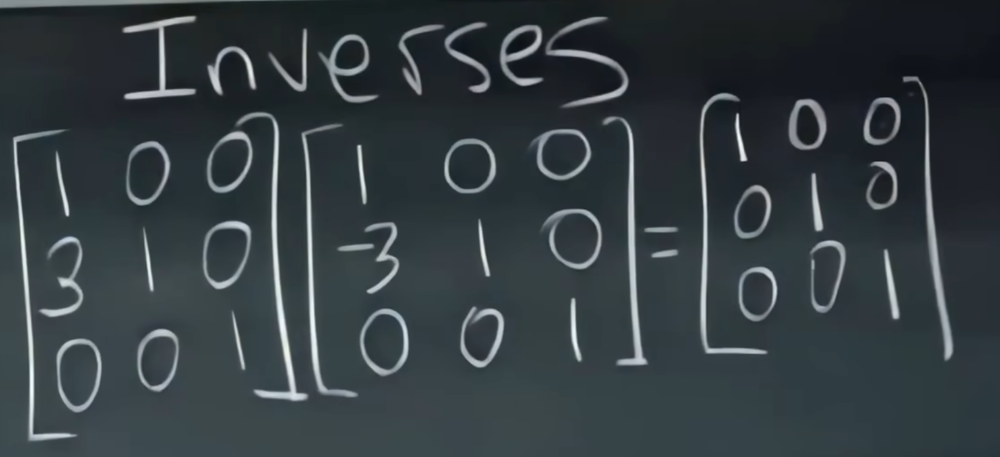

# Linear_Algebra

书籍："Introduction to Linear Algebra, 5th Edition"

lectures:
[MIT18.06 Linear Algebra](https://web.mit.edu/18.06/www/)

[MIT18.065 Matrix Methods in Data Analysis, Signal Processing, and Machine Learning](https://ocw.mit.edu/courses/18-065-matrix-methods-in-data-analysis-signal-processing-and-machine-learning-spring-2018/video_galleries/video-lectures/)

### Lecture #1: The Geometry of Linear Equations

Linear Combination of Column

行图像

列图像

2维的列图像的组合可以覆盖整个二维平面，3维的列向量组合可以覆盖整个3维空间（可逆矩阵）

如果3个列向量处于同一平面，则他们构造不出平面之外的b，称为奇异矩阵

### Lecture #2: Elimination with Matrices

##### 消元法

主元：pivots,其行列式等于主元之积，如果不存在3个主元则是不可逆矩阵

矩阵可以使用结合律 Associative Law（即可以移动括号），不能使用交换律

##### 初等矩阵（Elementary matrix) 记作E

行变化乘在矩阵左边，列变化乘在右边

##### 逆矩阵（Inverses）E^-1

