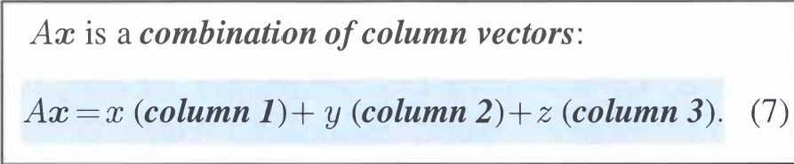

# Linear_Algebra

书籍："Introduction to Linear Algebra, 5th Edition"

lectures:
[MIT18.06 Linear Algebra](https://web.mit.edu/18.06/www/)

[MIT18.065 Matrix Methods in Data Analysis, Signal Processing, and Machine Learning](https://ocw.mit.edu/courses/18-065-matrix-methods-in-data-analysis-signal-processing-and-machine-learning-spring-2018/video_galleries/video-lectures/)

### Lecture #1: The Geometry of Linear Equations

Linear Combination of Column

行图像

列图像

2维的列图像的组合可以覆盖整个二维平面，3维的列向量组合可以覆盖整个3维空间（可逆矩阵）

如果3个列向量处于同一平面，则他们构造不出平面之外的b，称为奇异矩阵

### Lecture #2: Elimination with Matrices

##### 矩阵乘法

##### 消元法

主元：pivots,其行列式等于主元之积，如果不存在3个主元则是不可逆矩阵

矩阵可以使用结合律 Associative Law（即可以移动括号），不能使用交换律

矩阵乘以一列得到一列

行乘以矩阵得到一行

The given system of linear equations is:

1.  $x + y + z = 2$
2.  $x + 2y + z = 3$
3.  $2x + 3y + 2z = 5$

To find the line of solutions, we can use the method of **Gaussian elimination**.

### **1. Augmented Matrix**

First, we'll represent the system of equations as an augmented matrix:

$$
\begin{pmatrix}
1 & 1 & 1 & 2 \\
1 & 2 & 1 & 3 \\
2 & 3 & 2 & 5
\end{pmatrix}
$$

### **2. Row Operations**

Next, we perform row operations to simplify the matrix into row-echelon form.

* **R2 = R2 - R1:** Subtract the first row from the second row.

$$
\begin{pmatrix}
1 & 1 & 1 & 2 \\
0 & 1 & 0 & 1 \\
2 & 3 & 2 & 5
\end{pmatrix}
$$

* **R3 = R3 - 2*R1:** Subtract twice the first row from the third row.

$$
\begin{pmatrix}
1 & 1 & 1 & 2 \\
0 & 1 & 0 & 1 \\
0 & 1 & 0 & 1
\end{pmatrix}
$$

* **R3 = R3 - R2:** Subtract the new second row from the new third row.

$$
\begin{pmatrix}
1 & 1 & 1 & 2 \\
0 & 1 & 0 & 1 \\
0 & 0 & 0 & 0
\end{pmatrix}
$$

### **3. Back Substitution**

Now we can write the simplified system of equations from the row-echelon form of the matrix:

1.  $x + y + z = 2$
2.  $y = 1$

From the second equation, we have **$y = 1$**.

Substitute $y = 1$ into the first equation:

$x + 1 + z = 2$
$x + z = 1$

This confirms that there are infinitely many solutions. We can express one variable in terms of another. Let's introduce a parameter, $t$.

Let **$z = t$**.
Then, from $x + z = 1$, we get **$x = 1 - t$**.

### **4. The Solution: Line L**

The solution to the system of equations is a line, L, which can be expressed in parametric form:

* $x = 1 - t$
* $y = 1$
* $z = t$

This can be written in vector form as:

$L(t) = \begin{pmatrix} x \\ y \\ z \end{pmatrix} = \begin{pmatrix} 1 \\ 1 \\ 0 \end{pmatrix} + t \begin{pmatrix} -1 \\ 0 \\ 1 \end{pmatrix}$

This means the line **L** passes through the point **(1, 1, 0)** and is parallel to the direction vector **(-1, 0, 1)**.

##### 初等矩阵（Elementary matrix) 记作E~21

**置换矩阵**(permutation matrix) **P**

行交换

列交换：矩阵乘在右边

行变化乘在矩阵左边，列变化乘在右边

##### 逆矩阵（Inverses）E^-1

