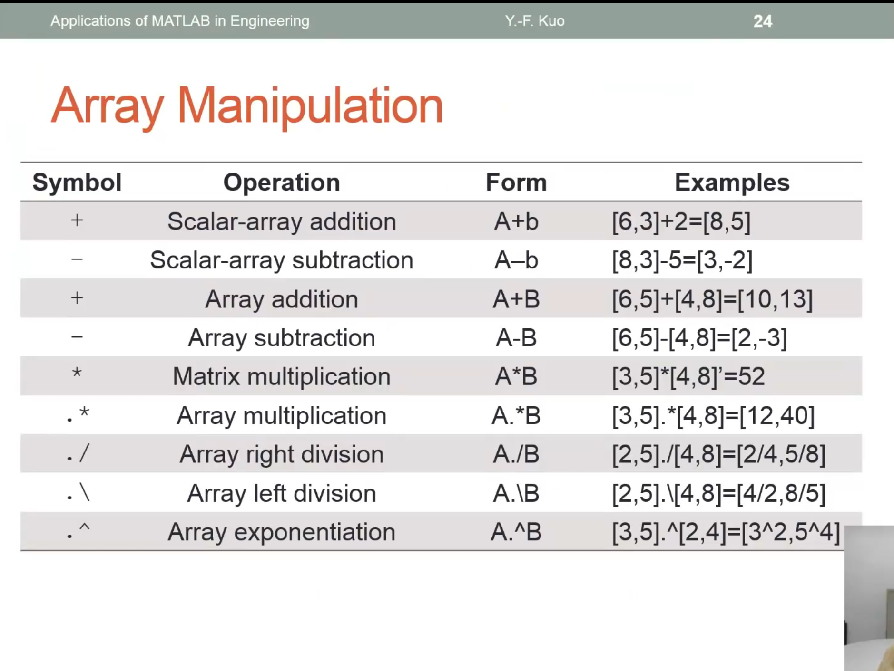

## [Matlab](https://www.bilibili.com/video/BV1ixgBzLEr2/?p=3&spm_id_from=333.1007.top_right_bar_window_history.content.click&vd_source=0e4de0dd0c9aad54817599a7fef890c7)

### 基础操作


内积：行*列

外积：列*行


###### indexing


###### 增广矩阵


###### 矩阵操作





### 程式撰写

一种解释型脚本语言，不需要编译，一般存为.m文件

```matlab
for i=1:10
    x=linspace(1,10,101);
    plot(x, sin(x+1));
    print(gcf,'-deps', strcat('plot',num2str(i),'.ps'));
end
```

% 为注释符号

%% 为section分区模块，可以执行部分脚本。主要用于debug（二分查找）


