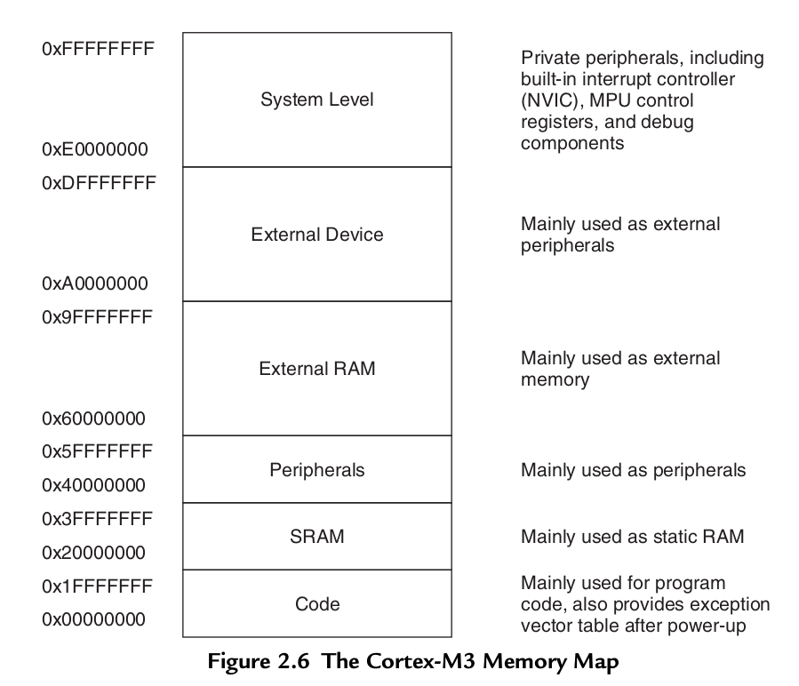
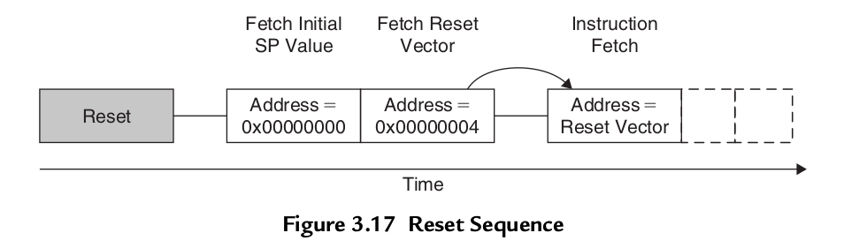

# Cortex-M3-Definitive-Guide-EN

## Chapter 2 Overview




## Chapter 3 Cortex-M3 Basics

The Cortex-M3 processor automatically pushes registers R0–R3, R12, LR, PSR, and
PC in the stack at interrupt entry and pops them back at interrupt exit. This reduces
the IRQ handling latency and allows interrupt handlers to be normal C functions (as
explained later, in Chapter 8).


The **MSP**, also called SP_main in ARM documentation, is the **default stack pointer after power-up**; it is used by kernel code and exception handlers. The PSP, or SP_ process in ARM documentation, is typically used by Thread processes.

Since register PUSH and POP operations are always **word aligned** (their addresses must be 0x0, 0x4, 0x8, …), the stack pointer R13 **bit 0 and bit 1 are hardwired** to zero and always read as zero (RAZ).

```assembly
PUSH {R0} ; R13=R13-4, then Memory[R13]=R0
POP {R0} ; R0=Memory[R13], then R13=R13+4


main ; Main program
 	…
	BL function1 ; Call function1 using Branch with Link
                ; instruction.
                ; PC = function1 and
                ; LR = the next instruction in main
	…
function1
	…		; Program code for function 1
	BX LR	; Return
```

> Despite the fact that bit 0 of the program counter is always 0 (because instructions are word
> aligned or half word aligned), the LR bit 0 is readable and writable. This is because in the
> Thumb instruction set, bit 0 is often used to indicate ARM/Thumb states. To allow the
> Thumb-2 program for the Cortex-M3 to work with other ARM processors that support
> the Thumb-2 instruction set, this LSB is writable and readable.

`0x1000 :MOV R0, PC ; R0 = 0x1004`
Writing to the program counter will cause a branch (but link registers do not get updated).
Since an instruction address must be half word aligned, the LSB (bit 0) of the program
counter read value is always 0. However, in branching, either by writing to PC or using branch
instructions, the LSB of the target address should be set to 1 because it is used to indicate
the Thumb state operations. If it is 0, it can imply trying to switch to the ARM state and will
result in a fault exception in the Cortex-M3.

### Special Registers

The special registers in the Cortex-M3 processor include these:

- Program Status Registers (PSRs)
- Interrupt Mask Registers (PRIMASK, FAULTMASK, and BASEPRI)
- Control Register (Control)

Special registers can only be accessed via MSR and MRS instructions; they do not have memory addresses:

```assembly
MRS <reg>, <special_reg>; Read special register
MSR <special_reg>, <reg>; write to special register
```

### Program Status Registers (PSRs)

The program status registers are subdivided into three status registers:

- Application PSR (APSR)1
- Interrupt PSR (IPSR)
- Execution PSR (EPSR)

The three PSRs can be accessed together or separately using the special register access instructions MSR and MRS. When they are accessed as a collective item, the name xPSR is used.


You can read the program status registers using the MRS instruction. You can also change the APSR using the MSR instruction, but EPSR and IPSR are read-only. For example:

```assembly
MRS r0, APSR	; Read Flag state into R0
MRS r0, IPSR	; Read Exception/Interrupt state
MRS r0, EPSR	; Read Execution state
MSR APSR, r0	; Write Flag state
```

In ARM assembler, when accessing xPSR (all three program status registers as one), the symbol PSR is used:

```assembly
MRS r0, PSR	; Read the combined program status word
MSR PSR, r0	; Write combined program state word
```


```assembly
MRS r0, BASEPRI		; Read BASEPRI register into R0
MRS r0, PRIMASK		; Read PRIMASK register into R0
MRS r0, FAULTMASK 	; Read FAULTMASK register into R0
MSR BASEPRI, r0		; Write R0 into BASEPRI register
MSR PRIMASK, r0		; Write R0 into PRIMASK register
MSR FAULTMASK, r0 	; Write R0 into FAULTMASK register
```

The PRIMASK, FAULTMASK, and BASEPRI registers cannot be set in the user access level.


CONTROL[1] is writable only when the core is in Thread mode and privileged. In the user state or handler mode, writing to this bit is not allowed.

The CONTRL[0] bit is writable only in a privileged state. Once it enters the user state, the only way to switch back to privileged is to **trigger an interrupt** and change this in the exception handler.

```assembly
MRS r0, CONTROL ; Read CONTROL register into R0
MSR CONTROL, r0 ; Write R0 into CONTROL register
```

### Operation Mode


When the processor is running in Thread mode, it can be in either the privileged or user level,but handlers can only be in the privileged level. When the processor exits **reset**, it is in Thread mode, **with privileged** access rights.

### Exception Types


### Vector Tables

​	When an exception event takes place on the Cortex-M3 and is accepted by the processor core, the corresponding exception handler is executed. To determine the starting address of the exception handler, a vector table mechanism is used. The vector table is an array of word data, each representing the starting address of one exception type. The vector table is relocatable and the relocation is controlled by a relocation register in the NVIC. After reset, this relocation control register is reset to 0; therefore, the vector table is located in address 0x0 after reset.


The LSB of each exception vector indicates whether the exception is to be executed in the Thumb state. Since the Cortex-M3 can support only Thumb instructions, the LSB of all the exception vectors should be set to 1.




## Chapter 4 Instruction Sets

### Basic Syntax

```assembly
label
	opcode operand1, operand2,... ; Comments
```

For example, immediate data are usually in the form #number, as here:

```assembly
MOV R0, #0x12 ; Set R0 = 0x12 (hexadecimal)
MOV R1, #‘A’ ; Set R1 = ASCII character A
```

You can define constants using EQU and then use them inside your program code. For example:

```assembly
NVIC_IRQ_SETEN0 EQU 0xE000E100
NVIC_IRQ0_ENABLE EQU 0x1
    ...
    LDR R0,=NVIC_IRQ_SETEN0 	; LDR here is a pseudo instruction that
                                ; convert to a PC relative load by
                                ; assembler.
    MOV R1,#NVIC_IRQ0_ENABLE 	; Move immediate data to register
    STR R1, [R0]				; Enable IRQ 0 by writing R1 to address
                                ; in R0
                
```

DCI can be used to code an instruction if your assembler cannot generate the exact instruction that you want and if you know the binary code for the instruction:

```assembly
DCI 0xBE00 ; Breakpoint (BKPT 0), a 16-bit instruction
```

We can use DCB (for byte size constant values such as characters) and DCD (for word size constant values) to define binary data in your code:

```assembly
    LDR R3,=MY_NUMBER 	; Get the memory address value of MY_NUMBER
    LDR R4,[R3]			; Get the value code 0x12345678 in R4

    ...
    LDR R0,=HELLO_TXT 	; Get the starting memory address of
    					; HELLO_TXT
    BL PrintText		; Call a function called PrintText to
    					; display string
    ...
MY_NUMBER
	DCD 0x12345678
HELLO_TXT
	DCB “Hello\n”,0		; null terminated string
```


### Instruction List


```assembly
	;per-indexing load
	LDR.W R0,[R1, #offset]! 	; Read memory[R1+offset], with R1
								; update to R1+offset

	;post-indexing memory access
	LDR.W R0,[R1], #offset 		; Read memory[R1], with R1
								; updated to R1+offset
```

### LDR and ADR Pseudo Instructions

Both LDR and ADR pseudo instructions can be used to set registers to a program address
value. They have different syntaxes and behaviors. For LDR, if the address is a program
address value, it will automatically set the LSB to 1. For example:

You will find that the LDR instruction will put 0x4001 into R1; the LSB is set to 1 to indicate
that it is Thumb code. If address1 is a **data address**, LSB will not be changed. For example:


```assembly
    LDR R0, =address1 ; R0 set to 0x4001
    ...
address1
0x4000: MOV R0, R1 ; address1 contains program code

    LDR R0, =address1 ; R0 set to 0x4000
    ...
address1
0x4000: DCD 0x0 ; address1 contains data
```

For ADR, you can load the address value of a program code into a register without setting the
LSB automatically. For example:

```assembly
    ADR R0, address1
    ...
address1
0x4000: MOV R0, R1 ; address1 contains program code
    ...
```

You will get 0x4000 in the ADR instruction. Note that there is **no equal sign** (=) in the ADR statement.


### Branch

```assembly
	B label 	; Branch to a labeled address
	BX reg		; Branch to an address specified by a register
	
	BL label	; Branch to a labeled address and save return
				; address in LR
	BLX reg		; Branch to an address specified by a register and
				; save return
				; address in LR.
```

the value of reg used by **BX and BLX** should make sure that the **LSB of the register is 1**.

### APSR(Flags)


The defined branch conditions can also be used in IF-THEN-ELSE structures. For example:

```assembly
        CMP R0, R1		; Compare R0 and R1
        ITTEE GT		; If R0 > R1 Then (first 2 statements execute
                        ; if true,
                        ; other 2 statements execute if false)
        MOVGT R2, R0 	;		R2 = R0

        MOVGT R3, R1 	;		R3 = R1

        MOVLE R2, R0 	; Else  R2 = R1
        MOVLE R3, R1 	;		R3 = R0
```

**PSR flags can be affected by the following:**

- **16-bit ALU instructions**

- **32-bit (Thumb-2) ALU instructions with the S suffix; for example, ADDS.W**

- **Compare (e.g., CMP) and Test (e.g., TST, TEQ)**

- **Write to APSR/PSR directly**

  **Most of the 16-bit Thumb arithmetic instructions** affect the N, Z, C, and V flags. With 32-bit
  Thumb-2 instructions, the ALU operation can either change flags or not change flags. For
  example:

```assembly
    ADDS.W	R0, R1, R2	; This 32-bit Thumb-2 instruction update flag
    ADD.W	R0, R1, R2	; This 32-bit Thumb-2 instruction do not
                        ; update flag
    ADDS	R0, R1		; This 16-bit Thumb instruction update flag
    ADD		R0, #0x1	; This 16-bit Thumb instruction update flag
```

```assembly
IT<x><y><z> <cond>						; IT instruction (<x>, <y>,
										; <z> can be T or E)
instr1<cond>				<operands>	; 1st instruction (<cond>
										; must be same as IT)
instr2<cond or not cond> 	<operands>	; 2nd instruction (can be
										; <cond> or <!cond>
instr3<cond or not cond> 	<operands>	; 3rd instruction (can be
										; <cond> or <!cond>
instr4<cond or not cond> 	<operands>	; 4th instruction (can be
										; <cond> or <!cond>

CMP			R1, R2	; If R1 < R2 (less then)
ITTEE		LT		; then execute instruction 1 and 2
					; (indicated by T)
					; else execute instruction 3 and 4
					; (indicated by E)
SUBLT.W		R2,R1	; 1st instruction
LSRLT.W		R2,#1	; 2nd instruction
SUBGE.W		R1,R2	; 3rd instruction (notice the GE is
					; opposite of LT)
LSRGE.W		R1,#1	; 4th instruction
```


When you do **a data write followed immediately by a read on a dual-port memory**, if the
memory write is buffered, the DMB instruction can be used to ensure the read gets the
updated value.

The DSB and ISB instructions can be important for self-modifying code. For example, if a
program **changes its own program code**, the next executed instruction should be based on the
updated program. However, since the processor is pipelined, the modified instruction location
might have already been fetched. Using DSB and then ISB can ensure that the modified
program code is fetched again.

## Chapter 5 Memory System

However, it is best to put the program **code in the Code region** because, with this arrangement, the
instruction fetches and data accesses are carried out simultaneously on two separate bus interfaces.


There are two segments of the private peripheral bus:

- AHB private peripheral bus, for Cortex-M3 internal AHB peripherals only: This includes NVIC, FPB, DWT, and ITM.
- APB private peripheral bus, for Cortex-M3 internal APB devices as well as external peripherals (external to the Cortex-M3 processor): The Cortex-M3 allows chip vendors to add additional on-chip APB peripherals on this APB private peripheral bus via an APB interface.


### Bit-Band Operations


## Chapter 6 Cortex-M3 Implementation Overview

In executing a branch instruction, the pipeline will be flushed. The processor will have to fetch
instructions from the branch destination to fill up the pipeline again. However, the Cortex-
M3 processor supports a number of instructions in v7-M architecture, so some of the short-
distance branches can be avoided by replacing them with conditional execution codes.


