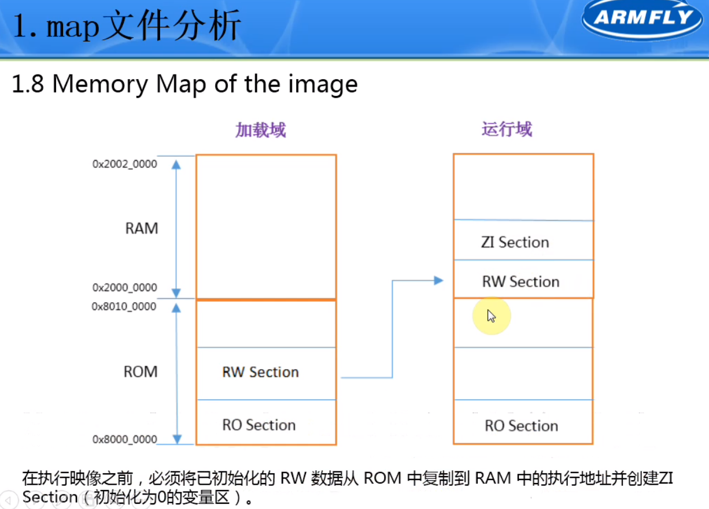

# Debug

## MAP文件


1. 列出了不同函数间的调用关系
2. 列出了被MDK优化掉的冗余函数
3. 列出了局部标签和全局标签
4. 列出了映像文件的内存映射
5. 列出了映像文件的组件大小（组件指单个的源文件）


### Symbol Table


Number类型是不占用大小的，不用管

**i.BusFault_Handler**:`i.`前缀表示在某个文件中的函数，此例在文件stm32f4xx_it.o中（该文件为中断汇集的地方，所有的中断函数建议大家都放这个文件里面，方便管理。如果局部标号里占用大小显示为0,需要去全局标号里查看


如果同一个函数有带和不带`i.`前缀两种情况同时出现，说明该函数是用`static`声明的，限制了它的作用域只在这个文件中

>  0x80是flash空间的地址
>
> 0x2开始就是RAM地址


.data 32代表它下面的一段东西共占32bytes。要用地址算，直接按后面标注的字节相加是不准确的


Data类型表示只读数据，不能更改


**没有调用过的函数**不占用空间


这些函数由MDK封装起来了，再汇编启动代码调用`__main`标号后，会陆续调用这些函数，然后才调用`main`函数


### 映像文件的内存映射


- **加载域**：简单来说就是大家通过下载器把代码下载到芯片里，下载进去之后它所存储的位置就是加载域
- **运行域**：一旦开始执行这些代码的时候，他们所在的位置就是运行域
- **入口点**：映像中的入口点就是程序开始执行的位置

运行域比加载域要小一些，因为部分可读可写的数据被移到了RAM中


PAD表示填充， 以实现4字节对齐




代码段需要**4字节对齐**，栈空间需要**8字节对齐**？（现在最新的map文件中栈空间可能也是4字节对齐）


### 各组件的大小


Debug一般不用管，仅在调试状态下占用字节。Object Totals已经包含连接器生成的中间文件和填充

> In the context of a map file generated during the build process of a software project, particularly when using development tools like ARM's MDK (Microcontroller Development Kit), the term "Code (inc. data)" refers to the total size of the code (instructions) and initialized data included in a specific object file or library. This size is typically measured in bytes. Let's break down the components you're seeing in the map file output:
>
> 1. **Code (inc. data):** This column shows the total size of both executable code and included data for each object file. The "included data" part typically refers to initialized data that is directly embedded within the code section. This can include constants and initial values for static variables that are determined at compile-time.
>
> 2. **RO Data (Read-Only Data):** This part represents the size of read-only data, which can include constant variables (e.g., `const` keyword in C/C++). These are not modifiable at runtime and usually reside in a read-only section of the memory like FLASH.
>
> 3. **RW Data (Read-Write Data):** This indicates the size of initialized read-write data. These are variables that can be modified at runtime and are initialized to specific values in the code. They typically start in FLASH but are copied to RAM during the initialization phase of a program.
>
> 4. **ZI Data (Zero Initialized Data):** This represents the size of uninitialized data or data explicitly initialized to zero, which will be placed in the `.bss` section. At program startup, this section is allocated in RAM and initialized to zero.
>
> 5. **Debug:** The size of debug information included for each object file. This information is used by debuggers to provide source-level debugging capabilities.
>
> 6. **Object Name:** The name of the object file or library.
>
> The "Code (inc. data)" metric is crucial for understanding the total size of both the executable instructions and the statically initialized data that will be part of the final binary. It helps in estimating the memory footprint of the application, especially the part that will occupy the read-only memory (like Flash in microcontrollers). This metric is essential for embedded systems where memory resources are limited, and developers need to manage both code and data sizes efficiently.


### 总计大小


## htm文件


每个函数的栈空间以及调用和被调用函数。

最重要的主要是最大堆栈空间

在freeRTOS动态监测最大栈空间中：

> FreeRTOS provides a simple yet powerful utility to monitor task stack usage called the "stack high water mark." The high water mark indicates the minimum amount of stack space that remained unused during the peak stack usage of a task. This feature helps developers to fine-tune task stack sizes by providing empirical data on actual stack usage at runtime. Here's how to use this tool:
>
> ### Enabling Stack High Water Mark Checking
>
> First, ensure that stack usage checking is enabled in your FreeRTOS configuration. This is typically done by setting the `configUSE_TRACE_FACILITY` and `INCLUDE_uxTaskGetStackHighWaterMark` macros to `1` in your `FreeRTOSConfig.h` file.
>
> ```c
> #define configUSE_TRACE_FACILITY                1
> #define INCLUDE_uxTaskGetStackHighWaterMark     1
> ```
>
> ### Using uxTaskGetStackHighWaterMark
>
> After ensuring the feature is enabled, you can use the `uxTaskGetStackHighWaterMark()` function to retrieve the high water mark for a particular task. This function returns the number of words (not bytes) remaining in the task's stack that have never been used; this helps to estimate how close a task came to overflowing its stack.
>
> Here is a basic usage example:
>
> ```c
> UBaseType_t uxHighWaterMark;
> uxHighWaterMark = uxTaskGetStackHighWaterMark(NULL);
> ```
>
> Passing `NULL` as the argument to `uxTaskGetStackHighWaterMark()` will return the high water mark of the calling task. You can also pass a task handle to check the stack usage of a different task.
>
> ### Interpreting the Results
>
> The value returned by `uxTaskGetStackHighWaterMark()` is the amount of unused stack space at the point of greatest stack usage. If this number is small, your task is close to overflowing its stack, and you should consider increasing the stack size. Conversely, if the number is large, you may have allocated more stack space than necessary, which could be wastefully consuming valuable RAM.
>
> ### Example: Monitoring and Logging
>
> A common approach is to periodically check the high water mark of tasks, especially during development and testing phases. You can log these values or use a debugger to observe them. Here’s an example of how you might incorporate high water mark checking into a periodic monitoring task:
>
> ```c
> void vMonitorTask(void *pvParameters) {
>     UBaseType_t uxHighWaterMark;
> 
>     for (;;) {
>         uxHighWaterMark = uxTaskGetStackHighWaterMark(NULL);
>         printf("Monitor Task High Water Mark: %lu words\n", uxHighWaterMark);
> 
>         // Delay for a period, allowing other tasks to run.
>         vTaskDelay(pdMS_TO_TICKS(1000));
>     }
> }
> ```
>
> This task periodically checks its own stack usage and prints out the minimum amount of stack that has been free. This approach can be extended to monitor multiple tasks, helping identify potential stack overflows before they occur.
>
> ### Final Notes
>
> - Remember, the stack high water mark provides a snapshot of the lowest point of unused stack space, which is invaluable for optimizing stack sizes based on actual application behavior.
> - Always account for the possibility of future changes to tasks' stack usage due to code modifications, and maintain a safety margin to avoid stack overflows.
> - Be mindful that the high water mark function may not account for all stack usage scenarios, especially in interrupt contexts, so it's wise to use this tool as part of a broader strategy for managing task stack sizes.