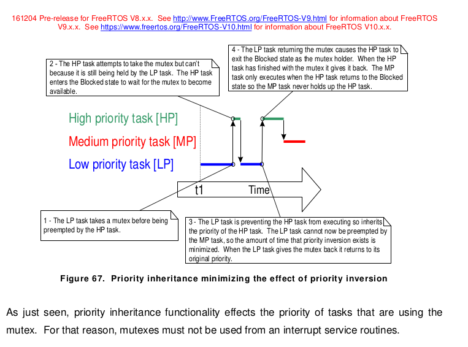

A real-time system is a computer system that must satisfy bounded response-time constraints or risk severe consequences, including failure.


The highest-priority unblocked task always runs


# freeRTOS

## Chapter 2 Heap Memory Management

1. heap_1.c:最简单的分配，申请全局变量数组，然后按顺序分配，永远不释放
2. heap_2.c:已废弃。申请全局变量数组，可以释放，但是不会合并相邻空闲块，最适匹配
3. heap_3.c:不申请全局变量数组，在标准malloc函数外层套了确保线程安全的修饰
4. heap_4.c:heap_2.c的优化方案，申请全局变量数组，可以释放，合并相邻空闲块，最先匹配
5. heap_5.c:heap_4.c的不申请全局变量数组版本，可以规定使用哪里的内存空间

## Chapter 3 Task Management

- Generic Method
  - When the generic method is used, FreeRTOS does not limit the maximum value to
    which configMAX_PRIORITIES can be set. However, it is always advisable to keep
    the configMAX_PRIORITIES value at the minimum necessary, because the higher its
    value, the more RAM will be consumed, and the longer the worst case execution time
    will be.
- Architecture Optimized Method
  - The configMAX_PRIORITIES setting does not affect the worst case execution time.
  - If the architecture optimized method is used then configMAX_PRIORITIES cannot be
    greater than 32.
    As with the generic method, it is advisable to keep
    configMAX_PRIORITIES at the minimum necessary, as the higher its value, the more
    RAM will be consumed.

The FreeRTOS scheduler will always ensure that the highest priority task that is able to run is
the task selected to enter the Running state. Where more than one task of the same priority is
able to run, the scheduler will transition each task into and out of the Running state, in turn.

The optimal value for configTICK_RATE_HZ is dependent on the application being developed,
although a value of 100 is typical.

It is important to note that the end of **a time slice** is not the only place that the scheduler can select a new task to run; as will be demonstrated throughout this book, the scheduler will also select a new task
to run immediately after the currently executing task **enters the Blocked state**, or when an **interrupt** moves a higher priority task into the Ready state.


If an application uses the vTaskDelete() API function then it is essential that the Idle task is not starved of processing time. This is because the Idle task is responsible for **cleaning up kernel resources** after a task has been deleted.

#### Prioritized Pre-emptive Scheduling with Time Slicing

The configuration shown in Table 14 sets the FreeRTOS scheduler to use a scheduling
algorithm called ‘Fixed Priority Pre-emptive Scheduling with Time Slicing’, which is the
scheduling algorithm used by most small RTOS applications, and the algorithm used by all the
examples presented in this book so far.

#### Prioritized Pre-emptive Scheduling (without Time Slicing)

Prioritized Preemptive Scheduling without time slicing maintains the same task selection and
pre-emption algorithms as described in the previous section, but does not use time slicing to
share processing time between tasks of equal priority.

If time slicing is not used, then the scheduler will only select a new task to enter the Running state when either:

- A higher priority task enters the Ready state.
- The task in the Running state enters the Blocked or Suspended state.

## Chapter 4 Queue Management


FreeRTOS uses the **queue by copy** method.

The task that is unblocked will always be the highest priority
task that is waiting for data. If the blocked tasks have equal priority, then the task that has
been **waiting for data the longest** will be unblocked.

```c
QueueHandle_t xQueueCreate( UBaseType_t uxQueueLength, UBaseType_t uxItemSize );

// All should not call from ISR, interrupt-safe ...FromISR() should be used
BaseType_t xQueueSendToFront( QueueHandle_t xQueue,
                             const void * pvItemToQueue,
							TickType_t xTicksToWait );
BaseType_t xQueueSendToBack( QueueHandle_t xQueue,
                            const void * pvItemToQueue,
                            TickType_t xTicksToWait );
BaseType_t xQueueReceive( QueueHandle_t xQueue,
                            void * const pvBuffer,
                            TickType_t xTicksToWait );
UBaseType_t uxQueueMessagesWaiting( QueueHandle_t xQueue );

// Use for mailbox(Queue which only have one element)
BaseType_t xQueueOverwrite( QueueHandle_t xQueue, const void * pvItemToQueue );
BaseType_t xQueuePeek( QueueHandle_t xQueue,
                        void * const pvBuffer,
                        TickType_t xTicksToWait );
```


两个发送者优先级1,接收者优先级2,则队列总是空或者仅有一个数据


两个发送者优先级2,接受者优先级1,则队列总是满或者仅有一个空位

## Chapter 5 Software Timer Management

```c
void ATimerCallback( TimerHandle_t xTimer );
```

A software timer can be in one of the following two states:

- Dormant
  - A Dormant software timer exists, and can be referenced by its handle, but is not running, so its callback functions will not execute.
- Running
  - A Running software timer will execute its callback function after a time equal to its period has elapsed since the software timer entered the Running state, or since the software timer was last reset.


#### The RTOS Daemon (Timer Service) Task

All software timer callback functions execute in the context of **the same RTOS daemon** (or ‘timer service’) task1.

The daemon task is a standard FreeRTOS task that is created automatically when the scheduler is started. Its priority and stack size are set by the configTIMER_TASK_PRIORITY and configTIMER_TASK_STACK_DEPTH compile time configuration constants respectively. Both constants are defined within FreeRTOSConfig.h.

Software timer API functions send commands from the calling task to the daemon task on a queue called the ‘timer command queue’.

> Note: The time at which the software timer being started will expire is calculated from
> the time the ‘start a timer’ command was sent to the timer command queue—it is not
> calculated from the time the daemon task received the ‘start a timer’ command from the
> timer command queue.

```c
TimerHandle_t xTimerCreate( const char * const pcTimerName,
                            TickType_t xTimerPeriodInTicks,
                            UBaseType_t uxAutoReload,
                            void * pvTimerID,
                            TimerCallbackFunction_t pxCallbackFunction );

// xTimerStart() can be called before the scheduler is started, but when this is done, the software timer will not actually start until the time at which the scheduler starts.
BaseType_t xTimerStart( TimerHandle_t xTimer, TickType_t xTicksToWait );

void vTimerSetTimerID( const TimerHandle_t xTimer, void *pvNewID );
void *pvTimerGetTimerID( TimerHandle_t xTimer );

BaseType_t xTimerChangePeriod( TimerHandle_t xTimer,
                            TickType_t xNewTimerPeriodInTicks,
                            TickType_t xTicksToWait );
BaseType_t xTimerReset( TimerHandle_t xTimer, TickType_t xTicksToWait );
```

Unlike other software timer API functions, vTimerSetTimerID() and pvTimerGetTimerID()
access the software timer directly—they do not send a command to the timer command
queue.

## Chapter 6 Interrupt Management

It is important to draw a distinction between the priority of a task, and the priority of an interrupt:

- A task is a software feature that is unrelated to the hardware on which FreeRTOS is running. The priority of a task is assigned in software by the application writer, and a software algorithm (the scheduler) decides which task will be in the Running state.
- Although written in software, an interrupt service routine is a hardware feature because the hardware controls which interrupt service routine will run, and when it will run. Tasks will only run when there are no ISRs running, so the lowest priority interrupt will interrupt the highest priority task, and there is no way for a task to pre-empt an ISR.

All architectures on which FreeRTOS will run are capable of processing interrupts, but details relating to interrupt entry, and interrupt priority assignment, vary between architectures.

> Note: Never call a FreeRTOS API function that does not have “FromISR” in its name from an ISR.

## Chapter 7 Resource Management

### Data Corruption

1. Accessing Peripherals
2. Read, Modify, Write Operations
3. Non-atomic Access to Variables
   1. Updating multiple members of a structure, or updating a variable that is larger than the natural word size of the architecture (for example, updating a 32-bit variable on a 16-bit machine), are examples of non-atomic operations. If they are interrupted, they can result in data loss or corruption.
4. Function Reentrancy

### Block Interrupt

```c
taskENTER_CRITICAL();
PORTA |= 0x01;
taskEXIT_CRITICAL();
```

>  Pre-emptive context switches can occur only from within an interrupt, so, as long as interrupts remain disabled, the task that called taskENTER_CRITICAL() is guaranteed to remain in the Running state until the critical section is exited.

It is safe for critical sections to become nested, because the kernel keeps a count of the nesting depth. The critical section will be exited only when the nesting depth returns to zero—which is when one call to taskEXIT_CRITICAL() has been executed for every preceding call to taskENTER_CRITICAL().

Calling taskENTER_CRITICAL() and taskEXIT_CRITICAL() is the **only legitimate way** for a task to alter the interrupt enable state of the processor on which FreeRTOS is running. Altering the interrupt enable state by any other means will invalidate the macro’s nesting count.

```c
void vAnInterruptServiceRoutine( void )
{
    UBaseType_t uxSavedInterruptStatus;
    
    uxSavedInterruptStatus = taskENTER_CRITICAL_FROM_ISR();
	taskEXIT_CRITICAL_FROM_ISR( uxSavedInterruptStatus );
}

```

### Suspending (or Locking) the Scheduler

However, interrupt activity while the scheduler is suspended can make resuming (or ‘un-suspending’) the scheduler a relatively long operation, so consideration must be given to which is the best method to use in each case.

If an **interrupt requests a context switch** while the scheduler is suspended, then the **request is held pending**, and is performed only when the scheduler is resumed (un-suspended).

```c
void vPrintString( const char *pcString )
{
    /* Write the string to stdout, suspending the scheduler as a method of mutual
    exclusion. */
    vTaskSuspendScheduler();
    {
        printf( "%s", pcString );
        fflush( stdout );
    }
    xTaskResumeScheduler();
}
```

### Mutex

A Mutex is a special type of binary semaphore that is used to control access to a resource that is shared between two or more tasks.

```c
xMutex = xSemaphoreCreateMutex();
static void prvNewPrintString( const char *pcString )
{
	xSemaphoreTake( xMutex, portMAX_DELAY );
    {
        /* The following line will only execute once the mutex has been successfully
        obtained. Standard out can be accessed freely now as only one task can have
        the mutex at any one time. */
        printf( "%s", pcString );
        fflush( stdout );
        /* The mutex MUST be given back! */
    }
    xSemaphoreGive( xMutex );
}
```


### Priority Inheritance

However, priority inheritance complicates system timing analysis, and it is not good practice to rely on it for correct system operation.




### Gatekeeper Tasks

The **scheduler will always execute immediately after the tick hook function**, so interrupt safe FreeRTOS API functions called from the tick hook do not need to use their pxHigherPriorityTaskWoken parameter, and the parameter can be set to NULL.

In some situations, it would be appropriate to assign the gatekeeper a higher priority, so messages get processed immediately—but doing so would be at the cost of the gatekeeper delaying lower priority tasks until it has completed accessing the protected resource.

## Chapter 8 Event Groups

**semaphores and queues**

- They allow a task to wait in the Blocked state for a single event to occur.
- They unblock a single task when the event occurs—the task that is unblocked is the highest priority task that was waiting for the event.

**Event groups**

- Event groups allow a task to wait in the Blocked state for a combination of one of more events to occur.
- Event groups unblock all the tasks that were waiting for the same event, or combination of events, when the event occurs.


```c
EventGroupHandle_t xEventGroupCreate( void );

EventBits_t xEventGroupSetBits( EventGroupHandle_t xEventGroup,
								const EventBits_t uxBitsToSet );
```

The FreeRTOS design and implementation standard **does not permit non-deterministic operations** to be performed inside an **interrupt service routine**, or when **interrupts are disabled**. For that reason, xEventGroupSetBitsFromISR() does not set event bits directly inside the interrupt service routine, but instead **defers the action to the RTOS daemon task**.


```c
EventBits_t xEventGroupWaitBits( const EventGroupHandle_t xEventGroup,
                                const EventBits_t uxBitsToWaitFor,
                                const BaseType_t xClearOnExit,
                                const BaseType_t xWaitForAllBits,
                                TickType_t xTicksToWait );
```


## Chapter 9 Task Notifications


## 一些注意点总结
- 关于Binary Semaphore和Mutex主要的不同点
  - **初始状态**：Binary Semaphore初始值为1，Mutex初始值为0
  - **优先级反转**：Mutex可通过配置freeRTOS参数实现优先级继承，Binary Semaphore没有这个功能
  - **多次赋值**：Binary Semaphore可以多次Give，但是值始终为1.Mutex只可以被take的任务give，多次赋值可能报错或者产生未定义行为。xSemaphoreCreateRecursiveMutex()递归互斥可以被同一个任务多次take，并等量give。

