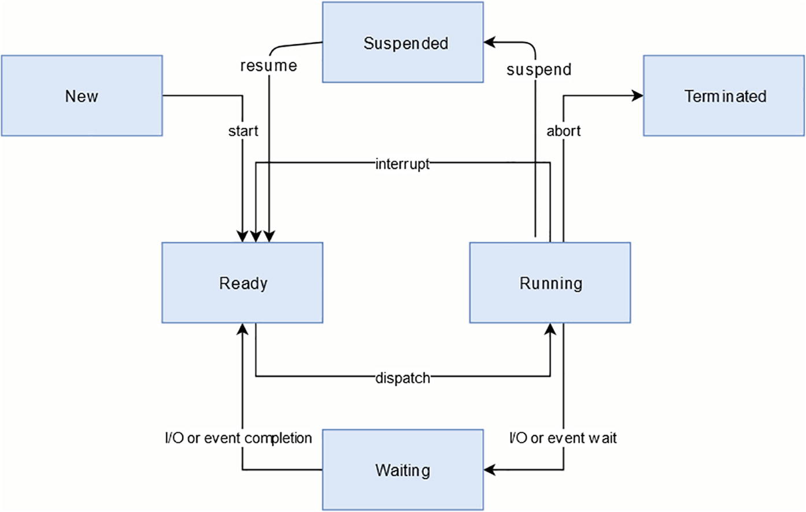

# Zephyr RTOS Embedded C Programming

### CHAPTER 1. An Introduction 

人们通常会对硬实时系统与软实时系统进行区分。在硬实时系统中，如果响应所需的时间超过了某个规定的时长，即被视为一种错误。而在软实时系统中，响应时间则是在统计学意义上加以解读的：即在绝大多数情况下，系统都能满足既定的完成时限要求；但偶尔也会出现无法满足的情况。

典型的裸机多任务处理通常结合了两种机制：一个用于处理非时间关键型任务的“超级循环”（Superloop），以及在中断服务程序中执行的时间关键型任务。经典的 Arduino IDE 也遵循了这一模式。

OSALs supported by Zephyr are POSIX and CMSIS v2. 

### CHAPTER 2. Mutitasking and Interprocess Communication and Synchronization Concepts and Patterns

##### Tasks

有多种调度策略可选，如下：
- Thread priority–based preemptive multitasking where a running lower priority thread can be preempted by a higher priority thread when the
conditions needed for that thread to run have been met 
- Cooperative multitasking where threads decide when to pause so that other threads have a chance to run 
- Round-robin scheduling where threads are given a slice of time in which to run in sequence - And other variations

系统创建的初始任务
The kinds of system tasks provided by the kernel can include tasks for handling kernel startup, an idle task that uses up CPU cycles when there is no
work to do, a logging task that logs system message to some logging system, an exception-handling task that runs when exceptions are detected, and, when
debugging code, a debug agent task. In systems that must minimize energy consumption, the idle task may also be responsible for putting the system into a
low power mode/sleep mode.

多任务系统在Zephyr里的任务状态

以一个高优先级的任务初始化各设备，然后回收自己
A common scenario involving a “run-to-completion” task is that it is a high priority task that initializes and starts up a set of tasks associated with the
application and then ends itself. Most tasks in an application are “infinite loop tasks.”

在使用二值信号量来实现互斥访问时，最好予以避免，而应改用互斥锁。这是因为在诸如 Zephyr 之类的现代实时操作系统（RTOS）中，互斥锁实现了“优先级继承”机制；该机制能够防止“优先级反转”现象的发生——即低优先级进程因占用了高优先级进程所需的资源，从而实际上阻碍了高优先级进程的运行。现代互斥锁所提供的另一项重要特性是其具备递归功能，从而能够防止某些死锁局面的出现，这一点我们将在后续内容中进一步探讨。

##### Binary Semaphore

二值信号量仅有两个可能的取值：0 和 1。当二值信号量未被任何任务持有时尚，其取值为 1；而当某任务获取该信号量时，其取值即被设为 0。只要信号量的取值为 0，其他任何任务便无法获取该信号量。

在实际应用中，二值信号量属于一种全局资源——由所有有需求的任务共享；此外，允许由并非最初获取该信号量的任务来释放该信号量。正是任务之间对信号量使用的这种协同调度机制，赋予了信号量以其应有的效能。

