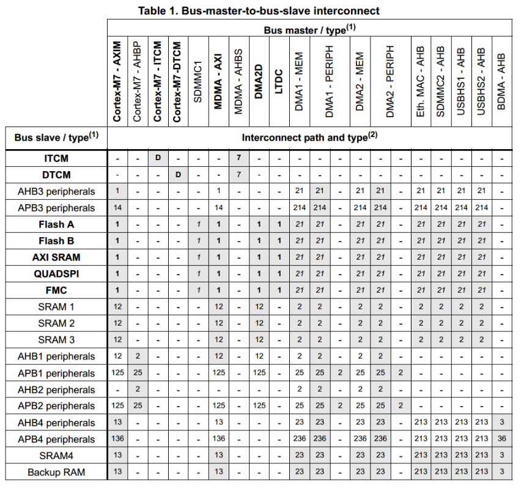

## 总线框架

https://www.armbbs.cn/forum.php?mod=viewthread&tid=32844

> 1. 加粗字体是64位总线，普通字体是32位总线。
> 2. 访问通路
>
>   任何有数值的 = 都是可以访问的，
>   “-” = 表示不可访问，
>   灰色阴影的 = 有实用价值的访问通路
>
> 3. 表格中具体数值所代表的含义
>
>   D=direct,
>   1=via AXI bus matrix,
>   2=via AHB bus matrix in D2,
>   3=via AHB bus matrix in D3,
>   4=via AHB/APB bridge in D1,
>   5=via AHB/APB bridge in D2,
>   6=via AHB/APB bridge in D3,
>   7=via AHBS bus of Cortex-M7,
>   多个数值组合 = 互连路径以数字的顺序经过多个矩阵或/和桥
>
> 4. 总线访问类型
>
>   普通字体 = 32位总线，
>   斜体 = 32位总线主机端/ 64位总线从机端，
>   粗体= 64位总线