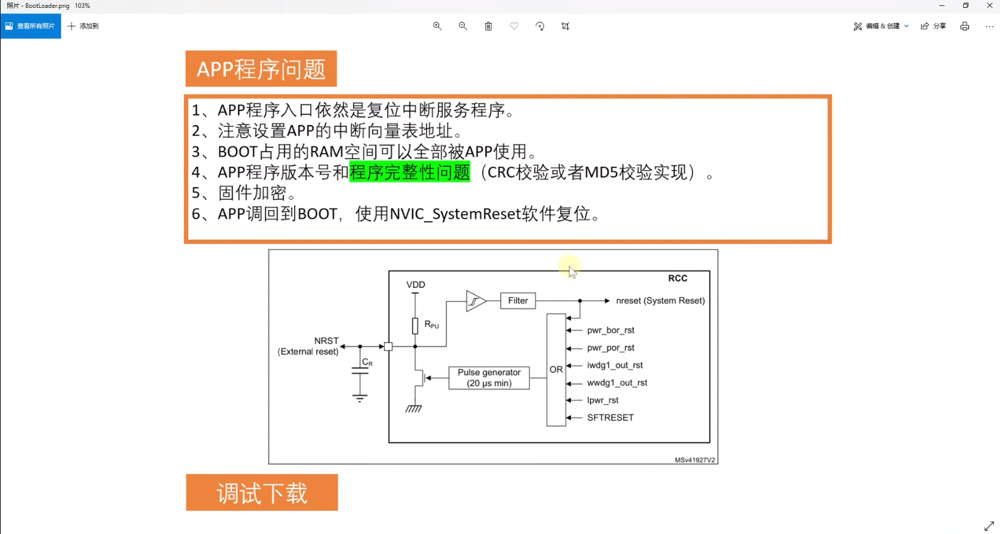

## Boot-up sequence

**Summary**

What is the boot-up sequence for Cortex-M3?

**Answer**[ARM官方回答](https://developer.arm.com/documentation/ka001328/latest)

The Cortex-M3 can only boot from address 0x0 from reset, however the vector table can be relocated during program execution, by writing to the Vector Table Offset Register at address 0xE000ED08.

The boot-up sequence for M3 is different to traditional ARM cores, in that the first fetch from address 0x0 is the initial value of the SP, the second value is reset vector, i.e. the starting address of program code. The other thing to note is that the vector table entries for Cortex-M3 are address values and not branch instructions like traditional ARM cores. Also creating a table entry with bit [0] clear generates an INVSTATE fault on the first instruction of the handler corresponding to this vector.

## 概述

> 在M7内核中就不存在这个问题，它将0x0000_0000分配给ITCM_RAM空间使用了

## NAND存储、U盘、SD卡升级

### APP

#### 1.修改中断向量表地址

> 在system文件中修改中断向量表的偏移，与连接设置中的地址对应一下

#### 2.在app程序文件末尾增加CRC校验

## AES加密

## CANFD、I2C、SPI和串口的固件更新实现

## 成熟解决方案（类mcuboot）

> If an application needs to update itself, especially in embedded systems, careful planning is required to ensure reliability and prevent the device from ending up in an unusable state. The process generally involves a bootloader, the current application, and the new application (update). Here’s a high-level overview of how an application might update itself, leveraging the bootloader and handling headers for versioning and validation:
>
> ### Step 1: Initial Setup
>
> 1. **Bootloader:** A small piece of code that runs at startup, responsible for initializing hardware and deciding whether to launch the main application or perform firmware updates. It should be capable of validating application integrity and compatibility using the header information.
>    
> 2. **Application Header:** Contains metadata about the application, including version, size, and a checksum or hash for integrity checks.
>
> 3. **Application:** The main firmware running on the device, which includes functionality to receive new firmware images (e.g., via OTA updates) and trigger the update process.
>
> ### Step 2: Receiving the Update
>
> 1. The application receives a new firmware image, which includes a new header with updated metadata (version, size, checksum).
>    
> 2. The application stores the new firmware in a designated update partition or area in the device's memory. This might be a separate flash memory region not currently used by either the bootloader or the running application.
>
> ### Step 3: Initiating the Update
>
> 1. After successfully receiving and optionally verifying the new firmware's integrity (e.g., by checking the checksum against the one in the header), the application can signal the bootloader to initiate the update process. This can be done by setting a flag in a shared, non-volatile memory location or by using a specific command if the bootloader supports it.
>
> ### Step 4: Switching to the Bootloader
>
> 1. The application then performs a system reset to restart the device.
>
> 2. The bootloader runs first, checks the flag or command indicating an update is pending, and reads the new application's header to verify its integrity and compatibility (e.g., using the version and checksum).
>
> ### Step 5: Installing the Update
>
> 1. If the new application is valid, the bootloader proceeds to replace the old application with the new one. This might involve copying the new application from the update partition to the primary application partition or simply changing pointers if the system is designed to allow booting from multiple partitions.
>
> 2. The bootloader updates any necessary metadata or flags to indicate the new application version and resets the update flag.
>
> 3. Finally, the bootloader jumps to the new application.
>
> ### Step 6: Post-Update Cleanup
>
> 1. The new application may perform additional initialization tasks, verify that the update was successful, and clean up the update partition if necessary.
>
> 2. Optionally, the application can report the update status to a remote server for tracking and verification purposes.
>
> ### Implementing Self-Validation or Rollback
>
> - **Self-Validation:** Upon startup, the application can use its header information to perform a self-check, verifying its integrity (e.g., using the checksum). If the self-check fails, it can request the bootloader to revert to a previous version if available.
>
> - **Rollback:** The bootloader must support rollback functionality, keeping a copy of the previous application version or allowing booting from a secondary partition. In case the new application fails or signals an error, the bootloader can switch back to the previous version.
>
> ### Security Considerations
>
> Self-updating systems must incorporate security measures to prevent unauthorized firmware updates, which could include:
>
> - Securely encrypting firmware images and using digital signatures to verify their authenticity.
> - Implementing secure boot mechanisms to ensure that only trusted code runs on the device.
> - Using secure communication channels for receiving firmware updates.
>
> This process involves multiple components (bootloader, application, update mechanism) working together, each responsible for different parts of the update process. Proper testing and fail-safes are crucial to ensure reliability and prevent bricking the device.