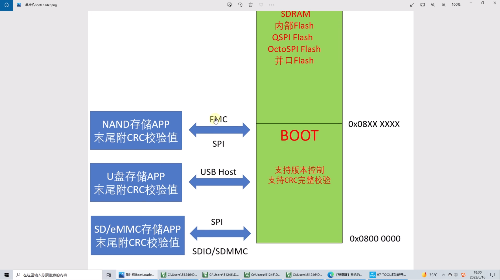
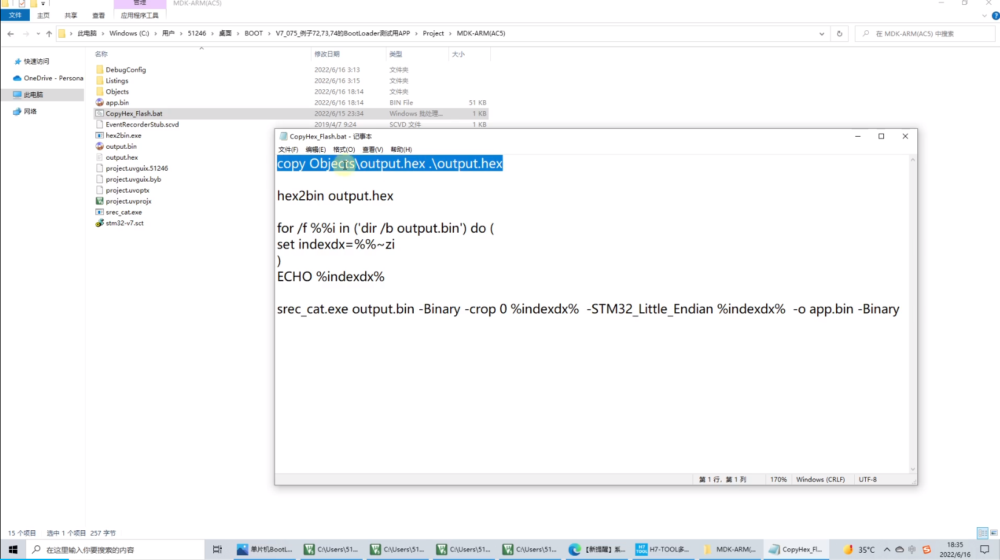

## Boot-up sequence

**Summary**

What is the boot-up sequence for Cortex-M3?

**Answer**[ARM官方回答](https://developer.arm.com/documentation/ka001328/latest)

The Cortex-M3 can only boot from address 0x0 from reset, however the vector table can be relocated during program execution, by writing to the Vector Table Offset Register at address 0xE000ED08.

The boot-up sequence for M3 is different to traditional ARM cores, in that the first fetch from address 0x0 is the initial value of the SP, the second value is reset vector, i.e. the starting address of program code. The other thing to note is that the vector table entries for Cortex-M3 are address values and not branch instructions like traditional ARM cores. Also creating a table entry with bit [0] clear generates an INVSTATE fault on the first instruction of the handler corresponding to this vector.

## 概述

> 在M7内核中就不存在这个问题，它将0x0000_0000分配给ITCM_RAM空间使用了

## NAND存储、U盘、SD卡升级

### APP

#### 1.修改中断向量表地址

> 在system文件中修改中断向量表的偏移，与连接设置中的地址对应一下

#### 2.在app程序文件末尾增加CRC校验

## AES加密

## CANFD、I2C、SPI和串口的固件更新实现

