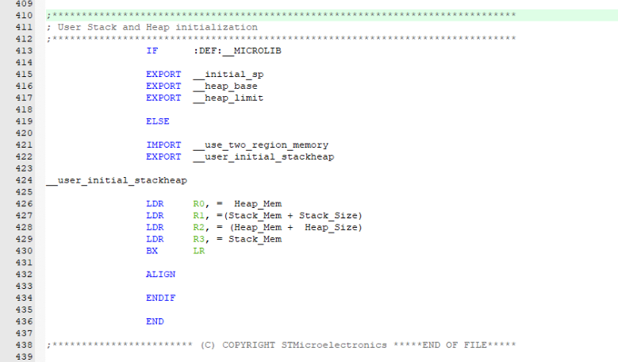
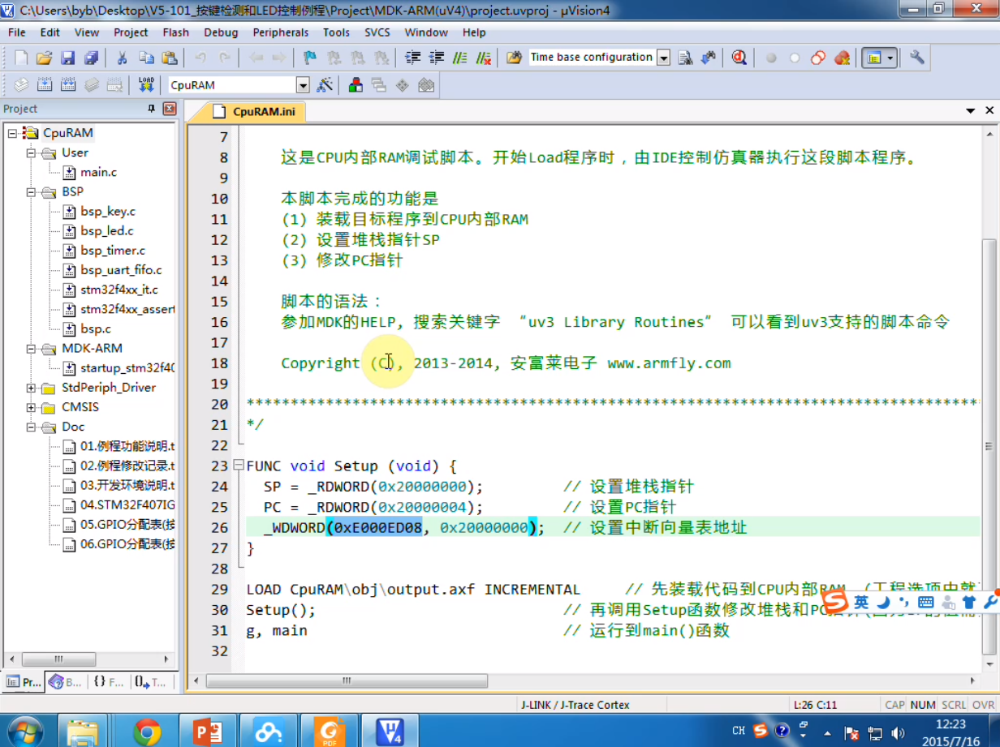

## Cortex-M简介

DSP扩展单元主要增加了一些DSP指令，算法比如FIR，FFR,IIR,FFT等。FPU是浮点数处理单元

> 哈佛结构：数据和指令是分开的，有数据总线和指令总线，可以同时进行访问
>
> 冯诺依曼结构：数据和指令是在一起的，不能同时访问

> 芯片厂商从ARM公司购买了芯片的M3或M4内核之后，购买了这个内核还不行，芯片还需要加很多外设。像模数/数模转换模块，或者SRAM还有FLASH,都要添加相应的**IP核**。然后芯片厂商通过这些内部的CPU核加上外部组件的IP核，最终通过**流片**形成一个真正的芯片。*流片*（Tape Out），是指像流水線一樣通過一系列工藝步驟製造芯片，該詞在集成電路設計領域，“*流片*”指的是“試生產”。流片也很麻烦，费用几十万到几百万，可分为多少纳米的工艺。

## STM32简介

> In the context of software development, especially in embedded systems, DSP (Driver Support Package) and BSP (Board Support Package) are terms used to describe software components that facilitate the use of hardware.
>
> ### DSP (Driver Support Package)
>
> A Driver Support Package typically includes a set of drivers that operate at a lower level than the BSP. These drivers are responsible for managing the communication between the operating system and a specific hardware device. A DSP may include:
>
> - Peripheral drivers for components such as UARTs, SPI, I2C, etc.
> - Drivers for internal components like DMA controllers or timers.
> - Low-level code that directly interfaces with hardware registers.
>
> The DSP is usually closer to the hardware, dealing with the actual data transfers and signaling.
>
> ### BSP (Board Support Package)
>
> A Board Support Package is a layer of software that includes all of the system-level drivers, startup code, and other necessary libraries to boot an operating system and support a specific board or hardware platform. The BSP often includes:
>
> - Bootloader, which initializes the hardware and loads the operating system.
> - Device drivers from the DSP, along with any additional drivers for board-specific features.
> - Operating system adaptations or configurations specific to the board.
> - Memory management configurations, including setting up the memory map.
> - CPU or core initialization code and interrupt handling.
>
> The BSP makes sure that the operating system can run on the hardware by taking care of all the system-specific details. It acts as the foundation upon which the operating system and application code are built.
>
> ### Comparison
>
> While a BSP is comprehensive and includes everything needed to support a particular hardware platform or board, a DSP is usually a subset of a BSP, focusing solely on the drivers for specific hardware devices. The terms can sometimes be used interchangeably or vary in meaning depending on the context or the manufacturer's definitions, but generally, BSP is the broader term that encompasses the DSP within it.

## 板级软硬件

> VBAT：电池供电，也就是电子供电，主要给RTC部分供电，电压为1.6-3.3V

## 内存映射

>  arm在授权之前是给了芯片的内存分配的粗线条，由芯片厂商具体定义细分

## 工程文件创建

勾选上微库，有利于printf函数中fputc的重定义，避免出问题

勾选用于下载的hex文件

## 标准固件库

> 一定要包含这个cortex-m3核心头文件路径

> Device文件夹不是ARM提供的，而是ST自己提供的

> 因为ARM是授权给每个芯片厂商IP核，授权之后每个芯片厂商在他这个IP核的基础之上做自己的外设。而且他这个IP核也不是原封不动的直接用，IP核也是可以裁剪的，还可以在这个IP核的基础之上做一定的修改。如果说大家使用了不同的芯片厂商的Cortex-M内核，比如都用的M3内核，可以认为这些IP核他们内核一样的，基本上做一些内核的操作基本上都是兼容的。稍微有一些区别，大部分都是兼容的。这个就是CMSIS优势，深入到内核层之后，更换其他厂商也能兼容。

## 启动代码

> 启动时cortex-M3内核处于handler mode

> 如果使用了微库，则将`__initial_sp`,`__heap_base`,`__heap_limit`三个标签地址暴露给`__main`函数调用。如果没有使用微库，则是使用的C标准库，则使用`ELSE`到`END`部分代码

## Boot启动方式

> system memory:出厂前，STM32芯片里面内嵌了一个bootloader

> 从SRAM启动需要改四处配置：
>
> 1. 更改启动地址为0x2000_0000
> 2. 添加宏定义`VECT_TAB_SRAM`
> 3. 添加`./CpuRAM.ini`配置文件，因为我们的开发板不支持上电在SRAM中启动
> 4. 取消`target->utilities->Use Debug Driver and Update Target before Debugging`,因为不需要把程序下载到Flash里面
>
> `0xE000_ED08`为cortex内核的一个寄存器，通过这个寄存器就可以设置这个中断向量表的首地址

> 在stm32 program manual编程手册中，有内核外设的介绍，其中就有中断向量表偏移寄存器

> 该宏定义在`SystemInit()`函数中

> **Wath is ISP?**
>
> ISP stands for In-System Programming. It is a technique used in the field of embedded systems for programming the non-volatile memory (usually Flash memory) of microcontrollers and other programmable devices after they have been installed or assembled into a system. This allows for the firmware of the device to be upgraded or modified without needing to remove the microcontroller from its circuit.
>
> ### Key Features of ISP:
>
> - **Convenience:** Firmware updates can be performed directly on the final product, eliminating the need to remove the device's microcontroller or other components for programming.
> - **Flexibility:** Allows for easy application updates, bug fixes, and feature enhancements to be deployed after the product has been manufactured and distributed.
> - **Cost-Effective:** Reduces the need for additional hardware for programming after assembly, lowering the overall production costs.
> - **Recovery:** Enables the recovery of devices that have been bricked or are malfunctioning due to software issues.
>
> ### How ISP Works:
>
> 1. **Connection:** A connection is established between the microcontroller and a programmer or computer, often through standard interfaces like UART, SPI, I2C, USB, or even wireless protocols.
> 2. **Bootloader:** The microcontroller needs to have a bootloader program in its memory. The bootloader is a small piece of code that runs on startup and decides whether to jump to the main application code or enter a programming mode.
> 3. **Programming:** If the bootloader decides to enter programming mode (often determined by a specific signal or command), it then communicates with the external programmer to receive the new firmware and write it to the device's non-volatile memory.
> 4. **Restart:** Once the programming is complete, the device is typically reset, and the new firmware starts running.
>
> ### Applications of ISP:
>
> - **Firmware Updates:** Deploying new firmware versions to fix bugs or add features.
> - **Configuration:** Setting or modifying device parameters or settings stored in non-volatile memory.
> - **Field Service:** Updating the firmware of devices deployed in the field without the need for specialized equipment or returning the device to the manufacturer.
>
> ISP is a critical feature for modern embedded systems, providing the flexibility and maintainability required for today's fast-paced and evolving technological landscape.

> In the context of microcontrollers, UDS, IAP, WWDG, and IWDG refer to specific features and functionalities:
>
> ### UDS: Unified Diagnostic Services
> UDS stands for Unified Diagnostic Services. It is a diagnostic communication protocol used in the automotive industry, defined by the international standard ISO 14229. UDS is used for diagnostic communication between a diagnostic tool (e.g., a tester) and the vehicle’s electronic control units (ECUs). It provides a standardized way to perform various diagnostic and reprogramming tasks such as reading and erasing error codes, retrieving real-time data, and updating the firmware of ECUs.
>
> ### IAP: In-Application Programming
> IAP stands for In-Application Programming. It is a feature that allows a microcontroller to reprogram its own non-volatile memory (like Flash memory) while the application is running. This is often used to update the firmware of an embedded device in the field without the need for a dedicated programmer or bootloader. IAP can be initiated by the application itself or via communication protocols like UDS, allowing for updates over networks such as CAN, Ethernet, or even wireless.
>
> ### WWDG: Window Watchdog Timer
> WWDG stands for Window Watchdog Timer, which is a hardware feature found in some microcontrollers, like those from STMicroelectronics. The WWDG is designed to reset the system in case of a malfunction, such as when the software becomes unresponsive or gets stuck in a loop. The "window" part of the WWDG refers to a timing window during which the watchdog must be refreshed (or "kicked") to prevent a system reset. If the watchdog is refreshed too early or too late (outside of this window), the WWDG will trigger a system reset.
>
> ### IWDG: Independent Watchdog Timer
> IWDG stands for Independent Watchdog Timer. Similar to the WWDG, the IWDG is also a hardware feature used to reset the system if the software becomes unresponsive. However, unlike the WWDG, the IWDG typically runs off a separate clock source and is independent of the main system clock. This makes it more reliable in systems where the main clock might fail or become unstable. The IWDG does not have a window; it simply must be refreshed at regular intervals to prevent it from resetting the system.
>
> ### Comparison: WWDG vs IWDG
> - **Clock Source:** WWDG usually runs on the system clock, whereas IWDG often has its own dedicated low-speed clock.
> - **Window vs. Regular Kick:** WWDG requires service within a specific window, while IWDG needs regular kicking at any time before it times out.
> - **Response to Clock Failure:** IWDG is more robust against system clock failure.
> - **Use Cases:** WWDG is used when the timing of the application is critical, while IWDG is used for general system health monitoring.
>
> When choosing between WWDG and IWDG, it depends on the specific requirements of the application and the level of safety and robustness required. Some systems may even use both watchdogs in tandem for an additional layer of protection.

## Boot更新固件

> 设置分散加载的配置文件[https://www.armbbs.cn/forum.php?mod=viewthread&tid=109595]

