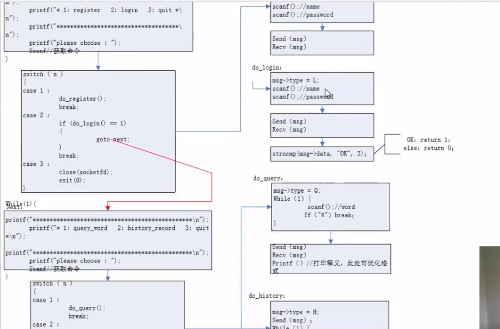
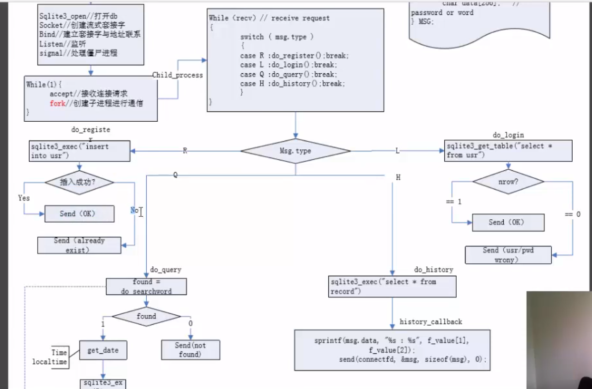
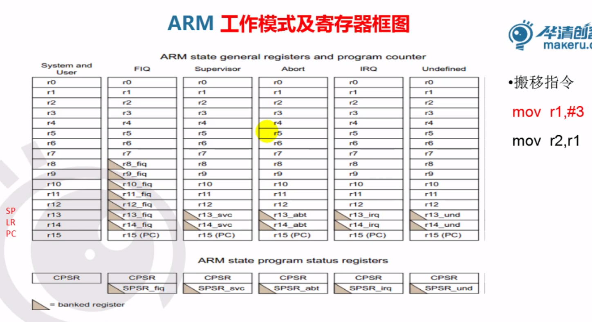
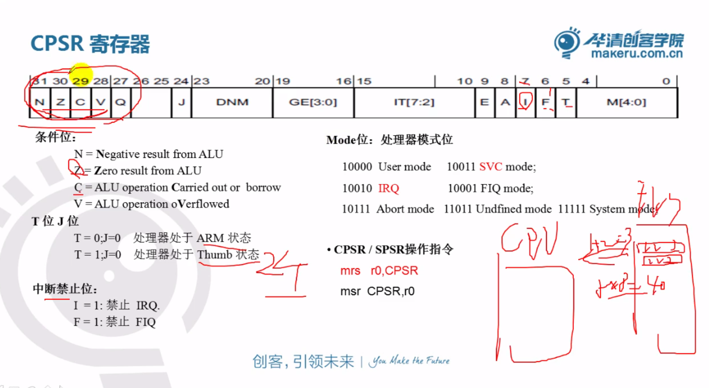

# 网络

## 网络采用分层的思想

    1. 每一层实现不同的功能，对上层的数据做透明传输
    2. 每一层向上层提供服务，同时使用下层提供的服务

各层典型的协议：

1. 网络接口与物理层

    MAC地址： 48位全球唯一，网络设备的身份标识（标识网卡身份）

    ARP/RARP:
        ARP: 地址解析协议， IP地址----> MAC地址
        RARP： MAC地址---->IP地址

    PPP协议（电话线上网）：拨号协议（GPRS/3G/4G）

2. 网络层：
    IP： Internet protocol(分为IPV4和IPV6)
    ICMP: Internet控制管理协议，ping命令属于ICMP
    IGMP： Internet分组管理协议，广播，组播

3. 传输层：
    TCP：（Transfer Control protocol,传输控制协议）提供面向连接的，一对一的可靠数据传输的协议
    即数据无误，数据无丢失，数据无失序，数据无重复到达的通信
    UDP：（user Datagram Protocol,用户数据报协议） 提供不可靠，无连接的尽力传输协议
    SCTP： 是可靠传输，是TCP的增强版，它能实现多主机，多链路的通信

4. 应用层
    网页访问协议： HTTP/HTTPS
    邮件发送接受协议：POP3（收）/SMTP(发)，IMAP（可接收邮件的一部分）
    FTP,文件传输
    Telnet/SSH: 远程登陆
    嵌入式相关：
        NTP：网络时钟协议
        SNMP:简单网络管理协议（实现对网络设备集中式管理）
        RTP/RTSP:用传输音视频的协议（安防监控）

|Ethernet header(14bytes)|IP header(20bytes)|TCP header(20bytes)|APP header|user data|Ethernet trailer(CRC32,4bytes,硬件产生和校验)|
46-1500bytes

MTU： Max Transfer Unit 最大传输单元（和网络类型相关）
例如：以太网：MTU = 1500
MSS： Maximum Segment Size 最大段大小 网络类型，线路，系统特性相关（实际数据和应用层包头的大小）此例中为1460

## TCP/IP网络编程预备知识

### Socket

- 是一个应用编程接口
- 是一种特殊的文件描述符(everything in Unix is a file),代表着网络编程的一种资源
- 并不仅限于TCP/IP协议
- 面向连接(Transmission Control Protocol - TCP/IP)
- 无连接 (User Datagram Protocol - UDP 和 Inter-network Packet Exchange IPX)

**套接字类型：**

- 流式套接字（SOCK——STREAM）：提供了一个面向连接，可靠的数据传输服务，数据无差错，无重复的发送且按发送的顺序接受。内置流量控制，避免数据流淹没慢的接收方。数据被看作是字节流，无长度限制。（唯一对应TCP）
- 数据报套接字（SOCK——DGRAM）：提供无连接服务。数据包以独立的数据包的形式被发送，不提供无差错保证，数据可能丢失或重复，顺序发送，可能乱序接收。（唯一对应UDP）
- 原始套接字（SOCK——RAM）：可以对较低层次协议如IP,ICMP直接访问。（对应多个协议，发送穿透了传输层）

### IP地址

IP地址分为IPV4和IPV6
    IPV4：采用32位的整数来表示
    IPV6：采用了128位整数来表示
    mobileIPV6：local IP（本地注册的IP）， roam IP（漫游IP）

IPV4地址：
    点分形式： 192.168.7.246
    32位整数

特殊IP地址：
    局域网IP：192.XXX.XXX.XXX 10.XXX.XXX.XXX
    广播IP： xxx.xxx.xxx.255, 255.255.255.255(全网广播)
    组播IP：224.xxx.xxx.xxx~239.xxx.xxx.xxx

### 端口号

    16位的数字（1-65535）
        Well Known Ports： 1～1023 （FTP:21, SSH:22, HTTP:80, HTTPS:443）
        保留端口： 1024～5000（不建议使用）
        可以使用的： 5000～65535
**TCP端口和UDP端口是相互独立的**

网络里面的通信是由IP地址+端口号来决定

### 字节序

字节序是指不同的CPU访问内存中的**多字节数据**时候，存在大小端问题
低对低： 小端   低端内存存放低端数据
低对高： 大端   低端内存存放高端数据

一般来说：
    X86/ARM： 小端
    powerpc/mips, ARM作为路由器时，大端模式

    网络传输的时候采用大端模式
    
    本地字节序，网络字节序

- 主机字节序到网络字节序
    - u_long htonl(u_long hostlong); (long 4bytes)
    - u_short htons(u_short short);  (short 2bytes)
- 网络字节序到主机字节序
    - u_long ntohl(u_long hostlong);
    - u_short ntohs(u_short short);

IP地址转换函数：
in_addr_t inet_addr(const char *cp);
cp :点分形式的ip地址，结果是32位整数（内部包含了字节序的转换，默认是大端）
特点： 1.仅适应于IPV4
        2.当出错时，返回-1
        3.此函数不能用于255.255.255.255的转换

inet_pton()/inet_ntop()

```c
#include <arpa/inet.h>

int inet_pton(int af, const char *src, void *dst);
```

特点： 1.适用于IPV4和IPV6
        2.能正确的处理255.255.255.255的转换问题
参数：
    1.af:地址协议族（AF_INET或AF_INET6）
    2.src:是一个指针（填写点分形式的IP地址[主要指IPV4]）
    3.dst:转换的结果给到dst

RETURN VALUE
       inet_pton() returns 1 on  success  (network  address  was  successfully  con‐
       verted).  0 is returned if src does not contain a character string represent‐
       ing a valid network address in the specified address family.  If af does  not
       contain  a valid address family, -1 is returned and errno is set to EAFNOSUP‐
       PORT.

inet_ntop(): 把IPV4/IPV6的网络字节序的地址变成本地的字符串形式的IP地址

```c
const char *inet_ntop(int af, const void *restrict src,
                        char dst[restrict .size], socklen_t size);
```
特点： 1.适用于IPV4和IPV6
        2.能正确的处理255.255.255.255的转换问题
参数：
    1.af:地址协议族（AF_INET或AF_INET6）
    2.src:是一个指针（32位网络字节序的IP地址）
    3.dst:输出结果为点分形式的IP地址[主要指IPV4]

RETURN VALUE
       On  success, inet_ntop() returns a non-null
       pointer to dst.  NULL is returned if  there
       was  an  error,  with errno set to indicate
       the error.

### TCP编程api

1.socket()

```c
#include <sys/socket.h>

int socket(int domain, int type, int protocol);
```

参数：
    1. domain
        AF_INET      IPv4 Internet protocols                    ip(7)
        AF_INET6     IPv6 Internet protocols                    ipv6(7)
        AF_UNIX      Local communication                        unix(7)
        AF_LOCAL     Synonym for AF_UNIX
        AF_NETLINK   Kernel user interface device               netlink(7)
        AF_PACKET    Low-level packet interface                 packet(7)
    2.type:
        SOCK_STREAM: 流式套接字，唯一对应于TCP
        SOCK_DGRAM: 数据报套接字，唯一对应着UDP
        SOCK_RAW： 原始套接字
    3.protocol: 一般为0,原始套接字编程时需填充

RETURN VALUE
       On  success,  a file descriptor for the new socket is returned.  On error, -1 is
       returned, and errno is set to indicate the error.
    成功时返回文件描述符，出错时返回为-1

2.bind()

```c
       #include <sys/socket.h>

       int bind(int sockfd, const struct sockaddr *addr,
                socklen_t addrlen);
```

参数：
    sockfd: 通过socket()函数拿到的fd
    addr： 采用struct sockaddr的结构体变量的地址
    addrlen： 地址长度

3.listen()

```c
       #include <sys/socket.h>

       int listen(int sockfd, int backlog);
```

参数：
    sockfd：通过socket()函数拿到的fd
    backlog:同时允许几路客户端和服务器进行正在连接的过程（正在三次握手）
            一般填5,测试得知，ARM最大为8
> 内核中服务器的套接字fd会维护2个链表
    1.正在三次握手的客户端链表（数量=2*backlog+1）
    2.已经建立好连接的客户端链表（已经完成3次握手分配好了newfd）

返回值：
    RETURN VALUE
       On success, zero is returned.  On error, -1 is returned, and errno is set to indicate the error.

4.accept() 阻塞等待客户端连接请求

```c
       #include <sys/socket.h>

       int accept(int sockfd, struct sockaddr *_Nullable restrict addr,
                  socklen_t *_Nullable restrict addrlen);
```

参数：
    sockfd: 经过前面socket()创建并通过bind(),listen(),设置过的fd
    addr和addrlen:

返回值：
    RETURN VALUE
       On  success,  these  system calls return a file descriptor for the accepted socket (a nonnegative integer).  On error, -1 is returned, errno is set to indicate the error, and addrlen is left  unchanged.

5.客户端的连接函数

```c
       #include <sys/socket.h>

       int connect(int sockfd, const struct sockaddr *addr,
                   socklen_t addrlen);
```

connect()函数和服务器bind()函数类似

返回值
RETURN VALUE
       If the connection or binding succeeds, zero is returned.  On error, -1 is returned, and errno is set to indicate the error.

参数：
    sockfd: 通过socket()函数拿到的fd
    addr： 采用struct sockaddr的结构体变量的地址
    addrlen： 地址长度

6.网络发送和接受数据
网络发送数据：send()/write()

```c
    #include <sys/socket.h>
    ssize_t send(int sockfd, const void buf[.len], size_t len, int flags);

    #include <unistd.h>
    ssize_t write(int fd, const void buf[.count], size_t count);
```

send()比write()多一个参数:
    flags:
    一般填写0,此时和write()作用一样
    MSG_DONWAIT: 当内核缓冲区满的时候默认阻塞，该宏取消阻塞 Enables  nonblocking  operation;
    MSG_OOB: 用于发送TCP类型的带外数据(out-of-band)

网络中接收数据： recv()/read()

```c
    #include <sys/socket.h>
    ssize_t recv(int sockfd, void buf[.len], size_t len,
                    int flags);

    #include <unistd.h>
    ssize_t read(int fd, void buf[.count], size_t count);
```

recv()比read()多一个参数:
    flags:
    一般填写0,此时和read()作用一样
    MSG_DONWAIT: 当内核缓冲区满的时候默认阻塞，该宏取消阻塞 Enables  nonblocking  operation;
    MSG_OOB: 用于发送TCP类型的带外数据(out-of-band)
    MSG_PEEK:读取数据之后不将其从内核缓冲区中移除，再次读取和第一次读取数据一样

### UDP编程api

UDP编程应用：实时的音视频传输，DNS的域名解析包

1.sendto()
```c
    #include <sys/socket.h>
    ssize_t sendto(int sockfd, const void buf[.len], size_t len, int flags,
                    const struct sockaddr *dest_addr, socklen_t addrlen);
```

2.recvfrom()
```c
    #include <sys/socket.h>
    ssize_t recvfrom(int sockfd, void buf[restrict .len], size_t len,
                    int flags,
                    struct sockaddr *_Nullable restrict src_addr,
                    socklen_t *_Nullable restrict addrlen);
```

## 多路复用

基本常识：
    linux中每个进程最多可以打开1024个文件，最多有1024个文件描述符
    文件描述符的特点：
        1. 非负整数
        2. 从最小可用的数字来分配
        3. 每个进程启动时默认打开0,1,2三个文件描述符（标准输入，标准输出，标准错误输出）
多路复用针对不止套接字fd,也针对普通文件描述符
    fd_set (maxfd + 1) 取最小的4个字节的整数倍

步骤：

1. 把关心的文件描述符加入到集合中(fd_set)
2. 调用select()/poll()函数去阻塞等待集合fd_set中的一个或多个文件描述符中有数据
3. 当有数据时，退出select()阻塞
4. 依次判断哪个文件描述符有数据
5. 依次处理有数据的文件描述符的数据

```c
void FD_ZERO(fd_set *fdset);    // 清零集合
void FD_SET(int fd, fd_set *fdset); // 把fd加入集合
void FD_CLR(int fd, fd_set *fdset); // 从集合中清除fd
int FD_ISSET(int fd, fd_set *fdset);    // 判断fd是否在set中

int select(int nfds, fd_set *_Nullable restrict readfds,
            fd_set *_Nullable restrict writefds,
            fd_set *_Nullable restrict exceptfds,
            struct timeval *_Nullable restrict timeout);

struct timeval {
    long tv_sec;    /* seconds */
    long tv_usec;   /* microseconds */
}
```

参数：
    nfds： 最大的文件描述符加1
    readfds: 读集合
    writefds： 写集合
    exceptfds： 异常集合
    timeout： 超时

    一般：填读集合，写集合填NULL，异常集合（带外数据）一般填NULL,

调用select()函数后，fd_set由之前用户设置的要监控的文件描述符集合，内核改为有数据的文件描述符集合（为设置集合的子集）

## wireshark抓包工具

### Ethernet头


MAC地址为48位全球唯一的地址

[Ethernet frame](https://en.wikipedia.org/wiki/Ethernet_frame)


### IP头

[Internet Protocol version 4](https://en.wikipedia.org/wiki/Internet_Protocol_version_4)


### TCP头

[Transmission Control Protocol](https://en.wikipedia.org/wiki/Transmission_Control_Protocol)

TCP是一种**面向连接的，可靠的**数据传输


一 TCP的可靠传输：通过确认和重发机制

	1. TCP把所有要发送的数据进行编号（每一个字节用一个号）
	1. 发送时从当前的数据位置，发送window大小的数据

二 面向连接


三次、四次握手注意点：

1. 一定标注客户端和服务器
2. 三次握手的连接必须是由客户端发起（四次握手客户端和服务器都可以发起）
3. SYN, ACK, FIN等标志符号应该写上
4. 建立连接必须是三次握手，关闭连接三四都可

## 网络属性的设置

```c
       #include <sys/socket.h>

       int getsockopt(int sockfd, int level, int optname,
                      void optval[restrict *.optlen],
                      socklen_t *restrict optlen);
       int setsockopt(int sockfd, int level, int optname,
                      const void optval[.optlen],
                      socklen_t optlen);
```

level指定控制套接字的层次，可以取三种值：

​	1） SOL_SOCKET: 通用套接字选项 （应用层）

​	2） IPPROTO_TCP：TCP选项	（传输层）

​	3） IPPROTO_IP: IP选项	（网络层）

​	optname指定控制的方式（选项的名称）


举例：

```c	
/* 允许绑定地址快速重用 */
int b_reuse = 1;
setsockopt(fd, SOL_SOCKET, SO_REUSEADDR, &b_reuse, sizeof(int));
```

```c
       struct timeval {
           time_t      tv_sec;         /* seconds */
           suseconds_t tv_usec;        /* microseconds */
       };
```

举例：

```c
/* 广播数据 */
int b_br = 1;
setsockopt(fd, SOL_SOCKET, SO_BROADCAST, &b_br, sizeof(int));

/* 设置接收超时 */
struct timeval tout;
tout.tv_sec = 5;
tout.tv_usec = 0;
setsockopt(fd, SOL_SOCKET, SO_RCVTIMEO, &tout, sizeof(struct timeval));
```

## 网络超时优化

### 方法1：设置socket的属性SO_RCVTIMEO

```C
struct timeval tv;
tv.tv_sec = 5;
tv.tv_usec = 0;
// 设置接收超时
setsockopt(sockfd, SOL_SOCKET, SO_REVTIMEO, &tv, sizeof(tv));
// 从socket读取数据
recv()/recvfrom()	
```

### 方法二：用select检测socket是否'ready'

```c
struct fd_set rdfs;
while(1) {
    struct timeval tv = {5, 0};
    FD_ZERO(&rdfs);
    FD_SET(sockfd, &rdfs);
    if (select(sockfd+1, &rdfs, NULL, NULL, &tv) > 0) {
        recv()/recvfrom()
    }
}
```

### 方法三：设置定时器（timer），捕捉SIGALRM信号

```C
viod handler(int signo)	{return;}

struct sigaction act;
sigaction(SIGALRM, NULL, &act);
act.sa_handler = handler;
act.sa_flags &= ~SA_RESTART; //清楚掉SIGALRM信号的SA_RESTART
sigaction(SIGALRM, &act, NULL);
alarm(5);
if (recv(...) < 0) ...
```

## 心跳检测

### 方法一：数据交互双方隔一段时间一方发送一点数据到对方

对方给出特定的应答。如超过设定次数大小的时间内还是没有应答，这时候认为异常

### 方法二：改变套接字的属性来实现

```c
int keepAlive = 1;	// 设定KeepAlive
int keepIdle = 5;	// 开始首次KeepAlive探测前的TCP空闭时间
int keepInterval = 5;	// 两次KeepAlive探测的时间间隔
int keepCount = 3;	// 判定断开前的KeepAlive探测次数

setKeepAlive(newfd, keepAlive, keepIdle, keepInterval, keepCount)
    
void setKeepAlive(int sockfd, int attr_on, socklen_t idle_time, socklen_t interval, socklen_t cnt) {
    setsockopt(sockfd, SOL_SOCKET, SO_KEEPALIVE, (const char *)&attr_on, sizeof(attr_on));
    setsockopt(sockfd, SOL_TCP, TCP_KEEPIDLE, (const char *)&idle_time, sizeof(idle_time));
    setsockopt(sockfd, SOL_TCP, TCP_KEEPINTVL, (const char *)&interval, sizeof(interval));
    setsockopt(sockfd, SOL_TCP, TCP_KEEPCNT, (const char *)&cnt, sizeof(cnt));
}
```

## 广播

- 前面介绍的数据包发送方式只有一个接收方，称为单播
- 如果同时发送给局域网中的所有主机，称为广播
- 只有用户数据报（使用UDP协议）套接字才能广播
- 广播地址
  - 以192.168.1.0(255.255.255.0)网段为例，最大的主机地址192.168.1.255代表该网段的广播地址
  - 发送到该地址的数据包被所有的主机接收
  - 255.255.255.255在所有网段中都代表广播地址

### 广播发送

- 创建用户数据报套接字	`fd = socket(AF_INET, SOCK_DGRAM, 0)`
- 缺省创建的套接字不允许广播数据包，需要设置属性
- 接收方地址指定为广播地址
- 指定端口信息，发送数据包

### 广播接收

- 创建用户数据报套接字
- 绑定本机IP地址和端口
  - 绑定的端口必须和发送方指定的端口相同
- 等待接收数据

```c
/* 广播数据 */
int b_br = 1;
setsockopt(fd, SOL_SOCKET, SO_BROADCAST, &b_br, sizeof(int));
```

### 组播

- 单播方式只能发给一个接收方
- 广播方式发送给所有主机，过多的广播会大量占用网络带宽，造成广播风暴，影响正常的通信
- 组播（又称为多播）是一种折中的方式，只有加入某个多组播的主机才能收到数据
- 多播方式既可以发给多个主机，又能避免像广播那样带来过多的负载（每台主机要到传输层才能判断广播包是否要处理）

组播的IP地址：224.0.0.1～239.255.255.254（中间除掉广播）


```c
struct ip_mreq {
    struct in_addr imr_multiaddr;
    struct in_addr imr_interface;
};

/* 加入多播组 */
struct ip_mreq mreq;
bzero(&mreq, sizeof(mreq));
mreq.imr_multiaddr.s_addr = inet_addr("234.3.3.1");
mreq.imr_interface.s_addr = htonl(INADDR_ANY);

setsockopt(fd, IPPROTO_IP, IP_ADD_MEMBERSHIP, &mreq, sizeof(mreq));
```

## UNIX域套接字（unix domain）

- socket同样可以用于本地通信
- 创建套接字时使用本地协议PF_UNIX(或PF_LOCAL)
  - socket(AF_LOCAL, SOCK_STREAM, 0)
  - socket(AF_LOCAL, SOCK_DGRAM, 0)
- 分为流式套接字和用户数据报套接字
- 和其他进程间通信方式相比使用方便、高效
- 常用于前后台进程通信

> 进程间通信：
>
> 1. 进程间的数据共享
>
> ​	管道、消息队列、共享内存、unix域套接字
>
> 易用性：消息队列 > unix域套接字 > 管道 >  共享内存（经常要和信号量一起使用）
>
> 效率： 共享内存 > unix域套接字 > 管道 > 消息队列
>
> 常用： 共享内存、unix域套接字
>
> 2. 异步通信：
>
> ​	信号
>
> 3. 同步和互斥（资源保护）
>
> ​	信号量

```c
       // A UNIX domain socket address is represented in the following structure:

           struct sockaddr_un {
               sa_family_t sun_family;               /* AF_UNIX */
               char        sun_path[108];            /* Pathname */
           };

       // The sun_family field always contains AF_UNIX.  On  Linux,  sun_path  is
       // 108 bytes in size; see also BUGS, below.

```

Unix域套接字的文件路径名（在内存中的文件）：

1. 必须事先不存在
2. 一般给绝对路径
3. 由内核在内存中创建

## 数据库

### SQLite3基本命令

**没有严格的类型检查**

**无法直接删除一列**

1. 系统命令（以.开头）
   1. .schema 查看表的结构图
   2. .databases 查看数据库
   3. .table 查看当前数据库下的表格
2. sql命令
   1. 创建数据表： CREATE TABLE stu(id integer, name str, score interger);
   2. 插入记录： INSERT INTO stu VALUES(1001, 'zhangsan', 80);
   3. 插入部分记录： INSERT INTO stu(id, name) VALUES(1001, 'zhangsan');
   4. 查看记录： SELECT * FROM stu; SELECT id, name FROM stu;
   5. 查看符合要求的记录： SELECT * FROM stu WHERE score=80 AND id=1001; SELECT * FROM stu WHERE score=80 OR id=1001;
   6. 删除一条记录： DELETE FROM stu WHERE name='zhangsan';
   7. 更新一条记录： UPDATE stu SET name = 'wang', score = 80 WHERE id=1001;
   8. 增加一列： ALTER TABLE stu ADD COLUMN address string;
   9. 删除一列的替代方案：
      1. CREATE TABLE stu1 AS SELECT id, name, score FROM stu;
      2. DROP TABLE stu;
      3. ALTER TABLE stu1 RENAME TO stu;

### SQLite编程接口

```c
#include <sqlite3.h>

int sqlite3_open(
  const char *filename,   /* Database filename (UTF-8) */
  sqlite3 **ppDb          /* OUT: SQLite db handle */
);


int sqlite3_close( sqlite3* db );
const char* sqlite3_errmsg(   sqlite3* db );

int sqlite3_exec(
  sqlite3*,                                  /* An open database */
  const char *sql,                           /* SQL to be evaluated */
  int (*callback)(void*,int,char**,char**),  /* Callback function */
  void *,                                    /* 1st argument to callback */
  char **errmsg                              /* Error msg written here */
);
```

## 类有道词典demo





## ARM





### 汇编指令

#### mov

```assembly
.text
mov r13, #5   @ 将十进制5移动到r13中
mov r0, r1
mov r0, r1, LSL#2 @ 将r1中的数字逻辑左移2次
mov r0, r1, LSR#2 @ 将r1中的数字逻辑左移2次
mrs r0, cpsr	@ 将cpsr中的数据移动到r0中
msr cpsr, r0	@ 将r0中的数据移动到cpsr中
.end
```

#### 条件执行

```assembly
@if (a==0) x=0;
@if (a>0) x=x+3;

.text
cmp	r0, #0
moveq	r1, #0
addgt	r1, r1, #3
.end
```

#### 指令机器码

- ARM采用的是32位架构
  - ARM指令集(32-bit)
  - Thumb指令集(16-bit)
- ARM instruction set encoding
  - 指令的机器码(如指令moveq r0, r1	机器码 0x01A00001)

- 立即数合法性  用伪指令 ldr   r0, =0x445501替换
- ARM指令包含条件判断

#### 逻辑指令

```assembly
and r0, r1, #0xFF @ r0 = r1&0xFF
orr r3, r0, #0x0F @ r3 = r0|0x0F
bic r0, r0, #0x03 @ 清除r0中的0号位和1号位
tst r0, #0x20 @ 测试第6位是否为0,为0则Z标志置1
cmp r1, r0   @ 将R1与R0相减做比较，并根据结果设置CPSR的标志位
```

#### 中断管理

打开中断

`MSR` (Move to Status Register) and `MRS` (Move from Status Register) 

CPSR stands for "Current Program Status Register" 

```assembly
mrs r0, cpsr
bic r0, #0xc0
msr cpsr, r0
```

判断当前工作状态是否是ARM状态，是则切换到user工作模式

```assembly
mrs r0, cpsr
tst r0, #0x20
andeq r0, r0, #0xFFFFFFE0
orreq r0, r0, #0x10
msreq cpsr, r0
```

#### 跳转指令

```assembly
b main
bl func @ 调用函数 Link Register (LR, or R14)
beq addr
bne addr @ 当CPSR寄存器中的Z条件码为0时，跳转到该地址处
```

#### 最大公约数

```rust
fn gcd(mut n: u64, mut m: u64) -> u64 {
    assert!(n != 0 && m != 0);
    while m != 0 {
        if m < n {
            let t = m;
            m = n;
            n = t;
        }
        m = m % n;
    }
    n
}
```

```c
int gcd(int a, int b) {
    while(1) {
        if (a==b) break;
        if (a>b){
            a = a-b;
        } else {
            b = b-a;
        }
    }oooooo
    return a;
}
```

