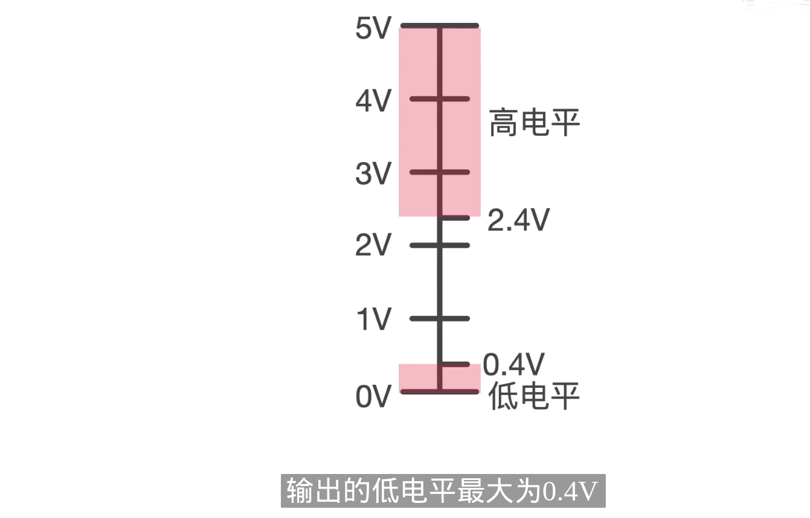

The terms "104" and "61850" refer to specific standards used in the context of power system communication protocols, each serving distinct purposes and addressing different aspects of electrical network operations, automation, and communication.

### IEC 60870-5-104 (IEC 104)

IEC 60870-5-104, commonly referred to as IEC 104, is part of the IEC 60870-5 telecontrol protocol family. It defines a network access protocol for electric power systems, which allows communication between control stations and substations via a standard TCP/IP network. Essentially, IEC 104 is used for transmitting control commands, measurements, and monitoring information over IP networks. It is widely implemented in electrical substation automation and is a key protocol for the communication between control centers and remote locations.

### IEC 61850

IEC 61850 is a comprehensive standard for the design of electrical substation automation systems. It encompasses communication protocols and data models to manage, control, and ensure interoperability between devices within a substation and between substations. IEC 61850 is designed to support the complex systems and networks in modern electrical grids, facilitating not just communication but also ensuring reliability, performance, and security in the electric power industry. This standard covers various aspects of substation automation, including device configuration, data modeling, communication, and system integration.

While both IEC 104 and IEC 61850 are used within electric power systems, IEC 61850 is broader in scope, addressing the interoperability and communication between various substation devices and beyond, while IEC 104 focuses specifically on communication protocols over IP networks for telecontrol purposes. Together, these standards play critical roles in the modernization and efficient operation of electrical power systems, promoting automation, reliability, and interoperability across the grid.

RS-485 and RS-422 are technical standards for electrical characteristics of balanced voltage digital interface circuits. They are used in serial communications systems and define the electrical properties of drivers, receivers, and cables to ensure broad compatibility and interoperability between different devices. Here's a brief overview of each:

### RS-485 (Recommended Standard 485)
RS-485 is a standard defining the electrical characteristics of drivers and receivers for use in serial communications systems. It is widely used for its robustness, flexibility, and ability to handle long distances and high speeds.

- **Topology**: RS-485 supports multi-point configurations, allowing multiple devices (up to 32, or more with repeaters) to communicate on a single bus. It's a two-wire system that can be expanded to four wires for full-duplex communication.
- **Distance and Speed**: It can transmit data up to 4000 feet (about 1200 meters) at speeds up to 10 Mbps, though speed decreases as distance increases.
- **Applications**: RS-485 is used in a wide range of applications including industrial control systems, building automation, networks in electrically noisy environments, and any application requiring multiple devices to communicate over long distances.

### RS-422 (Recommended Standard 422)
RS-422 is a serial communications standard that defines the electrical characteristics of a single-ended (not differential like RS-485) digital signaling circuit. It's designed for point-to-point, or simplex, configurations but can be used in multi-point systems with one transmitter and up to 10 receivers.

- **Topology**: Primarily intended for point-to-point configurations but can support multi-point setups in specific scenarios (one driver with multiple receivers).
- **Distance and Speed**: RS-422 can also achieve long-distance communication up to 4000 feet (about 1200 meters) and supports data rates up to 10 Mbps, similar to RS-485.
- **Applications**: RS-422 is used in applications that require one-way communication over long distances or at high speeds, such as computer networking, telecommunications, and industrial automation systems.

Key Differences and Similarities

- **Electrical Signaling**: Both RS-485 and RS-422 use differential signaling for noise immunity, but RS-485 is specifically designed for multi-point configurations whereas RS-422 is optimized for point-to-point.
- **Topology**: RS-485 allows for multiple drivers and receivers on a single bus, making it more versatile for networked communication systems. RS-422 is better suited for simple, direct communication paths.
- **Applications**: Both are used in environments where long cable runs and high data integrity are necessary, but RS-485's ability to support multiple devices on the same bus makes it more suitable for complex networks.

Both standards are integral to modern industrial and commercial communication systems, providing reliable data transmission in challenging environments.

## RS-232

> TTL stands for "Transistor-Transistor Logic," a type of digital logic circuit design used in electronics. TTL logic levels refer to the voltage levels used by TTL circuits to represent logical states (0 or 1, often referred to as low and high, respectively). TTL technology was widely used in the construction of integrated circuits (ICs) for computers and industrial electronics before being largely supplanted by CMOS (Complementary Metal-Oxide-Semiconductor) technology due to its lower power consumption. However, TTL logic levels are still relevant in the context of digital electronics, especially in interfacing and signal processing.
>
> ### TTL Logic Levels:
> - **High (Logic 1):** For a standard TTL circuit, a voltage in the range of approximately +2.4 volts to +5 volts represents a logical high state. The exact thresholds can vary slightly depending on the specific type of TTL circuit (e.g., standard TTL, Low-Power TTL (LPTTL), etc.).
> - **Low (Logic 0):** A voltage in the range of 0 volts to approximately +0.8 volts represents a logical low state in TTL circuits.
>
> ### Key Characteristics:
> - **Input Levels:** TTL circuits are designed to interpret voltages close to 0V as a logical 0 and voltages close to 5V as a logical 1. The exact switching threshold (the voltage at which the input is considered to switch from 0 to 1 or vice versa) is typically around 1.4 volts for standard TTL inputs.
> - **Output Levels:** When driving a logical 1, TTL outputs typically provide a voltage somewhat lower than the supply voltage (Vcc, usually +5V) but well within the range considered to be a logical high. When driving a logical 0, the output voltage is very close to 0V.
> - **Current Sinking and Sourcing:** TTL outputs can both sink and source current. Sinking current means the ability to draw current into the output when it is at a low level, while sourcing current refers to supplying current from the output when it is at a high level. TTL outputs can generally sink more current than they can source.
>
> ### Applications:
> - **Digital Circuits:** TTL logic levels are foundational in digital electronics, used in logic gates, flip-flops, counters, and other basic components.
> - **Microcontrollers and Microprocessors:** Many microcontrollers and microprocessors operate with TTL-compatible input and output levels, especially those designed for 5V operation.
> - **Interfacing:** TTL levels are crucial for interfacing different digital devices, ensuring that signals are correctly interpreted across components.
>
> While TTL logic levels are less commonly used in new designs due to the rise of CMOS technology, which operates at lower voltages and consumes less power, understanding TTL is still essential for working with a wide range of existing digital electronics and legacy systems.

> 我们一般都会认为串口通讯的高电平是5V,而低电平是0V，这就造成量它的抗干扰能力很弱。如果这时候突然来一个静电，很可能把某一位低电平变高，这就导致串口通讯的距离很短,所以一般都是用于在一块电路板上两块芯片之间的通讯，或者芯片和电脑通讯，距离一般都在一米之内。为了提高串口通讯的距离和稳定性，美国电子工业联盟制定了一个RS232（Recommended Standard）标准

**将串口通讯转为RS232通讯只需在原来串口通讯的基础上加一个电平转换芯片，比如MAX232**，这样它就能把TTL电平转换为RS232电平了。比如单片机给它发送5v,则它输出12v,发送0v,则它输出-12v。抗干扰能力更强，传输距离可达15米，但是速率只有20k,也就是19200的波特率

## RS-485

为了应对更远的传输距离和更高的传输速率要求，人们又制定了RS485标准

485转换芯片可以把输入的串口信号转换为**差分信号**。差分信号只需要两根线，不需要地线。比如信号A大于信号B的时候，它代表逻辑0,而信号A小于信号B时，它代表逻辑1。485芯片既可以把串口TTL信号转换为差分信号，也可以把差分信号转换为TTL信号。差分信号最大的优势就是抗干扰能力强。因为它用的是两根信号线的差值来表示逻辑0和1,而且它的两根线采用双绞线形式缠绕在了一起，这样即使受到干扰，也是两根线同时受到干扰，所以最后的电压差值也基本上会保持不变，因此RS485可以传输更远的距离，可达1200米，而且传输的频率还更高，可达50M。一般为**半双工通讯**，也就是它在同一时间，它要么在发送数据，要么在接收数据，不能同时进行。这样带来的好处是它可以进行**一主多从**的组网通讯。而RS232和串口通讯只能进行点对点的简单通讯

其实无论是RS232还是RS485,他们只定义了**物理层**，规定了**电平标准**，对我们编程几乎没有影响，我们只需要会简单的串口通讯，就能快速的进行RS232或485通讯。