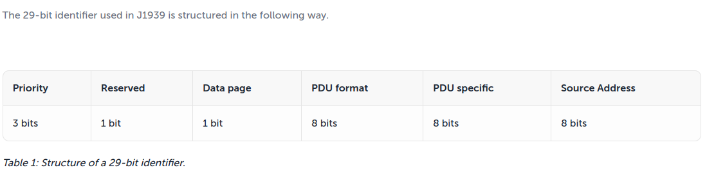
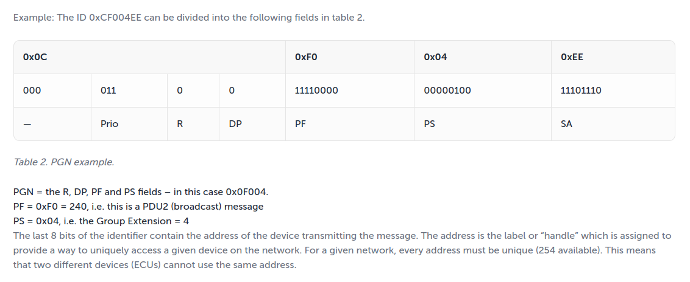

## SAE J1939 Introduction

https://kvaser.com/about-can/higher-layer-protocols/j1939-introduction/

J1939 uses the 29-bit identifier defined within the **CAN 2.0B** protocol

The identifier is used slightly different in a message with a destination address (”**PDU 1**”) compared to a message intended for broadcast (”**PDU 2**”).

- **PDU**:stands for Protocol Data Unit (i.e. Message Format).
- The **SOF**, **SRR**, and **IDE** bits are defined by the CAN standard and will be ignored here. The **RTR** bit (remote request bit) is always set to zero in J1939.

- **Priority:** The first three bits of the identifier are used for controlling a message’s priority during the arbitration process. A value of 0 has the highest priority. Higher priority values are typically given to high-speed control messages, for example, the torque control message from the transmission to the engine. Messages containing data that is not time critical, like the vehicle road speed, are given lower priority values.

- **Reserved**: The next bit of the identifier is reserved for future use and should be set to 0 for transmitted messages.

- **Data page**: The next bit in the identifier is the data page selector. This bit expands the number of possible Parameter Groups that can be represented by the identifier.

- **PDU format**: The PDU format (PF) determines whether the message can be transmitted with a destination address or if the message is always transmitted as a broadcast message.

- **PDU specific**: The interpretation of the PDU specific (PS) field changes based on the PF value:

  > - If the PF is between **0 and 239**, the message is addressable (PDU1) and the PS field contains the **destination address**.
  > - If the PF is between **240 and 255**, the message can only be broadcast (PDU2) and the PS field contains a **Group Extension**.
  >
  > The Group extension expands the number of possible broadcast Parameter Groups that can be represented by the identifier.

The term **Parameter Group Number (PGN)** is used to refer to the value of the Reserve bit, DP, PF, and PS fields combined into a single 18 bit value.

