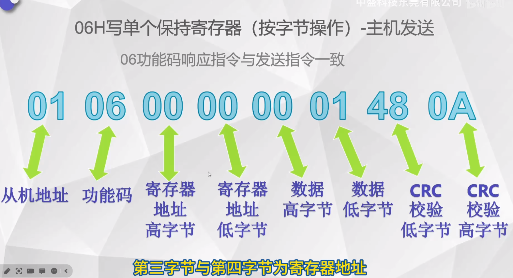

每个报文之间大概间隔3ms

## Modbus RTU

Modbus协议诞生于1979年， 是Modicon为使用可编程逻辑控制器PLC而发表的。Modbus已经成为工业领域通讯协议的业界标准，是工业电子设备之间相当常用的连接方式

Modbus是一种应用层报文传输协议，定义了控制器能够识别的一种消息结构，不管他们是经过何种网络进行通讯，能够适应多种电气接口，因此使用非常广泛

Modbus通讯在通讯协议上面，采用**主从应答方式**进行，只能由主站PC或PLC通过唯一从机地址发起请求，从机根据主机请求响应，即**半双工通讯**。该协议**只允许主机发起请求**，从机进行被动响应，因此从机不会主动占用通讯线路，造成数据冲突。

### 寄存器类型

Modbus RTU协议中有：

- 线圈寄存器：为按位操作寄存器，可读可写，使用`01H`功能码读单个或多个线圈状态，使用`05H`功能码写单个线圈，使用`0FH`功能码写多个线圈。线圈寄存器常用于DO数字量输出，可设置输出端口状态，常用场景有继电器输出、晶体管输出等
- 离散输入寄存器:为位操作寄存器，仅可读，使用`02H`功能码读单个或多个离散输入寄存器状态。常用于DI数字量输入，通过外部设置改变输入状态。常用场景有按钮开关、光电开关等
- 输入寄存器：为字操作寄存器，仅可读，使用`04H`功能码读单个或多个输入寄存器。输入寄存器常用于AI模拟量输入，控制器运行时从外部设备获取的参数。常用场景有模拟量输入。
- 保持寄存器：为字操作寄存器，可读可写，使用`03H`功能码读单个或多个保持寄存器，使用`06H`功能码写单个保持寄存器，使用`10H`功能码写多个保持寄存器。保持寄存器常用于AO模拟量输出，输出参数或保持参数，控制器运行时被设定的某些参数。常用场景有模拟量输出设定值，PID运行参数变量阀值输出大小，传感器报警上限下限等。

> In Modbus, there are four primary types of registers used to store and transmit data:
>
> 1. **Coil Registers**: These are used for reading and writing a single bit of data and are typically associated with on/off states. They are used to control outputs or to read the status of discrete inputs. In Modbus protocol, the function codes to read coils are 01 (Read Coils) and 05 (Write Single Coil), and the function code to write multiple coils is 15 (Write Multiple Coils).
>
> 2. **Discrete Input Registers**: These are read-only registers used for reading a single bit of data that represents the status of a specific input. They are similar to coil registers but are used only for inputs. The function code to read discrete inputs is 02 (Read Discrete Inputs).
>
> 3. **Input Registers**: These are used for reading a 16-bit word of data and are typically used to read analog inputs or other types of data that require more than a single bit to represent. Input registers are read-only. The function code to read input registers is 04 (Read Input Registers).
>
> 4. **Holding Registers**: These can be read or written and are used to store and modify data that can be used by the device. Holding registers can represent a variety of things, such as numeric values, status flags, control registers, and more. They are 16-bit registers and can be used for a wide range of purposes. The function codes to read holding registers are 03 (Read Holding Registers) and 06 (Write Single Register), and the function code to write multiple registers is 16 (Write Multiple Registers).
>
> Each type of register in Modbus has a specific function and is used depending on what kind of data needs to be transmitted or what action is required. This structure allows for flexible and efficient communication within a wide range of industrial environments.

### 01H

寄存器地址`0000`为第一通道，`0001`为第二通道，依次类推

### 02H

### 03H

### 04H

### 05H

写单个线圈寄存器，向寄存器写`FF00`控制线圈吸合，写`0000`控制线圈断开

### 06H

### 10H

### 0FH

## Modbus TCP

在TCP层上又封装了一层协议

主站设备向从站设备发送请求，从站设备分析并处理主站设备的请求，然后向主站设备返回结果。在网络应用中，存在客户端和服务端，客户端发送请求到服务器，服务器向客户端返回内容。在Modbus协议中，主站发送Modbus请求，从机根据请求内容向主机返回响应，主机总是主动方，从机总是被动方

Modbus TCP 与RTU的**主要区别**有

1. 从机地址变得不再重要。因为Modbus TCP可以通过ip地址区分从机
2. 取消了CRC校验。由于TCP IP数据包中已经存在校验，所以就不需要CRC校验
3. 多了MBAP报文头

- **事务处理标识**可以理解为报文序列号，每次通讯之后都要加1以区别不同的通讯数据

- **协议标识**0000H表示Modbus TCP协议
- **数据长度**表示接下来的数据长度，以字节为单位
- **单元标识**可以理解为设备的从站地址

### 01H

代表第一通道至第四通道的线圈状态为1,为触发状态，第五至第8通道的线圈状态为0,为未触发状态

本次演示为4通道模块，返回值为1F,只需解析低四位，即F，全部为1,说明线圈为**吸合状态**

### 02H

>  02功能码为**按位操作寄存器**， 需要将0F转换为二进制

0000H至0003H输入状态为1,为触发状态

### 03H

> 03功能码为**按字节读取**的寄存器（读取保持寄存器）,所以一个寄存器占据两个字节，回两个字节数。第三第四字节为返回的字节数据，返回0001，说明第一通道的寄存器值为0001，第一通道的线圈为吸合状态

### 04H

04功能码也是按字节操作的寄存器，所以一个寄存器返回两个字节数据

### 05H

该例为控制第二通道线圈吸合，第二通道的线圈地址为0001H，所以寄存器地址就写0001。控制单个线圈吸合需要向寄存器写`FF00`控制单个线圈吸合，控制断开时需要写入`0000`。05功能码发送指令与返回指令一致

### 06H

> 向寄存器写`0001`控制线圈吸合，向寄存器写`0000`控制线圈断开

### 10H

10功能码为按字节操作寄存器，一个寄存器数据占两个字节

### 0FH

