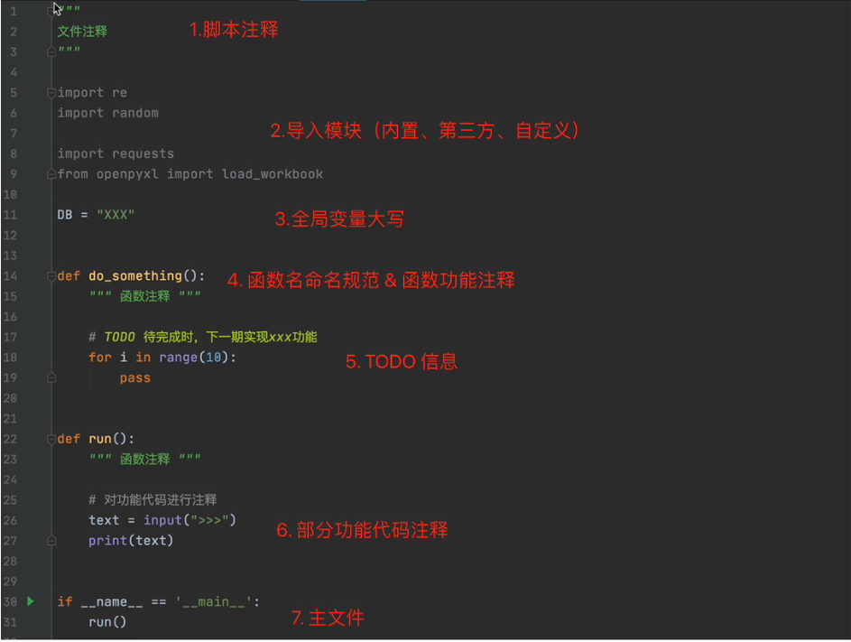
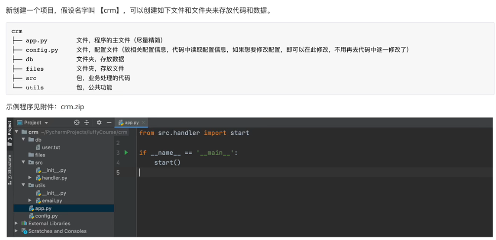
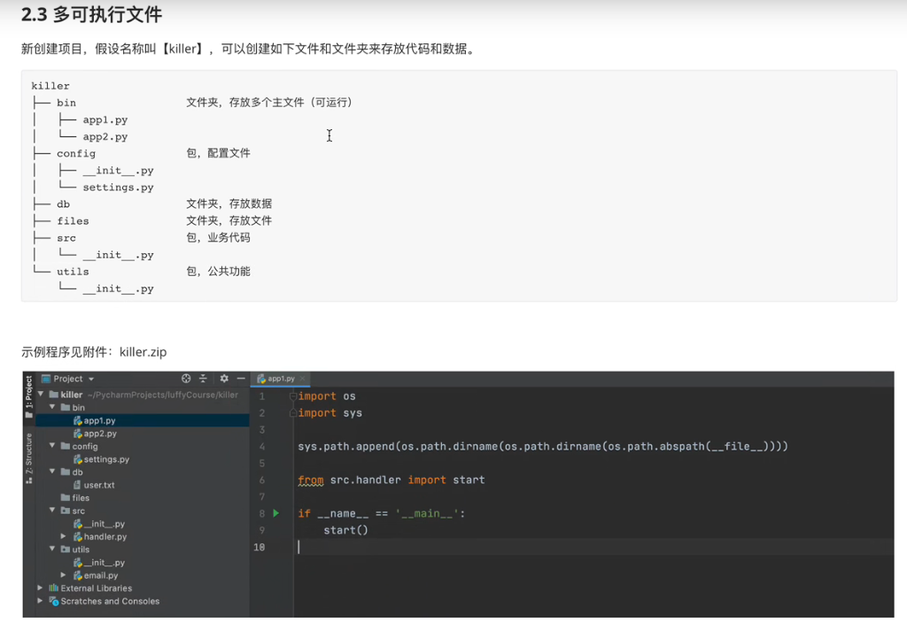

# 文件操作相关

## 1.文件操作

### 1.1读文件

- 读文本文件

```python
# 1.打开文件
#	- 路径
#		相对路径：'info.txt'
#		绝对路径：r'c:\Users\wangz\Desktop\info.txt'
#	- 模式
#		rb,表示读取文件原始的二进制（r,读 read;b,二进制 binary;)
# 1.打开文件
file_object = open('info.text', mode='rb')
# 2.读取文件内容，并赋值给data
data = file_object.read()
# 3.关闭文件
file_object.close()
# 转换为字符串类型
text = data.decode('utf-8')
```

```python
# python简化过程'rt'(自动读取二进制并转换为字符串类型)
file_object = open('info.txt', mode='rt', encoding='utf-8')
data = file_object.read()
file_object.close()

# 转换为字节类型
name = '武沛齐663e'
data = name.encode(encoding='utf-8')
print(data)

# 判断路径是否存在
exists = os.path.exists('info.txt') # 存在返回True,不存在返回False
```

- 读图片等非文本内容文件

  ```python
  file_object = open('a1.png', mode='rb')
  data = file_object.read()
  file_object.close()
  ```

### 1.2写文件

- 写文本文件

  ```python
  # 1.打开文件
  #	路径：t1.txt
  #	模式：wb (要求写入的内容是字节类型)
  #	r
  file_object = open('t1.txt', mode='wb')
  
  # 2.写入内容
  file_object.write("武沛齐".encode('utf-8'))
  
  # 3.文件关闭
  file_object.close()
  ```

  ```python
  # python简化过程'wt'(自动将字符串类型转换为字节类型并写入)
  file_object = open('t2.txt', mode='wt', encoding='utf-8') # encoding='utf-8'默认值
  file_object.write("武沛齐")
  file_object.close()
  ```

- 写图片等文件

  ```python
  # 复制图片
  f1 = open('a1.png', mode='rb')
  content = f1.read()
  f1.close()
  
  f2 = open('a2.png', mode='wb')
  f2.write(content)
  f2.close()
  ```

  注意事项：

  - 路径
    - 绝对路径
    - 相对路径
  - ==文件不存在时，w模式会新建然后写入内容；文件存在时，w模式会清空文件再写入内容。==

### 1.3文件打开模式

上文我们基于文件操作基本实现了读、写的功能，其中涉及的文件操作模式：`rt`、`rb`、`wt`、`wb`，其实在文件操作中还有其他的许多模式。

```python
=========== ===============================
Character Meaning
----------- -------------------------------
'r'       open for reading (default)
'w'       open for writing, truncating the file first
'x'       create a new file and open it for writing # 若文件已经存在报错
'a'       open for writing, appending to the end of the file if it exists

'b'       binary mode
't'       text mode (default)	

'+'       open a disk file for updating (reading and writing)

The default mode is 'rt' (open for reading text).
```

关于文件的打开模式常见应用有：

- 只读：`r`、`rt`、`rb` （用）

  - 存在，读
  - 不存在，报错

- 只写：`w`、`wt`、`wb`（用）

  - 存在，清空再写
  - 不存在，创建再写

- 只写：`x`、`xt`、`xb`

  - 存在，报错
  - 不存在，创建再写。

- 只写：`a`、`at`、`ab`【尾部追加】（用）

  - 存在，尾部追加。
  - 不存在，创建再写。

- 读写

  - `r+`、`rt+`、`rb+`，默认光标位置：起始位置(每次写或读都会移动光标)

  - `w+`、`wt+`、`wb+`，默认光标位置：起始位置（清空文件）

  - `x+`、`xt+`、`xb+`，默认光标位置：起始位置（新文件）

  - `a+`、`at+`、`ab+`，默认光标位置：末尾

    ```python
    file_object = open('info.txt', mode='at+')
    
    # 写入内容
    file_object.write("武沛齐")
    
    # 将光标位置重置起始
    file_object.seek(0) # 无论什么模式，0永远指字节，把光标移动到第0个字节的位置
    
    # 读取内容
    data = file_object.read()
    print(data)
    
    file_object.close()
    ```

### 1.4常见功能

在上述对文件的操作中，我们只使用了write和read来对文件进行读写，其实在文件操作中还有许多其他的功能来辅助实现更好的读写文件的内容

- `read()`,读

  - 读所有

    ```python
    f = open('info.txt', mode='r',encoding='utf-8')
    data = f.read()
    f.close()
    ```

    ```python
    f = open('info.txt', mode='rb')
    data = f.read()
    f.close()
    ```

  - 读n个字符（字节）【会用到】

    ```python
    f = open('info.txt', mode='r', encoding='utf-8')
    # 读1个字符
    data = f.read(1)
    f.close()
    
    print(data) # 武
    ```

    ```python
    # '武沛齐'  b'\xe6\xad\xa6\xe6\xb2\x9b\xe9\xbd\x90'
    f = open('info.txt', mode='rb')
    
    # 读3个字节
    chunk1 = f.read(3)
    chunk2 = f.read(3) # 光标已经移动，从第三个开始，向后继续读3个
    f.close()
    
    print(chunk1, chunk2, type(data))  # b'\xe6\xad\xa6' b'xe6\xb2\x9b'  <class 'bytes'>
    ```

- `readline()`,读一行

  小技巧：可用于跳过第一行数据，让光标移到第二行

  ```python
  # 可节省内存，不会一次全读出来
  f = open('info.txt', mode='r', encoding='utf-8')
  # 读取第一行
  v1 = f.readline()
  # 文件没有关闭，继续往下读，读取第二行
  v2 = f.readline()
  
  f.close()
  ```

- `readlines()`，读所有行，每行作为列表的一个元素【不常用，太吃内存】

  ```python
  f = open('info.txt', mode='rb')
  data_list = f.readlines()
  f.close()
  ```

- 循环，读大文件（`readline()`加强版）【常见】

  ```python
  f = open('info.txt', mode='r', encoding='utf-8')
  for line in f:
      print(line.strip()) # 跳过换行符，空格和制表符
  f.close()
  ```

- flush，刷到硬盘

  ```python
  f = open('info.txt', mode='a',encoding='utf-8')
  
  while True:
      # write()不是写到了硬盘，而是写在缓冲区，系统会将缓冲区的内容刷到硬盘。但我们无法确定什么时候写上去
  	f.write("武沛齐")
      f.flush() # 立即将缓冲区的内容写入硬盘
  
  f.close()
  ```

- 移动光标位置（字节）`seek()`

  ```python
  f.seek(3) # 移动到第三个字节的位置
  ```

  ==注意==：在a模式下，调用write在文件中写入内容时，永远只能将内容写入到尾部，不会写到光标的位置。 【a模式永远都是先将光标移动到最后再开始写入】

- 获取当前光标位置`tell()`

  ```python
  f.tell() # 返回当前光标位置的整数，单位字节
  ```

### 1.5上下文管理

之前对文件进行操作时，每次都要打开和关闭文件，比较繁琐且容易忘记关闭文件。

以后再进行文件操作时，推荐大家使用with上下文管理，它可以自动实现关闭文件。

```python
with open('info.txt', mode='rb') as file_object:
    data = file_object.read()
```

在Python 2.7 后，with又支持同时对多个文件的上下文进行管理，即：

```python
with open("xxxx.txt", mode='rb') as f1, open("xxxx.txt", mode='rb') as f2:
    pass
```

==修改文件内容==

```python
# 打开两个文件，读一行写一行到另一个文件，在同一个文件中操作不可取，容易出错
with open('info.txt', mode='rt', encoding='utf-8') as read_file_object, open('new_info.txt', mode='wt', encoding='utf-8') as write_file_object:
    for line in read_file_object:
        new_line = line.replace("luffycity", "pythonav")
        write_file_object.write(new_line)
# 重命名
shutil.move('new_info.txt', 'info.txt') # 存在则覆盖
```

## 2.csv格式文件

**逗号分隔值**（Comma-Separated Values，**CSV**，有时也称为**字符分隔值**，因为分隔字符也可以不是逗号），其文件以纯文本形式存储表格数据（数字和文本）。

对于这种格式的数据，我们需要利用open函数来读取文件并根据逗号分隔的特点来进行处理。

## 3.ini格式

`ini`文件是Initialization File的缩写，平时用于存储软件的的配置文件。例如：MySQL数据库的配置文件。

```ini
[mysqld]
datadir=/var/lib/mysql
socket=/var/lib/mysql/mysql.sock
log-bin=py-mysql-bin
character-set-server=utf8
collation-server=utf8_general_ci
log-error=/var/log/mysqld.log
# Disabling symbolic-links is recommended to prevent assorted security risks
symbolic-links=0

[mysqld_safe]
log-error=/var/log/mariadb/mariadb.log
pid-file=/var/run/mariadb/mariadb.pid

[client]
default-character-set=utf8
```

这种格式是可以直接使用open来出来，考虑到自己处理比较麻烦，所以Python为我们提供了更为方便的方式。

```python
import configparser

config = configparser.ConfigParser() # 固定格式
config.read('files/my.ini', encoding='utf-8')

# 1.获取所有的节点
result = config.sections()
print(result)  # ['mysqld', 'mysqld_safe', 'client']

# 2.获取节点下的键值
result = config.items("mysqld_safe")
print(result)  # [('log-error', '/var/log/mariadb/mariadb.log'), ('pid-file', '/var/run/mariadb/mariadb.pid')]

for key, value in config.items("mysqld_safe"):
    print(key, value)


# 3.获取某个节点下的键对应的值
result = config.get("mysqld","collation-server")

# 4.其他

# 4.1 是否存在节点
v1 = config.has_section("client")

# 4.2 添加一个节点
config.add_section("group")
config.set('group','name','wupeiqi') # 节点，键，值
config.set('client','name','wupeiqi')
config.write(open('files/new.ini', mode='w', encoding='utf-8'))

# 4.3 删除
config.remove_section('client')
config.remove_option("mysqld", "datadir")
config.write(open('files/new.ini', mode='w', encoding='utf-8')) # 所有操作都是在内存中进行，要更改实际文件必须在最后用write写入原文件
```

## 4.XML格式文件

[可扩展标记语言](https://baike.baidu.com/item/可扩展标记语言/2885849)，是一种简单的数据存储语言，XML 被设计用来传输和存储数据。

- 存储，可用来存放配置文件，例如：java的配置文件。
- 传输，网络传输时以这种格式存在，例如：早期ajax传输的数据、soap协议等。

```xml
<data> # 开头标志   根标签
    <country name="Liechtenstein">    # 孩子，name=''称为属性
        <rank updated="yes">2</rank>
        <year>2023</year>
        <gdppc>141100</gdppc>
        <neighbor direction="E" name="Austria" />
        <neighbor direction="W" name="Switzerland" />
    </country>
    <country name="Singapore">
        <rank updated="yes">5</rank>
        <year>2026</year>
        <gdppc>59900</gdppc>
        <neighbor direction="N" name="Malaysia" />
    </country>
    <country name="Panama">
        <rank updated="yes">69</rank>
        <year>2026</year>
        <gdppc>13600</gdppc>
        <neighbor direction="W" name="Costa Rica" />
        <neighbor direction="E" name="Colombia" />
    </country>
</data> # 结尾标志
```

注意：在Python开发中用的相对来比较少，大家作为了解即可（后期课程在讲解微信支付、微信公众号消息处理 时会用到基于xml传输数据）。

例如：https://developers.weixin.qq.com/doc/offiaccount/Message_Management/Receiving_standard_messages.html

### 4.1读取文件和内容

```python
from xml.etree import ElementTree as ET

# ET去打开xml文件
tree = ET.parse('files\\xo.xml')

# 获取根标签
root = tree.getroot()
print(root) # <Element 'data' at 0x7f94e02763b0>
```

```python
# 通过网络获取到了xml文件
content = """    
<data>
    <country name="Liechtenstein">
        <rank updated="yes">2</rank>
        <year>2023</year>
        <gdppc>141100</gdppc>
        <neighbor direction="E" name="Austria" />
        <neighbor direction="W" name="Switzerland" />
    </country>
     <country name="Panama">
        <rank updated="yes">69</rank>
        <year>2026</year>
        <gdppc>13600</gdppc>
        <neighbor direction="W" name="Costa Rica" />
        <neighbor direction="E" name="Colombia" />
    </country>
</data>
"""

# 获取根标签 data
root = ET.XML(content)
print(root)  # <Element 'data' at 0x7fdaa019cea0>
```

```python
# 接上面代码块
# 获取data标签的孩子标签
for child in root:
    print(child.tag, child.attrib) 
    # child.tag = 'conntry' 获取标签名字符串
    # chile.attrib = {'name':'Liechtenstein'} 获取属性字典
    for node in child: # country里面所有的孩子
        print(node.tag, node.attrib, node.text)
        # node.text = 2 # 获取里面的文本内容
```

### 4.2 读取节点数据

```python
# 获取根标签 data
root = ET.XML(content)

country_object = root.find("country") # 在根标签data下找第一个叫country的孩子标签
print(country_object.tag, country_object.attrib)
gdppc_object = country_object.find("gdppc") # 在country下找第一个gdppc
print(gdppc_object.tag,gdppc_object.attrib,gdppc_object.text)
```

```python
root = ET.XML(content)
for child in root.iter('year'): # 在data的子子孙孙里找到所有的名叫year的节点并进行遍历
    print(child.tag, child.text)
    
v1 = root.findall('country') # 找到所有country标签
v2 = root.find('country').find('rank')
```

### 4.3修改和删除节点

```python
root = ET.XML(content)

# 修改节点内容和属性
rank = root.find('country').find('rank')
rank.text = "999"
rank.set('update', '2020-11-11') # 在rank里增加属性
print(rank.text, rank.attrib)

# 删除节点
root.remove( root.find('country') )
print(root.findall('country'))
############ 保存文件 ############
tree = ET.ElementTree(root)
tree.write("new.xml", encoding='utf-8')
```

### 4.4构建文档

```python
from xml.etree import ElementTree as ET

# 创建根标签
root = ET.Element("home")

# 创建节点大儿子
son1 = ET.Element('son', {'name': '儿1'})
# 创建小儿子
son2 = ET.Element('son', {"name": '儿2'})

# 在大儿子中创建两个孙子
grandson1 = ET.Element('grandson', {'name': '儿11'})
grandson2 = ET.Element('grandson', {'name': '儿12'})

# 上面只是在创建标签，标签与标签之间还没有关系，下面开始建立关系
# 把孙子添加到儿子中
son1.append(grandson1)
son1.append(grandson2)
# 把儿子添加到根节点中
root.append(son1)
root.append(son2)

tree = ET.ElementTree(root)
tree.write('oooo.xml', encoding='utf-8', short_empty_elements=True) # 决定是否生成短标签 里面没有值的简写成 <grandson name="儿11" />
```

```xml
<home>
    <son name="儿1">
        <grandson name="儿11" />
        <grandson name="儿12" />
    </son>
    <son name="儿2" />
</home>
```

```python
# 方法2【不推荐】
from xml.etree import ElementTree as ET

# 创建根节点
root = ET.Element("famliy")


# 创建大儿子
son1 = root.makeelement('son', {'name': '儿1'})
# 创建小儿子
son2 = root.makeelement('son', {"name": '儿2'})

# 在大儿子中创建两个孙子
grandson1 = son1.makeelement('grandson', {'name': '儿11'})
grandson2 = son1.makeelement('grandson', {'name': '儿12'})

son1.append(grandson1)
son1.append(grandson2)


# 把儿子添加到根节点中
root.append(son1)
root.append(son2)

tree = ET.ElementTree(root)
tree.write('oooo.xml',encoding='utf-8')
```

```python
# 方法3
from xml.etree import ElementTree as ET


# 创建根节点
root = ET.Element("famliy")


# 创建节点大儿子
son1 = ET.SubElement(root, "son", attrib={'name': '儿1'})
# 创建小儿子
son2 = ET.SubElement(root, "son", attrib={"name": "儿2"})

# 在大儿子中创建一个孙子
grandson1 = ET.SubElement(son1, "age", attrib={'name': '儿11'})
grandson1.text = '孙子'


et = ET.ElementTree(root)  #生成文档对象
et.write("test.xml", encoding="utf-8")
```

## 5.Excel格式文件

## 6.压缩文件

基于Python内置的shutil模块可以实现对压缩文件的操作。

```python
import shutil

# 1. 压缩文件
"""
# base_name，压缩后的压缩包文件
# format，压缩的格式，例如："zip", "tar", "gztar", "bztar", or "xztar".
# root_dir，要压缩的文件夹路径
"""
# shutil.make_archive(base_name=r'datafile',format='zip',root_dir=r'files')


# 2. 解压文件
"""
# filename，要解压的压缩包文件
# extract_dir，解压的路径
# format，压缩文件格式
"""
# shutil.unpack_archive(filename=r'datafile.zip', extract_dir=r'xxxxxx/xo', format='zip')
```

## 7.路径相关

### 7.1  转义

windows路径使用的是\，linux路径使用的是/。

特别的，在windows系统中如果有这样的一个路径 `D:\nxxx\txxx\x1`，程序会报错。因为在路径中存在特殊符 `\n`（换行符）和`\t`（制表符），Python解释器无法自动区分。

所以，在windows中编写路径时，一般有两种方式：

- 加转义符，例如：`"D:\\nxxx\\txxx\\x1"`
- 路径前加r，例如：`r"D:\\nxxx\\txxx\\x1"`

### 7.2 程序当前路径

项目中如果使用了相对路径，那么一定要注意当前所在的位置。

```python
import os


# 1.获取当前运行的py脚本所在路径
abs = os.path.abspath(__file__)  # __file__代指当前运行的py脚本
print(abs) # /Users/wupeiqi/PycharmProjects/luffyCourse/day09/20.路径相关.py
path = os.path.dirname(abs) # 得到上一级目录
print(path) # /Users/wupeiqi/PycharmProjects/luffyCourse/day09

base_dir = os.path.dirname(os.path.abspath(__file__))
# 适用多种系统
file_path = os.path.join(base_dir, 'files', 'info.txt')
if os.path.exists(file_path):
    file_object = open(file_path, mode='r', encoding='utf-8')
    data = file_object.read()
    file_object.close()
    print(data)
else:
    os.makedire(path) # 创建文件夹，可多级
```

### 7.3文件和路径相关

```python
import shutil
import os

# 1. 获取当前脚本绝对路径
"""
abs_path = os.path.abspath(__file__)
print(abs_path)
"""

# 2. 获取当前文件的上级目录
"""
base_path = os.path.dirname( os.path.dirname(路径) ）
print(base_path)
"""

# 3. 路径拼接
"""
p1 = os.path.join(base_path, 'xx')
print(p1)

p2 = os.path.join(base_path, 'xx', 'oo', 'a1.png')
print(p2)
"""

# 4. 判断路径是否存在
"""
exists = os.path.exists(p1)
print(exists)
"""

# 5. 创建文件夹
"""
os.makedirs(路径)
"""
"""
path = os.path.join(base_path, 'xx', 'oo', 'uuuu')
if not os.path.exists(path):
    os.makedirs(path)
"""

# 6. 是否是文件夹
"""
file_path = os.path.join(base_path, 'xx', 'oo', 'uuuu.png')
is_dir = os.path.isdir(file_path)
print(is_dir) # False

folder_path = os.path.join(base_path, 'xx', 'oo', 'uuuu')
is_dir = os.path.isdir(folder_path)
print(is_dir) # True

"""

# 7. 删除文件或文件夹
"""
os.remove("文件路径")
"""
"""
path = os.path.join(base_path, 'xx')
shutil.rmtree(path)
"""

# 8. 拷贝文件夹
"""
shutil.copytree("/Users/wupeiqi/Desktop/图/csdn/","/Users/wupeiqi/PycharmProjects/CodeRepository/files")
"""

# 9.拷贝文件
"""
shutil.copy("/Users/wupeiqi/Desktop/图/csdn/WX20201123-112406@2x.png","/Users/wupeiqi/PycharmProjects/CodeRepository/")
shutil.copy("/Users/wupeiqi/Desktop/图/csdn/WX20201123-112406@2x.png","/Users/wupeiqi/PycharmProjects/CodeRepository/x.png")
"""

# 10.文件或文件夹移动（重命名）
"""
shutil.move("/Users/wupeiqi/PycharmProjects/CodeRepository/x.png","/Users/wupeiqi/PycharmProjects/CodeRepository/xxxx.png")
shutil.move("/Users/wupeiqi/PycharmProjects/CodeRepository/files","/Users/wupeiqi/PycharmProjects/CodeRepository/images")
"""
```

# 函数基础

## 1.初识函数

在计算机编程中，**子程序**是执行特定任务的程序指令序列，打包为一个单元。

## 发邮件

之前说了很好多次发送邮件的案例，下面就来教大家用python发邮件，然后再由此引出函数的参数。

- 注册邮箱
- 基础配置
  - 授权码
  - SMTP服务器: smtp.126.com
- 代码发送邮件

```python
import smtplib
from email.mime.text import MIMEText
from email.utils import formataddr

# ### 1.邮件内容配置 ###
msg = MIMEText("住宿", 'html', 'utf-8') 
msg['From'] = formataddr(["武沛齐", "wuwentao_c@126.com"])
msg['Subject'] = "180单人间"

# ### 2.发送邮件 ### 
server = smtplib.SMTP_SSL("smtp.126.com")
server.login("wuwentao_c@126.com", "IAYMQSPEECLWZAFT")
server.sendmail("wuwentao_c@126.com", "1159166558@qq.com", msg.as_string())
server.quit()
```

## 2.函数参数

### 2.1 参数

在定义函数时，如果在括号中添加`变量`，我们称它为函数的形式参数：

```python
"""
1. 形参
2. 实参
3. 位置传参
4. 关键字传参
"""

'形参'
# 定义有三个参数的函数（a1/a2/a3一般称为形式参数-形参） #####
def func(a1, a2, a3):
    print(a1 + a2 + a3)

'实参'
# 执行函数并传入参数（执行函数传值时一般称为实际参数-实参）
func(11, 22, 33)

'位置传参'
func(9, 2, 103)

'关键字传参' # 关键字传参和位置传参混合时，关键字传参要在后面
func(a1=99, a2=88, a3=1)
func(a1=99, a3=1, a2=88)
func(12, 9, a3=90)
```


### 2.2 默认参数

```python
def func(a1, a2, a3=10): # a3传入值时按传入值，没有传入时按默认值10
    print(a1 + a2 + a3)
```

### 2.3 动态参数

- *

  ```python
  def func(*args):
      print(args) # args默认封装成元组类型 (22,)   (22,33,99,) ()
  
  # 只能按照位置传参
  func(22)
  func(22,33)
  func(22,33,99)
  func()
  ```

- **

  ```python
  def func(**kwargs):
      print(kwargs) # kwargs默认封装成字典类型 {"n1":"武沛齐"}                              {"n1":"武沛齐","age":"18","email":"xxxx"}          {}
      
  # 只能按关键字传参
  func(n1="武沛齐")
  func(n1="武沛齐",age=18)
  func(n1="武沛齐",age=18,email="xx@live.com")
  ```

- *,**

  ```python
  def func(*args,**kwargs):
      print(args,kwargs) # (22,33,99) {}
  
  func(22,33,99)
  func(n1="武沛齐",age=18)
  func(22,33,99,n1="武沛齐",age=18)
  func()
  ```

  提示：是否还记得字符串格式化时的format功能。

  ```python
  v1 = "我叫{},今年{},性别{}".format("武沛齐",18,"男")
  
  v2 = "我叫{name},今年{age},性别{gender}".format(name="武沛齐",age=18,gender="男")
  ```

  

注意事项（不重要，听过一遍即可）

```python
# 1. ** 必须放在 * 的后面
def func1(*args, **kwargs):
    print(args, **kwargs)


# 2. 参数和动态参数混合时，动态参数只能放在最后。
def func2(a1, a2, a3, *args, **kwargs):
    print(a1, a2, a3, args, **kwargs)


# 3. 默认值参数和动态参数同时存在，一定要放**前面
def func3(a1, a2, a3, a4=10, *args, a5=20, **kwargs):
    print(a1, a2, a3, a4, a5, args, kwargs)


func3(11, 22, 33, 44, 55, 66, 77, a5=10, a10=123)
```

## 3. 函数返回值

在开发过程中，我们希望函数可以帮助我们实现某个功能，但让函数实现某功能之后有时也需要有一些结果需要反馈给我们，例如：

```python
def magic(num):
    result = num + 1000
    return result

data = magic(9)
print(data) # 1009
```


在了解了返回值的基本使用之后，接下来在学3个关键知识：

- 返回值可以是任意类型，如果函数中没写return，则默认返回None

  当在函数中`未写返回值` 或 `return` 或 `return None` ，执行函数获取的返回值都是None。

- return后面的值如果有逗号，则默认会将返回值转换成元组再返回。

  ```python
  def func():
      return 1,2,3
  
  value = func()
  print(value) # (1,2,3)
  ```

- 函数一旦遇到return就会立即退出函数（终止函数中的所有代码）

  ```python
  def func():
      print(1)
      return "结束吧"
  	print(2) # 2不会被打印出来
      
  ret = func()
  print(ret)
  ```

  函数的注释，说明函数的作用。

  ```python
  def encrypt(origin):
      """ 用于数据加密和xxx """
  	pass
  ```

# 函数进阶

## 1.参数的补充

在函数基础部分，我们掌握函数和参数基础知识，掌握这些其实完全就可以进行项目的开发。

今天的补充的内容属于进阶知识，包含：内存地址相关、面试题相关等，在特定情况下也可以让代码更加简洁，提升开发效率。


### 1.1 参数内存地址相关

在开始开始讲参数内存地址相关之前，我们先来学习一个技能：

如果想要查看下某个值的在内存中的地址？

```python
v1 = "武沛齐"
addr = id(v1)

print(addr) # 140691049514160
```

问题：请问python的参数默认传递的是什么？

记住一句话：函数执行传参时，传递的是==**内存地址**==。

参数得是可变类型：list/dict/set & 在函数内部只能对内部元素进行修改

### 1.2 函数的返回值是内存地址

```python
def func():
    data = [11, 22, 33]
    return data

v1 = func()
print(v1) # [11,22,33]
```

上述代码的执行过程：

- 执行func函数
- `data = [11, 22, 33]` 创建一块内存区域，内部存储`[11,22,33]`，data变量指向这块内存地址。
- `return data` 返回data指向的内存地址
- v1接收返回值，所以 v1 和 data 都指向  `[11,22,33]` 的内存地址（两个变量指向此内存，引用计数器为2）
- 由函数执行完毕之后，==函数内部的变量都会被释放==。（即：删除data变量，内存地址的引用计数器-1）【当变量为数字或字符串时，缓存和驻留机制会使得内部变量地址不释放，但依然无法从外部调用】

所以，最终v1指向的函数内部创建的那块内存地址。

```python
def func():
    data = [11, 22, 33] # 为列表等时会开辟新地址给data
    print(id(data))
    return data


v1 = func()
print(v1, id(v1))  # [11,22,33] 

v2 = func()
print(v2, id(v1))  # [11,22,33]
# v1 和 v2 id内存地址不一样
```

==注意事项==：当上面data换成字符串时，python内部有一个缓存和驻留机制，它认为这些是高频使用的，所以data不会得到新地址，还是用之前的。同样的```v1=3, v2=3```，v1和v2的内存地址一样

### 1.3 参数的默认值

这个知识点在面试题中出现的概率比较高，但真正实际开发中用的比较少。

```python
def func(a1,a2=18):
    print(a1,a2)
```

>  原理：Python在==创建函数（未执行）时==，如果发现函数的参数中有默认值，则在函数内部会创建一块区域并维护这个默认值。【此后再也不会重新创建】
>
>  - 执行函数未传值时，则让a2指向 函数维护的那个值的地址。
>
>   ```python
>  func("root")
>   ```
>
>  - 执行函数传值时，则让a2指向新传入的值的地址。
>
>   ```python
>  func("admin",20)
>   ```


在特定情况<span style="color:red;">【默认参数的值是可变类型 list/dict/set】 & 【函数内部会修改这个值】</span>下，参数的默认值 有坑 。

- 坑

  ```python
  # 在函数内存中会维护一块区域存储 [1,2,666,666,666] 100010001
  def func(a1,a2=[1,2]):
      a2.append(666)
      print(a1,a2)
  
  # a1=100
  # a2 -> 100010001
  func(100) # 100  [1,2,666]
  
  # a1=200
  # a2 -> 100010001
  func(200) # 200 [1,2,666,666]
  
  # a1=99
  # a2 -> 1111111101
  func(99,[77,88]) # 66 [177,88,666]
  
  # a1=300
  # a2 -> 100010001
  func(300) # 300 [1,2,666,666,666] 
  ```

- 大坑

  ```python
  # 在内部会维护一块区域存储 [1, 2, 10, 20,40 ] ,内存地址 1010101010
  def func(a1, a2=[1, 2]):
      a2.append(a1)
      return a2
  
  # a1=10
  # a2 -> 1010101010
  # v1 -> 1010101010
  v1 = func(10)
  print(v1) # [1, 2, 10]
  
  # a1=20
  # a2 -> 1010101010
  # v2 -> 1010101010
  v2 = func(20)
  print(v2) # [1, 2, 10, 20 ]
  
  # a1=30
  # a2 -> 11111111111        [11, 22,30]
  # v3 -> 11111111111
  v3 = func(30, [11, 22])
  print(v3) #  [11, 22,30]
  
  # a1=40
  # a2 -> 1010101010
  # v4 -> 1010101010
  v4 = func(40)
  print(v4) # [1, 2, 10, 20,40 ] 
  ```

- 深坑

  ```python
  # 内存中创建空间存储 [1, 2, 10, 20, 40] 地址：1010101010
  def func(a1, a2=[1, 2]):
      a2.append(a1)
      return a2
  
  # a1=10
  # a2 -> 1010101010
  # v1 -> 1010101010
  v1 = func(10)
  
  
  # a1=20
  # a2 -> 1010101010
  # v2 -> 1010101010
  v2 = func(20)
  
  # a1=30
  # a2 -> 11111111111   [11,22,30]
  # v3 -> 11111111111
  v3 = func(30, [11, 22])
  
  # a1=40
  # a2 -> 1010101010
  # v4 -> 1010101010
  v4 = func(40)
  
  print(v1) # [1, 2, 10, 20, 40]
  print(v2) # [1, 2, 10, 20, 40]
  print(v3) # [11,22,30]
  print(v4) # [1, 2, 10, 20, 40] 
  ```

### 1.4 动态参数

动态参数，定义函数时在形参位置用 `*或**` 可以接任意个参数。

```python
def func(*args,**kwargs):
    print(args,kwargs)
    
func("宝强","杰伦",n1="alex",n2="eric")
```


在定义函数时可以用 `*和**`，其实在执行函数时，也可以用。

- 形参固定，实参用`*和**`

  ```python
  def func(a1,a2):
      print(a1,a2)
      
  func( 11, 22 )
  func( a1=1, a2=2 )
  
  func( *[11,22] )
  func( **{"a1":11,"a2":22} )
  ```

- 形参用`*和**`，实参也用 `*和**`

  ```python
  def func(*args,**kwargs):
      print(args,kwargs)
      
  func( 11, 22 )
  func( 11, 22, name="武沛齐", age=18 )
  
  # 小坑，([11,22,33], {"k1":1,"k2":2}), {}
  func( [11,22,33], {"k1":1,"k2":2} )
  
  # args=(11,22,33),kwargs={"k1":1,"k2":2}
  func( *[11,22,33], **{"k1":1,"k2":2} ) 
  
  # 值得注意：按照这个方式将数据传递给args和kwargs时，数据是会重新拷贝一份的（可理解为内部循环每个元素并设置到args和kwargs中）。
  ```


所以，在使用format字符串格式化时，可以可以这样：

```python
v1 = "我是{},年龄：{}。".format("武沛齐",18)
v2 = "我是{name},年龄：{age}。".format(name="武沛齐",age=18)


v3 = "我是{},年龄：{}。".format(*["武沛齐",18])
v4 = "我是{name},年龄：{age}。".format(**{"name":"武沛齐","age":18})
```

## 2. 函数和函数名

函数名其实就是一个变量，这个变量只不过代指的函数而已。

```python
name = "武沛齐"
```

```python
def add(n1,n2):
    return n1 + n2
```

注意：函数必须先定义才能被调用执行（解释型语言）。

```python
# 正确
def add(n1,n2):
    return n1 + n2

ret = add(1,2)
print(ret) 
```

### 2.1 函数做元素

既然函数就相当于是一个变量，那么在列表等元素中是否可以把行数当做元素呢？

```python
def func():
    return 123

data_list = ["武沛齐", "func", func , func() ]

print( data_list[0] ) # 字符串"武沛齐"
print( data_list[1] ) # 字符串 "func"
print( data_list[2] ) # 函数 func
print( data_list[3] ) # 整数 123

res = data_list[2]()
print( res ) # 执行函数 func，并获取返回值；print再输出返回值。

print( data_list[2]() ) # 123
```

注意：函数同时也可被哈希，所以函数名通知也可以当做 集合的元素、字典的键。

掌握这个知识之后，对后续的项目开发有很大的帮助，例如，在项目中遇到根据选择做不同操作时：

- 情景1，例如：要开发一个类似于微信的功能。

  ```python
  def send_message():
      """发送消息"""
      pass
  
  def send_image():
      """发送图片"""
      pass
  
  def send_emoji():
      """发送表情"""
      pass
  
  def send_file():
      """发送文件"""
      pass
  
  print("欢迎使用xx系统")
  print("请选择：1.发送消息；2.发送图片；3.发送表情；4.发送文件")
  choice = input("输入选择的序号")
  
  if choice == "1":
      send_message()
  elif choice == "2":
      send_image()
  elif choice == "3":
      send_emoji()
  elif choice == "4":
      send_file()
  else:
      print("输入错误")
  ```

  ```python
  def send_message():
      """发送消息"""
      pass
  
  
  def send_image():
      """发送图片"""
      pass
  
  
  def send_emoji():
      """发送表情"""
      pass
  
  
  def send_file():
      """发送文件"""
      pass
  
  def xxx():
      """收藏"""
      pass
  
  
  function_dict = {
      "1": send_message,
      "2": send_image,
      "3": send_emoji,
      "4": send_file,
      "5": xxx
  }
  
  print("欢迎使用xx系统")
  print("请选择：1.发送消息；2.发送图片；3.发送表情；4.发送文件")
  choice = input("输入选择的序号") # "1"
  
  func = function_dict.get(choice)
  if not func:
      print("输入错误")
  else:
      # 执行函数
      func()
  
  ```

- 情景2，例如：某个特定情况，要实现发送短信、微信、邮件。

  ```python
  def send_msg():
      """发送短信"""
      pass
  
  def send_email():
      """发送图片"""
      pass
  
  def send_wechat():
      """发送微信"""
      
  # 执行函数
  send_msg()
  send_email()
  send_wechat()
  ```

  ```python
  def send_msg():
      """发送短信"""
      pass
  
  def send_email():
      """发送图片"""
      pass
  
  def send_wechat():
      """发送微信"""
      pass
  
  
  func_list = [ send_msg, send_email, send_wechat ]
  for item in func_list:
      item()
  ```

上述两种情景，在参数相同时才可用，如果参数不一致，会出错。所以，在项目设计时就要让程序满足这一点，如果无法满足，也可以通过其他手段时间，例如：

情景1：

```python
def send_message(phone,content):
    """发送消息"""
    pass


def send_image(img_path, content):
    """发送图片"""
    pass


def send_emoji(emoji):
    """发送表情"""
    pass


def send_file(path):
    """发送文件"""
    pass


function_dict = {
    "1": [ send_message,  ['15131255089', '你好呀']],
    "2": [ send_image,  ['xxx/xxx/xx.png', '消息内容']],
    "3": [ send_emoji, ["😁"]],
    "4": [ send_file, ['xx.zip'] ]
}

print("欢迎使用xx系统")
print("请选择：1.发送消息；2.发送图片；3.发送表情；4.发送文件")
choice = input("输入选择的序号") # 1

item = function_dict.get(choice) # [ send_message,  ['15131255089', '你好呀']],
if not item:
    print("输入错误")
else:
    # 执行函数
    func = item[0] # send_message
    param_list = item[1] #  ['15131255089', '你好呀']
    
    func(*param_list) # send_message(*['15131255089', '你好呀'])
```

情景2：

```python
def send_msg(mobile, content):
    """发送短信"""
    pass


def send_email(to_email, subject, content):
    """发送图片"""
    pass


def send_wechat(user_id, content):
    """发送微信"""
    pass


func_list = [
    {"name": send_msg, "params": {'mobile': "15131255089", "content": "你有新短消息"}},
    {"name": send_email, "params": {'to_email': "wupeiqi@live.com", "subject": "报警消息", "content": "硬盘容量不够用了"}},
    {"name": send_wechat, "params": {'user_id': 1, 'content': "约吗"}},
]

#  {"name": send_msg, "params": {'mobile': "15131255089", "content": "你有新短消息"}},
for item in func_list:
    func = item['name'] # send_msg
    param_dict = item['params'] # {'mobile': "15131255089", "content": "你有新短消息"}
    func(**param_dict) # send_msg(**{'mobile': "15131255089", "content": "你有新短消息"})
```

### 2.2 函数名赋值

- 将函数名赋值给其他变量，函数名其实就个变量，代指某函数；如果将函数名赋值给另外一个变量，则此变量也会代指该函数，例如：

  ```python
  def func(a1,a2):
      print(a1,a2)
  
  xxxxx = func
  
  # 此时，xxxxx和func都代指上面的那个函数，所以都可以被执行。
  func(1,1)
  xxxxx(2,2)
  ```

  ```python
  def func(a1,a2):
      print(a1,a2)
      
  func_list = [func,func,func]
  
  func(11,22)
  func_list[0](11,22)
  func_list[1](33,44)
  func_list[2](55,66)
  ```

  

- 对函数名重新赋值，如果将函数名修改为其他值，函数名便不再代指函数，例如：

  ```python
  def func(a1,a2):
      print(a1,a2)
  
  # 执行func函数
  func(11,22)
  
  # func重新赋值成一个字符串
  func = "武沛齐"
  
  print(func)
  ```

  ```python
  def func(a1,a2):
      print(a1+a2)
      
  func(1,2)
  
  def func():
      print(666)
      
  func()
  ```

  ==注意==：由于函数名被重新定义之后，就会变量新被定义的值，所以大家在自定义函数时，不要与python内置的函数同名，否则会覆盖内置函数的功能。

### 2.3 函数名做参数和返回值

函数名其实就一个变量，代指某个函数，所以，他和其他的数据类型一样，也可以当做函数的参数和返回值。

- 参数

  ```python
  def plus(num):
      return num + 100
  
  def handler(func):
      res = func(10) # 110
      msg = "执行func，并获取到的结果为:{}".format(res)
      print(msg) # 执行func，并获取到的结果为:110
     
  # 执行handler函数，将plus作为参数传递给handler的形式参数func
  handler(plus)
  ```

- 返回值

  ```python
  def plus(num):
      return num + 100
  
  def handler():
  	print("执行handler函数")
      return plus
      
  result = handler()
  data = result(20) # 120
  print(data)
  ```

## 3.返回值和print

对于初学者的同学，很多人都对print和返回值分不清楚，例如：

```python
def add(n1,n2):
    print(n1 + n2)

v1 = add(1,3)
print(v1)
# 输出
4
None

def plus(a1,a2):
    return a1 + a2

v2 = plus(1,2)
print(v2)
# 输出
3
```

这两个函数是完全不同的

- 在函数中使用print，只是用于在某个位置输出内容而已。
- 在函数中使用return，是为了将函数的执行结果返回给调用者，以便于后续其他操作。

在调用并执行函数时，要学会分析函数的执行步骤。

```python
def f1():
    print(123)
def f2(arg):
    ret = arg()
    return ret
v1 = f2(f1)
print(v1)

# 输出
123
None
```

```python
def f1():
    print(123)
def f2(arg):
    ret = arg()
    return f1
v1 = f2(f1)
v2 = v1()
print(v2)

# 输出
123
123
None
```

## 4. 作用域

作用域，可以理解为一块空间，这块空间的数据是可以共享的。通俗点来说，作用域就类似于一个房子，房子中的东西归里面的所有人共享，其他房子的人无法获取。

### 4.1 函数为作用域

Python以函数为作用域，所以在函数内创建的所有数据，可以此函数中被使用，无法在其他函数中被使用。==在python中循环中的变量并不独立，循环结束后依然存在==。

### 4.2 全局和局部

Python中以函数为作用域，函数的作用域其实是一个局部作用域。

```python
# 全局变量（变量名大写）
COUNTRY = "中国"
CITY_LIST = ["北京","上海","深圳"]

def download():
    # 局部变量
    url = "http://www.xxx.com"
    ...
    
def upload():
    file_name = "rose.zip"
    ...
    
```

`COUNTRY`和`CITY_LIST`是在全局作用域中，全局作用域中创建的变量称之为【全局变量】，可以在全局作用域中被使用，也可以在其局部作用域中被使用。

`download`和`upload`函数内部维护的就是一个局部作用域，在各自函数内部创建变量称之为【局部变量】，且局部变量只能在此作用域中被使用。局部作用域中想使用某个变量时，==**寻找的顺序**==为：`优先在局部作用域中寻找，如果没有则去上级作用域中寻找`。

注意：全局变量一般都是大写。

### 4.3 global关键字

默认情况下，在局部作用域对全局变量只能进行：读取和修改内部元素（可变类型），无法对全局变量进行重新赋值。

- 读取

  ```python
  COUNTRY = "中国"
  CITY_LIST = ["北京","上海","深圳"]
  
  def download():
      url = "http://www.xxx.com"
      print(COUNTRY)
      print(CITY_LIST)
      
  download()
  ```

- 修改内部元素（可变类型）

  ```python
  COUNTRY = "中国"
  CITY_LIST = ["北京","上海","深圳"]
  
  def download():
      url = "http://www.xxx.com"
      print(CITY_LIST)
      
      CITY_LIST.append("广州")
      CITY_LIST[0] = "南京"
      print(CITY_LIST)
      
  download()
  ```

- 无法对全局变量重新赋值

  ```python
  COUNTRY = "中国"
  CITY_LIST = ["北京","上海","深圳"]
  
  def download():
      url = "http://www.xxx.com"
      # 不是对全部变量赋值，而是在局部作用域中又创建了一个局部变量 CITY_LIST 。
      CITY_LIST =  ["河北","河南","山西"]
      print(CITY_LIST)
  
  def upload():
      file_name = "rose.zip"
      print(COUNTRY)
      print(CITY_LIST)
      
  download()
  upload()
  ```

  

如果想要在局部作用域中对全局变量重新赋值，则可以基于 `global`关键字实现，例如：

```python
CITY_LIST = ['江苏', '山东']
def download():
    global CITY_LIST # 如果外面没有定义则报错
    CITY_LIST =  ["河北","河南","山西"]
```

## 总结

1. 函数参数传递的是内存地址。

   - 想重新创建一份数据再传递给参数，可以手动拷贝一份。

   - 特殊：参数是动态参数时，通过*或**传参时，会将数据循环添加到参数中（类似于拷贝一份）

     ```python
     def fun(*args, **kwargs):
         print(args, kwargs)
     
     fun(*[11, 22, 33], **{"k1": 1, "k2": 2})
     ```

2. 函数的返回值也是内存地址。（函数执行完毕后，其内部的所有变量都会被销毁，引用计数器为0时，数据也销毁）

   ```python
   def func():
       name = [11,22,33]
       data = name
       
   func()
   ```

   ```python
   def func():
       name = [11,22,33]
       return name
   
   data = func()
   while True:
   	print(data)
   ```

3. 当函数的参数有默认值 & 默认值是可变类型 & 函数内部会修改内部元素（有坑）

   ```python
   # 内部会维护一个列表 []，只要b不传值则始终使用都是这个列表。
   def func(a,b=[]):
       b.append(a)
   ```

4. 定义函数写形式参数时可以使用`*`和`**`，执行函数时也可以使用。

5. 函数名其实也是个变量，他也可以做列表、字典、集合等元素（可哈希）

6. 函数名可以被重新赋值，也可以做另外一个函数的参数和返回值。

7. 掌握 print 和 return的区别，学会分析代码的执行流程。

8. python是以函数为作用域。

9. 在局部作用域中寻找某数据时，优先用自己的，自己没有就在上级作用域中寻找。

10. 基于 global关键字可以在局部作用域中实现对全局作用域中的变量（全局变量）重新赋值。

# 函数高级

## 1. 函数嵌套

Python中以函数为作用域，在作用域中定义的相关数据只能被当前作用域或子作用域使用。

### 1.1 函数在作用域中

其实，函数也是定义在作用域中的数据，在执行函数时候，也同样遵循：优先在自己作用域中寻找，没有则向上一接作用域寻找，例如：

```python
# 1. 在全局作用域定义了函数func
def func():
    print("你好")
    
# 2. 在全局作用域找到func函数并执行。
func()


# 3.在全局作用域定义了execute函数
def execute():
    print("开始")
    # 优先在当前函数作用域找func函数，没有则向上级作用域中寻找。
    func()
    print("结束")

# 4.在全局作用域执行execute函数
execute()
```

此处，有一个易错点：在读到后定义的同名函数时会覆盖之前的【和变量类似】

### 1.2 函数定义的位置

上述示例中的函数均定义在全局作用域，其实函数也可以定义在局部作用域，这样函数被局部作用域和其子作用于中调用（函数的嵌套）。

```python
def handler():
    def inner():
        pass
    pass
```

到现在你会发现，只要理解数据定义时所存在的作用域，并根据从上到下代码执行过程进行分析，再怎么嵌套都可以搞定。

现在的你可能有疑问：为什么要这么嵌套定义？把函数都定义在全局不好吗？

其实，大多数情况下我们都会将函数定义在全局，不会嵌套着定义函数。不过，当我们定义一个函数去实现某功能，想要将内部功能拆分成N个函数，又担心这个N个函数放在全局会与其他函数名冲突时（尤其多人协同开发）可以选择使用函数的嵌套。

```python
def func():
    def f1():
        pass
    def f2():
        pass
	f1()
    f2()
```

```python
"""
生成图片验证码的示例代码，需要提前安装pillow模块（Python中操作图片中一个第三方模块）
	pip3 install pillow
"""
import random
from PIL import Image, ImageDraw, ImageFont


def create_image_code(img_file_path, text=None, size=(120, 30), mode="RGB", bg_color=(255, 255, 255)):
    """ 生成一个图片验证码 """
    _letter_cases = "abcdefghjkmnpqrstuvwxy"  # 小写字母，去除可能干扰的i，l，o，z
    _upper_cases = _letter_cases.upper()  # 大写字母
    _numbers = ''.join(map(str, range(3, 10)))  # 数字
    chars = ''.join((_letter_cases, _upper_cases, _numbers))

    width, height = size  # 宽高
    # 创建图形
    img = Image.new(mode, size, bg_color)
    draw = ImageDraw.Draw(img)  # 创建画笔

    def get_chars():
        """生成给定长度的字符串，返回列表格式"""
        return random.sample(chars, 4)

    def create_lines():
        """绘制干扰线"""
        line_num = random.randint(*(1, 2))  # 干扰线条数

        for i in range(line_num):
            # 起始点
            begin = (random.randint(0, size[0]), random.randint(0, size[1]))
            # 结束点
            end = (random.randint(0, size[0]), random.randint(0, size[1]))
            draw.line([begin, end], fill=(0, 0, 0))

    def create_points():
        """绘制干扰点"""
        chance = min(100, max(0, int(2)))  # 大小限制在[0, 100]

        for w in range(width):
            for h in range(height):
                tmp = random.randint(0, 100)
                if tmp > 100 - chance:
                    draw.point((w, h), fill=(0, 0, 0))

    def create_code():
        """绘制验证码字符"""
        if text:
            code_string = text
        else:
            char_list = get_chars()
            code_string = ''.join(char_list)  # 每个字符前后以空格隔开

        # Win系统字体
        # font = ImageFont.truetype(r"C:\Windows\Fonts\SEGOEPR.TTF", size=24)
        # Mac系统字体
        # font = ImageFont.truetype("/System/Library/Fonts/SFNSRounded.ttf", size=24)
        # 项目字体文件
        font = ImageFont.truetype("MSYH.TTC", size=15)
        draw.text([0, 0], code_string, "red", font=font)
        return code_string

    create_lines()
    create_points()
    code = create_code()

    # 将图片写入到文件
    with open(img_file_path, mode='wb') as img_object:
        img.save(img_object)
    return code


code = create_image_code("a2.png")
print(code)
```

### 1.3 嵌套引发的作用域问题

基于内存和执行过程分析作用域。

三句话搞定作用域：

- 优先在自己的作用域找，自己没有就去上级作用域。
- 在作用域中寻找值时，要确保此次此刻值是什么。
- 分析函数的执行，并确定函数`作用域链`。（函数嵌套）

## 2.闭包

闭包，简而言之就是将数据封装在一个包（区域）中，使用时再去里面取。（本质上 闭包是基于函数嵌套搞出来一个中特殊嵌套）

- 闭包应用场景1：封装数据防止污染全局。（将全局变量变成局部变量）

- 闭包应用场景2：封装数据封到一个包里，使用时在取。

  ```python
  def task(arg):
      def inner():
          print(arg)
      return inner
  
  v1 = task(11)
  v2 = task(22)
  v3 = task(33)
  v1()
  v2()
  v3()
  ```

  ```python
  def task(arg):
      def inner():
          print(arg)
      return inner
  
  inner_func_list = []
  for val in [11,22,33]:
      inner_func_list.append( task(val) )
      
  inner_func_list[0]() # 11
  inner_func_list[1]() # 22
  inner_func_list[2]() # 33
  ```

  

  ```python
  """ 基于多线程去下载视频 """
  from concurrent.futures.thread import ThreadPoolExecutor
  
  import requests
  
  
  def download_video(url):
      res = requests.get(
          url=url,
          headers={
              "user-agent": "Mozilla/5.0 (Macintosh; Intel Mac OS X 10_15_7) AppleWebKit/537.36 (KHTML, like Gecko) Chrome/87.0.4280.88 Safari/537.36 FS"
          }
      )
      return res.content
  
  
  def outer(file_name):
      def write_file(response):
          content = response.result()
          with open(file_name, mode='wb') as file_object:
              file_object.write(content)
  
      return write_file
  
  
  POOL = ThreadPoolExecutor(10)
  
  video_dict = [
      ("东北F4模仿秀.mp4", "https://aweme.snssdk.com/aweme/v1/playwm/?video_id=v0300f570000bvbmace0gvch7lo53oog"),
      ("卡特扣篮.mp4", "https://aweme.snssdk.com/aweme/v1/playwm/?video_id=v0200f3e0000bv52fpn5t6p007e34q1g"),
      ("罗斯mvp.mp4", "https://aweme.snssdk.com/aweme/v1/playwm/?video_id=v0200f240000buuer5aa4tij4gv6ajqg")
  ]
  for item in video_dict:
      future = POOL.submit(download_video, url=item[1])
      future.add_done_callback(outer(item[0]))
  
  POOL.shutdown()
  ```


## 3.装饰器

现在给你一个函数，在不修改函数源码的前提下，实现在函数执行前和执行后分别输入 "before" 和 "after"。

```python
def func():
    print("我是func函数")
    value = (11,22,33,44) 
    return value
    
result = func()
print(result)
```


### 3.1 第一回合

你的实现思路：

```python
def func():
    print("before")
    
    print("我是func函数")
    value = (11,22,33,44) 
    
    print("after")
    
    return value
    
result = func()
```


我的实现思路：

```python
def func():
    print("我是func函数")
    value = (11, 22, 33, 44)
    return value


def outer(origin):
    def inner():
        print('inner')
        origin()
        print("after")

    return inner

func = outer(func)
result = func()
```

处理返回值：

```python
def func():
    print("我是func函数")
    value = (11, 22, 33, 44)
    return value


def outer(origin):
    def inner():
        print('inner')
        res = origin()
        print("after")
        return res
    return inner

func = outer(func)
result = func()
```


### 3.2 第二回合

在Python中有个一个特殊的语法糖：

```python
def outer(origin):
    def inner():
        print('inner')
        res = origin()
        print("after")
        return res
    return inner


@outer
def func():
    print("我是func函数")
    value = (11, 22, 33, 44)
    return value


func()
```


### 3.3 第三回合

请在这3个函数执行前和执行后分别输入 "before" 和 "after"

```python
def func1():
    print("我是func1函数")
    value = (11, 22, 33, 44)
    return value
    
    
def func2():
    print("我是func2函数")
    value = (11, 22, 33, 44)
    return value
    
def func3():
    print("我是func3函数")
    value = (11, 22, 33, 44)
    return value
    
func1()
func2()
func3()
```


你的实现思路：

```python
def func1():
    print('before')
    print("我是func1函数")
    value = (11, 22, 33, 44)
    print("after")
    return value
    
    
def func2():
    print('before')
    print("我是func2函数")
    value = (11, 22, 33, 44)
    print("after")
    return value
    
def func3():
    print('before')
    print("我是func3函数")
    value = (11, 22, 33, 44)
    print("after")
    return value
    
func1()
func2()
func3()
```

装饰器，在不修改原函数内容的前提下，通过@函数可以实现在函数前后自定义执行一些功能（批量操作会更有意义）。

### 优化

优化以支持多个参数的情况。

```python
def outer(origin):
    def inner(*args, **kwargs):
        print("before 110")
        res = origin(*args, **kwargs)  # 调用原来的func函数
        print("after")
        return res

    return inner


@outer  # func1 = outer(func1)
def func1(a1):
    print("我是func1函数")
    value = (11, 22, 33, 44)
    return value


@outer  # func2 = outer(func2)
def func2(a1, a2):
    print("我是func2函数")
    value = (11, 22, 33, 44)
    return value


@outer  # func3 = outer(func3)
def func3(a1):
    print("我是func3函数")
    value = (11, 22, 33, 44)
    return value


func1(1)
func2(11, a2=22)
func3(999)
```


其中，我的那种写法就称为装饰器。

- 实现原理：基于@语法和函数闭包，将原函数封装在闭包中，然后将函数赋值为一个新的函数（内层函数），执行函数时再在内层函数中执行闭包中的原函数。

- 实现效果：可以在不改变原函数内部代码 和 调用方式的前提下，实现在函数执行和执行扩展功能。

- 适用场景：多个函数系统统一在 执行前后自定义一些功能。

- ==装饰器示例==【熟记】

  ```python
  def outer(origin):
      def inner(*args, **kwargs):
  		# 执行前
          res = origin(*args, **kwargs)  # 调用原来的func函数
          # 执行后
          return res
      return inner
  
  
  @outer
  def func():
      pass
  
  func()
  ```


### 伪应用场景

在以后编写一个网站时，如果项目共有100个页面，其中99个是需要登录成功之后才有权限访问，就可以基于装饰器来实现。

```
pip3 install flask
```

基于第三方模块Flask（框架）快速写一个网站：

```python
from flask import Flask

app = Flask(__name__)


def index():
    return "首页"


def info():
    return "用户中心"


def order():
    return "订单中心"


def login():
    return "登录页面"


app.add_url_rule("/index/", view_func=index)
app.add_url_rule("/info/", view_func=info)
app.add_url_rule("/login/", view_func=login)

app.run()
```


基于装饰器实现的伪代码：

```python
from flask import Flask

app = Flask(__name__)


def auth(func):
    def inner(*args, **kwargs):
        # 在此处，判断如果用户是否已经登录，已登录则继续往下，未登录则自动跳转到登录页面。
        return func(*args, **kwargs)

    return inner


@auth
def index():
    return "首页"


@auth
def info():
    return "用户中心"


@auth
def order():
    return "订单中心"


def login():
    return "登录页面"


app.add_url_rule("/index/", view_func=index, endpoint='index')
app.add_url_rule("/info/", view_func=info, endpoint='info')
app.add_url_rule("/order/", view_func=order, endpoint='order')
app.add_url_rule("/login/", view_func=login, endpoint='login')

app.run()

```


### 重要补充：functools

你会发现装饰器实际上就是将原函数更改为其他的函数，然后再此函数中再去调用原函数。

```python
def handler():
    pass

handler()
print(handler.__name__) # handler
```

```python
def auth(func):
    def inner(*args, **kwargs):
        return func(*args, **kwargs)
    return inner

@auth
def handler():
    pass

handler()
print(handler.__name__) # inner
```

```python
import functools

def auth(func):
    @functools.wraps(func)
    def inner(*args, **kwargs):
        return func(*args, **kwargs)
    return inner

@auth
def handler():
    pass

handler()
print(handler.__name__)  # handler
```

其实，一般情况下大家不用functools也可以实现装饰器的基本功能，但后期在项目开发时，不加functools会出错（内部会读取`__name__`，且`__name__`重名的话就报错），所以在此大家就要规范起来自己的写法。

## 总结

1. 函数可以定义在全局、也可以定义另外一个函数中（函数的嵌套）

2. 学会分析函数执行的步骤（内存中作用域的管理）

3. 闭包，基于函数的嵌套，可以将数据封装到一个包中，以后再去调用。

4. 装饰器

   - 实现原理：基于@语法和函数闭包，将原函数封装在闭包中，然后将函数赋值为一个新的函数（内层函数），执行函数时再在内层函数中执行闭包中的原函数。

   - 实现效果：可以在不改变原函数内部代码 和 调用方式的前提下，实现在函数执行和执行扩展功能。

   - 适用场景：多个函数系统统一在 执行前后自定义一些功能。

   - 装饰器示例

     ```python
     import functools
     
     
     def auth(func):
         @functools.wraps(func)
         def inner(*args, **kwargs):
             """巴巴里吧"""
             res = func(*args, **kwargs)  # 执行原函数
             return res
     
         return inner
     ```

- 当一个文件被运行时，`__name__`=`__main__`
- 当一个文件被调用时，`__name__=模块名`

# 内置模块

## 1.os

```python
import os
#1.获取当前脚本绝对路径
abs_path = os.path.abspath(__file__)
#2.获取当前文件的上级目录
base_path = os.path.dirname(__file__)
#3.路径拼接
p1 = os.path.join(base_path, "xx1", "xx2", ...)
#4.判断路径是否存在
exists = os.path.exists(p)
#5.创建文件夹
os.makedira(p)
#6.是否是文件夹
is_dir = os.path.isdir(p)
#7.删除文件或文件夹
os.remove(p)
#8.查看目录下所有文件
os.listdir(p)
#9.查看目录下所有的文件（含子孙文件）
os.walk(p)
```

## 2.shutil

```python
import shutil


#1.删除文件夹
shutil.rmtree(path)
#2.拷贝文件夹
shutil.copytree(src, dst)
#3.拷贝文件
shutil.copy(src, dst)
#4.文件或文件夹重命名
shutil.move(src, dst)
#5.压缩文件
# base_name,压缩后的压缩包文件
# format，压缩的格式，例如：“zip","tar"...
# root_dir,要压缩的文件夹路径
shutil.make_archive(base_name, format, root_dir)
#6.解压文件
shutil.unpack_archive(filename, extract_dir=None, format=None)
```

## 3.sys

```python
import sys


#1.获取解释器版本
sys.version
sys.version_info
#2.导入模块路径
sys.path
#3.接收执行脚本的参数
sys.argv
#为一个列表，第一个元素在执行时为当前脚本路径，在终端交互界面时为输入的脚本路径  之后的元素以空格为一个区分
```

## 4.random

```python
import random


#1.获取范围内的随机整数
v = random.randint(10, 20)

#2.获取范围内的随机小数
v = random.uniform(1, 10)

#3.随机抽取一个元素
v = random.choice([11, 22, 33, 44])

#4.随机抽取多个元素
v = random.sample([11, 22, 33, 44], 3)

#5.打乱顺序
random.shuffle([1, 2, 3, 4, 5])
```

## 5.hashlib

```python
import hashlib


def md5(origin, salt="qijfija;mlfk;S,?Ko;k	012ikokf")
    #加盐(仅自己知道的任意字符串）防止撞库
    hash_object = hashlib.md5(salt.encode('utf-8'))
    hash_object.update(origin.encode('utf-8'))
    result = hash_object.hexdigest()
    return result
```

## 6.json

**json模块**，是python内部的一个模块，可以将python的数据格式，转换为json格式的数据，也可以将json格式的数据转换为python的数据格式。

**json格式**，是一个数据格式（本质上就是个字符串，常用于网络数据传输）

### 6.1核心功能 

json格式的作用：

跨语言数据传输，列如：

​	A系统用python开发，有列表类型和字典类型等

​	B系统用Java开发，有数组、map等的类型

​	语言不同，基础数据类型格式都不同。

​	为了方便数据传输，大家约定一个格式：json格式，每种语言都是将自己的数据类型转换为json格式，也可以将json格式的数据转换为自己的数据类型

Python数据类型与json格式的相互转换

- 数据类型 - > json，一般称为**序列化**

```python
import json


data = [{1: "武", "2": "wu"}, {3: 1, "4": 1}]
res = json.dumps(data)
# '[{"1": "\u6b66", "2": "wu"}, {"3": 1, "4": 1}]'
```

- json格式 - > 数据类型， 一般称为**解序化**（反序列化）

```python
import json


data_string = '[{"1": "\u6b66", "2": "wu"}, {"3": 1, "4": 1}]'
data_list = json.loads(data_string)
# [{'1': '武', '2': 'wu'}, {'3': 1, '4': 1}]
```

- 使用flask写网站

```python
import json
from flask import Flask


app = Flask(__name__)


def index():
    return "首页"


def users():
    data = [{1: "武", "2": "wu"}, {3: 1, "4": 1}]
    return json.dumps(data)


app.add_url_rule('/index', view_func=index, endpoint='index')
app.add_url_rule('/users', view_func=users, endpoint='users')


if __name__ == '__main__':
    app.run()
```

- 发送网络请求，获取json格式数据并处理

```python

```

### 6.2类型要求

python的数据类型转换为json格式，对数据类型是有要求的，默认只支持：

| Python      | JSON   |
| ----------- | ------ |
| dict        | object |
| list, tuple | array  |
| str         | string |
| int, float  | number |
| True        | true   |
| False       | false  |
| None        | null   |

### 6.3其他功能

json模块中常用的是：

- json.dumps,序列化生成一个字符串
- json.loads,反序列化生成python数据类型
- json.dump，将数据序列化并写入文件（不常用）
- json.load,读取文件中的数据并反序列化为python的数据类型（不常用）

# 时间处理

- UTC/GMT：世界时间
- 本地时间：本地时区的时间

python中关于时间处理的模块有两个，分别是time和datetime

## 1.time

```python
import time


# 获取当前时间戳（自1970-1-1 00：00）
v1 = time.time()

# 时区
vv2 = time.timezone

# 停止n秒，再执行后续代码
time.sleep(5)
```

## 2.datetime

在平时开发过程中的时间一般是以如下三种格式存在：

- datetime

```python
from datetime import datetime, timezone, timedelta

# 当前本地时间
v1 = datetime.now()

# utc当前时间
v2 = datetime.utcnow()

# 获取指定时区时间
tz = timezone(timedelta(hours=7))   # 指定时区：东7区
v3 = datetime.now(tz)

# 时间加减
v4 = v1 + timedelta(days=140, minutes=5)

# datetime之间相减，计算间隔时间（不能相加）
data = v1 - v2
print(data.days, data.seconds)
```

- 字符串

  ```python
  # 字符串格式的时间 -----》 转换为datetime格式时间
  text = "2021-11-11"
  v1 = datetime.strptime(text, '%Y-%m-%d')    # %Y 年  %m 月  %d 日
  
  # datetime格式 --------》转换为字符串格式
  v1 = datetime.now()
  val = v1.strftime("%Y-%m")
  ```

  

## 练习题

### 1、日志记录

```python
from datetime import datetime


while True:
    text = input("请输入内容：")
    if text.upper() == "Q":
        break
    current_datetime = datetime.now().strftime("%Y-%m-%d-%H-%M")
    file_name = "{}.txt".format(current_datetime)
    with open(file_name, mode='a', encoding='utf-8') as file_object:
        file_object.write(text)
        file_object.flush()
```

### 2、用户注册

```python
import os
import hashlib
from datetime import datetime

from openpyxl import load_workbook, workbook

BASE_DIR = os.path.dirname(os.path.abspath(__file__))
FILE_NAME = "db.xlsx"


def mad5(origin):
    hash_object = hashlib.md5("s3%gd".encode('utf-8'))
    hash_object.update(origin.encode('utf-8'))
    return hash_object.hexdigest()


def register(username, password):
    db_file_path = os.path.join(BASE_DIR, FILE_NAME)
    if os.path.exists(db_file_path):
        wb = load_workbook(db_file_path)
        sheet = wb.worksheets[0]
        next_row_position = sheet.max_row + 1
    else:
        wb = workbook.Workbook()
        sheet = wb.worksheets[0]
        next_row_position = 1
    user = sheet.cell(next_row_position, 1)
    user.value = username
    pwd = sheet.cell(next_row_position, 2)
    pwd.value = md5(password)
    ctime = sheet.cell(next_row_position, 3)
    ctime.value = datetime.now().strftime("%Y-%m-%d %H:%M:%S")
    wb.save(db_file_path)
    
    
def run():
    while True:
        username = input("请输入用户名:")
        if username.upper() == "Q":
            break
        password = input("请输入密码：")
        register(username, password)


if __name__ == "__main__":
    run()
```

# 正则表达式

## 1.字符相关

```python
import re
#1.匹配固定文本
data_list = re.findall("wupeiqi", test)

#2.匹配a或b或c字符
data_list = re.findall("[abc]", test)
```

| 符号 | 说明 |
| ---- | ---- |
| []   |      |

### `re.findall`

获取匹配到的所有数据

### `re.match`

从起始位置开始匹配，匹配成功返回一个对象，未匹配成功返回None(必须从第一个字符就匹配上)

`data = re.match(Pattern, text)`

### `re.search`

浏览整个字符串去匹配第一个，未匹配成功返回None

### `re.sub`

替换匹配成功的位置（相比str.replace功能更强大）

`data = re.sub(Pattern, text, num)`

### `re.split`

根据匹配成功的位置分割

`re.split("\dB", text)`

`re.finditer`

返回一个迭代器（不至于一下子把所有内容存入内存）

```python
# 正则：命名分组   (?<name>Pattern)
text = "dsf130429191912915219k13042919591219521Xkk"
data_list = re.finditer("\d{6}(?P<year>\d{4})(?P<month>\d{2})(?P<day>\d{2})\d{3}[\d|X]", text)
# 若用findall名称不会显示
for item in data_list:
    info_dict = item.groupdict()
    print(info_dict)
```

# 项目开发规范







# 面向对象

想要通过面向对象去实现某个或某些功能时需要2步：

- 定义类，在类中定义方法，在方法中去实现具体的功能
- 实例化类中的一个对象，通过对象去调用并执行方法

```python
# 命令规范，驼峰式命名，每个单词首字母大写
class Message:
    
    def sen_email(self, email. content):
        pass

msg_object = Message() # 实例化一个对象 msg_object,创建了一块区域
msg_object.send_email("sswdf", "wadsf")
```

> 注意：
>
> 1.类名称首字母大写&驼峰式命名
>
> 2.py3之后默认类都继承object
>
> 3.在类中编辑的函数称为方法
>
> 4.每个方法的第一个参数是self

## 1.对象和self

在每个类中都可以定义个特殊的：`__init__`初始化方法，在实例化类创建对象时自动执行，即对象=类()

```python
class Message:
    
    def __init__(self, content):
        self.data = content

	def send_email(self, email):
        data = "给{}发邮件，内容是：{}".format(email, self.data)
        print(data)
        
      
# 1.根据类型创建一个对象，内存的一块区域
# 2.执行__init__方法，模块会将创建的那块区域的内存地址当self参数传递进去
msg_object = Message("注册成功")
msg_object.send_email("wupeiqi@live.com")
```

面向对象的思想：将一些数据封装到对象中，在执行方法时，再去对象中获取

函数式的思想：函数内部需要的数据均通过参数的形式传递

- self，本质上就是一个参数，这个参数是Python内部会提供，其实本质上
- 对象，基于类实例化出来“一块内存”，默认里面没有数据；结果类的`__init__`方法,可以在内存中初始化一些数据

## 2.常见成员

在编写面向对象相关代码时，最常见的成员有：

- 实例变量，属于对象，只能通过对象调用
- 绑定方法，属于类，通过对象调用或通过类调用（不过这样self需要自己传，不常用）

注意：还有很多其他的成员，后续再来介绍

```python
class Person:
    def __init__(self, n1, n2):
        # 实例变量
        self.name = n1
        self.age = n2
        
	# 绑定方法
    def show(self):
        msg = "我叫{}，今年{}岁。".format(self.name, self.age)
        print(msg)
        

# 初始化，实例化了Person类的对象叫p1
p1 = Person("武沛齐"， 20)
# 执行绑定方法
p1.show()
# 或
# Person.show(p1)   # 需要自己传self参数p1
```

## 3.三大特性

面向对象编程在很多语言中都存在，这种编程方式有三大特性：封装、继承、多态。

### 封装

封装主要体现在两个方面：

- 将同一类方法封装到了一个类中，例如上述示例中：匪徒的相关方法都写在Terrorist类中；警察的相关方法都写在Police类中。
- 将数据封装到了对象中，在实例化一个对象时，可以通过`__init__`初始化方法在对象中封装一些数据，便于以后使用

### 继承

子类可以继承父类中的方法和类变量(不是拷贝一份,父类的还是属于父类,子类可以继承而已)(也可称为基类和派生类)

```python
class Base:
    def func(self):
        pass
    
class Son(Base):
    def show(self):
        pass

s1 = Son()
s1.show()
s1.func()  # 优先在自己的类中找,自己没有才去父类找
```

主要作用:提高代码的重用性

### 多态

在程序设计中,鸭子类型(duck typing)是动态类型的一种风格.在鸭子类型中,关注点在于对象的行为,能作什么;而不是关注对象所属的类型.例如,一只鸟走起来像鸭子,游泳起来像鸭子,叫起来也像鸭子,那么这只鸟才可以称为鸭子

## 4.所有成员

- 变量

  - 实例变量
  - 类变量

- 方法

  - 绑定方法,默认有一个self参数,由对象进行调用(此时self就等于调用方法的这个对象[对象&类均可调用])
  - 类方法,默认有一个cls参数,用类或对象都可以调用(此时cls就等于调用方法的这个类[对象&类均可调用])
  - 静态方法,无默认参数,用类和对象都可以调用.[对象&类均可调用]

- 属性

  通过面向对象进行编程时,会遇到很多情况,也会使用不同的成员来实现,接下来我们来逐一介绍成员特性和应用场景

### 变量

- 实例变量,属于对象,每个对象中各自维护自己的数据
- 类变量,属于类,可以被所有对象共享,一般用于给对象提供公共数据(类似于全局变量)

### 方法

```python
class Foo:
    
    def __init__(self, name):
        self.name = name
        
    # 绑定方法
	def f1(self):
        pass
    
    # 类方法
    @classmethod
    def f2(cls):
        pass
    
    # 静态方法
    @staticmethod
    def f3():
        pass
   
# 绑定方法调用(对象)
obj = Foo("wuwt")
obj.f1()  # Foo.f1(obj)   # 不常用

# 类方法调用(类)
Foo.f2()	# cls就是当前调用这个方法的类
obj.f2()	# cls就是当前调用这个方法的对象的类

# 静态方法(类)
Foo.f3()	# 类执行方法
obj.f3()	# 对象执行方法
```

### 属性

属性其实是由绑定方法+特殊装饰器组合创造出来的,让我们以后在调用方法时可以不加括号,例如:

```python
class Foo:
    
    def __init__(self, name):
        self.name = name
    
    # 绑定方法
	def f1(self):
        pass
    
    # 属性
    @property
    def f1(self):
        pass
    
obj = Foo("wuwt")
v1 = obj.f1()
v2 = obj.f2       # 不用加括号
```

关于属性的编写有两种方式:

- 方式一:基于装饰器

  ```python
  class Foo(object):
      @property
      def x(self):
          pass
      @f2.setter
      def x(self, value):
          pass
      @f3.deleter
      def x(self):
          pass
      
  obj = Foo()
  obj.x
  obj.x = 123 # 将123传给value
  del obj.x
  ```

- 方式二,基于变量

  ```python
  class C(object):
      def getx(self):
          pass
      def setx(self, value):
          pass
      def delx(self):
          pass
  
  	x = porperty(getx, setx, delx, "I'm the 'x' property")
      
  obj = Foo()
  obj.x
  obj.x = 123 # 将123传给value
  del obj.x
  ```

## 5.成员修饰符

Python中的成员的修饰符就是指的是:公有,私有

- 公有,在任何地方都可以调用这个成员
- 私有,只有在类的内部才可以调用该成员(成员是以两个下划线开头,则表示该成员为私有)

示例一:

```python
class Foo(object):
    def __init__(self, name, age):
        self.__name = name
        self.age = age
    def get_data(self):
        return self.__name
    
obj = Foo("wuwt", 23)

# 私有成员
# print(obj.__name)  # 错误,由于是私有成员,只能在类中进行使用
v2 = obj.get_data()

```

> 特别提醒:
>
> 父类中的成员,子类无法继承 

写在最后,按理说私有成员是无法被外部调用,但如果用一些特殊的语法也可以(Flask源码中有这种写法,大家写代码不推荐这样写)

```python
class Foo(object):
    def __init__(self):
        self.__num = 123
        self.age = 19
        
	def __msg(self):
        print(1234)
        
obj = Foo()
obj.age
obj._Foo__num
obj._Foo__msg()
```

## 6.对象嵌套

在基于面向对象进行编程时,对象之间可以存在各种各样的关系,例如:组合,关联,依赖等(Java中的称呼),用大白话来说就是各种嵌套,下面我们就用示例来学习常见的嵌套的情景

情景一:

```python
class Student(object):
    """ 学生类 """
    
    def __init__(self, name, age):
        self.name = name
        self.age = age

    def message(self):
        data = "我是一名学生，我叫:{},我今年{}岁".format(self.name, self.age)
        print(data)
        
s1 = Student("wuwt", 22)
s2 = Student("zhangsan", 21)
s3 = Student("lisi", 19)

class Classes(object):
    """ 班级类 """
    
    def __init__(self, title):
        self.title = title
        self.student_list = []

    def add_student(self, stu_object):
        self.student_list.append(stu_object)

    def add_students(self, stu_object_list):
        for stu in stu_object_list:
            self.add_student(stu)

    def show_members(self):
        for item in self.student_list:
            item.message()

c1 = Classes("三年二班")
c1.add_student(s1)
c1.add_students([s2, s3])

c1.show_members()

```

情景二：

```python
class Student(object):
    """student"""
    def __init__(self, name, age, class_object):
        self.name = name
        self.age = age
        self.class_object = class_object
    def message(self):
        data = "我是一名学生，我叫:{},我今年{}岁".format(self.name, self.age)
        print(data)

class Classes(object):
    """class"""
    def __init__(self, title):
        self.title = title

c1 = Classes("Python")
c2 = Classes("num")
user_object_list = [
    Student("wuwt", 19, c1),
    Student("zhangsan", 20, c1),
    Student("lisi", 20, c2)
]

for obj in user_object_list:
    obj.message()
```

## 7.特殊成员

在python的类中存在一些特殊的方法，这些方法都是`__function__`格式，这种方法在内部均有特殊的含义，接下来我们来讲一些常见的特殊成员：

- `__init__`,初始化方法

- `__new__`，构造方法

  ```python
  class Foo(object):
      def __init__(self, name):
          print("第二步：初始化对象，在空对象中创建数据")
          self.name = name
  	def __new__(cls, *args, **kwargs):
          print("第一步：先创建空对象并返回")
          return object.__new__(cls)
      
  obj = Foo("wuwt")
  ```

- `__call__`

  ```python
  class Foo(object):
      def __call__(self, *args, **kwargs):
          print("执行call方法")
          
  obj = Foo()  # 类后面加括号，执行__new__, __init__方法
  obj() # 对象后面直接加括号，执行__call__方法
  ```

- `__str__`

  ```python
  class Foo(object):
      def __str__(self):
          return "哈哈哈"
      
  obj = Foo()
  data = str(obj) # 执行该对象的__str__方法
  print(obj)	# 如果类内部有__str__方法，print输出时会自动执行
  ```

- `__dict__`

  ```python
  # 自动获取实例变量，并整理成字典输出
  ```

- `__getitem__, __setitem__, __delitem__`

  ```python
  class Foo(object):
      def __setitem__(self, key, value):
          print(key, value)
  	def __getitem__(self, key):
          print(key)
  	def __delitem__(self, value):
          print(value)
          
  obj = Foo()
  obj["xxx"] = 123	# 调用__setitem__，将["..."]中的内容赋值给key，将 = 后内容赋值给value
  
  obj["xxx"]		# 调用__getitem__，将["..."]中的内容赋值给key
  
  del obj['xxx']	# 调用__delitem__,将obj['xxx']的值复制给value
  ```

- `__enter__, __exit__`

  上下文管理语法

  ```python
  # with 对象 as f(接收__enter__的返回值)， 在内部会执行__enter__方法
  # 当with缩进中的代码执行完毕，自动会执行__exit__
  
  class Foo(object):
      def __enter__(self):
          print("进来了")
          return 666
      def __exit__(self, exc_type, exc_val, exc_tb):
          print("出去了")
          
  # obj = Foo() 可直接将类传入with
  with Foo() as f:
      print(f)
      
  class Context:
      def __enter__(self):
          return self
      def __exit__(self, exc_type, exc_val, exc_tb):
          pass
      def do_something(self):
          print("内部执行")
  
  with Context() as ctx:
      print("内部执行")
      ctx.do_something()
  
  ```

- `__add__`等

  ```python
  class Foo(object):
  	def __add__(self, other):
          return 999
      
  v1 = Foo()
  v2 = Foo()
  # 对象+值，内部会去执行 对象.__add__方法，并将 + 后面的值当作参数传递过去
  v3 = v1 + v2
  print(v3)	# 999
  ```

### 迭代器

- `__iter__`

  ```python
  # 迭代器类型的定义：
  	"""
  	1.当类中定义了__iter__和__next__两个方法
  	2.__iter__方法需要返回对象本身，即：self
  	3.__next__方法，返回下一个数据，如果没有数据了，则需要抛出一个StopIteration的异常
  	"""
      
  # 创建迭代器类型：
  class It(object):
      def __init__(self):
          self.counter = 0
  	def __iter__(self):
          return self
      def __next__(self):
          self.counter += 1
          if self.counter == 3:
              raise StopIteration
          return self.counter
      
  # 根据类实例化创建一个迭代器对象：
  obj1 = It()
  
  v1 = next(obj1)		# next()为内置函数，也相当于执行obj1.__next__()
  v2 = next(obj1)		
  v3 = next(obj1)		# 抛出异常
  
  obj2 = It()
  # 首先会执行迭代器对象的__iter__方法并获取返回值，接下来一直去反复的执行next(对象)，每执行一次就把获得的结果赋值给item.有异常StopIteration则终止循环
  for item in obj2:
      print(item)
      
  # 迭代器对象支持通过next()取值，如果取值结束则自动抛出StopIteration
  ```

### 生成器

如果按照迭代器的规定来看，其实生成器是一种特殊的迭代器类（生成器是一种特殊的迭代器）

```python
# 创建生成器函数
def func():
    yield 1
    yield 2
    
# 创建生成器对象（内部是根据生成器类generator创建的对象），生成器的内部也声明了：__iter__,__next__方法
obj = func()
v1 = next(obj)
v2 = next(obj)
v3 = next(obj)

obj2 = func()
for item in obj2:
    print(item)
```

### 可迭代对象

```python
# 如果一个类中有__iter__方法且返回一个迭代器对象
class Foo(object):
    def __iter__(self):
        return 迭代器对象
obj = Foo()	# obj是可迭代对象
# 可迭代对象是可以使用for来进行循环，在循环的内部是先执行__iter__方法，获取其迭代器对象，然后再在内部执行这个迭代器对象的next功能，逐步取值
for item in obj:
    pass

```

```python
class It(object):
    def __init__(self):
        self.counter = 0
	def __iter__(self):
        return self
    def __next__(self):
        self.counter += 1
        if self.counter == 3:
            raise StopIteration
        return self.counter
    
class Foo(object):
    def __iter__(self):
        return It()
    
obj = Foo() # 可迭代对象

# 循环可迭代对象时，内部先执行obj.__iter__并获取迭代器对象，然后不断执行迭代器对象的__next__方法
for item in obj:
    print(item)
# 判断可迭代对象方法，内置函数dir()显示其所有成员，只有__iter__,而没有__next__
dir(obj)

```

```python
# 基于可迭代对象&迭代器实现：自定义range
class IterRange(object):
    def __init__(self, num):
        self.num = num
        self.counter = -1
	def __iter__(self):
        return self
    def __next__(self):
        self.counter += 1
        if self.counter == self.num:
            raise StopIteration()
		return self.counter
    
class Xrange(object):
    def __init__(self, max_num):
        self.max_num = max_num
	def __iter__(self):
        return IterRange(self.max_num)
    
obj = Xrange(10)
for item in obj:
    print(item)
    
# 基于可迭代对象&生成器 实现自定义range
class Xrange(object):
    def __init__(self, max_num):
        self.max_num = max_num
	def __iter__(self):
        counter = 0
        while counter < self.max_num:
            yield counter
            counter += 1
            
obj = Xrange(10)
for item in obj:
    print(item)
```

### 常见数据类型:

```python
v1 = list([11, 22, 33])
v1是一个可迭代对象,因为在列表中声明了一个__iter__方法并且返回一个迭代器对象

from collections.abc import Iterator, Iterable

v1 = [11, 22, 33]
isinstance(v1, Iterator)	# False, 判断迭代器,判断依据是__iter__和__next__
isinstance(v1, Iterable)	# True,判断可迭代,判断依据是否有__iter__且返回迭代器对象
```

# 面向对象高级和应用

## `mro`

如果在类中存在继承关系,可以通过`mro()`获取当前类的继承关系(找成员顺序)(c3算法)

```python
class B(object):
    pass
class A(B):
    pass

A.mro()			# 一个函数,返回一个列表
# [<class '__main__.A'>, <class '__main__.B'>, <class 'object'>]
A.__mro__		# A中的一个属性,返回元组
# (<class '__main__.A'>, <class '__main__.B'>, <class 'object'>)

```

# 内置函数补充

### `classmethod,staticmethod,property`

### `callable`

是否可在后面加括号执行

- 函数

  ```python
  def func():
      pass
  callable(func)	# True
  ```

- 类

  ```python
  class Foo(object):
      pass
  callable(Foo) # True
  ```

- 类中具有`__call__`方法的对象

  ```python
  class Foo(object):
      pass
  obj = Foo()
  callable(obj)	# True
  ```

  所以当你以后见到下面的情况时,首先就要想到handler可以是:**函数**,**类**,**具有call方法的对象** 这三种,到底具体是什么,需要根据代码的调用关系才能分析出来

### `super`

按照`mro`继承关系列表一直向后找成员,直到object(不在自身内部找)

```python
class Top(object):
    def message(self, num):
        print("Top.message", num)
        
class Base(Top):
    pass

class Foo(Base):
    def message(self, num):
        print("Foo.message", num)
        super().message(num + 100)
        
        
obj = Foo()
obj.message(1)
>>> Foo.message 1
>>> Top.message 101
```

### `type`

获取一个对象是由哪个类生成的

```python
v1 = "武沛齐"
type(v1)
```

### `isinstance`

判断对象是否是某个类或其子类的实例

```python
class Top(object):
    pass

class Base(Top):
    pass

class Foo(Base):
    pass

v1 = Foo()
isinstance(v1, Foo)		# True, 对象v1是Foo类的实例
isinstance(v1, Base)	# True, 对象v1的Base子类的实例
isinstance(v1, Too)		# True, 对象v1的Top子类的实例

from collections import OrderedDict

v2 = OrderedDict({"name":"wuwt", "age":18})
isinstance(v2, OrderedDict)		# True
isinstance(v2, dict)			# True
isinstance(v2, object)			# True

```

`issubclass`

判断类是否是某个类的子孙类

```python
class Top(object):
    pass

class Base(Top):
    pass

class Foo(Base):
    pass

issubclass(Foo, Base)	# True
issubclass(Foo, Top)	#True
```

# 内置函数和推导式

## 1. 匿名函数

传统的函数的定义包括了：函数名 + 函数体。

```python
def send_email():
    pass

# 1. 执行
send_email()
# 2. 当做列表元素
data_list = [send_email, send_email, send_email ]
# 3. 当做参数传递
other_function(send_email)
```


匿名函数，则是基于lambda表达式实现定义一个可以没有名字的函数，例如：

```python
data_list = [ lambda x:x+100,  lambda x:x+110, lambda x:x+120 ]

print( data_list[0] )
```

```python
f1 = lambda x:x+100

res = f1(100)
print(res)
```


基于Lambda定义的函数格式为：`lambda 参数:函数体`

- 参数，支持任意参数。

  ```python
  lambda x: 函数体
  lambda x1,x2: 函数体
  lambda *args, **kwargs: 函数体
  ```

- 函数体，只能支持单行的代码。

  ```python
  def xxx(x):
      return x + 100
      
  lambda x: x + 100
  ```

- 返回值，默认将函数体单行代码执行的结果返回给函数的执行这。

  ```python
  func = lambda x: x + 100
  
  v1 = func(10)
  print(v1) # 110
  ```


```python
def func(a1,a2):
    return a1 + a2 + 100

foo = lambda a1,a2: a1 + a2 + 100
```

匿名函数适用于简单的业务处理，可以快速并简单的创建函数。

在编写匿名函数时，由于受限 函数体只能写一行，所以匿名函数只能处理非常简单的功能。


### 扩展：三元运算

简单的函数，可以基于lambda表达式实现。

简单的条件语句，可以基于三元运算实现，例如：

```python
num = input("请写入内容")

if "老师" in num:
    data = "职业"
else:
    data = "其他"
print(data)
```

```python
num = input("请写入内容")
data = "职业" if "老师" in num else "其他"
print(data)
# 结果 =  条件成立时    if   条件   else   不成立
```

lambda表达式和三元运算没有任何关系，属于两个独立的知识点。


掌握三元运算之后，以后再编写匿名函数时，就可以处理再稍微复杂点的情况了，例如：

```python
func = lambda x: "大了" if x > 66 else "小了"
```

## 2. 生成器：generator

生成器是由函数+yield关键字创造出来的写法，在特定情况下，用他可以帮助我们节省内存。

- 生成器函数，但函数中有yield存在时，这个函数就是生产生成器函数。

- 生成器对象，执行生成器函数时，会返回一个生成器对象。

  ```python
  def func():
      print(111)
      yield 1
  
  data = func()
  
  # 执行生成器函数func，返回的生成器对象。
  # 注意：执行生成器函数时，函数内部代码不会执行。
  ```

  ```python
  def func():
      print(111)
      yield 1
      print(222)
      yield 2
      print(333)
      
  data = func()
  
  v1 = next(data)
  v2 = next(data)
   # 结束或中途遇到return，程序报：StopIteration 错误
      # 生成器中的代码执行完毕了
  ```

  ```python
  data = func()
  
  for item in data:
      print(item)
  ```

==**生成器的特点**==是，记录在函数中的执行位置，下次执行next时，会从上一次的位置基础上再继续向下执行。

### 应用场景

- 假设要让你生成 300w个随机的4位数，并打印出来。

  - 在内存中一次性创建300w个
  - 动态创建，用一个创建一个。

  ```python
  import random
  
  data_list = []
  for i in range(300000000):
      val = random.randint(1000, 9999)
  	data_list.append(val)
      
  # 再使用时，去 data_list 中获取即可。
  # ...
  ```

  ```python
  import random
  
  
  def gen_random_num(max_count):
      counter = 0
      while counter < max_count:
          yield random.randint(1000, 9999)
          counter += 1
  
  
  data_list = gen_random_num(3000000)
  # 再使用时，去 data_list 中获取即可。
  ```

- 假设让你从某个数据源中获取300w条数据（后期学习操作MySQL 或 Redis等数据源再操作，了解思想即可）。

所以，当以后需要我们在内存中创建很多数据时，可以想着用基于生成器来实现一点一点生成（用一点生产一点），以节省内存的开销。


### 扩展

```python
def func():
    print(111)
    v1 = yield 1
    print(v1)
    print(222)
    v2 = yield 2


data = func()
n1 = data.send(None) # 第一次必须传None
n2 = data.send(666) # 将666赋值给yield前面的v1
```

## 3.内置函数


Python内部为我们提供了很多方便的内置函数，在此整理出来36个给大家来讲解。

### 第1组（5个）数学运算

- abs，绝对值

  ```python
  v = abs(-10)
  ```

- pow，指数

  ```python
  v1 = pow(2,5) # 2的5次方  2**5
  ```

- sum，求和

  ```python
  v1 = sum([-11, 22, 33, 44, 55]) # 可以被迭代-for循环
  ```

- divmod，求商和余数

  ```python
  v1, v2 = divmod(9, 2)
  ```

- round，小数点后n位（四舍五入）

  ```python
  v1 = round(4.11786, 2) # 4.12
  ```

### 第2组：（4个）选择判断数

- min，最小值

  ```python
  v1 = min(11, 2, 3, 4, 5, 56) # 2
  ```

  ```python
  v2 = min([11, 22, 33, 44, 55]) # 迭代的类型（for循环）
  ```

  ```python
  v3 = min([-11, 2, 33, 44, 55], key=lambda x: abs(x)) # 2 将值依次传入函数，根据返回值再比较大小，最后再返回原本的值（加工之前的值）
  ```

- max，最大值

  ```python
  v3 = max([-11, 22, 33, 44, 55], key=lambda x: x * 10) # 55
  ```

- all，是否全部为True

  ```python
  v1 = all([11,22,44,""]) # False
  ```

- any，是否存在True

  ```python
  v2 = any([11,22,44,""]) # True
  ```


### 第3组（3个）进制转换

- bin，十进制转二进制
- oct，十进制转八进制
- hex，十进制转十六进制

### 第4组（2个）编码序号

- ord，获取字符对应的unicode码点（十进制）

  ```python
  v1 = ord("武")
  print(v1, hex(v1))
  ```

- chr，根据码点（十进制）获取对应字符

  ```python
  v1 = chr(27494)
  print(v1)
  ```

### 第5组（9个）格式转换

- int

- foat

- str，unicode编码

- bytes，utf-8、gbk编码

  ```python
  v1 = "武沛齐"  # str类型
  
  v2 = v1.encode('utf-8')  # bytes类型
  
  v3 = bytes(v1,encoding="utf-8") # bytes类型
  ```

- bool

- list

- dict

- tuple

- set

### 第6组（13个）

- len

- print

- input

- open

- type，获取数据类型

- range 

- enumerate

  ```python
  v1 = ["武沛齐", "alex", 'root']
  for num, value in enumerate(v1, 1):
      print(num, value)
  ```

- id # 获取内存地址

- hash

  ```python
  v1 = hash("武沛齐") # 取到它的哈希值
  ```

- help，帮助信息

  - pycharm，不用
  - 终端，使用

- zip 拉链函数

  ```python
  v1 = [11, 22, 33, 44, 55, 66]
  v2 = [55, 66, 77, 88]
  v3 = [10, 20, 30, 40, 50]
      
  result = zip(v1, v2, v3)
  # [11,55,10],[22,66,20],...[44,88,40]之后的忽略
  # zip object 迭代器
  for item in result:
      print(item)
  ```

- callable，是否可执行，后面是否可以加括号。

  ```python
  v1 = "武沛齐"
  v2 = lambda x: x
  def v3():
      pass
  callable(v1) # False
  callable(v2) # True
  callable(v3)
  ```

- sorted，排序

  ```python
  v1 = sorted([11,22,33,44,55]， reverse=True) # 通用款
  # 列表内部为列表专门提供了功能 li.sort(reverse=True)
  # 排字典
  v2 = sorted(info, reverse=True) # 排keys
  v3 = sorted(info.items(), key=lambda x:x[1]['id']) # key里面填按什么排，同样返回原本的值
  ```

  ```python
  data_list = [
      '1-5 编译器和解释器.mp4',
      '1-17 今日作业.mp4',
      '1-9 Python解释器种类.mp4',
      '1-16 今日总结.mp4',
      '1-2 课堂笔记的创建.mp4',
      '1-15 Pycharm使用和破解（win系统）.mp4',
      '1-12 python解释器的安装（mac系统）.mp4',
      '1-13 python解释器的安装（win系统）.mp4',
      '1-8 Python介绍.mp4', '1-7 编程语言的分类.mp4',
      '1-3 常见计算机基本概念.mp4',
      '1-14 Pycharm使用和破解（mac系统）.mp4',
      '1-10 CPython解释器版本.mp4',
      '1-1 今日概要.mp4',
      '1-6 学习编程本质上的三件事.mp4',
      '1-18 作业答案和讲解.mp4',
      '1-4 编程语言.mp4',
      '1-11 环境搭建说明.mp4'
  ]
  result = sorted(data_list, key=lambda x: int(x.split(' ')[0].split("-")[-1]) )
  ```

## 4.推导式

推导式是Python中提供了一个非常方便的功能，可以让我们通过一行代码实现创建list、dict、tuple、set 的同时初始化一些值。

请创建一个列表，并在列表中初始化：0、1、2、3、4、5、6、7、8、9...299 整数元素。

```python
data = []
for i in range(300):
    data.append(i)
```

- 列表

  ```python
  num_list = [ i for i in range(10)]
  num_list = [ [i,i] for i in range(10)]
  num_list = [ [i,i] for i in range(10) if i > 6 ]
  ```

- 集合

  ```python
  num_set = { '武沛齐——{}'.format(i) for i in range(10) if i>3}
  ```

- 字典

  ```python
  num_dict = { i:i for i in range(10)}
  ```

- 元组，<span style="color:red">不同于其他类型。</span>

  ```python
  # 不会立即执行内部循环去生成数据，而是得到一个生成器。
  data = (i for i in range(10))
  print(data)
  for item in data:
      print(item)
  ```

# 内存管理&垃圾回收

引用计数器为主,标记清除和分代回收为辅+缓存机制

- 引用计数器
- 标记清除
- 分代回收
- 缓存机制
- Python的C源码(3.8.2版本)

### 环状双向链表`refchain`

在python中创建的任意对象都会放在这个`refchain`链表中

```python
name = "wuwt"
# 内部会创建一个结构体[上一个对象地址,下一个对象地址,类型,引用个数]
li = [1, 2]
# 多个元素组成的内部结构体会多一个元素个数[上一个对象地址,下一个对象地址,类型,引用个数,元素个数]
```

### 类型封装结构体

```c
#define PyObject_HEAD   PyObjecj ob_base;
#define PyObject_VAR_HEAD PyVarObject ob_base

// 宏定义,包含 上一个,下一个,用于构造双向链表用.(放到refchain链表中时,要用到)
#define _PyObject_HEAD_EXTRA        \ 
        struct _object *_ob_next;    \ 
        struct _object *_ob_prev;

typedef struct _object {
    _PyObject_HEAD_EXTRA    //用于构造双向链表
    Py_ssize_t ob_refcnt    //引用计数器 reference counter
    struct _typeobject *ob_type //数据类型
}PyObject;

typedef struct {
    PyObjecj ob_base;   //PyObject对象
    Py_ssize_t ob_size  /* Number of items in variable part */
}PyVarObject;

// float
typedef struct {
    PyObject_HEAD
    double ob_fval;
}PyFloatObject;

// int
struct _longobject {
    PyObject_VAR_HEAD
    digit ob_digit[1];
};
/* Long(arbitrary precision) integer object interface */
typedef struct _longobject PyLongObject; /* Revealed in longintrepr.h */

// list
typedef struct 
{
    /* data */
    PyObject_VAR_HEAD
    PyObject **ob_item;
    Py_ssize_t allocated;
}PyListObject;

// tuple
typedef struct 
{
    /* data */
    PyObject_VAR_HEAD
    PyObject *ob_item[1];
}PyTupleObject;

// dict
typedef struct 
{
    /* data */
    PyObject_HEAD
    Py_ssize_t ma_used;
    PyDictKeysObject *ma_keys;
    PyObject **ma_values;
}PyDictObject;
```

### 引用计数器

当python程序运行时,会根据数据类型的不同找到其对应的结构体,根据结构体中的字段来进行创建相关的数据,然后将对象添加到refchain双线链表中

在C源码中有两个关键的结构体:`PyObject,PyVarObject`

每个对象中有ob_refcnt就是引用计数器,值默认为1,当有其他变量引用对象时,引用计数器就会发生变化

- 引用

  ```python
  a = 999
  b = a # obj_refcnt+1
  ```

- 删除引用

  ```python
  a = 999
  b = a
  del b	# b变量删除,b对应对象引用计数器-1
  del a	# a变量删除,a对应对象引用计数器-1
  # 当一个对象的引用计数器为0时,意味着没有人使用这个对象了,这个对象就是垃圾,垃圾回收
  # 回收:1.对象从refchain链表移除;2.将对象销毁,内存归还
  ```

### 循环引用问题

(交叉感染)

```python
v1 = [11, 22, 33]
v2 = [44, 55, 66]
v1.append(v2)
v2.append(v1)

del v1		# 引用计数器 -1
del v2		# 引用计数器 -1 bug:没有人使用但是refcnt不为0
```

### 标记清楚

目的:为了解决引用计数器循环引用的不足

实现:在python的底层,再维护一个链表,链表中专门放那些可能存在循环引用的对象(list/tuple/dict/tuple)

在python内部,某种情况下触发,会去扫描可能存在循环引用的链表中的每个元素,检查是否有循环引用,如果有则让双方的引用计数器-1

问题:

- 什么时候扫描?
- 可能存在循环引用的链表扫描代价大,每次扫描耗时久

### 分代回收

将可能存在的循环应用的对象维护成3个链表:

- 0代:0代中对象个数达到700个扫描一次
- 1代:0代扫描10次,则1代扫描一次
- 2代:1代扫描10次,则2代扫描一次

### 小结

在python中维护了一个`refchain`的双向环状链表,这个链表中存储程序创建的所有对象,每种类型的对象中都有一个`obj_refcnt`变量,被引用则+1,del则-1,值为0则被销毁.但是,为了解决循环引用的问题,又引入了标记清楚和分代回收,在其内部为4过链表

- `refchain`
- 0代
- 1代
- 2代

在源码内部达到各自的阈值时,就会触发扫描链表进行标记清除动作(有循环则各自-1)

### python缓存

源码内部在上述的流程中提出了优化机制

#### 小数据池(`int`,字符)

为了避免重复创建和销毁一些常见对象,维护一个池.(**链表**)

```python
# 启动解释器时,python内部维护一个samll_ints链表保存常见数据(小数据池), 小数据池范围:[5-256]
# 字符:维护一个unicode_latin1[256]链表,内部将所有的ascii字符缓存起来
v1 = 7	# 内部不会开辟内存,而是直接去池中获取
v2 = 9
```

##### str类型

维护`unicode_latin1[256]`链表，内部将所有的`ascii字符`缓存起来，以后使用时就不再反复创建。

除此之外，Python内部还对字符串做了驻留机制，针对那么只含有字母、数字、下划线的字符串（见源码Objects/codeobject.c），如果内存中已存在则不会重新在创建而是使用原来的地址里（不会像free_list那样一直在内存存活，只有内存中有才能被重复利用）。

#### `free_list`(float/list/tuple/dict)

当一个对象的引用计数器为0时,按理说应该回收,内部不会直接回收,而是当对象添加到`free_list`**数组**中当缓存.以后再创建对象时,不再重新开辟内存,而是直接使用`free_list`

```python
v1 = 3.14	# 开辟内存,内部存储结构体中定义那几个值,并存到refchain中
del v1		# refchain中移除,将对象地址添加到free_list中(有个数限制),free_list满了则销毁
v9 = 99.4	# 当再次创建同类型对象时,不会重新开辟内存,去free_list中获取对象,对象内部数据初始化,再放到refchain中
```

#### 源码分析

###### float