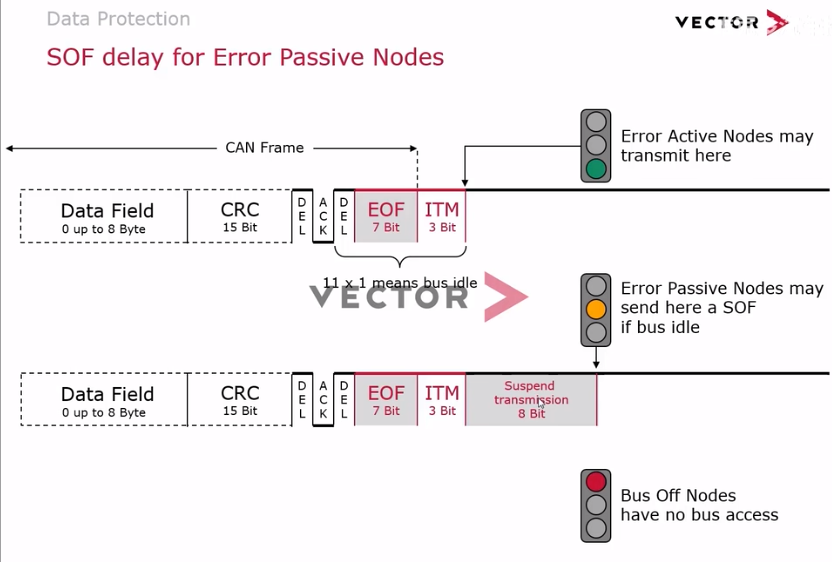

# [CAN总线](https://www.bilibili.com/video/BV1M5411N7Kc?p=10&spm_id_from=pageDriver&vd_source=0be7e6585a5e2d139cd3524579615507)

A **Controller Area Network** (**CAN bus**)

主设备广播数据，从设备筛选

所有设备在总线空闲时都可发送数据，所以需要总线仲裁机制

非破坏性仲裁机制：遇到访问冲突时，会根据优先级依次发送，优先级低的也不会被丢弃

由0起始，标准的仲裁位由11bit组成

回读机制，节点A回读到总线的数据和自己发送的不同，则认为自己丢失了仲裁，停止发送数据

报文唯一，确保决出一个优先级

高位0越多，在仲裁过程中会有优势

## CAN总线构成

### SOF

### Identifier

### RTR

0为数据帧，1为远程帧。0为显性位，1为隐性位，因为是通过与运算来的

### IDE

IDE也是一个格式指示位，*r*位是保留位，没有做特殊定义，一般发一个显性位0

### Standard Frame

Here is an explanation of the CAN standard frame bit-by-bit:

- Start of Frame (SOF): 1 bit - Indicates the start of a new message

- Identifier: 11 bits - Contains the message ID which identifies the type of message

- IDE: 1 bit - Identifier Extension bit - Dominant for standard frame format, Recessive for extended frame format

- RTR: 1 bit - Remote Transmission Request - Dominant for a data frame, Recessive for a remote request frame 

- Reserved bit: 1 bit - Always dominant (0)

- DLC: 4 bits - Data Length Code - Indicates the number of bytes of data (0-8 bytes)

- Data field: 0-64 bits - Contains the message data, length determined by DLC

- CRC: 15 bits - Cyclic Redundancy Check - Used for error detection 

- CRC Delimiter: 1 bit - Recessive bit that separates CRC from ACK

- ACK: 1 bit - Acknowledgement - Transmitted as recessive, overwritten as dominant by any receiver

- ACK Delimiter: 1 bit - Recessive bit that follows ACK

- End of Frame: 7 bits - Signals the end of message with recessive bits

So in summary, it contains fields for message ID, data length, data, error checking, acknowledgement, and start/end of frame indicators. The fixed layout allows different nodes to correctly interpret messages.

### Extended Frame

Here is an explanation of the CAN extended frame format bit-by-bit:

- Start of Frame (SOF): 1 bit - Indicates start of message

- Identifier: 29 bits - Contains the extended message ID 

- SRR: 1 bit - Substitute Remote Request - Dominant for data frame, Recessive for remote request frame

- IDE: 1 bit - Identifier Extension bit - Recessive for extended frame format

- RTR: 1 bit - Remote Transmission Request - Dominant for data frame, Recessive for remote request frame

- Reserved bits: 2 bits - Always dominant (0) 

- DLC: 4 bits - Data Length Code - Indicates number of bytes of data (0-8 bytes)

- Data field: 0-64 bits - Contains the message data 

- CRC: 15 bits - Cyclic Redundancy Check for error detection

- CRC Delimiter: 1 bit - Recessive bit separating CRC from ACK

- ACK: 1 bit - Acknowledgement from receivers 

- ACK Delimiter: 1 bit - Recessive bit following ACK

- End of Frame: 7 bits - Signals end of message

The key differences from standard format are the 29-bit identifier and 2 reserved bits. This allows for a much larger number of message IDs. The rest of the frame structure remains the same.

### DLC

当数值为0-8时，具体的数值是多少就表示数据位有多少字节，9-15依然表示8个字节。在后面CANFD里面又对9-15进行了具体分配

### CRC

校验从Id场到数据场的最后一位（或者认为从SOF开始也可以）

### DEL

界定符位，固定格式1,没有特殊的含义

### ACK

ACK位需要接收节点发送，发送节点在发这个字段时都为1。接收节点校验没问题后发送0,有问题发送1

然后接收节点会去回读总线上这一位，如果为0,表示没有问题，会继续发送。如果为1，就认为当前发送的数据是有问题的，他会停止数据的发送，在下一位之后会发送一个错误帧。其实对于这些CRC校验失败的节点也会发送错误帧，它的错误帧在ACK,DEL之后去发送

### EOF

在ACK场结束，就是一个连续7个bit的1的EOF,标志着一帧CAN报文的结束。在每帧CAN报文结束后，会额外加3个bit的帧间隔（3个1），在3个帧间隔之后才允许其他的节点访问总线。

> 在CAN当中检测到**连续11个1**,则表示总线空闲

### 位填充

在身份场和数据场及校验场段，出现连续5个极性相同的位，就会在他后面插入一个极性相反的位（这5个极性相同的位包括插入的填充位）

## CAN保护机制

- 发送节点
  - Bit Monitoring：位监控，通过回读检查总线上的位与自己发的是否一致
  - 虚线部分表示仲裁场发1读0不会认为是位错误，而是仲裁失败。但是发0读1的话（0是显性的，不可能被1覆盖掉），肯定是一个位错误
  - ACK Check：ACK位刚好相反，如果发1读0,反而是正确的，因为这说明接受设备发了应答0。如果发1读1,表示接收节点给的否定应答，表明有节点在CRC校验失败了
- 接收节点
  - Stuff Check:填充检查，如果在位填充段检测到6个相同位，则表示破坏了填充规则，会报填充错误
  - Form Check：格式检查，在一个固定为1的格式位，出现了0,则破坏了固有格式，报格式错误
  - ACK-Bit Monitoring: 在ACK位上，我发的是1,回读为0,則在下一位发送错误帧

### Error Signaling

当错误发生时，错误帧将在下一位立马发出（除了CRC错误，CRC错误会在应答位发生1，给一个否定的应答，然后在ACK del之后才会发送CRC错误帧）

因为发送方检测到位错误，所以发送6个0,和8个1.接受方在接收到第6个0时才意识到填充错误，所以也发6个0,掩盖了发送方的前6个1,所以在总线上表现出12个0,8个1,然后最后加3个1的帧间隔，刚好11个1,表示总线空闲。空闲后由于纠错机制的存在，发送者会进行重新发送。

所以在CAN中错误一般都是成对出现的，当某一个节点检测到错误之后，必然会引发其他节点也检测到一个错误，最终表现出来的结果就是所有参与通讯的节点都会发送错误帧。这样所有的节点都会将当前正在发送或接收的数据丢弃掉，保证总线在数据传输过程中的数据一致性。

### Fault Confinement

错误界定：怎么判断你这个节点是处于一个主动错误状态还是被动错误状态

CAN网络中，节点的状态必然处于这3种状态之一。

- 每种状态的切换是根据两个寄存器的数值。
  - TEC：发送错误计数器
  - REC：接收错误计数器
- TEC<=127 && REC<=127，为主动错误状态，发送的错误都为主动错误
- TEC>127 || REC>127,为被动错误状态，发送被动错误
- TEC > 255 ,Bus Off,不会参与任何总线通讯
- 软件重置并128*11个隐形位后，恢复到主动错误状态
- **TEC和REC寄存器变化规则：**
  - 对于一个节点它每成功发送一个或者成功接收一个报文的话，对应的TEC的数值或者REC的数值`-1`
  - 发送节点在发送过程中检测到一个错误，它的TEC数值就会`+8`
  - 接收节点在接收过程中率先检测一个错误的话，它的REC数值`+8`，如果在其他节点已经发现错误帧的基础上又发现了一个错误的话，REC数值`+1`
  - 还有其他一些特殊情况，REC和TEC值不变化

除了发送的错误帧有区别，主动错误就是正常工作状态，被动错误状态的节点不能在3个bit1的帧间隔之后立马发送数据，**必须额外等待8个bit**

当一个节点进入被动状态时，或多或少说明该节点存在一些问题

## CAN FD

可变数据速率

数据段最高可达8M/s, 最多64byte数据

### 硬件改动

物理电平与数字信号的转换与传统高速CAN是一致的

1. 如果原先CAN收发器就支持较高速率则不用更换
2. CAN FD在协议层面与传统CAN有所变动，需要使用支持FD报文解析的新的CAN控制器
3. 取消了远程帧格式

### 协议变动

#### 变动总结

- **CAN标准帧与扩展帧区别**：
  - 由IDE位(Identifier Extension bit)（第13bit）区分标准帧和远程帧，扩展id(18bit)插在IDE位后
  - 保留位由1位变为2位
- **CAN标准帧与CAN FD标准帧区别**：
  - RTR位变为RRS位（保留位，默认值0）
  - 将保留位作为FDF位用以区别传统CAN与CAN FD报文，0表示传统报文，1表示CAN FD报文
  - 增加一位保留位，BRS和ESI位
- **CAN扩展帧与CAN FD扩展帧区别**：
  - 一位保留位替换位FDF位
  - 在另一位保留位后增加BRS和ESI位

### BRS

**BRS**：传输速率切换位，为0时，不进行速率切换，为1时数据段比特率会切换到第二种较高的值

### ESI

**ESI**: 错误状态指示位，为0时为主动错误状态，为1时为被动错误状态。（在传统CAN报文中，发送节点的错误状态只有节点本身知道）

### DLC

### CRC优化（较大改变）

### 位填充规则改变

在CRC场之前，和传统CAN报文一样，都遵循每5个相同位填充一个相反位。

Stuff Bit Counter: 填充位计数，在CRC场前面增加了4个位，对前序的填充位进行计数校验。将统计的数目进行mod8运算，结果以格林编码的形式存放在stuff bit counter高3位中，最后一位偶校验位用来校验前三位

而CRC场的位填充则改为固定位置位填充。首先在stuff counter第一位之前增加一个填充位，取值与前一位相反。之后每隔4个位增加一个填充位，每个填充位都取前一个的相反值

## J1939

基于CAN的高层协议，使用的是CAN扩展帧格式

# LIN总线

Local Interconnect Network

## 简介

> 电子控制单元 (ECU)，也称为电子控制模块 (ECM)，是汽车电子中的嵌入式系统，用于控制汽车或其他机动车辆中的一个或多个电气系统或子系统。
> 现代车辆有许多 ECU，其中可能包括以下部分或全部：发动机控制模块 (ECM)、动力总成控制模块 (PCM)、变速箱控制模块 (TCM)、制动控制模块（BCM 或 EBCM）、中央控制模块 (CCM)、中央正时模块(CTM)、通用电子模块(GEM)、车身控制模块(BCM)、悬架控制模块(SCM)。 这些 ECU 有时统称为汽车计算机，尽管从技术上讲它们都是独立的计算机，而不是一台计算机。

缺点：要求传感器和执行器都得具备CAN接口，包括CAN收发器，CAN控制器，成本大幅提升。同时，总线上节点过多也会导致总线负载的提升

缺点：虽然上面的CAN总线不受负载影响，但是还是无法解决CAN接口带来的成本问题

解决了CAN接口的成本问题，这个低成本的总线就是LIN总线

## LIN规范

一般用于汽车舒适性方面，如空调，雨刮器等

- NCF：节点性能文件，定义了节点名称和属性值
- LDF：LIN描述文件，则描述了LIN网络的信息，网络中所有信息和报文都在这个文件中进行声明

## LIN物理层

出于成本考虑，1根线，且利用了每个传感器中都有的UART通讯接口

### 信号规范

显性位为逻辑0,隐性位为逻辑1

### 同步实现

为了降低成本，LIN总线没有时钟线，从节点一般采用低成本的RC振荡器，并允许最大百分之14的时钟偏差。当总线处于空闲时，总线状态为逻辑1，数据开始传输时，由LIN的主节点，实现初始同步，主节点会向总线发送同步间隔场，和同步场数据。

- 同步间隔场至少由**13位显性位，和1位隐性位**
- 同步场数据为0x55

当从节点接收到主节点发送的同步场数据后，从节点测量第一个和最后一个下降沿之间的时间，并将此时间除以8，由此计算出主节点的位时间，同时根据计算结果，调整自身的位速率，从而时从节点和主节点的位速率一致。

- **初始同步**使所有从节点和主节点的位速率一致。但在实际应用中，各节点的时钟精度是存在差异的。在数据传输过程中，由于这种时钟精度的差异，可能会造成位传输的偏差。
- 还有一种同步方式为**重同步**。LIN帧格式是一种基于UART的通讯格式，可利用UART起始位的下降沿进行同步，尽量避免因时钟精度的差异，而导致的传输偏差。这个阶段的同步称之为重同步。

## LIN通讯原理

LIN网络采用主从结构，有一个主节点和多个从节点。主节点包含主任务和从任务，从节点只包含从任务。

- 主任务根据在LIN调度表中确定的时间，负责向总线中发送`Header`（也称为报头）。网络中的节点接收到`Header`后，从任务负责发送`Response`,或接收`Response`，或不发送也不接收。`Response`也称为相应，`Header`和`Response`就组成了`LIN`报文

LIN报文的发送和接收时间都是可以预先确定和预测的

## LIN帧结构

**Header**

- **同步间隔场**：由同步间隔和间隔界定符组成，同步间隔为至少持续13个位的显性位。由由于总线空闲时为隐性位，并且报文中处同步间隔场外的任何其他字段均符合UART帧格式，也就**不会发出大于9个位的显性位**。所以同步间隔可以表示一帧报文的起始。间隔界定符至少包含一个隐性位。
- **同步场**：为固定格式，数据为0x55,用于初始同步
- **PID**：由6位ID和P0、P1两位奇偶校验位组成。由于LIN的ID有6位，所以范围为0-63。
- 其中60和61即0x3c和0x3d用于**诊断报文**。62,63为保留。P0为ID0,1,2,4进行异或运算的结果。P1是ID1,3,4,5异或运算后取非的结果。

**Response**

包含数据场和校验场，数据场长度为1-8个字节。校验场起到校验和保护传输内容的作用。

- 在LIN总线中有两种校验模型，分别为**经典校验**和**增强校验**
  - 经典校验为数据场内容
  - 增强校验内容为PID和数据场内容
  - 在LIN规范1.1,1.2,1.3版本中没有增强校验
  - **注意**：对于ID为**0x3c和0x3d**的报文，也就是**诊断报文**，在所有版本的LIN规范中使用的都是**经典校验**

## 调度机制

一帧LIN报文由Header和Response组成。

- Header包括同步间隔场，同步场和PID场。

  - 同步间隔场至少包括13个显性位和一个隐性位，所以他的最小长度为14个位。
  - 同步场和PID场**均符合UART帧格式**，因此长度均为10位。因此可以计算出Header的额定传输时间为34个位时间。

- Response包括数据场和校验场

  - 数据场长度为1-8个字节，即10-80个位，校验场为10个位，由此也可以计算出Response的**额定传输时间**
  - Header和Response的额定传输时间相加，即可得到一帧LIN报文的传输时间。但在实际使用中，比如一些芯片使用的LIN芯片性能较低时，处理速度较慢，可能无法立即执行任务。

  

  - 所以，在报文传输时间中包含**时间余量**，时间余量有两种类型
    - Inter-byte space(即字节间隔)，位于同步间隔场，和同步场之间，以及每两个相邻的UART帧之间
    - Response space(即响应间隔)，位于Header和Response之间
    - 对于一帧LIN报文，时间余量最大为额定传输时间的**40%**

### 调度表（Schedule）

在LIN总线中，调度表除了规定总线上报文的**传输次序**外，还规定了各个报文的**帧时隙（Real Frame Slot）**

- T-jitter为报文同步间隔的下降沿与帧时隙起始时刻相差的时间，因此，保证有足够的时间传输LIN报文。所以**LIN报文的帧时隙为最大传输时间+T-jitter**。需要注意的是，根据Response的长度，帧时隙的长度也是不一样的。

当然在实际的调度表中，帧时隙并不是任意长度。LIN报文的**帧时隙是由`Mini-Slot`的整数倍组成的**。`Mini-Slot`与`time base`（时基）是一致的。

- **时基**是LIN网络中的**最小时间单位**。用于主节点执行调度时，控制定时。时基一般为**5ms或10ms**。
- 因此帧时隙的实际长度可能比传输LIN报文所需的理想时间长度更长
- 多出的这段时间称为`Inter-frame space`,即**帧间空间**
- 主节点可以有多个调度表，并且可以在不同的调度表之间进行切换

## 报文类型

在LIN网络中包括4种报文类型

- **无条件帧**：一个Response对应一个Header，另外每个Header都分配有独立的帧时隙。这种帧类型在实际使用中较多。
- **事件触发帧**：关联多个无条件帧，当从节点信号发生变化的频率较低时，主任务一次次地轮询各个信号，会占用一定的带宽。为了减小带宽的占用，引入了事件触发帧的概念。事件触发帧的典型应用就是轮询4个**车门的开关状态**，如果其中一个车门打开，该车门要对询问做出应答。当大于等于两个车门打开时，同时应答会发生冲突，此时会切换到**冲突解决调度表**。当然与事件触发帧关联的无条件帧需要满足一定的条件，包括长度相同，使用相同的校验模型，数据场的第一个字节，为该无条件帧的PID，关联的无条件帧由不同的从节点发送，并且不能与事件触发帧处于同一个调度表中。
- **偶发帧**：特点是一个帧时隙中包含多个无条件帧，主节点根据需要去进行发送。这也是为了避免发生很少的事件频繁发送，从而占用带宽。当有多个无条件帧需要同时发送时，需要根据事先规定好的优先级进行发送，优先级较高的无条件帧获得发送权，优先级较低的要等到下一个偶发帧到来时才能发送。由于主节点是唯一的发送节点，所以主节点知道各个无条件帧的发送优先级。
- **诊断帧**：60用于诊断请求，61用于诊断响应

该调度表中都为无条件帧，时基为5ms,该表循环周期为225ms

- 如果无条件帧5-8相关信号发生变化的频率较低，并且满足与事件触发帧关联的条件时，那么可以将其关联到一个**事件触发帧**中
  - 当调度表执行到事件触发帧时，主节点发送该事件触发帧的header，只有关联的无条件帧的信号发生变化时，才发送Response。如果没有任何从节点响应，那么该帧时隙的其余部分将保持静默。当有多个从节点响应时，将切换到冲突解决调度表。
  - 类似的，可以将无条件帧12-15放到同一个帧时隙中，由此，调度表的循环周期可以减少到135ms，可以提高通讯的灵活性。

## 状态管理

**目的**：检测各个节点运行过程中的错误。每个从节点在其发送的某个无条件帧中，应包含一个名为Response Error的标量信号。通过该信号向主节点报告自身的状态。主节点负责接收这个信号，并且执行分析。LIN协议并没有标准化错误类型，可以根据需要自行定义。（比如位错误，校验错误，无应答错误等）但在事件触发帧中，由于冲突的可能性，发送与回读数据不一致也不一定是位错误，发送Header没有Response也不能认为是无应答错误。

## 网络管理

主要为网络的休眠与唤醒管理

### 唤醒信号

**唤醒信号**：任何节点都可以请求唤醒，为持续250us~5ms的显性电平，并在总线信号返回隐性状态时有限。

- 对于主节点，同步间隔场也可以充当唤醒信号。比如可以发送普通的header来请求唤醒。这种情况下主节点需要知道这个header可能不会被从节点处理，因为从节点可能还未被唤醒。
- 如果节点发送唤醒信号后，在150ms-250ms之内，没有接收到总线上的任何命令，那么重新发送一次唤醒信号。
- 唤醒信号最多可以发送3次，3次后必须等待至少1.5s后，才可以再次发送唤醒信号。

### 休眠命令

主节点可以向总线发送休眠命令，使LIN子网进入休眠模式。

- PID为**0x3C**的诊断报文可以作为休眠命令，要求该报文数据场的第一个字节为0x00,其余字节为0xFF
- 总线上的从节点只判断数据场的第一个字节，其余字节忽略
- 总线静默4-10s时，从节点自动进入休眠模式
- 从节点在接收到休眠命令后，不一定要进入低功耗模式，可以根据应用层需要进行设置

